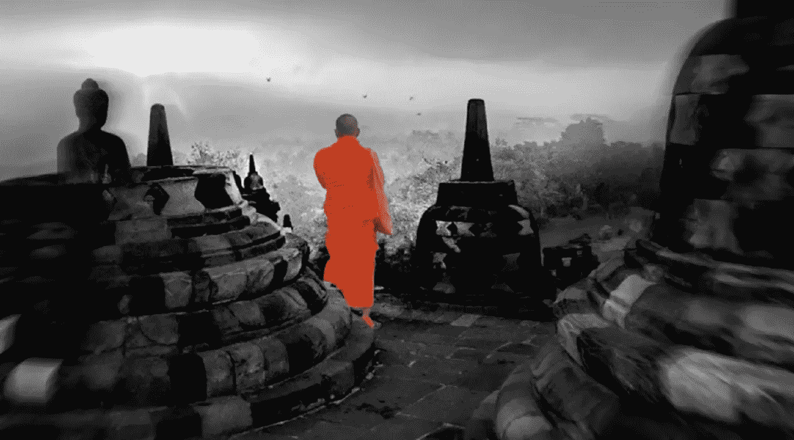

# 宇宙的中产阶级化

> 原文：<https://medium.com/coinmonks/gentrification-of-the-universe-642f0588b417?source=collection_archive---------6----------------------->

这个博客的种子就是由这项工作播下的，[这里](/@rextar4444/a-proper-critique-of-jordan-peterson-an-inquiry-into-the-role-of-propriety-on-the-observation-of-38c9bea43d81)；而写一般书评的作家逍遥，[此处](/@jongulson/translating-jal-24a0150fd43)。

有人好心提醒我这篇评论，在这里:

我注意到这是一个值得欢迎的提醒，提醒我重访博客，因为有时候写和观察比特币感觉就像一只被困在瓶子里的苍蝇。

# 感悟与总结

为这种写作埋下种子的[作品](/@rextar4444/a-proper-critique-of-jordan-peterson-an-inquiry-into-the-role-of-propriety-on-the-observation-of-38c9bea43d81)引用了*二元性*和亚当·斯密对[礼仪和同情](https://en.wikipedia.org/wiki/The_Theory_of_Moral_Sentiments)的观察(《国富论》的前奏)。

史密斯间接谈到了中产阶级化的本质——这与今天自然秩序如何保护我们免受激进社会变革的影响有关，尤其是在面对强大的社会规模技术时。

相关是因为它展示了经济学如何从非合作情景中创造社会福利；换句话说，由于我们自己在竞争市场中的直接经验，我们实际上无法体验另一个人的观点(因此是二元性)。

随着史密斯的工作在基于均衡博弈的模型中重新定位，它展示了非合作市场的演变——表明我们有能力超越它们；或者至少能够考虑[非二元性]经济学的可能性，这不会是传统意义上的经济学。

从这个角度来看，我们已经看到了金钱是如何在日常生活中变得不言自明的:它让社会凝聚和润滑，否则这可能不会存在。

而且我们还可以看到货币和银行是如何成为它们所服务的人的延伸；因为货币更为复杂，我们可以认为它来自自然秩序而不是理性。

# 比特币真的是比特币吗？

如果金钱是以这种方式(自然秩序)产生的，而银行是它们所服务的人的延伸，那么同样地，我们会按照同样的思路来考虑宇宙，因为它也是我们的延伸，产生于自然秩序；其中一个*永恒的宇宙*可能处于一种持续的再创造或*轮回*的状态。

这条推文突出了背景问题:

这个问题是有价值的，即使(重新)强调:我们如何确定比特币创造者的最初目的？这不仅仅是因为我们可能已经将比特币过于狭隘地定义为某种类型的货币；但更尖锐地说，我们怎么能确定[比特币]的最初目的是仅仅作为一种货币呢？

# 后现代主义的顶峰

回到页面顶部的推文，有一个问题是，我们是否能确定比特币是我们所认为的平淡无奇的描述或故意精心设计的互联网现金？

有人说我们是后现代主义的第二代——第一代在高能物理领域最为突出，成为科学史上最成功的理论。

后现代方法去除了参数，质疑传统，挑战理论架构:

> “我们在后现代时代的旧神至少已经被严重地妥协或重组或……解构。一些人努力保护和捍卫他们古老的话语，但是世界已经在他们的统治下改变了。意识形态板块构造的转变通常难以察觉。当被发现时，有时更难接受。”不久以后；匿名（Anonymous）

在这一时期，由于语言、历史、经济、物理等之间可能的联系，人们开始寻求所有领域的统一。例如，我们看到亚当·斯密是如何通过基于数学的行为建模在数字市场中再次发挥作用的。然而，货币经济学仍然相对未受影响。

# 蛮力和可证明猜想

比特币的 SHA-256 哈希算法因其耗能而被视为残忍，像[这种](https://theoutline.com/post/6047/bitcoin-mining-accounts-for-almost-one-percent-of-the-worlds-energy-consumption?zd=1&zi=bps6bkcl)的文章就证明了这一点；伴随着这些推文:

这条推文的同一作者也在这里推文:

这些推文加入了传统标准的显而易见的想法:如果比特币被设计为消费级货币——用于经济场景，如亚当·斯密最初想象的那样——那么期望比特币发挥作用是不现实的。

很容易理解如何在*经济学 101* 中理解这一点:经济学是由创造机会成本的非合作市场中的稀缺性引起的——但是在一个稀缺的世界中，环境本身——我们被引导去相信——没有机会成本，因为一旦它消失了，就无法被取代。

所以这里有一个猜想:如果一种新形式的[非二元性]经济学能够用不同的语言理解能源和环境(比如说，一种*经济学 102)会怎么样？*)

这条推文评论道:

热力学第二定律当然存在:在这条定律中，孤立的系统无法回到较低的熵状态。这应该是制定比特币监管和观察比特币波动性的一个考虑因素。

这又让我们回到比特币的强力能耗:为什么它的设计者实现了非图灵完整性，即处理单元(矿工)共享一个开放的网络和单一的存储场？这些推文可能会提供一些线索:

言外之意是我们所理解的热力学定律，适用于孤立的(或封闭的)系统；然后质疑它们与比特币区块链的相关性。

我们可以从这一点推断出这样的定律在正常意义上可能不适用。并由此推断开放或封闭系统是否需要外部输入来理解它们的现实和本质？或者，如果我们真的忘乎所以，质疑我们的能量来源本身的性质，以及它是否与其他能量形式相隔离？

在这种情况下，我们可以再次考虑发现的自然顺序:

我们可以与首先研究亚原子新领域的物理学家相提并论，这些物理学家意识到他们可能使用了错误的符号信号——他们的计算可能会受到影响。

正如我们已经看到的那样，比特币通过其工作证明算法(*证明是工作，是被成本吸引的价格*)融合了[通胀]目标的公理——真实和名义价值，从而[重塑了通胀](/coinmonks/reframing-inflation-67b63968c7e4)；我们可以看到比特币如何通过一个新的价值网络在所有层面和所有形式上重塑信任，这个价值网络允许思考非二元经济学——一个可能永久解决稀缺问题的经济学。

在我们的太阳系之外是否有生命或能量——如果有，或者曾经有；我们会鼓起精神去寻找它吗——这只是猜测，还有比特币可能让我们用冥思苦想的钱来观察冥思苦想的宇宙的想法。

然而，我们应该对这种猜想持开放态度——尽管听起来可能很可笑——因为有一天，它们可能会被哈希算法证明。

> [在您的收件箱中直接获得最佳软件交易](https://coincodecap.com/?utm_source=coinmonks)

