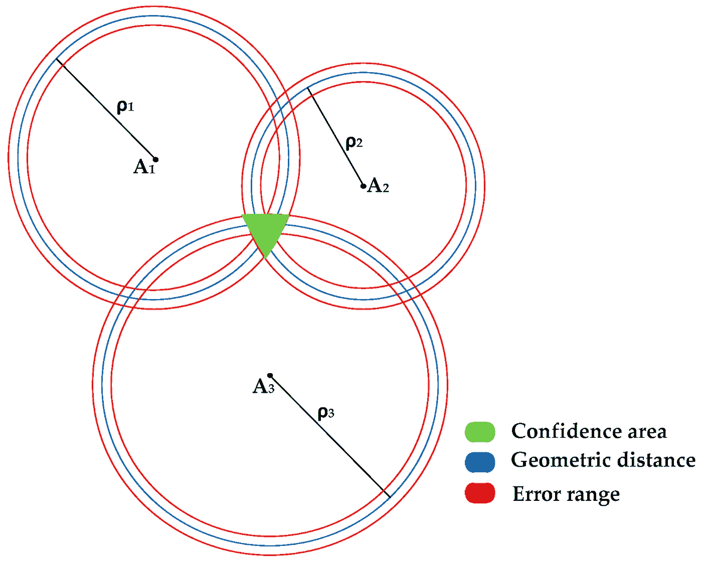
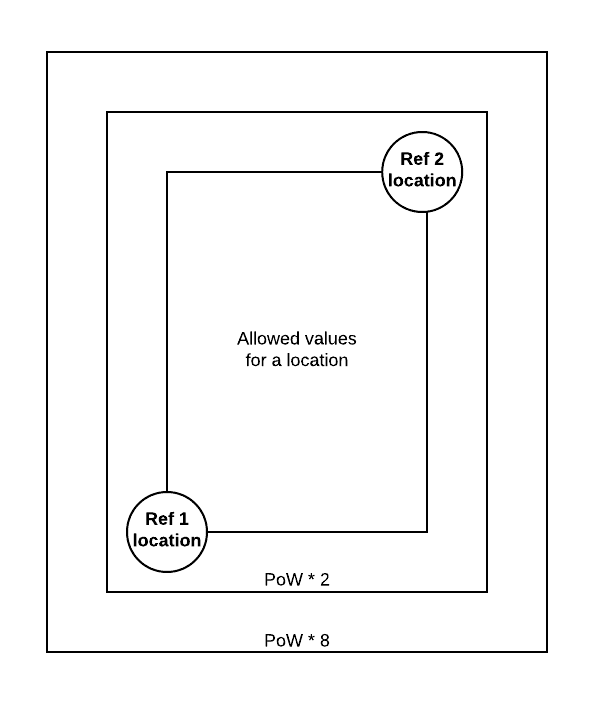

# 地理分片一个 DAG

> 原文：<https://medium.com/coinmonks/geo-sharding-a-dag-52c008eabddb?source=collection_archive---------0----------------------->

## 实现真正的水平可伸缩性。

毫不奇怪，这篇文章是关于切分一个 DAG 的，特别是在 DLT 和区块链的分布式设置中的 DAG。要补充的是，这篇文章的重点是数据结构的分片，DAG 本身，而不是财务分类帐！也就是说，这不是一篇科学论文，而是对在地理上分割 DAG 的一些关键元素的一般描述。然而，我相信如果你不能分割/缩放数据结构，你就不能缩放分类帐。

> 如果你不能扩展数据结构，你就不能扩展分类帐。

## 分片的基础

在数据库世界和扩展中，一般来说，**一致散列**是确定性地将任何数据分配给碎片的主要概念之一，碎片是数据结束的“位置”。现在假设你想要在你的系统中有 16 个碎片，那么你只需要做`Hash(data) mod 16`(取一个数，减去 16，然后取剩下的，也就是模)来确定你想要存储信息的位置。为了知道在哪里可以找到它，您只需找到与`hash(IP) mod 16 == Hash(data) mod 16`匹配的节点/机器/服务器。通过这种方式，您可以以简单确定的方式知道在哪里可以找到您的数据。当然，还有更多的内容，如果你想了解细节，请阅读[这篇文章](https://www.toptal.com/big-data/consistent-hashing)。

当有未知数量的节点想要将数据分成越来越多的碎片时，这种方法的难点就来了。或者换句话说，做动态分片。动态确定您的碎片将导致所谓的网络重新平衡，因为它需要到处发送数据，而这不是您想要经常做的事情。出于这个原因，像 Radix 这样的 DLT 解决方案选择了非常大量的碎片，认为碎片空间永远不会用完。所以现在我们只是`mod`有一个非常大的数字，但有一个问题是，将没有足够的设备来填补所有这些碎片空间 1 对 1，就像我们可能只有 16 个碎片。这种情况由所谓的哈希环和分布式哈希表来处理，这样我们就可以在不知道整个网络拓扑的情况下发现我们的邻居有什么。

现在，这对于键-值对来说工作得很好，但是并不是所有的数据都只有键-值。大多数真实世界的数据，包括分布式分类账，都是某种形式的关联数据。它是上下文相关的，只表示上下文中的某个内容，就像一个地址的余额是所有事务向它发送某个内容的结果。如果只有一个分布式键值存储，它将不得不在分布式哈希表和一致的哈希环中从一个位置弹出到另一个位置，以检索所有这些分组和相关的数据。如果每个人都需要一直这样做，那么这将阻塞所有的网络带宽，然后整个分片点就丢失了。

我在这里尝试的是分布式链接/相关数据结构的一些基本要求。

1.  给定我们正在寻找的数据，我们必须确定它的“位置”
2.  给定一个位置，我们必须知道什么网络地址映射到它。
3.  我们希望相关数据与其关系相对接近。

要分割一个 DAG，但保持其相关数据彼此接近，我们应该让*顶点*包含位置信息，并且只引用在其‘邻近’范围内的(*边* ) v *顶点*。这种方法的问题是，如果空间是虚构的(就像一致哈希中的碎片)，用大量数据填充单个位置就变得很容易。这是因为不存在玩得好的动机，也因为“位置”是任意挑选的，不再是其自身的函数(散列)。

为了让*顶点*选择它们附着的位置，我们需要一些方法来限制谁可以这样做。

# 基于地理位置的分片和联网

现在已经创建了一些上下文，让我们直接进入实际的想法。

一个*顶点*需要一个最小的分片设置，有多个字段是其他目的所需要的，但是被忽略了，比如时间戳。

顶点结构:

```
Vertex: {    
   id: Hash(fields),
   location: "gbsuv7ztr",
   vertex_ref_1: "gbsuv7ztq-v1ID",
   vertex_ref_2: "gbsuv7zts-v2ID",
   nodeID: "gbsuv7ztr-nodeID",
   nodeSig: "0xfff88...",
   nonce: 999,
   payload: {"whatever your application is"}}
```

**位置**定义为 [Geohash](https://en.wikipedia.org/wiki/Geohash) ，是对经纬度 GPS 空间中一个小区域的简明描述，所以不是固定位置而是对一个小区域的描述。总有且只有两条*边*，类似于 IOTA 的分支和主干。然而，这些*边*的标识符包括它所引用的*顶点*的位置。

## 网络节点

此设置中的节点需要标识自己。一个***NodeID****至少由它的公钥和 Geohash 组成，该公钥和 geo hash 是自由选取的而不是任意的。这个*节点的* Geohash 很重要！*

*一个*节点*可以通过发出一个*顶点*声明它的 NodeID 和它的预期分片范围来开始附加。该分片范围将包含潜在邻居的 NodeID，并且由相对于 NodeID 自我声明的 geohash 的表面函数(半径/正方形/多边形等)组成。*

**

*Triangulation*

*这个*顶点*仅由其他节点添加，这些节点通过使用基于延迟的多边定位/三角测量对*节点*的位置进行强测试，具体如何做确实需要另一篇文章，但是先前的[研究](https://www.researchgate.net/publication/220429402_Constraint-based_geolocation_of_internet_hosts)是在这个主题上进行的。*

*由于信息/光的速度的简单限制，与自己的*节点*相比，可以生成节点位置的置信区域。NodeID 的 geohash 必须位于此置信区域内，其他节点才能接受它。这需要一个测试*节点*的持续过程，以保持诚实。*

*随着网络吞吐量的增加和更多的*节点*加入网络，该方法的精度也随之增加。作为这种方法的结果，它将激励强大的*节点*分布，并防止*节点*在 Cloudproviders 中聚集。*

*一个*节点*覆盖的表面区域的数量将取决于网络的吞吐量和它的机器的能力。当*顶点*吞吐量增加时，更多的*节点*将需要加入，现有的*节点*将减少它们的表面积。*

## *位置限制*

**一个顶点*引用另外两个*顶点*。但是，为了实现分片，对此还有进一步的限制。首先:*节点*不允许发出位置在其自身表面区域之外的*顶点*，其最大值可以从 DAG 的吞吐量和相邻*节点*中导出。*

**

*Transaction reference surface*

*除了*节点*只能发布*其自我声明和对等邻居测试的地理位置内的顶点*之外，*顶点*本身必须发布其想要引用的*顶点*所定义的表面内的位置。如果一个*顶点的*给定位置不可用，那么一个*节点*将需要发出工作证明增加的越界*顶点*，这样网络可以开始包括那些*顶点*。*

*通过将 *NodeID 的*与可测试的相对位置和对*顶点*的一些额外限制相结合，我们为每个*节点*创建一个分片，该分片可以根据地理位置和资源决定自己的吞吐量。*

## *推导财务分类账*

*如前所述，本文并不是要进一步解释让财务分类账发挥作用的共识机制。但是，需要注意的是，如果您有一个位置感知的数据结构，那么它上面的财务层也必须是位置感知的。这意味着钱获得了分配给它的位置，几乎像真正的现金一样；)*

## *结论*

*总而言之，这通常允许当前 DLT 系统没有的有趣的属性。*

*   *网络分割不是问题，只有在分割的实际物理位置可能会有问题。*
*   *它允许地理感知共识机制。就像代币或硬币，通过其共识机制，只在某个城市或地区可用。所以物理地理围栏的一般概念。*
*   *这也将允许具有真正的水平可伸缩性。更多的机器=更高的吞吐量*
*   *向数据添加物理位置，就像真实对象一样。*
*   *还有很多。*

*对于那些感兴趣的人，几个月前我做了一个小模拟，使用一个 1d 圆(2d 行星表面的较低维度，更容易可视化)，并在这个圆上均匀地放置节点，让它们根据上述规则开始发布事务。视频中的白色*顶点*是单个分片*节点*的“视图”。你可以在这里观看视频:*

*如有疑问，请随时联系我:*

*[](http://twitter.com/@ovanwijk) [## 奥拉夫·范维克

### Olaf van Wijk 的最新推文(@ovanwijk)。设计蚂蚁，而不是蚁群

twitter.com](http://twitter.com/@ovanwijk)  [## Olaf van Wijk -开源开发者- IOTA | LinkedIn

### 查看 Olaf van Wijk 在世界上最大的职业社区 LinkedIn 上的个人资料。奥拉夫有 6 个工作列在他们的…

www.linkedin.com](https://www.linkedin.com/in/ovanwijk/) 

电报:@ovanwijk

> [直接在您的收件箱中获得最佳软件交易](https://coincodecap.com/?utm_source=coinmonks)

[](https://coincodecap.com/?utm_source=coinmonks)[](https://coincodecap.com)*