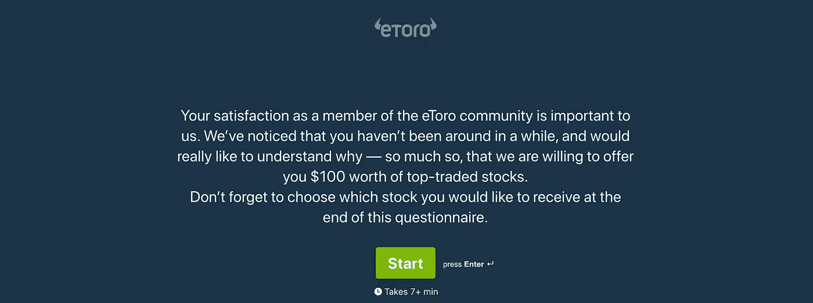
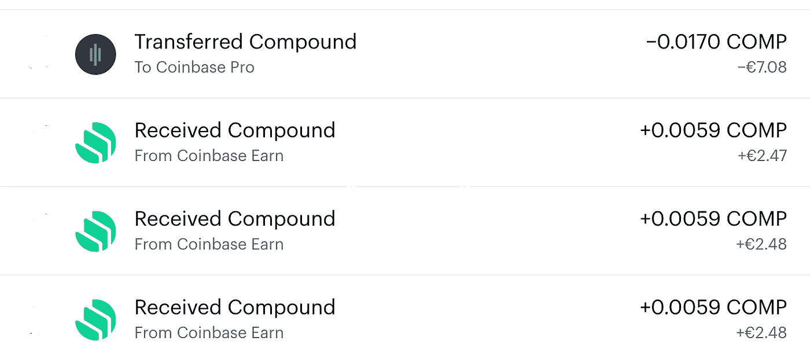
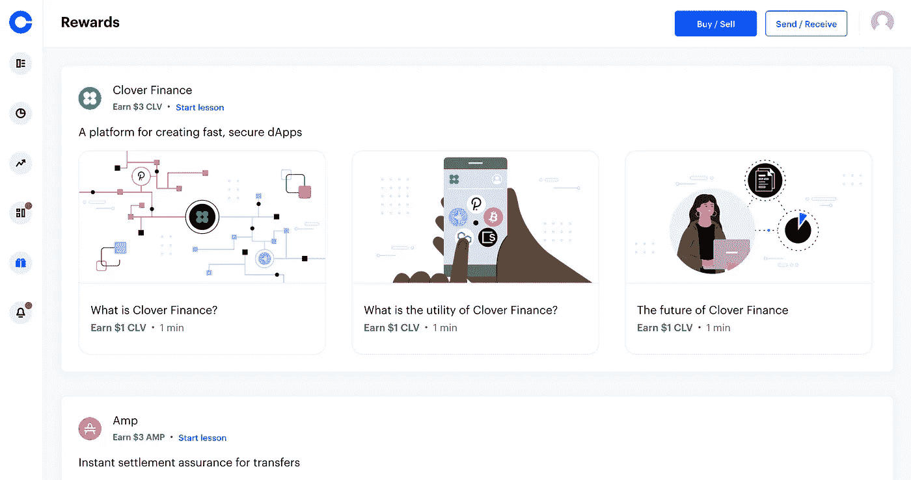

# 如何获得 150 美元的股票和密码绝对免费

> 原文：<https://medium.com/coinmonks/get-150-in-stocks-and-crypto-for-free-4a8c63390909?source=collection_archive---------4----------------------->

## 个人财务

## 在欧洲最受欢迎的交易平台上获得免费资金的 2 种方法

Photo by [Executium](https://unsplash.com/@executium?utm_source=unsplash&utm_medium=referral&utm_content=creditCopyText) on [Unsplash](https://unsplash.com/s/photos/bitcoin?utm_source=unsplash&utm_medium=referral&utm_content=creditCopyText)

让我先说，我不是投资或交易专家，我不会告诉你应该如何或为什么投资。然而，我确实喜欢免费的东西，并且碰巧有一些关于如何免费获得你的第一笔 150 美元的股票和密码*的建议。*

*没错。*免费*。*钱*。*

*所以，如果你想开始学习如何在网上投资或交易而不拿自己的钱冒险，请继续阅读，因为在这篇文章中，我将分享如何做到以下几点:*

1.  *用 eToro 获得价值 100 美元的最高交易股票*
2.  *在比特币基地的加密游戏中赚取高达 50 美元*

*尽管你必须在这些平台上创建一个账户，完成一些验证、存款等程序，但你实际上并不需要购买任何东西来获得好处。*

## *从 eToro 获得 100 美元的股票*

**

*Investment of 100$ in Microsoft on eToro*

*eToro 是欧洲领先的交易平台之一。你可以交易和投资股票、交易所交易基金、指数、商品、货币和密码。不仅每个市场都有大量信息供你自己研究，eToro 还提供了一些其他平台上没有的功能:例如复制投资者的投资组合，并用虚拟投资组合进行练习。*

## ***获得 100 美元免费股票的步骤:***

*得到 eToro 的这份厚礼并不是最简单的，但值得付出努力和耐心。我很偶然地发现了这一点，下面是你必须要做的:*

1.  *[在平台上登记](https://etoro.tw/2X4b9He)*
2.  *完成验证过程，并确保完成所需的税务表格，以便有资格获得奖励*
3.  *通过银行转帐向您的帐户存入至少 200 美元，以免除费用。*
4.  *等等。这一点很重要，不要投资这笔钱。它只需要原封不动地存在你的账户里。*
5.  *几周后，您将收到 eToro 的电子邮件，邀请您参加 10 分钟的调查，您将获得 100 美元的自选股票*

**

*4.几天后，你会收到一封确认邮件，你选择的价值 100 美元的股票将出现在你的投资组合中*

*当我把钱存到 eToro 时，我决定等到我学会一些股票交易的基础知识后再投资我的第一笔钱，尽管我很慢，一个月过去了。然后 eToro 就像“嘿，我们看到你还没有投资你的钱，所以你为什么不告诉我们为什么，我们会给你 100 美元”。不要问我两次。*

## ***在 eToro 上还能免费做什么？***

*在 eToro 上的虚拟投资组合中，你可以玩“虚拟货币”，看看潜在投资在未来会如何升级。你不需要拿你的钱去冒险学习交易的基础知识，一旦你对这个平台感到舒适，你就可以开始使用你真正的法定货币了。*

*此外，eToro 似乎每周都会组织网络研讨会，你可以收听平台上最受欢迎的投资者，并有机会向他们提问。它们是完全免费的，也可以按需获得。*

## *在比特币基地的加密游戏中赚取高达 50 美元*

**

*Coinbase rewards history*

*[比特币基地](https://www.coinbase.com/)可能是对用户最友好的加密货币交易平台。有些人不喜欢它，因为它的费用比其他平台高。然而，一旦你赢得了你的硬币，你可以免费将它们转移到你的[比特币基地专业](https://pro.coinbase.com/)账户，如果你选择这样做，以后出售它们的费用会更低。*

*要获得免费硬币，您只需:*

1.  *[创建账户](https://www.coinbase.com/join/nikolo_peu)。使用此链接，在您购买或出售您的第一个 100 美元后，您将获得额外的 10 美元比特币。不过，要获得免费硬币，你不需要投入任何东西。*
2.  *注册后，直接跳到 [*奖励*](https://www.coinbase.com/rewards) 部分。*

**

*Learn and Earn (Rewards) section on Coinbase. Currently available coins to earn are Clover (CLV), Amp (AMP), the Graph (GRT), Compound (COMP) and Stellar Lumens (XLM)*

*3.点击*开始课程，完成所有课程。*每完成一节课，您将获得 3 $- 15＄不等的加密*

*根据可用性，你可以通过观看简短的教育教程来获得一些硬币。每个教程不超过 1 分钟，通常不超过 20 秒。因此，在 10 分钟或更短的时间内，您就可以完成所有这些任务，并在您的帐户中存入 40 美元。太好了。*

## *在比特币基地你还能免费做什么？*

*研究市场。浏览概述并研究图表。*

*当我第一次开始了解加密货币时，与比特币基地相比，其他一切都显得势不可挡。在我交易的头几个月，当我习惯比特币基地专业版时，我仍然使用他们的主要平台来观察价格图表和获取新闻。*

## *这还不是全部*

*如果你准备好开始投资加密，但不知道从哪里开始，前往[crypto.com](https://crypto.com/app/ptenqh8q9t)应用程序，免费获得一张免费的 Visa 借记卡，高达 8%的返现和免费的 Spotify 会员资格！除此之外，你将获得 25 元赌注 CRO 在他们的平台上。[Reddit](https://www.reddit.com/r/beermoneyuk/comments/kozpyd/cryptocom_debit_card_25_instant_bonus_free/)上的这篇文章解释了如何做到这一点，以及为什么它会有用。*

*如果你开始挖掘，你会发现其他平台上有很多像这样的交易，但上面提到的两个实际上并不需要你做任何交易。*

*永远记住，分享就是关爱。如果你尝试了这些方法中的任何一种，并且它们对你有效，那就广而告之吧。*

> *加入 [Coinmonks 电报频道](https://t.me/coincodecap)，了解加密交易和投资*