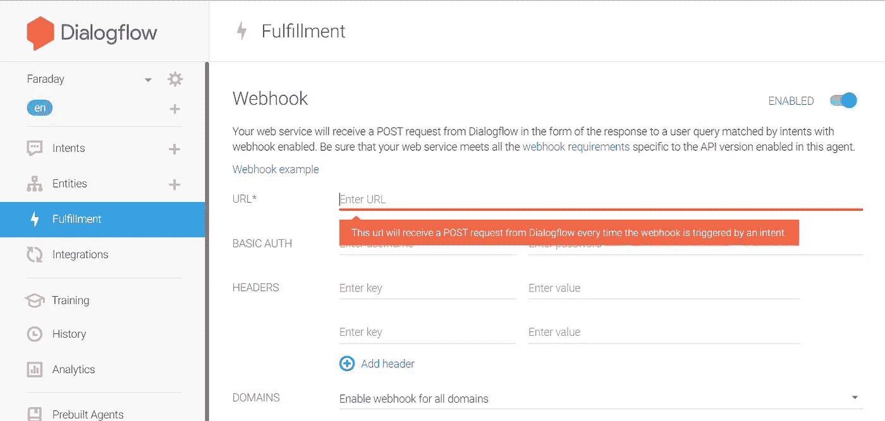

# 使用 Raspberry Pi 和 Dialogflow (Chromecast 替代品)为您的 Google Home 获得一个屏幕[第 2 部分]

> 原文：<https://medium.com/coinmonks/get-a-screen-to-your-google-home-using-raspberry-pi-and-dialogflow-chromecast-alternative-59050bafbcd5?source=collection_archive---------5----------------------->

在我之前的文章中，我们已经看到了如何设置 dialogflow 来让 Google Home 理解和解析我们的查询。现在，我们将设置我们的后端服务，让这些查询在我们的 raspberry pi 上打开视频和网站。
剩余设置
数据策略- >节点服务器- >代码


为什么我们需要数据透明度？因为 Google Home 连接到了可以通过互联网访问的 webhooks。尽管我们的 GHome 连接到本地网络，但查询来自 Google 云服务，因此，需要将我们的服务器移植到互联网上。我们可以使用 dataplicity 服务轻松地将我们的 raspberry pi 放在互联网上，而不用担心这个问题。

首先，连接到 raspberry pi【直接用 HDMI 甚至 SSh】
从终端中的以下命令获取最新的 nodejs 运行时。

```
*curl -sL* [*https://deb.nodesource.com/setup_8.x*](https://deb.nodesource.com/setup_8.x) *| sudo -E bash -*
```

然后使用安装它

```
sudo apt-get install -y nodejs
```

然后创建一个新文件

```
nano webserver.js
```

然后，将下面的代码插入文件中

在这里，为了演示，我只使用了两个网站(谷歌，youtube)。人们可以编辑代码并进行相应的更改。

```
bodyParser = require(‘body-parser’);
var exec = require(‘child_process’).exec;
var express = require(‘express’);
var app = express();
app.use(bodyParser.json());
app.post(‘/’,function(req,res){
let variable =req.body.queryResult.parameters.website;
 exec(“midori www.”+variable+”.com”, function(error, stdout, stderr) {
 console.log(“stdout: “ + stdout);
 console.log(“stderr: “ + stderr);
 if (error !== null) {
 console.log(“exec errror: “ + error);
 }
 });
return res.end();
});
app.listen(80);
```

上面的代码只是为了解释这个概念。我在代码中使用了 midori 浏览器，因为 chromium 不支持远程命令。我们也可以使用 firefox。[在编写代码之前，我们必须在 npm 的帮助下安装 body-parser、express 模块]

记住，我们应该只监听端口 80，因为 dataplicity 只能转发 raspberry pi 的端口 80。

现在我们需要设置数据政策

转到 Dataplicity 网站并创建您的帐户，然后按照说明将 raspberry pi 添加到仪表板。


之后，从设备列表中打开 raspberry pi 并选择 wormhole 来获得 raspberry pi 的唯一 IP 地址，我们可以在该地址上部署我们的节点服务器。

将 IP 地址复制到剪贴板。

现在从 raspberry pi 终端运行代码


```
sudo node webserver.js
```

如果它显示任何关于显示或协议的错误…执行

```
xhost +
```

现在返回到 dialogflow，并点击履行部分



在上面的空白处输入来自 dataplicity 的 IP 地址或 url。


最后，转到 intents 部分，从 fulfillment 选项卡启用 webhook 调用。

就是这样！现在回到你的谷歌主页，检查它是如何工作的！

下次见，黑客快乐:)