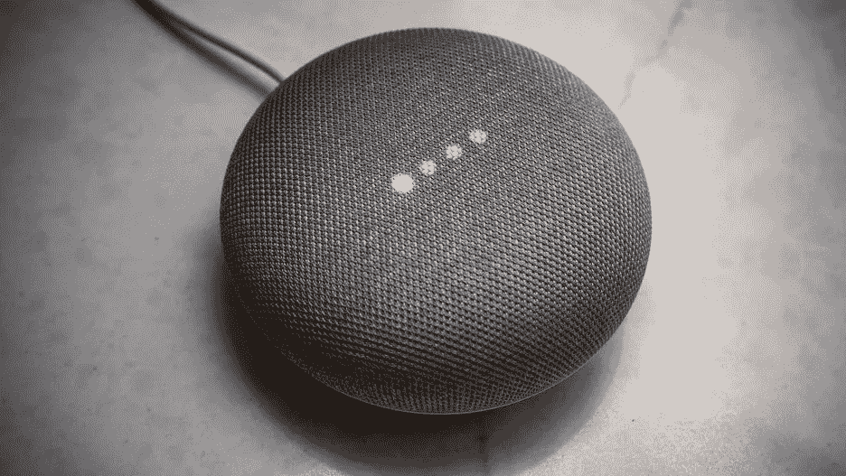

# 使用 Raspberry Pi 和 Dialogflow (Chromecast 替代品)为您的 Google Home 获得一个屏幕[第 1 部分]

> 原文：<https://medium.com/coinmonks/get-a-screen-to-your-google-home-using-raspberry-pi-and-dialogflow-chromecast-alternative-f96aad07c2d5?source=collection_archive---------3----------------------->

自从我买了谷歌主页，我就一直想在家里用语音指令控制我的设备。它在各方面都很棒，但我为它的视频功能感到难过。只有当我们有 Chromecast 设备或内置 Chromecast 功能的电视时，我们才能观看 Youtube 和网飞。我有一个树莓皮，所以我想用它来播放我最喜欢的视频和电影。

因此，我的想法是让 google home 使用语音命令在我的 raspberry pi 上打开一个特定的 url。下面是它如何工作的一个快速演示。

为此，我做了如下设置

Google Home-> dialog flow-> data policy 上的 Rpi IP 地址-> Nodejs 服务器->打开 URL 的代码

Dialogflow 是谷歌基于自然语言对话的人机交互技术。在此帮助下，我们可以开发自己的对话或任务，作为对 Google home 的输入。其工作原理如下

意图[输入、问题、对话、命令……。] -> Google Home ->操作[回复]

在这里，回复可以是一个简单的对话，也可以是从 webhook 中检索的数据，我们将使用 Rpi server 来实现。所以，去 Dialogflow 网站创建一个帐户和一个新的代理。

然后创造一个新的意图…

Click on create intent and give it a name…

然后输入训练短语。这些是用户试图从 Google Home 访问特定任务时发出的命令。

在这里,“网站”这个词可以改成任何东西，比如 youtube、网飞、亚马逊 prime 等等。所以，这个词就像一个变量，当你选择“网站”这个词时，你会得到如下结果

从下拉菜单中选择“@sys.any”并按回车键。

然后在 actions 部分输入相同的参数名。本节中提到的值以 json 文件的形式发送到 webhook，我们需要在服务器中检索该文件，以了解用户调用了哪个网站。

使用' $variable_name '检索变量值

在对 Google Home 说出命令后，添加我们需要听到的响应。然后保存意图。如果需要，将此意图设置为对话的结尾。