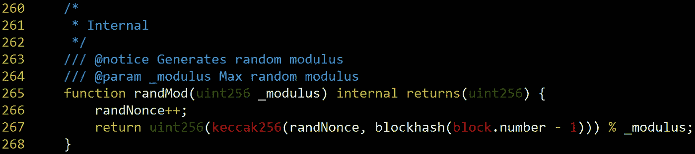
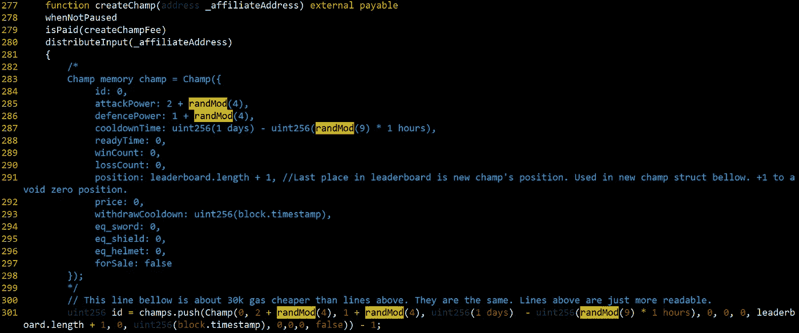
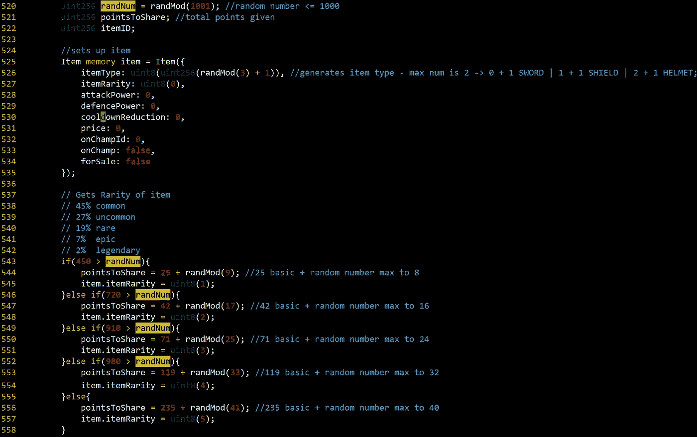
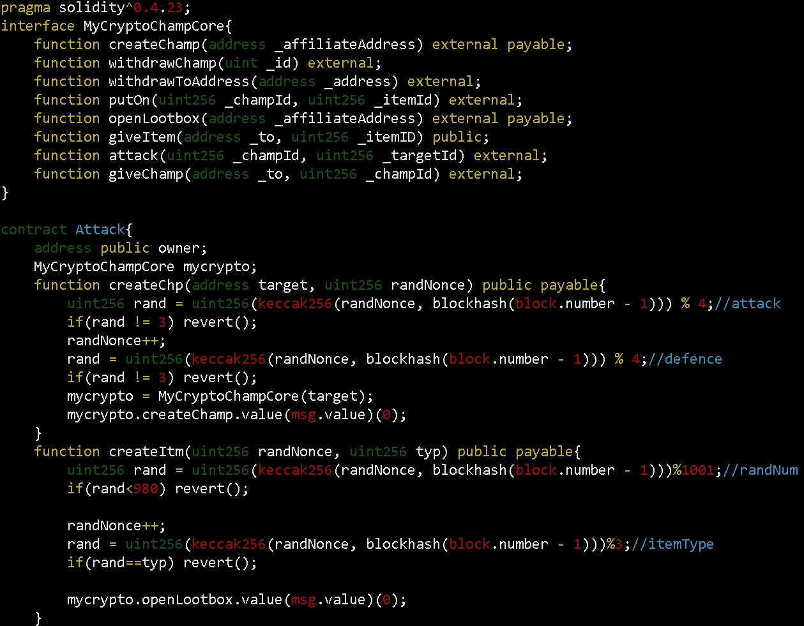
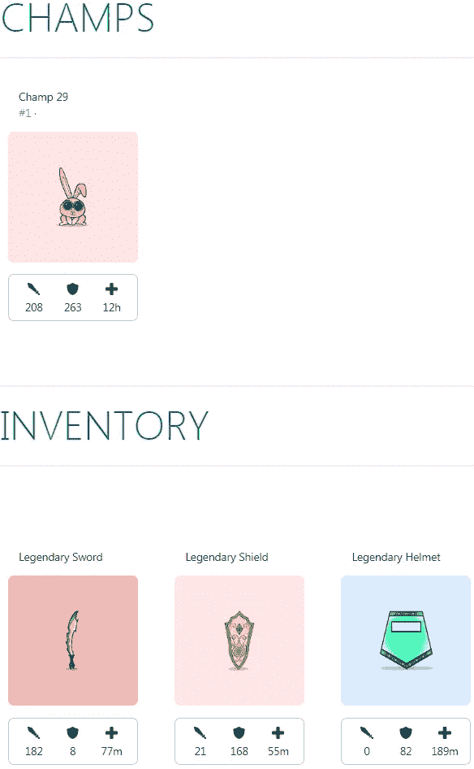

# 通过打破以太坊在线游戏 MyCyptoChamp 的 PNRG 获得传奇物品(CVE-2018–12885)

> 原文：<https://medium.com/coinmonks/get-legendary-items-by-breaking-pnrg-of-mycyptochamp-an-ethereum-online-game-cve-2018-12855-6e6beb41b8df?source=collection_archive---------9----------------------->

# 摘要

以太坊在线游戏 [MyCryptoChamp](https://mycryptochamp.io/) 有一个漏洞，它会生成可预测的随机数。在这个游戏中，用户可以通过支付一些以太来创建冠军和物品。这时，冠军和物品的力量是由随机数决定的。随机数由带有私有变量和块哈希为`block.number-1`的`keccak256()`函数生成。然而，它们都是公开的，所以攻击者可以很容易地访问它们并预先计算随机数。这个案例和我之前描述的一千个猜想*的漏洞是如此的相似[1]。我利用 MyCryptoChamp 利用内部事务，就像我利用 1000 Guess 一样。你可以在这篇文章中找到更详细的解释:“ [*攻击以太坊抽奖游戏 1000 Guess 中使用的伪随机数发生器(PRNG)。(CVE-2018–12454)*](/coinmonks/attack-on-pseudo-random-number-generator-prng-used-in-1000-guess-an-ethereum-lottery-game-7b76655f953d)”。经过剥削，我得到了一个强大的冠军与三个传奇项目。*

# *细节*

*我之前提到过，这个漏洞类似于 1000 Guess 的漏洞。如果你不知道如何读取私有变量和如何利用内部事务，我推荐你阅读我的[上一篇文章【1】](/coinmonks/attack-on-pseudo-random-number-generator-prng-used-in-1000-guess-an-ethereum-lottery-game-7b76655f953d)。还有更多细节。*

## *易受攻击代码*

**

*Figure 1\. MyCryptoChamp generates random numbers with a private variable and a blockhash*

*`randMod`函数是 MyCryptoChamp 智能合约的易受攻击函数。它使用带有私有变量`randNonce`和`blockhash(block.number-1)`的`keccak256`生成随机数。两者都是公开的，所以任何人都可以访问。*

**

*Figure 2\. Part of createChamp() function which generates new champs*

**

*Figure 3\. Part of openLootbox() function which generates new items*

*图 2 和图 3 显示 MyCryptoChamp 使用随机数生成 champs 和 items。冠军/物品的威力取决于随机数。因此，如果攻击者可以预测随机数，他可以创建最强大的冠军和项目。*

## *利用*

*利用 MyCryptoChamp 的方法很简单。攻击者通过使用`randNonce`和`blockhash(block.number-1)`预先计算随机数。当所需的随机数生成后，攻击者向 MyCryptoChamp 发送交易并获得 champs/items。*

*先来了解一下`randNonce`怎么走。我们可以这样读取私有变量[2]:*

```
*web3.eth.getStorageAt(contractAddress, position)*
```

*`position`是变量的索引位置。我们可以使用上述方法检索智能合约中的所有存储变量。在 MyCryptoChamp 中，`randNonce`位于槽 11。因此，当`contractAddress`为 MyCryptoChamp 智能合约的地址，`position`为 11 时，我们可以得到`randNonce`。*

*现在，我们要做的就是找出`blockhash(block.number-1)`。为了准确地知道它，我们应该知道包含我们发送的事务的块。如果我在块号`N`发送一个事务，该事务将在块号`N+a`执行，因为矿工选择和执行事务需要一些时间。然而，没有人确切地知道`a`。因此，在我们发送事务之前，我们无法知道执行事务的块的块号。*

*那么，我们如何得到`blockhash(block.number-1)`并预计算随机数呢？。我们只能在智能合约中知道执行我们的事务的块的块号。因此，我们应该部署一个智能契约，并预先计算该契约中的随机数。此智能合约应满足以下条件:*

1.  *以与目标合同相同的方式生成随机数*
2.  *如果目标协定生成攻击者想要的随机数，则向目标协定发送内部事务*
3.  *如果生成攻击者不想要的随机数，则恢复*

*为了攻击 MyCryptoChamp，攻击者需要满足上述条件的契约。由于 3 的条件，攻击者应该不断地发送交易，直到他们得到他们想要的随机数。所以消耗了一些气费。然而，在大多数情况下，这与他们攻击成功后获得的利益相比是微不足道的。*

*为了利用 MyCryptoChamp，我部署了以下契约:*

**

*Figure 4\. The smart contract to exploit MyCryptoChamp*

*在`createChp`函数中，第一个随机数代表攻击力，第二个随机数代表防御力。在`createItm`函数中，第一个随机数表示物品的稀有度，第二个随机数表示物品类型。这两个函数在生成攻击者想要的随机数时都会调用 MyCryptoChamp 的函数。攻击契约中生成的随机数与 MyCryptoChamp 的契约中生成的随机数相同，因为两者是在同一个块中生成的。*

**

*Figure 5\. Champ and items that I created by exploiting the vulnerability*

*图 5。显示了我利用此漏洞创建的冠军和项目。我创造了强大的冠军和三个传奇物品。*

# *报告*

*6 月底我就上报给开发商了。令人惊讶的是，他们把我花在开发上的油费还给我了。*

*现在 MyCryptoChamp 被修补了。*

*   *旧智能合约:[https://ethers can . io/address/0xa 44 e 464 b 13280340904 ffef 0 a 65 b 8 a 0033460430](https://etherscan.io/address/0xa44e464b13280340904ffef0a65b8a0033460430)*
*   *新智能合约:[https://ethers can . io/address/0x 689 FB 61845488297 dfe 7586 e5f 7956475955 D2 DC](https://etherscan.io/address/0x689FB61845488297dfE7586E5f7956475955d2Dc)*

*他们拿走了我的冠军和三件传奇物品。实际上，我找不到新智能合约的源代码，所以我不确定它现在是否安全。*

# *结论*

*在以太坊智能合约中生成随机数并不容易。使用私有变量和过去块的块变量是不安全的。如果你想了解更多的细节，我推荐你阅读我以前的文章[1]。如果有智能合约生成随机数，你应该检查它是完全随机的。*

# *参考*

*[1][https://medium . com/coin monks/attack-on-pseudo-random-number-generator-prng-used-in-1000-guess-an-ether eum-lottery-game-7b 76655 f953 d](/coinmonks/attack-on-pseudo-random-number-generator-prng-used-in-1000-guess-an-ethereum-lottery-game-7b76655f953d)*

*[2][https://web 3js . readthe docs . io/en/1.0/web 3-eth . html # get storage at](https://web3js.readthedocs.io/en/1.0/web3-eth.html#getstorageat)*

> *[直接在您的收件箱中获得最佳软件交易](https://coincodecap.com/?utm_source=coinmonks)*

*[](https://coincodecap.com/?utm_source=coinmonks)*