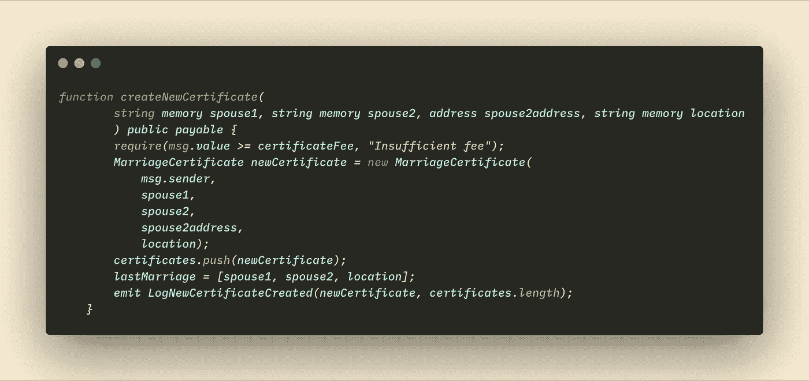
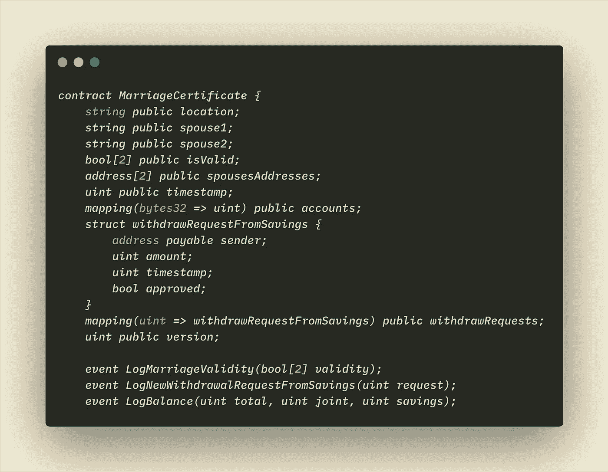
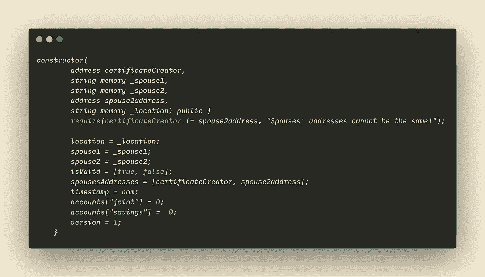
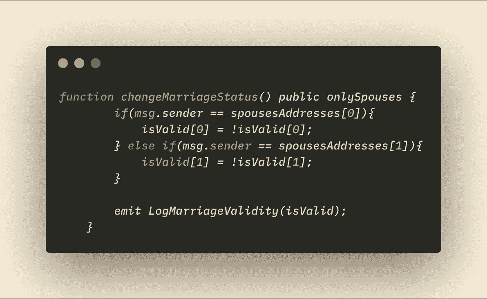
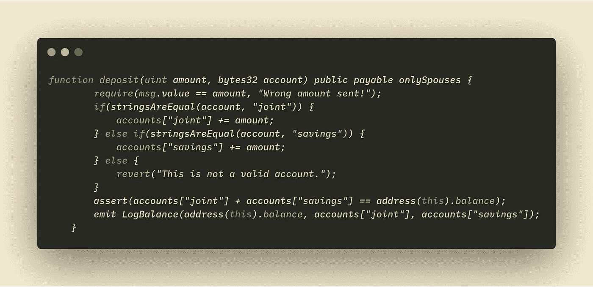
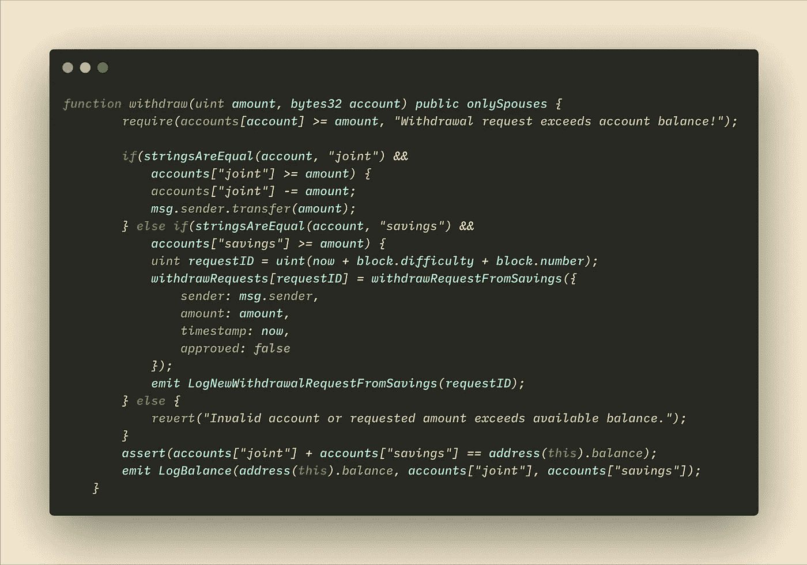
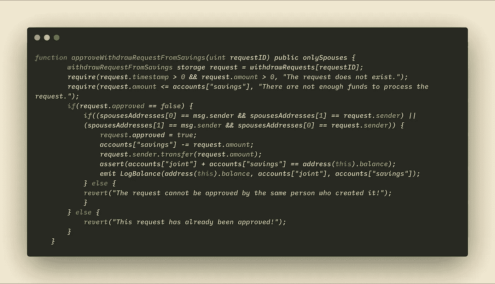
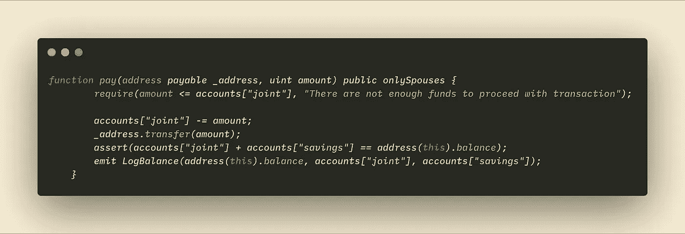
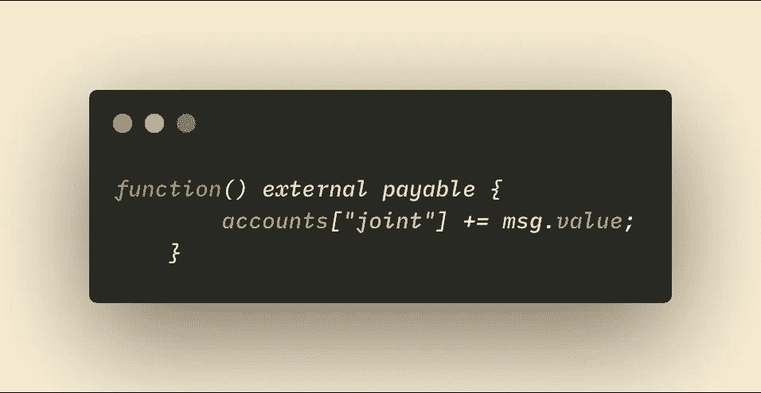

# 在区块链上结婚！

> 原文：<https://medium.com/coinmonks/get-married-on-the-blockchain-25091f12399b?source=collection_archive---------0----------------------->

或者区块链如何也能彻底改变我们的关系…


Picture from undraw.co

自从我听说它的那一刻起，我就一直对智能合约给我们带来的巨大可能性着迷，我觉得它们仍然被低估了。

我大约两年前开始对比特币感兴趣，但就在几个月前，我发现了以太坊区块链和可靠性。从那时起，我就无法阻止自己阅读关于这个主题的所有资料。我订阅了邮件列表，直接在我的邮箱中接收关于以太坊和 Solidity 的文章，我经常偷看 Solidity 文档，并且我阅读了无数关于这个主题的教程。

然而，看起来除了大公司之外，没有多少人试图以一种更“颠覆性”的方式使用以太坊区块链。大多数教程教授如何创建 ERC20 令牌或投票系统。我经常让自己的思绪游走，想象如果区块链取代我们的政府，我们会取得怎样的成就。智能合同可以让我们收回并重新拥有哪些任务？我就是这样产生了写结婚证智能合同的想法。毕竟，这是一件相对简单的事情:两个人想要结婚(不管是好是坏)，他们在一个机构前登记他们的结合，例如当他们需要证明他们的婚姻或者当他们想要离婚时，他们回到同一个机构。

在现实生活中，婚姻是一个真正的挑战，人们往往会浪费大量的时间和金钱。智能合同可以帮助他们在几秒钟内结婚(或离婚)，只需几分钱。区块链的不变性允许确保结婚证不被更改超出其内部功能，并使其在任何时间任何地点可用。

这就是在区块链庆祝婚姻的想法是如何诞生的！通过该网站，夫妇可以创建一个智能合同，该合同将以不变的方式存储他们的个人身份信息(如姓名、位置和身份证号码)，以便能够以简单的方式证明证书的所有权，他们可以毫不费力地更新婚姻状态(离婚实际上只需几秒钟和几分钟即可完成)，最后， 智能合同的设计允许夫妇使用证书以两种不同的方式存储共同资金:一个“联合账户”，配偶双方可以自由存钱和取钱；一个“储蓄账户”，在取钱之前需要配偶双方的同意。

我将在下面描述智能合同的代码(在这个地址处[可用)，一个接一个的功能，以便更好地理解它的功能，同时也接收有用的反馈:)对于初学者来说，这可能也是有用的，因为我几个月前已经详细浏览了智能合同是如何工作的。](https://github.com/claudebarde/GetMarriedOnTheBlockchain/blob/master/contracts/MarriageCertificateCreator.sol)

# 结婚证工厂

每个结婚证都是由工厂智能合同创建的，该合同负责用正确的数据设置正确的状态，并保存证书地址。按照惯例，智能合同从 pragma 版本开始:

```
pragma solidity ^0.5.0;
```

与许多用第四版编写的智能合同相比，智能合同使用了最新版本的 Solidity。

```
contract MarriageCertificateCreator {
    MarriageCertificate[] public certificates;
    address payable public owner;
    uint public certificateFee;
    string[3] public lastMarriage;
```

这是合同声明。它创建了四个状态变量:一个**证书**变量(一个包含类型为“结婚证书”的值的动态数组)，最终将包含每个创建的证书的地址；一个**所有者**变量(使用智能合同的各种功能)；一个**证书**变量(一个无符号整数，表示 wei 中的费用)；以及一个**last 婚姻法**变量(一个由 3 个字符串组成的数组，保存最后一个注册证书的名称和位置)。

```
constructor() public {
        owner = msg.sender;
        certificateFee = 100000000000000000 wei;
    }
```

建造者非常直接，它保存了所有者的地址(我的),并将创建新结婚证的费用设置为 0.1 以太。该费用可在另一个功能中手动更新。

```
event NewCertificateCreated(MarriageCertificate newCertificateAddress, uint numberOfCertificates);
```

这是智能合同中唯一的事件，它在每次创建新证书时发出，并将新合同的地址和结婚证总数返回到 web3 界面。

## createNewCertificate 函数

这是所有魔法发生的地方！下面的功能负责从 web3 接口接收数据，验证数据，更新合同工厂的状态，显然还负责创建新的结婚证。



您将在下面找到该功能不同部分的详细说明。

```
function *createNewCertificate*(
        string memory **spouse1**, string memory **spouse2**, address **spouse2address**, string memory **location**
        ) public payable {}
```

该函数接受 4 个参数:

1.  **spouse1** 变量是 JSON 格式的 JavaScript 对象，包含关于第一任配偶(也是结婚证的发起人)的各种信息。出于多种原因，JSON 字符串是存储在智能契约中的更好选择:它允许在将来存储不同的信息，在 Solidity 中比像数组或结构这样的其他结构更容易处理，更容易从 web3 接口获取信息(例如，如果它是一个结构，就不需要对其进行转换),并且在智能契约创建期间提供的大部分信息对其执行并不重要。
2.  **spouse2** 变量也是 JSON 格式的 JavaScript 对象，保存与第二个配偶相关的信息。因为结婚证书是由一个人创建的，所以第二个参与者必须稍后验证该信息以使婚姻有效。在第二个配偶到来并批准婚姻之前，婚姻一直处于永久无效状态。
3.  **spouse2address** 变量包含必须批准婚姻的第二个配偶的地址。这两个地址将被独立存储，因为它们需要更新新创建的证书的状态。
4.  **位置**变量是一个 JSON 格式的 Javascript 对象，包含这对夫妇在注册过程中选择的城市和国家的名称。

```
MarriageCertificate newCertificate = new MarriageCertificate(
            msg.sender,
            spouse1,
            spouse2,
            spouse2address,
            location);
```

函数体负责传递之前收到的参数， **msg.sender** 是 **spouse1** 的地址。请注意，无论 spouse1 变量中传递了什么值，创建结婚证的人都将被视为第一个配偶。
另请注意，在 Solidity 0.5 中，当您从智能合约创建新的智能合约时，它返回的值最终是一个地址，但它将是“NameOfCreatedSmartContract”类型。知道这一点也很重要，因为我们将把这些值存储在一个数组中。

```
certificates.push(newCertificate);
lastMarriage = [spouse1, spouse2, location];
emit NewCertificateCreated(newCertificate, certificates.length);
```

接下来的几行代码非常简单:我们将新证书的地址推送到 *certificates* 数组中(根据 Solidity 0.5，其值必须是“NameOfCreatedSmartContract”类型)，我们更新 lastMarriage 变量，因此该值总是设置为最后注册的婚姻，我们发出一个事件，该事件将被 web3 接口捕获。

# **结婚证**

婚姻证书智能契约是一个非常简单的契约，因为它主要用于存储关于夫妻双方的不变信息、关于婚姻状况的可变信息以及两个独立账户中的共同资金，外加一些存取上述资金的功能。



在合同创建期间设置了几个变量以及两个事件发射器:**位置**、 **spouse1** 和 **spouse2** 将保存关于配偶和注册地的信息。应该注意的是，如果配偶必须证明他们是登记婚姻的人，那么配偶在证书创建期间提供的身份证号码在客户端是加密的，并且提供了解密密钥。
有效变量是由 2 个布尔值组成的数组，代表配偶双方选择的婚姻状态，**配偶使用地址**是由两个地址组成的数组，包含配偶双方的地址，常用于*要求*功能，以确保合同状态只能由配偶双方修改。
时间戳**变量保存创建时间戳，而**账户**映射跟踪“联名”和“储蓄”账户中的乙醚量。
配偶一方每次从储蓄账户提出取款请求时，都会创建一个**取款请求表单**结构。然后，该请求被保存在**提取请求**映射中。
最后，**婚姻有效性**事件返回*是有效的*数组，而**newwithrrawalquestfro 储蓄**事件返回新创建的请求。**

## 构造函数

构造函数非常标准:



它接收关于新婚夫妇的不同信息，将其存储在之前创建的变量中，并将“联合”和“储蓄”帐户设置为 0。*为有效*变量设置为`[true, false]`，因为婚姻只有在第二任配偶认可后才能有效。

## 合同状态操纵

智能合同允许配偶根据自己的意愿更新婚姻状况。使用布尔运算`&&`运算符计算*中两个值之间的状态是有效的*数组。这意味着，要使婚姻有效，配偶双方都必须同意。简单的读取*中的布尔值就是有效的*数组，这也可以表明配偶中的哪一个同意或者不同意婚姻。

```
modifier onlySpouses {
        require (
            msg.sender == spousesAddresses[0] || msg.sender == spousesAddresses[1], "The contract status can only be changed by one of the spouses."
            );
        _;
    }
```

这个修饰符将被使用几次，并确保更新智能合同状态的人从创建智能合同时提供的两个地址中选择一个进行更新。



当夫妻中的一方要求改变婚姻状态时， *changeMarriageStatus* 函数执行简单的布尔翻转。请注意，夫妻双方必须将 *isValid* 数组中的两个值都设置为`true`才能使离婚生效。

**存取款功能**

智能合同基本上是一个带代码的以太坊账户，如果不使用这个功能就太可惜了:)进一步说，结婚证分为两个不同的账户:“联名”账户和“储蓄”账户。
“联合”账户是夫妻双方(或任何有以太坊地址的人)都可以发送以太网的账户，夫妻双方可以提取他们想要的金额。
“储蓄”账户是一个只有配偶双方可以向其汇款的账户，为了取钱，取款人必须登记一个请求，然后由第二个配偶批准。

让我们深入研究代码:



**存款**功能允许配偶通过网络界面存款。它接受两个参数:要添加的*金额*和要增加的*账户名称*。*only 配偶*修饰符确保只有两个配偶可以访问该功能。

作为一种安全措施，合同验证用户选择的金额也是发送的金额。stringsAreEqual 函数检查 bytes32 变量，契约决定相应地增加联合帐户或储蓄帐户。最后一个*断言*函数用于检查无论发生什么情况，联名账户和储蓄账户的总和始终等于合同的总余额。
通过智能合约功能的每一次余额变化都会发出一个 *LogBalance* 事件，其中包含总余额、“联合账户”的余额和“储蓄余额”的余额。



**撤回**功能有点复杂。没有另一方的批准，任何一方都不允许从储蓄账户中取钱，这个功能必须确保不会发生这种情况。
如果其中一方发送交易从储蓄账户中提取乙醚，则在合同中保存一个请求，并发布一个请求 ID。第二个配偶必须使用他/她自己的帐户地址来批准请求。

首先，*only 配偶*修饰符确保除了两个配偶之外，其他任何人都不能从合同中取钱。然后，合同会检查请求的金额是否没有超过所选帐户的余额。
第一个条件验证所选帐户的名称，并检查请求的金额，以确保它没有超过帐户的余额。

如果选择“联名”账户，结果很简单:从余额中扣除金额并发送给汇款人。

如果选择了“储蓄”账户，则合同创建一个(伪)唯一 ID，添加当前时间戳、块难度和块号。因为两个请求同时出现的可能性很小，所以这就足够了。使用 ID 作为关键字，创建一个类型为*withdrawrequestfromservices*的新结构，并保存在 *withdrawRequests* 映射中。一旦新请求保存在映射中，我们就发出一个事件来获取 web 界面中的请求 ID。

最后，我们再次检查联合账户余额和储蓄账户余额是否等于总余额，如果不等于总余额，合同将恢复到之前的状态。

现在让我们来看一下允许配偶批准从储蓄账户提款请求并发送资金的函数。



**approvewithdrawrequestfromservices**函数将请求 ID 作为参数。该功能只能由夫妻中的一方使用。契约从存储中的映射获取请求，并运行一些检查:通过检查时间戳和金额，它确保请求存在(如果没有找到请求结构，它们默认等于 0)，然后它检查请求的金额是否仍然可用，以及请求是否仍然待定(批准已经批准的请求没有意义！)

如果请求是待定的，下一个条件确保批准请求的配偶不是创建请求的人(试图批准他们自己创建的请求的用户将触发恢复功能)。
如果一切正常，请求将被标记为已批准(true)，所请求的金额将从储蓄帐户中扣除，并发送给发起请求的配偶。



**支付**功能允许配偶使用共同账户中的钱支付各种费用，如账单。该功能会在扣除并发送请求的金额之前，检查该金额在联合帐户中是否可用。
完成后，该功能将确保总余额等于联名账户余额和储蓄账户余额。
最后，发出一个 *LogBalance* 事件来更新用户界面。

总之，值得一提的是*回退*功能:



任何直接发送到合同的乙醚将被添加到联合帐户。请注意，如果不提供 42.000 左右的汽油，交易将失败。

# 结论

我希望这篇文章能帮助你理解智能合同的内部机制，该合同是为了在区块链登记婚姻、跟踪婚姻状况、管理婚姻预算以及简化婚姻官僚主义中的各种程序而创建的。

除了这种合同的实际方面，它还被视为一种示范，展示了区块链可以在多大程度上推动我们中央集权社会的极限，并打开一个去中心化世界的大门，在这个世界中，我们都将收回为自己做决定的权力！

## 链接:

你可以在 这里找到网站 [**，智能合约代码在**](https://www.marriageontheblock.com) **[**这个地址**](https://raw.githubusercontent.com/claudebarde/MarriageOnTheBlock/master/contracts/MarriageCertificateCreator.sol) 或者查看 [**Github 库**](https://github.com/claudebarde/MarriageOnTheBlock) 。**

> [直接在您的收件箱中获得最佳软件交易](https://coincodecap.com?utm_source=coinmonks)

[](https://coincodecap.com?utm_source=coinmonks)

> [直接在您的收件箱中获得最佳软件交易](https://coincodecap.com/?utm_source=coinmonks)

[](https://coincodecap.com/?utm_source=coinmonks)