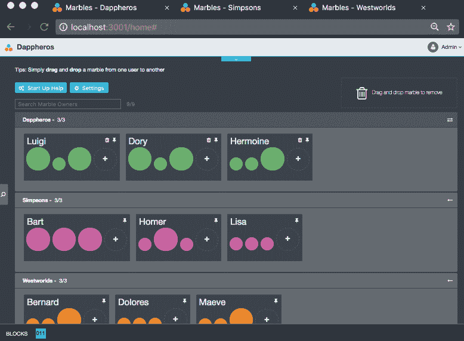
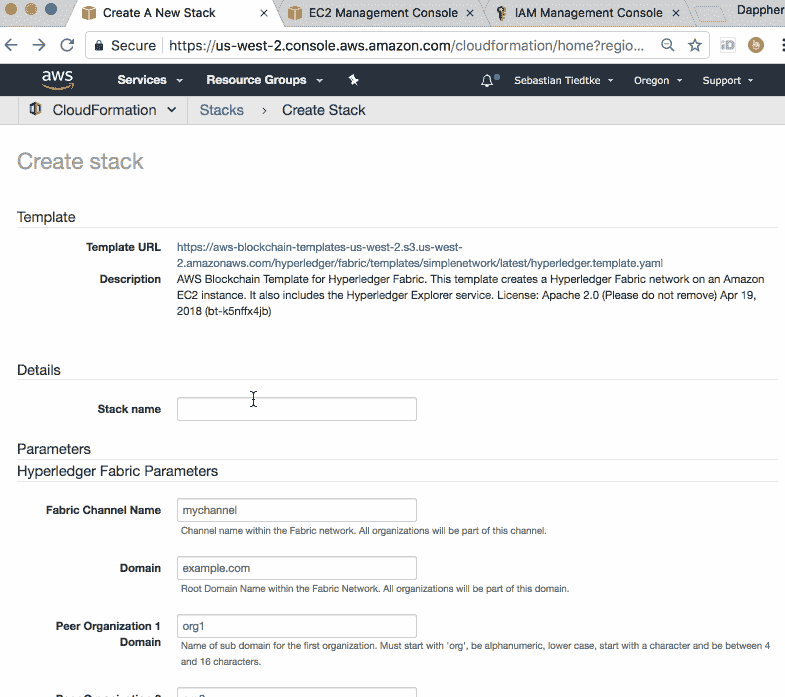
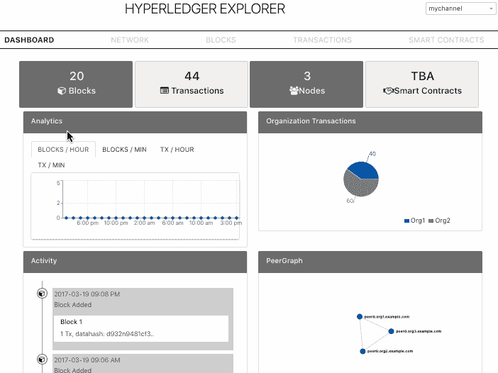

# 使用 AWS Hyperledger 结构模板开始使用区块链-非官方指南(第 1 部分)

> 原文：<https://medium.com/coinmonks/get-started-with-blockchain-using-the-aws-hyperledger-fabric-template-an-unofficial-guide-551bc46af710?source=collection_archive---------1----------------------->

2018 年 4 月 19 日，亚马逊网络服务(Amazon Web Services)宣布为以太坊发布[区块链模板，为其公共云发布【Hyperledger Fabric。在达费罗，我们相信 DLT 和区块链既强大又复杂。我们相信，模板和最佳实践对于社区和行业采用和实施诸如 Fabric 等技术以释放其价值至关重要。](https://aws.amazon.com/about-aws/whats-new/2018/04/introducing-aws-blockchain-templates/)

> [发现并回顾最佳区块链软件](https://coincodecap.com)

我们的好奇心让我们看了一下 AWS 官方的 CloudFormation 的 Hyperledger Fabric 模板。虽然 AWS 官方报道了如何使用[以太坊模板](https://aws.amazon.com/blogs/aws/get-started-with-blockchain-using-the-new-aws-blockchain-templates/)，但我们想了解该模板能为 Hyperledger Fabric 用户做些什么。经过彻底的回顾，我们想在一个多部分的 Dapphero 博客系列中分享我们的旅程，以展示在 AWS 中运行的 Hyperledger Fabric 之上的端到端分散式应用程序。

在本博客系列结束时，按照逐步说明，您将能够完成以下任务:

1.  利用 AWS 的 Hyperledger Fabric 模板为 3 个组织提供基础架构，每个组织有 1 个对等方加入联盟网络。
2.  了解 AWS 托管的云主机以及 Fabric 命令行界面的基础知识。
3.  在联盟网络上运行多个 IBM Marbles 的实例。

本文要求具备 AWS 服务的基本知识，特别是 EC2 和 CloudFormation。

[Marbles](https://github.com/IBM-Blockchain/marbles) 是 IBM 在 Apache 2.0 许可下发布的一个去中心化应用程序。这个 dapp 演示了利用 Hyperledger Fabric 作为 DLT/区块链平台，在许多独立组织的所有者之间转移弹珠。它加强了生命周期控制、所有权、各方之间的转移，以及对单个弹珠出处记录的审计跟踪。如果你想了解更多关于[弹珠](https://github.com/IBM-Blockchain/marbles)的信息，我们建议你查看该项目的详细自述。



Illustrates three instances, one per org, of IBM’s Marbles dapp running against AWS-hosted Fabric consortium blockchain

# 第 1 部分:利用 AWS 的 Hyperledger 结构模板

让我们直接进入这个多部分博文系列的第一部分。

## 步骤 1:使用 AWS 的 CloudFormation 模板进行结构基础设施配置

导航至[区块链模板入门](https://aws.amazon.com/blockchain/templates/getting-started/)页面。从右侧的“Hyperledger Fabric”部分下选择所需区域的链接。在达费罗，我们将使用*美国西部(俄勒冈州)*，又名*美国西部-2* 。如果您尚未登录，AWS 控制台会提示您输入凭据。如下面的截屏所示，填写堆栈创建表单，尽可能使用默认值。我们还将分享脚本片段，假设您的组织被称为 *org1* 、 *org2* 和 *org3* 。命名方案对于我们的脚本非常重要，有助于简化后续博客文章中的配置过程。

一些需要注意的事项:

1.  CloudFormation 模板表单仅应用简单的健全性检查，例如，未关联的安全组和 VPC ID 将被忽略，并且堆栈创建将在过程后期失败。一定要提前仔细检查。
2.  为了简单起见，我们选择通过 AWS 主机的公共网络接口与它进行交互。
3.  安全组(例如 SG_Fabric_Demo)应该允许到以下端口的入站 TCP 连接: *22、80、8080、7050、7051、7053、8051、8053、9051、*和 *9053* 。您可以将来自*任何地方*的连接列入白名单(仅限 PoC！)，特定的 IP 范围，或者使用堡垒主机(不在范围内)来访问托管您的组织的对等机的云机器。
4.  我们已经创建了一个临时 IAM 角色来运行堆栈创建。确保授予该角色使用两个特定策略来配置 EC2 基础架构的访问权限，1。)*Amazon EC 2 containerregistry readonly*和 2。)*亚马逊 3ReadOnlyAccess* 。
5.  不用说，确保您拥有 EC2 中用于运行模板的私钥。

提交后，CloudFormation 将导航至堆栈详细信息页面，其中将显示 ***创建进行中*** 的状态。需要几分钟才能完成。喝杯茶/咖啡的好机会。



CloudFormation template-based stack creation end-to-end

一旦完成堆栈细节将显示***CREATE _ COMPLETE***。如果出现错误，请注意这个 CloudFormation 模板利用了嵌套的堆栈(转到堆栈概述页面)，在我们的情况下，这有助于通过更仔细地查看日志来诊断问题。还请注意，出于演示目的，AWS 选择提供单个云主机实例来为所有组织托管多个 Fabric 对等体。不建议在生产中应用类似的设置。

## 步骤 2:查看 Fabric Explorer web 应用程序

AWS 模板附带了现成的 Fabric Explorer(可以说是一个过时的版本)。将 web 浏览器导航到以下 URL 将直接进入 Fabric Explorer 体验。

```
http://<Instance IP address>/
(e.g. [http://54.202.17.239](http://54.202.17.239))
http://<Instance IP address>:8080/
(this will also work; e.g. [http://54.202.17.239:8080/](http://54.202.17.239:8080/))
```

Fabric Explorer 应该类似于下面的屏幕截图。有几点需要注意:

1.  某些浏览器在输入 IP 地址时不再自动完成 http://。它们要么使用 https://无法使用，要么是错误。我们还意识到(谢谢你，戴夫！)只要安全组允许入站连接，端口 8080 也将服务于资源管理器。
2.  在交易进入之前，新调配的探险者可能不会向其他对等方显示太多数据。
3.  AWS 模板利用 *iptables* 直接在端口 80 上公开地公开容器的端口。不幸的是， *iptables* 指令不会在机器重新启动时持续存在。请改用端口 8080。
4.  如果即使云主机没有重新启动，资源管理器也不会加载，则安全组可能会错过允许端口 *80* 上的入站 TCP 连接的指令。不如试试 8080 端口。



Fabric Explorer web interface

稍后我们将部署弹珠应用程序，Fabric Explorer 是一个很好的工具，可以在事务数据进入网络时进行跟踪和监控。

## 第 3 步:通过 AWS 云主机导航结构

CloudFormation 堆栈详细信息页面将在 *DevDesktopInstanceId 下的*输出*部分显示实例 ID。*找到 EC2 控制台的 Fabric 主机实例，并按照说明将 SSH 插入该对话框。

```
**~/demo $ ssh -i yourkey.pem -r ec2-user@<Instance IP address>**
> Amazon Linux AMI
```

*ec2-用户*的主目录将显示与 Hyperledger Fabric 相关的两个条目。两者都预先打包了 AWS 模板。

```
~ $ **ls -l ~/**
total 8
drwxr-xr-x 3 ec2-user ec2-user 4096 Apr 24 23:44 HyperLedger-BasicNetwork
drwxr-xr-x 5 ec2-user ec2-user 4096 May 16 17:35 hyperledger-fabric-samples
```

这有助于实现 AWS 选择使用[Docker composite](https://docs.docker.com/compose/)通过 Docker 容器基础架构交付 Fabric。它基于 Hyperledger Fabric 项目发布的示例项目。只要浏览一下正确的子目录，就会看到相关的 Docker 配置文件。

```
$ **ls -l ~/HyperLedger-BasicNetwork/artifacts/docker-compose/**
total 40
-rw-r - r - 1 ec2-user ec2-user 4185 May 16 17:36 docker-compose-base.yaml
-rw-r - r - 1 ec2-user ec2-user 4575 Apr 24 23:44 docker-compose-base.yaml.template
-rw-r - r - 1 ec2-user ec2-user 2085 Apr 24 23:44 docker-compose-cli-only.yaml.template
-rw-r - r - 1 ec2-user ec2-user 3662 May 17 00:51 docker-compose-cli.yaml
-rw-r - r - 1 ec2-user ec2-user 3968 Apr 24 23:44 docker-compose-cli.yaml.template
-rw-r - r - 1 ec2-user ec2-user 749 May 16 17:36 docker-compose-explorer.yaml
-rw-r - r - 1 ec2-user ec2-user 790 Apr 24 23:44 docker-compose-explorer.yaml.template
-rw-r - r - 1 ec2-user ec2-user 1006 Apr 24 23:44 peer-base.yaml
```

任何基于码头工人撰写的命令都将工作，将 ***码头工人撰写命令*** 指定为各自的配置文件。要查看哪些容器正在运行，我们可以列出它们，并使用 Docker Compose 跟踪它们的所有日志。

```
$ **cd ~/HyperLedger-BasicNetwork/artifacts/docker-compose/**
$ **docker-compose -f docker-compose-cli.yaml ps**
         Name                       Command               State                       Ports
----------------------------------------------------------------------------------------------------------------
cli                      /bin/bash                        Up
fabric-explorer          /bin/sh -c /opt/blockchain ...   Up      0.0.0.0:8080->8080/tcp
fabric-explorer-db       docker-entrypoint.sh postgres    Up      0.0.0.0:5432->5432/tcp
orderer.example.com      orderer                          Up      0.0.0.0:7050->7050/tcp
peer0.org1.example.com   peer node start                  Up      0.0.0.0:7051->7051/tcp, 0.0.0.0:7053->7053/tcp
peer0.org2.example.com   peer node start                  Up      0.0.0.0:8051->7051/tcp, 0.0.0.0:8053->7053/tcp
peer0.org3.example.com   peer node start                  Up      0.0.0.0:9051->7051/tcp, 0.0.0.0:9053->7053/tcp$ **docker-compose -f docker-compose-cli.yaml logs | grep "example.com"**
[...]
peer0.org1.example.com | 2018–05–21 22:17:08.307 UTC [gossip/discovery] expireDeadMembers -> WARN 037 Entering [[170 123 98 139 66 14 67 137 217 110 254 192 37 205 91 30 68 48 210 154 215 82 38 145 53 103 71 19 112 148 202 206]]
peer0.org1.example.com | 2018–05–21 22:17:08.307 UTC [gossip/discovery] expireDeadMembers -> WARN 038 Closing connection to Endpoint: peer0.org2.example.com:7051, InternalEndpoint: , PKI-ID: [170 123 98 139 66 14 67 137 217 110 254 192 37 205 91 30 68 48 210 154 215 82 38 145 53 103 71 19 112 148 202 206], Metadata: []
peer0.org1.example.com | 2018–05–21 22:17:08.307 UTC [gossip/discovery] expireDeadMembers -> WARN 039 Exiting
```

通常情况下，能够更接近容器/流程级别可以更有效、更快地排除问题。它还提供了一个了解有关 Fabric 内部工作方式的详细信息的好方法。

在继续之前，让我们先看看与结构本身、资源管理器、基本自动化脚本和底层加密材料相关的更多配置数据位于 AWS 主机上的何处。

```
$ **ls -l /etc/fabric/**
total 32
drwxr-xr-x 7 root root 4096 May 16 17:36 chaincode
drwxrwxr-x 2 ec2-user ec2-user 4096 May 17 00:51 channel-artifacts
drwxr-xr-x 4 ec2-user ec2-user 4096 May 16 17:36 crypto-config
-rw-r - r - 1 root root 3195 May 16 17:36 explorer-config.json
drwxr-xr-x 2 root root 4096 May 16 17:36 network-management-scripts
drwxr-xr-x 2 root root 4096 May 16 17:36 scripts
drwxr-xr-x 2 root root 4096 May 16 17:36 tools-bin
drwxr-xr-x 2 root root 4096 May 16 17:36 tools-config
```

在所有工件中，一个重要的数据存储是 ***crypto-config*** 目录，它存储所有组织的证书、它们的公钥和私钥对。请注意，对于任何形式的生产级操作，都不建议将所有组织的这种高度敏感的加密材料存储在一个位置(为简单起见)，由一个人或一个实体控制。 ***加密配置*** 的高层浅树应该类似于下面目录层的结构。

```
$ **tree -d -L 3 crypto-config**
crypto-config
├── ordererOrganizations
│   └── example.com
│       ├── ca
│       ├── msp
│       ├── orderers
│       ├── tlsca
│       └── users
└── peerOrganizations
    ├── org1.example.com
    │   ├── ca
    │   ├── msp
    │   ├── peers
    │   ├── tlsca
    │   └── users
    ├── [...repeats for org2., org3.]
```

在博客系列的后面部分，我们将需要 ***加密配置*** 来运行 Marbles 应用程序的实例。现在，让我们转到 Fabric 的命令行界面。

## 步骤 4:探索 AWS 主机上的结构对等 CLI

在一个基本的操作级 Hyperledger 结构上，是一组作为容器中的进程运行的二进制文件，通过网络接口提供 API。为了与 Fabric 进行交互，可以使用官方语言专用的 SDK，或者使用内置的命令行接口来针对 API 发出调用，以执行各种 Fabric 管理任务和监控。

不幸的是，AWS 模板附带了一个微妙的错别字(Dapphero 向 AWS 提交了一个错误报告),它使预先提供的 CLI 开箱即用。应用修复需要几个步骤，但总体来说很简单。

```
$ cd HyperLedger-BasicNetwork/artifacts/docker-compose/
$ nano docker-compose-cli.yaml
```

删除第 68 行 ***/opt /gopath*** 中**/*opt*/opt 后的空白，以***/opt/gopath****和* 退出+保存，用键盘快捷键 *CTRL+X* 确认修改*。*接下来，需要重新创建 cli 容器来进行修复，然后在 CLI 容器内启动 bash。**

```
**$ IMAGE_TAG=latest docker-compose -f docker-compose-cli.yaml up -d --no-deps cli**
$ docker-compose -f docker-compose-cli.yaml exec cli bash
**root@0f45d277b51a:peer# ls**
channel-artifacts crypto scripts
```

container Fabric 的对等二进制内部提供了各种命令来检查 Fabric 区块链内部的情况并进行更改。对等二进制程序获取环境变量，以确定要连接到哪个对等体。以下说明将揭示什么样的对等体加入了什么样的通道。

```
**root@0f45d277b51a:peer# export | grep PEER | grep -v TLS**
declare -x CORE_PEER_ADDRESS="peer0.org1.example.com:7051"
declare -x CORE_PEER_ID="cli"
declare -x CORE_PEER_LOCALMSPID="org1MSP"
declare -x CORE_PEER_MSPCONFIGPATH="/[opt/gopath/src/github.com/hyperledger/fabric/peer/crypto/peerOrganizations/org1.example.com/users/Admin@org1.example.com](mailto:opt/gopath/src/github.com/hyperledger/fabric/peer/crypto/peerOrganizations/org1.example.com/users/Admin@org1.example.com)/msp"
**root@0f45d277b51a:peer# peer channel list**
2018–05–22 15:41:11.235 UTC [channelCmd] InitCmdFactory -> INFO 001 Endorser and orderer connections initialized
Channels peers has joined:
mychannel
2018–05–22 15:41:11.237 UTC [main] main -> INFO 002 Exiting…..
```

要对 org2 或 org3 的对等方发出命令，需要设置环境以匹配相应组织的地址、MSP 和 MSPIDs。在线文档的 ***对等通道帮助*** 和[对等命令参考](https://hyperledger-fabric.readthedocs.io/en/latest/commands/peercommand.html)部分提供了对等二进制帮助。

## 下一步是什么？

恭喜你。现在我们已经了解了通过官方 AWS 模板提供的 AWS 主机的设置，在下一篇文章中，我们将重点关注如何在没有结构证书授权(AWS 模板中未提供)的情况下导航身份、部署链码(智能合同的结构语言)以及运行 Marbles 的多个实例，以展示分散式应用程序如何在联盟网络中端到端地工作。

我们期待您在下面的评论中或通过[daphero 的联系表](https://docs.google.com/forms/d/e/1FAIpQLSc3K55U7g6iOU8G6odqnF-1sJcySe6JcFC6MpE69qVijNUGsA/viewform?usp=pp_url&entry.2005620554&entry.482458136=I+want+to+get+involved&entry.1045781291&entry.1166974658&entry.839337160)提出反馈和问题。


About the author: [Sebastian Tiedtke](https://www.linkedin.com/in/sourishkrout) is the cofounder & CEO of Dapphero. Before dedicating his time to unlock Blockchain/DLT for developers and businesses, Sebastian spent five years helping bring test automation to countless agile software shops leading [Sauce Labs](https://saucelabs.com/)’ engineering teams.