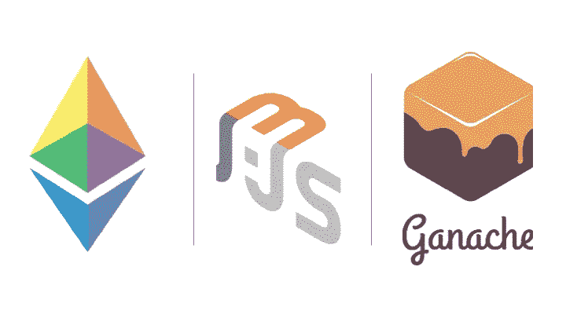

# 使用 Web3js & Ganache-CLI 创建和部署智能合约—第 1 部分

> 原文：<https://medium.com/coinmonks/get-started-with-building-ethereum-dapps-and-smart-contracts-d86b9f7bd1c?source=collection_archive---------0----------------------->

*注意——本文更新了 Truffle、Solidity、Metamask、web3js 和 Ganache-CLI 的最新版本*

在[的前一部分](/@itsromiljain/getting-started-with-ethereum-and-building-basic-dapp-ebb681fb3748)，我们讨论了以太坊、智能合约、EVM 以及以太坊系统的主要组件。



Ethereum’ Smart Contract using Web3js & Ganache

在这一部分中，我们将使用 Solidity 实现一个非常基本的分散式应用程序，并将使用 Web3/Truffle 框架在 Ganache-CLI 网络上进行开发和部署。

# 入门指南

## 我们需要的基本工具-

*   节点程序包管理器(npm) — NPM 是 Node.js 程序包或模块的程序包管理器。
*   web3js——web3js 是一个允许您通过 RPC 与区块链交互的库。该库将用于部署智能合约并与之交互。
*   [Solidity](https://solidity.readthedocs.io/en/develop/index.html) — Solidity 是一种面向契约的高级语言，用于实现智能契约。它受 C++、Python 和 JavaScript 的影响，设计目标是以太坊虚拟机(EVM)。
*   Ganache(早期的 TestRPC )—Ganache 是一个基于 Node.js 的以太坊客户端，用于测试和开发。它 100%在本地运行，模拟一个完整的以太坊客户端，但是速度快得多，非常适合测试和开发。
*   Truffle/Embark——Truffle/Embark 是以太坊的开发环境、测试框架和资产管道。基本上，它帮助您将合同部署到区块链，用新合同替换旧合同(称为迁移)，并将您的前端与您部署的合同挂钩。
*   meta mask/Mist——meta mask/Mist 是一个以太坊轻型客户端和 Chrome 扩展，允许用户与区块链交互，而无需下载整个区块链。换句话说，它允许你在普通的 Chrome 浏览器中与 dApps 进行交互。MetaMask 是虚拟客户端，用于在部署到由 Mist 提供的实际以太网之前测试和模拟合同。
*   Visual Studio 代码/Atom — Visual Studio 代码是一个源代码编辑器。它支持多种编程语言和一组特性，这些特性对于给定的语言可能可用，也可能不可用。它还对 Solidity 进行了扩展，这将有助于我们使用这个 IDE 编写智能合同。

所以让我们安装工具。如果没有，我们将首先安装 npm。[这里](https://www.npmjs.com/get-npm)是如何安装它的说明。

一旦安装了 npm，我们就可以用它来安装 ganache-cli (testrpc)，这是一个 Node.js 以太坊客户端，模拟了一个真实的以太坊节点。

> 交易新手？试试[加密交易机器人](/coinmonks/crypto-trading-bot-c2ffce8acb2a)或者[复制交易](/coinmonks/top-10-crypto-copy-trading-platforms-for-beginners-d0c37c7d698c)

***ethereumjs-testrpc 已弃用，已更名为 ganache-cli，请从现在开始使用这个包。***

```
$ npm install -g ganache-cli
```

## 启动 Ganache-CLI

```
$ ganache-cli
```

或者想要在任何特定端口上运行

```
$ ganache-cli -p 8545
```

这将启动客户端并生成 10 个帐户供您使用，每个帐户有 100 个 ETH。您应该会看到类似这样的内容:

```
Ganache CLI v6.4.3 (ganache-core: 2.5.5)Available Accounts
==================
(0) 0x19e39a220bd0b32f3d0e6a01af0f2e9fc4697129 (~100 ETH)
(1) 0xb8c3dcdb4bb0b0ed66743d26313617591bb88c97 (~100 ETH)
(2) 0x27710af42d24ce6ac9a50374943ea02f825a635a (~100 ETH)
(3) 0xfa31efefdd139df83c38aa174503dee5c0d42234 (~100 ETH)
(4) 0x7c8032b0230b8998adf82ecc4aa032cfab036278 (~100 ETH)
(5) 0xa3be7fb43970d4f98866e42c554a01c2d63f3b34 (~100 ETH)
(6) 0x613b9faea2d3b109d0528f0bb989651a6e8e299b (~100 ETH)
(7) 0x3dc361390029168de15e9c6c77be46a5c35e06cf (~100 ETH)
(8) 0x85f07866d2838ae2ef5a4667dfd6dd8b9f64b812 (~100 ETH)
(9) 0x0ab839eb51c344647bef7bb7105411051dbe1823 (~100 ETH)Private Keys
==================
(0) 0x0b6b9eebd6d3773dfbda8e4470a5d2178a736947ad25e703faf8f92b0fa8cb61
(1) 0x88c27c389c0ab6988e3195d6c2f591447873fa765fac16c8ebf2608751db3143
(2) 0xf61659cdbf45105291165b5777a9be813a567f78b54bce6e1e37004dd41498e2
(3) 0xe4d93dba856977b542daaec83b378828861cb535f7c1adcc4d42c000c6c66d9c
(4) 0x50ac5af3cbfc5fb229ba8b2c0be2f0393f350c7656d951b018c913d489affb50
(5) 0x51cb6b577668b60e54a668ca08decf4a5333575a04330b27238accfe3500c9b9
(6) 0x7ba07828a96858a4535dc29f980b90bf9e11272585c686bbfa9620dbe9639b9c
(7) 0x5c594ff0b2539148c47302b8a3cf4bcf07c03ec3f58696393cbd63ccfd091b02
(8) 0xf11424b419c7f41db179ff33c0199a5b7eccc19f0a2afe3daad8371e5e2b1341
(9) 0x0e00cb9beda393c7be54804a4b884aa579c8717dbcd832a4e8b2dc99bffa7896HD Wallet
==================
Mnemonic:      fall mushroom age arrange match tornado debris wrap sample unlock culture crime
Base HD Path:  m/44'/60'/0'/0/{account_index}Gas Price
==================
20000000000Gas Limit
==================
6721975Listening on 127.0.0.1:8545
```

第一个列表是 10 个帐户中每个帐户的公共地址，第二个列表是与每个帐户相关联的私有密钥。

现在，我们将创建一个简单的契约来公证一个文档，并检查该文档是否经过公证。然后，我们将首先通过 Web3 和 Ganache-CLI 部署此合同，然后将使用 Truffle framework 做同样的事情，因为 Truffle framework 提供了一些现成的东西。

## *使用 Web3 js 库和 Ganache-CLI 部署*

首先，安装 web3 js 库和 solidity 编译器(使用 Solidity v0.58)

```
$ npm install -g web3@1.0.0-beta.37
$ npm install -g solc
```

要检查 Solidity 的版本，

```
$ solcjs --version
0.5.8+commit.23d335f2.Emscripten.clang
```

让我们创建一个名为 e *的文件夹，然后在其中创建子文件夹 *contracts* 。现在，我们将在 contracts 子文件夹中创建一个智能合同*公证文档. sol* 。从[这里](https://gist.github.com/itsromiljain/6065b0f7ef1b62bde09f1f5fec440658)获取代码。*

首先，我们必须编译这个文件并创建一个 *bin(* 二进制)和 *abi* (应用程序二进制接口)

```
$ solcjs --bin --abi NotarizedDocument.sol
```

上述命令将创建一个二进制和 abi 文件。我们可以看到在合同文件夹中创建的文件*公证文档 _ sol _ 公证文档. bin &公证文档 _ sol _ 公证文档. abi* 。

现在，为了部署契约，我们将使用*节点*并在节点控制台中获取字节码

```
$ node
>bytecode=fs.readFileSync('NotarizedDocument_sol_NotarizedDocument.bin').toString()
```

现在我们将得到 abi

```
>abi=JSON.parse(fs.readFileSync('NotarizedDocument_sol_NotarizedDocument.abi').toString())
```

一旦我们运行上面的代码，我们将只看到契约的两个公共函数——check document 和公证处。

```
[ { constant: true,
    inputs: [ [Object] ],
    name: 'checkDocument',
    outputs: [ [Object] ],
    payable: false,
    stateMutability: 'view',
    type: 'function' },
  { constant: false,
    inputs: [ [Object] ],
    name: 'notarize',
    outputs: [],
    payable: false,
    stateMutability: 'nonpayable',
    type: 'function' } ]
```

一旦我们有了 abi 和字节码，我们现在就可以将契约部署到 ganache-cli 的一个帐户中。

让我们用 ganache 实例化 web 3(http://localhost:8545，ganache 运行的地方)。确保 ganache 在另一个终端中运行。

```
> Web3 = require('web3')
> web3 = new Web3("http://localhost:8545")
```

如果您得到类似“*错误:找不到模块“web3”*”的错误，请尝试在本地安装 web 3。

```
$ npm install web3
```

Web3 为您提供了解析合同 ABI 并提供 JavaScript API 与之交互的可能性。然后，您只需要字节码将该契约的一个新实例部署到`ganache-cli`。

```
> notorizedContract=web3.eth.contract(abi)
> notorizedContract.deploy({data:bytecode})
.send({
from:'0x19e39a220bd0b32f3d0e6a01af0f2e9fc4697129',
gas:1500000, 
gasPrice:web3.utils.toWei('0.00003', 'ether')})
.then((newContractInstance) => {notorizedContract.options.address=newContractInstance.options.address});
```

一旦您部署了契约，您可以看到在 ganache 控制台中创建了一个块，如下所示。它有一个事务散列和合同地址。

```
Transaction: 0xb9c81c00b262878712af3803aba20f00562842a490c1dfc72610796b3fb00f4d
  Contract created: 0x350725ed3bbb91fa64745538f2d28dd0b4375f16
  Gas usage: 297522
  Block Number: 1
  Block Time:<>
```

在调用契约的方法之前，我们可以检查节点控制台中的契约地址，以检查它是否与 ganache 控制台中的契约地址匹配

```
> notarizedContract.options.address
'0x350725ed3bBb91Fa64745538f2D28Dd0b4375f16'
```

首先，让我们通过在节点控制台中执行下面一行来检查契约的方法。

```
> notarizedContract.methods
{ checkDocument: [Function: bound _createTxObject],
  '0x53fb9233': [Function: bound _createTxObject],
  'checkDocument(string)': [Function: bound _createTxObject],
  notarize: [Function: bound _createTxObject],
  '0x7183616c': [Function: bound _createTxObject],
  'notarize(string)': [Function: bound _createTxObject] }
```

我们可以看到两个函数‘check document(string)’和‘notarize(string)’。现在让我们调用契约的这些方法。从 ganache-cli 的一个帐户调用“公证”功能。

```
> notarizedContract.methods.notarize("Hello Romil!!").send({from:'0x19e39a220bd0b32f3d0e6a01af0f2e9fc4697129'}).then((f) => console.log(f))
```

一旦您调用契约的*公证*方法，您可以看到在 ganache-cli 控制台中创建的另一个块。

```
Transaction: 0x94d455b45bd4d1f7434c6aee04a212bd68438bb364962c19299bad5d146c3a61
  Gas usage: 44982
  Block Number: 2
  Block Time: <>
```

我们现在可以通过调用契约的 *checkDocument* 方法来检查上面创建的文档。

```
> notarizedContract.methods.checkDocument("Hello Romil!!").call(console.log)
```

这将在控制台中返回*真*。如果你愿意，你可以拿这个合同和 web3js 玩玩。完整的代码可以在[这里](https://github.com/itsromiljain/ethereumdapps/tree/master/notarized)找到。在下一部分的[中，我们将使用 Truffle 和 Ganache-CLI 部署相同的契约。](/@itsromiljain/creating-deploying-a-smart-contract-using-truffle-framework-ganache-cli-part-2-f2dcf400fbde)

*请分享您的想法、反馈、评论和澄清。这将有助于我随机应变。*

*如果你喜欢这篇文章，你可以帮我把它推荐到❤下面*

*关注我*[*Linkedin*](https://www.linkedin.com/in/romiljain)*和* [*Twitter*](https://twitter.com/itsromiljain)

> 加入 Coinmonks [电报频道](https://t.me/coincodecap)和 [Youtube 频道](https://www.youtube.com/c/coinmonks/videos)获取每日[加密新闻](http://coincodecap.com/)

## 另外，阅读

*   [复制交易](/coinmonks/top-10-crypto-copy-trading-platforms-for-beginners-d0c37c7d698c) | [加密税务软件](/coinmonks/crypto-tax-software-ed4b4810e338)
*   [网格交易](https://coincodecap.com/grid-trading) | [加密硬件钱包](/coinmonks/the-best-cryptocurrency-hardware-wallets-of-2020-e28b1c124069)
*   [密码电报信号](/coinmonks/top-3-telegram-channels-for-crypto-traders-in-2021-8385f4411ff4) | [密码交易机器人](/coinmonks/crypto-trading-bot-c2ffce8acb2a)
*   [最佳加密交易所](/coinmonks/crypto-exchange-dd2f9d6f3769) | [印度最佳加密交易所](/coinmonks/bitcoin-exchange-in-india-7f1fe79715c9)
*   [开发者最佳加密 API](/coinmonks/best-crypto-apis-for-developers-5efe3a597a9f)
*   最佳[密码借贷平台](/coinmonks/top-5-crypto-lending-platforms-in-2020-that-you-need-to-know-a1b675cec3fa)
*   [免费加密信号](/coinmonks/free-crypto-signals-48b25e61a8da) | [加密交易机器人](/coinmonks/crypto-trading-bot-c2ffce8acb2a)
*   杠杆代币的终极指南