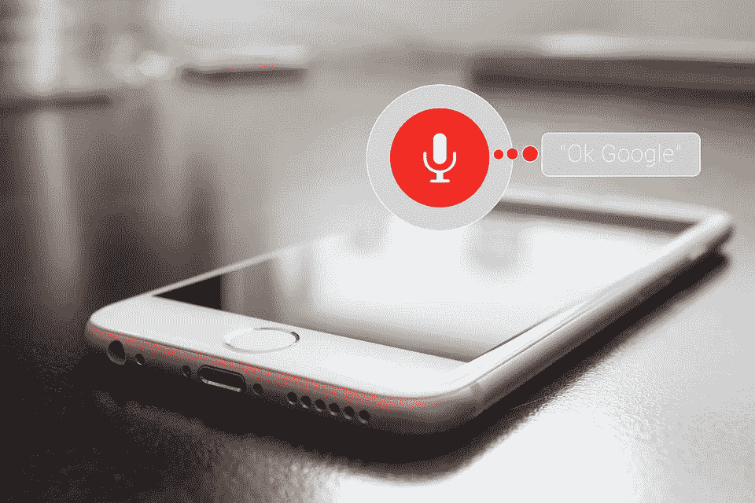
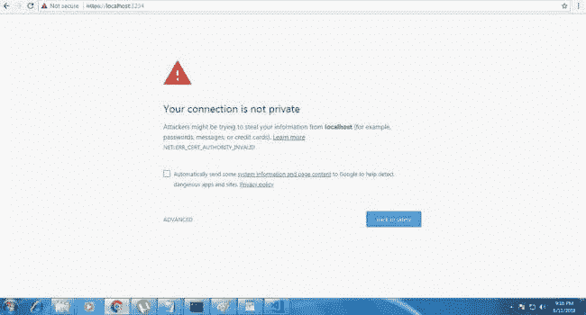
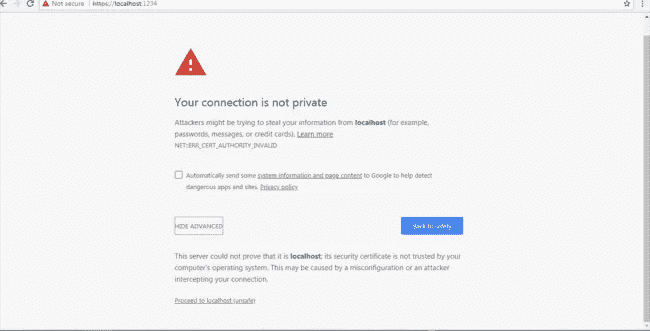
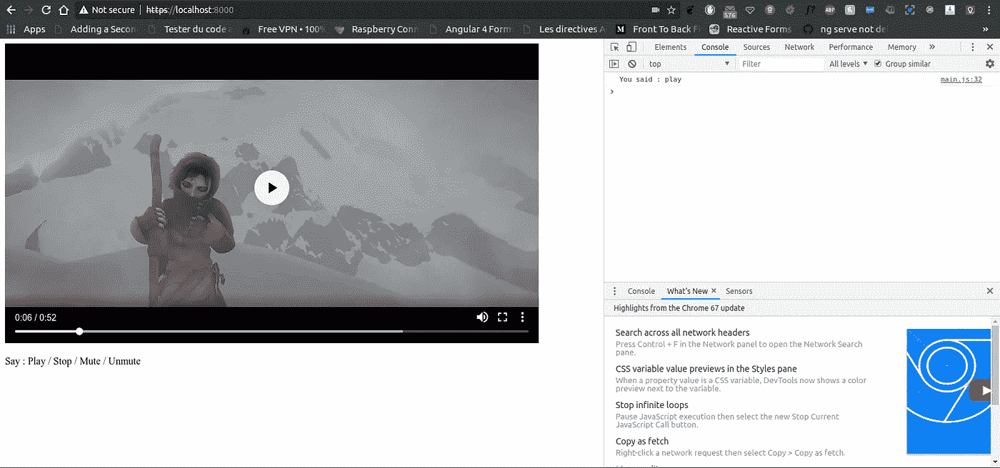

# 使用 Node.js 开始使用语音驱动应用程序

> 原文：<https://medium.com/coinmonks/get-started-with-voice-driven-applications-using-node-js-78902eb6bc44?source=collection_archive---------4----------------------->



> 声控应用曾经是科幻小说的素材，但现在不是了。如今，这些应用程序已被成人和儿童在日常生活中用于商业和个人用途。—未知

由于科学和技术的巨大进步，世界每天都变得令人惊奇。这种进步是由我们每天使用的大量工具推动的。

这些神奇事物的最好例子之一是个人助理应用程序，这些虚拟生物真的很惊人，可以在个人和职业日常生活中做很多事情来帮助你，这种应用程序的主要优势是它们与
用户进行语音交互的能力。

由于其高性能和直观性，语音驱动应用程序是完成日常机械任务的最佳解决方案。

下面是 Google I/O 2018 中一个很棒的 Google Assistant 演示视频:

**谷歌助手还可以帮助你:**

*   打电话/发信息
*   快速搜索(搜索附近的餐馆/路线/药店)。
*   设置警报
*   查看天气
*   描述你的个性
*   给你讲个笑话
*   …

所以今天我决定尝试一下语音识别，看看我能如何破解一些东西:)用于网络。

我将创建一个远程控制应用程序，使用 HTML 页面中的语音来控制视频播放器。

用于语音识别的 Javascript API 使网页的语音操作变得更加容易。唯一的要求是，尤其是在使用谷歌浏览器时，网页应该使用安全协议(HTTPs)。

所以我们要做的第一件事是使用 node.js 创建一个安全的本地主机

```
//make the project directorymkdir remote-control-with-speech-recognition && cd remote-control-with-speech-recognition// initialize the npmnpm init // install required package npm install https express
```

之后，我们必须使用以下命令生成`privatekey.pem`和`certificate.pem`文件:

```
openssl genrsa -out privatekey.pem 1024 openssl req -new -key privatekey.pem -out certrequest.csr openssl x509 -req -in certrequest.csr -signkey privatekey.pem -out certificate.pem
```

创建服务器文件:

```
// create a server.js filetouch server.js
```

在公共目录中创建 index.html:

```
// create a public/index.html filemkdir public && cd public && touch index.html
```

正在公共目录中创建 main.js 和 RemoteControl.js 文件:

```
// create a public/main.js file touch main.js
```

```
// create a public/RemoteControl.js filetouch RemoteControl.js
```

保存您的工作，然后运行应用程序

```
node server.js
```

转到 [https://localhost:8000](https://localhost:8000)

你会看到这个:



点击高级:



然后转到本地主机(不安全)



开始了。你可以用你的声音控制这个视频，试着说:播放/停止/静音/取消静音

你也可以从 [Github](https://github.com/AbderrahimSoubaiElidrissi/remote-control-with-speech-recognition) 中抓取代码..享受黑客攻击吧！

其他故事:

*1-*[*node . js*](/@AbderrahimSE/get-started-with-face-detecting-in-nodejs-d3c5fd97e701)人脸检测入门

> 加入 Coinmonks [电报频道](https://t.me/coincodecap)和 [Youtube 频道](https://www.youtube.com/c/coinmonks/videos)获取每日[加密新闻](http://coincodecap.com/)

## 另外，阅读

*   [复制交易](/coinmonks/top-10-crypto-copy-trading-platforms-for-beginners-d0c37c7d698c) | [加密税务软件](/coinmonks/crypto-tax-software-ed4b4810e338)
*   [网格交易](https://coincodecap.com/grid-trading) | [加密硬件钱包](/coinmonks/the-best-cryptocurrency-hardware-wallets-of-2020-e28b1c124069)
*   [密码电报信号](http://Top 4 Telegram Channels for Crypto Traders) | [密码交易机器人](/coinmonks/crypto-trading-bot-c2ffce8acb2a)
*   [最佳加密交易所](/coinmonks/crypto-exchange-dd2f9d6f3769) | [印度最佳加密交易所](/coinmonks/bitcoin-exchange-in-india-7f1fe79715c9)
*   开发人员的最佳加密 API
*   最佳[密码借贷平台](/coinmonks/top-5-crypto-lending-platforms-in-2020-that-you-need-to-know-a1b675cec3fa)
*   [免费加密信号](/coinmonks/free-crypto-signals-48b25e61a8da) |加密交易机器人
*   杠杆代币的终极指南