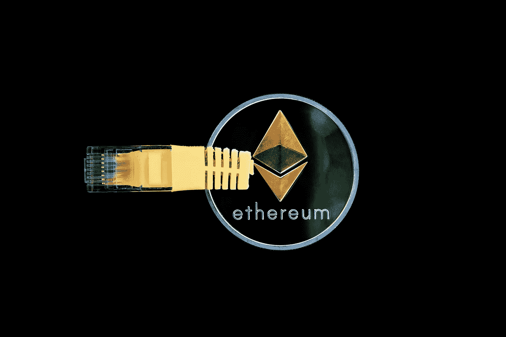

# 使用 Graph GraphQL API 获取 Uniswap 数据

> 原文：<https://medium.com/coinmonks/get-uniswap-data-using-the-graph-79d0c6f7b9f2?source=collection_archive---------1----------------------->

## 图上的 Uniswap 子图

## 使用 GraphQL 构建一个 dotnet sdk 来调用 Uniswap 的子图

[https://pixabay.com/photos/cryptocurrency-money-ethereum-3424785/](https://pixabay.com/photos/cryptocurrency-money-ethereum-3424785/)

Uniswap 是一个建立在以太坊上的分散式协议，用户可以交换 ERC-20 令牌，而不需要买方和卖方来创建需求。在撰写本文时，它是最受欢迎的分散式交易所(DEX ),总价值超过 14 亿美元。

Uniswap 使用`y = k*x`做市商机制来确定代币的价格，该产品保持不变，并用于确定交易价格。

该图是一个索引协议，用于查询来自以太坊和 IPFS 的数据。任何人都可以贡献和创建所谓的子图，从而使访问区块链数据变得容易。

该图有多个子图，如 [Aave](https://thegraph.com/explorer/subgraph/aave/protocol) 、 [ENS](https://thegraph.com/explorer/subgraph/ensdomains/ens) 、[平衡器](https://thegraph.com/explorer/subgraph/balancer-labs/balancer)和 [MakerDAO](https://thegraph.com/explorer/subgraph/protofire/makerdao-governance) 。为了从这些子图中查询数据，我们将使用 GraphQL。

> GraphQL 是一种由脸书创建的用于 API 的开源数据查询和操作语言。

Uniswap 子图如下所示:

 [## Uniswap V2 子图

### Uniswap 是以太坊上自动令牌交换的分散式协议。

thegraph.com](https://thegraph.com/explorer/subgraph/uniswap/uniswap-v2) 

# 构建 Uniswap sdk

为了进行 GraphQL 查询，我们需要两个包，一个用于进行 GraphQL 查询，另一个使用新的高性能`System.Text.Json`来反序列化数据。为了添加软件包，我们可以运行 cli 命令:

`dotnet add package GraphQL.Client --version 3.2.0`

`dotnet add package GraphQL.Cliente.Serializer.SystemTextJson --version 3.2.0`

现在，我们可以创建我们的`Uniswap.cs`类，它将通过构造函数注入接收 IGraphQLClient:

Uniswap.cs

# 获取最具流动性的市场对端点

我们现在可以称 Uniswap V2 子图。让我们创建一个名为`GetMostLiquidMarketPairs`的方法，并使用 GraphQL 进行第一次查询。为了创建查询，我们实例化了`GraphQLRequest`类并用我们想要的 GraphQL 查询设置属性`Query`:

现在我们可以从 GraphQL 客户端使用方法`SendQueryAsync`调用 API:

Call the Uniswap V2 subgraph

我们将得到以下 JSON 响应:

`GetMostLiquidMarketPairs JSON response`

# 将 Uniswap 类添加到依赖注入容器中

为了访问我们构建的 Uniswap 类，我们将把它添加到 DI 容器中。为了做到这一点，我们将创建`IUniswap`接口，并创建扩展方法`AddUniswap`，如我们在下面的代码中所见。我们为`IServiceCollection`接口创建一个扩展方法，因为当使用这个 sdk 时，我们将简单地在`StartUp.cs`类中添加`services.AddUniswap();`。

AddUniswap.cs

在上面的代码中，我们使用了 [HttpClient 类型的客户端，它只是一个](https://docs.microsoft.com/en-us/dotnet/architecture/microservices/implement-resilient-applications/use-httpclientfactory-to-implement-resilient-http-requests#how-to-use-typed-clients-with-ihttpclientfactory) `[HttpClient](https://docs.microsoft.com/en-us/dotnet/architecture/microservices/implement-resilient-applications/use-httpclientfactory-to-implement-resilient-http-requests#how-to-use-typed-clients-with-ihttpclientfactory)` [为某些特定用途而预先配置的客户端。](https://docs.microsoft.com/en-us/dotnet/architecture/microservices/implement-resilient-applications/use-httpclientfactory-to-implement-resilient-http-requests#how-to-use-typed-clients-with-ihttpclientfactory)

# 使用 Uniswap sdk

既然我们已经构建了 sdk，我们可以在自己的 API 中使用它。在下面的例子中，我们将通过构造函数注入获得`IUniwap`接口，然后我们能够调用它的方法，如下面的示例控制器所示:

Use IUniswap.cs

# Uniswap dotnet 标准库

这个完整的库是免费的，可以下载并通过运行 cli 命令添加到您的项目中:

`dotnet add package Uniswap.dotnet --version 1.0.1`

您也可以通过 nuget 添加这个包，nu get 是的官方包管理器。NET 或通过访问 GitHub:

 [## Uniswap.dotnet 1.0.1

### 图 GraphQL API 上 Uniswap V2 子图的 dotnet 标准包装器。

www.nuget.org](https://www.nuget.org/packages/Uniswap.dotnet/)  [## strykerin/Uniswap-dotnet

### 图 GraphQL API 上 Uniswap V2 子图的 dotnet 标准包装器。Uniswap 子图可以在这里找到…

github.com](https://github.com/strykerin/Uniswap-dotnet) 

# 结论

在本文中，我们为 Uniswap V2 子图构建了一个 dotnet 包装器，以获得分散的交易分析，例如最具流动性的市场对。

# 参考

 [## Uniswap

### 以太坊上自动化流动性供应的完全分散协议

uniswap.org](https://uniswap.org/)  [## 什么是 Uniswap？令牌交换-解密的简短指南

### 简而言之，Uniswap 是一个基于以太坊的交易所，允许任何人交换 ERC20 令牌。Uniswap V2 于 5 月启动…

decrypt.co](https://decrypt.co/resources/what-is-uniswap)  [## 自动做市算法综述

### 从金融到博彩市场，自动做市商在许多情况下被例行采用，并已…

medium.com](/terra-money/survey-of-automated-market-making-algorithms-951f91ce727a)  [## API 的查询语言

### GraphQL 是一种 API 查询语言，也是一种用现有数据完成这些查询的运行时语言。图表 QL…

graphql.org](https://graphql.org/)  [## 使用 DeFi Pulse API 获取 DeFi 项目数据

### 使用 DeFi Pulse dotnet sdk 了解最受欢迎的 DeFi 项目

reitter.medium.com](https://reitter.medium.com/get-defi-projects-data-with-defi-pulse-api-81721f8e6dd2) 

## 另外，阅读

*   [uni WAP API](https://bitquery.io/blog/uniswap-pool-api)—获取池数据、令牌并创建图表
*   [了解以太坊和网络 3](https://blog.coincodecap.com/go/learn)
*   [密码交易机器人](/coinmonks/crypto-trading-bot-c2ffce8acb2a)
*   [3 商业评论](/coinmonks/3commas-review-an-excellent-crypto-trading-bot-2020-1313a58bec92)
*   [AAX 交易所评论](/coinmonks/aax-exchange-review-2021-67c5ea09330c) |推荐代码、交易费用、利弊
*   [Deribit 审查](/coinmonks/deribit-review-options-fees-apis-and-testnet-2ca16c4bbdb2) |选项、费用、API 和 Testnet
*   [FTX 密码交易所评论](/coinmonks/ftx-crypto-exchange-review-53664ac1198f)
*   [n 零审核](/coinmonks/ngrave-zero-review-c465cf8307fc)
*   [Bybit 交换审查](/coinmonks/bybit-exchange-review-dbd570019b71)
*   [3Commas vs Cryptohopper](/coinmonks/cryptohopper-vs-3commas-vs-shrimpy-a2c16095b8fe)
*   最好的比特币[硬件钱包](/coinmonks/the-best-cryptocurrency-hardware-wallets-of-2020-e28b1c124069?source=friends_link&sk=324dd9ff8556ab578d71e7ad7658ad7c)
*   [密码本交易平台](/coinmonks/top-10-crypto-copy-trading-platforms-for-beginners-d0c37c7d698c)
*   最佳 [monero 钱包](https://blog.coincodecap.com/best-monero-wallets)
*   [莱杰纳米 s vs x](https://blog.coincodecap.com/ledger-nano-s-vs-x)
*   [bits gap vs 3 commas vs quad ency](https://blog.coincodecap.com/bitsgap-3commas-quadency)
*   最好的[加密税务软件](/coinmonks/best-crypto-tax-tool-for-my-money-72d4b430816b)
*   [最佳加密交易平台](/coinmonks/the-best-crypto-trading-platforms-in-2020-the-definitive-guide-updated-c72f8b874555)
*   最佳[密码借贷平台](/coinmonks/top-5-crypto-lending-platforms-in-2020-that-you-need-to-know-a1b675cec3fa)
*   [莱杰纳米 S vs 特雷佐 one vs 特雷佐 T vs 莱杰纳米 X](https://blog.coincodecap.com/ledger-nano-s-vs-trezor-one-ledger-nano-x-trezor-t)
*   [block fi vs Celsius](/coinmonks/blockfi-vs-celsius-vs-hodlnaut-8a1cc8c26630)vs Hodlnaut
*   bits gap review——一个轻松赚钱的加密交易机器人
*   为专业人士设计的加密交易机器人
*   [PrimeXBT 审查](/coinmonks/primexbt-review-88e0815be858) |杠杆交易、费用和交易
*   [其他准备评审](https://blog.coincodecap.com/altrady-reivew)
*   [埃利帕尔泰坦评论](/coinmonks/ellipal-titan-review-85e9071dd029)
*   [SecuX Stone 评论](https://blog.coincodecap.com/secux-stone-hardware-wallet-review)
*   区块链评论 |从你的密码中赚取高达 8.6%的利息
*   [Coinrule 审查](https://blog.coincodecap.com/coinrule-review-a-perfect-trading-bot)
*   [最佳区块链分析工具](https://bitquery.io/blog/best-blockchain-analysis-tools-and-software)
*   [加密套利](/coinmonks/crypto-arbitrage-guide-how-to-make-money-as-a-beginner-62bfe5c868f6)指南:新手如何赚钱
*   最佳[加密制图工具](/coinmonks/what-are-the-best-charting-platforms-for-cryptocurrency-trading-85aade584d80)
*   了解比特币最好的[书籍有哪些？](/coinmonks/what-are-the-best-books-to-learn-bitcoin-409aeb9aff4b)

> [直接在您的收件箱中获得最佳软件交易](/coinmonks/newsletters/coinmonks)

