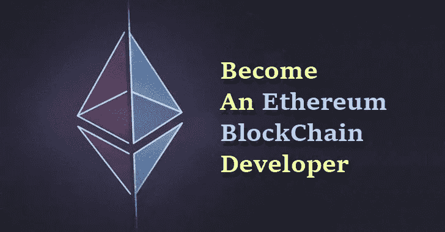

# 以太坊开发教程:设置环境

> 原文：<https://medium.com/coinmonks/get-up-and-running-in-minutes-with-ethereum-development-3c87be26cdfd?source=collection_archive---------2----------------------->

## 区块链技术最近得到了很大的发展，以太坊技术为开发分布式应用提供了一个新的范例。为了快速启动您的旅程，[**【Techlatest.net】**](http://techlatest.net)**为您提供了一个开箱即用的** [**以太坊开发套件**](https://techlatest.us18.list-manage.com/track/click?u=94040f0d44569f83a8866c979&id=036512ac21&e=4f25bbe207) **运行在微软 Azure 上。这样你就可以专注于以太坊的学习和发展，所有的基础设施需求都会得到照顾。**

Become a ethereum Developer [Source](https://thehackernews.com/2017/11/ethereum-blockchain-development.html)

# **如何获取以太坊开发套件？**

该工具包在微软 Azure 上以图片形式提供。您需要创建一个 azure 帐户，该帐户附带 200 美元的信用点数，以便开始免费使用 Azure 服务。

如果您没有 azure 帐户，请先通过点击此[链接](https://azure.microsoft.com/en-in/free/)创建一个帐户。

然后点击这个[链接](https://azuremarketplace.microsoft.com/en-us/marketplace/apps/techlatest.ethereumdevkit?tab=Overview&flightCodes=2a3c94bc-164f-47cf-99e4-fc7be034c207)来启动你的以太坊开发包虚拟机。

要了解更多关于该套件及其使用方法的信息，请参考这些[视频教程。](http://techlatest.net/support/support)

# 你得到了什么

我们提供在 Microsoft Azure 云上运行的虚拟机，包括:

1.  [**松露以太坊框架**](http://truffleframework.com) **:**

Truffle 是以太坊的世界级开发环境、测试框架和资产管道，旨在使以太坊开发者的生活更加轻松。有了松露，你会得到:

*   内置智能合约编译、链接、部署和二进制管理。
*   快速开发的自动化合同测试。
*   可脚本化、可扩展的部署和迁移框架。
*   部署到任意数量的公共和私有网络的网络管理。
*   使用 [ERC190](https://techlatest.us18.list-manage.com/track/click?u=94040f0d44569f83a8866c979&id=7a6e947c71&e=4f25bbe207) 标准，通过 EthPM & NPM 进行封装管理。
*   用于直接合同通信的交互式控制台。
*   支持紧密集成的可配置构建管道。
*   在 Truffle 环境中执行脚本的外部脚本运行程序。

2.

**快速启动个人以太坊区块链，您可以使用它来运行测试、执行命令和检查状态，同时控制链如何运行。带有一个成熟的图形用户界面。**

**3.**带有 solidity 插件的 Visual studio 代码****

**Visual studio 代码和 solidity 插件为开发人员提供了更快开发和测试所需的 IDE。**

**4. [**围棋以太坊/Geth**](https://github.com/ethereum/go-ethereum/wiki/geth)**

**Geth 是运行一个完整以太坊节点的命令行接口，用 Go 编程语言实现。使用 Geth，您可以**

*   **参加以太坊前沿直播网络**
*   **我的真实以太**
*   **在地址间转移资金**
*   **创建合同并发送交易记录**
*   **浏览块历史**
*   **还有更多**

**5. **Metamask Firefox 插件****

**[**Metamask**](https://metamask.io/) 允许您直接在浏览器中运行以太坊 dApps，而无需运行完整的以太坊节点。
MetaMask 包括一个安全的身份库，提供一个用户界面来管理您在不同站点上的身份并签署区块链交易。**

**6.**法定人数列兵区块链****

**[Quorum](https://www.jpmorgan.com/global/Quorum)([Github](https://github.com/jpmorganchase/quorum/wiki))是[以太坊](https://techlatest.us18.list-manage.com/track/click?u=94040f0d44569f83a8866c979&id=f5d9fbf634&e=4f25bbe207)的企业级版本。
Quorum 是任何需要在一组被许可的已知参与者中高速、高吞吐量处理私人事务的应用程序的理想选择。Quorum 解决了金融行业内外采用区块链技术面临的具体挑战。**

**7.**样本演示****

**学习以太坊开发的最好和最快的方法是通过 VM 中包含的示例演示。该演示让开发人员无需自己编写任何代码，就可以摆弄工作代码，理解各种以太坊和区块链概念。演示内容包括:**

*   **以太坊的 Hello world 演示**
*   **带有用户界面的完整 Dapp**
*   **法定人数私人区块链演示**

**8.**培训视频****

**除了所有必需的基础设施，我们还为您提供超过 3 小时的[培训视频](http://techlatest.net/support/support/)，帮助您学习以太坊开发，包括:**

*   **环境和演示概述。**
*   **如何在 Azure cloud 上设置虚拟机？**
*   **如何开发、测试和运行演示**
*   **以太坊上完整的端到端应用开发**

**

**Click to read more about Dapps****