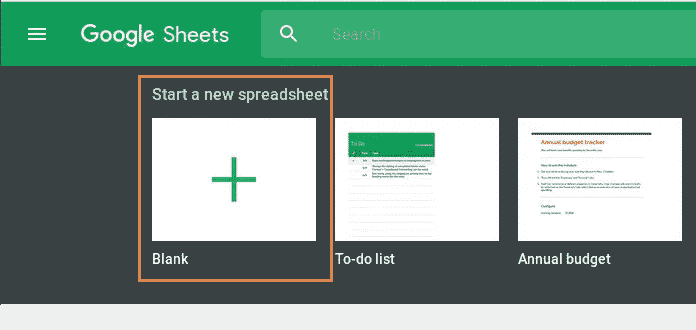

# 在谷歌表单中获取来自北海巨妖的实时贸易平衡

> 原文：<https://medium.com/coinmonks/get-your-real-time-trade-balance-from-kraken-in-google-sheets-ca3adaed8b4?source=collection_archive---------3----------------------->

Source: Kraken.com

对于那些执行月末会计或使用谷歌资产负债表来评估其加密货币投资组合的人来说，这个工具将是有用和快速的。

Kraken.com 已经为我们编写了谷歌表单代码。我们所需要做的就是遵循来自 [**北海巨妖谷歌脚本 REST API 私有端点**](https://support.kraken.com/hc/en-us/articles/360047262172-Google-Script-REST-API-Private-Endpoints) **的指令。**

注意，在我们进一步讨论之前:**永远不要分享你的床单和你的私人信息！**

# 你需要什么:

*   生成北海巨妖私有 API 密钥(3 分钟)
*   打开 Google 工作表
*   添加代码— Ctrl C/Ctrl V —授权—保存(3 分钟)

# 工作原理:

## [来自北海巨妖的网站:](https://support.kraken.com/hc/en-us/articles/360000919966-How-to-generate-an-API-key-pair-)如何生成 API 密钥对？

API 密钥是 API 认证的组成部分之一，它们相当于用户名和密码。

需要 API 键来调用任何一个[私有 API 方法](https://www.kraken.com/features/api#private-user-data)，即[账户管理](https://www.kraken.com/features/api#private-user-data)、[交易](https://www.kraken.com/features/api#private-user-trading)和[资金方法](https://www.kraken.com/features/api#private-user-funding)。API 键不需要使用[公共 API 方法](https://www.kraken.com/features/api#public-market-data)([市场数据方法](https://www.kraken.com/features/api#public-market-data))因为公共方法不需要访问北海巨妖账户。

**创建 API 密钥**

*   [登录您的北海巨妖账户](https://www.kraken.com/sign-in)。
*   点击页面右上角的您的**姓名**。
*   点击“**安全**”，然后点击“ **API** ”。
*   点击**【添加密钥】**按钮。

**配置 API 密钥**

API 密匙有几个配置选项，在使用 API 密匙之前必须进行设置，特别是密匙描述和密匙许可。

Source: [https://support.kraken.com/hc/en-us/articles/360000919966-How-to-generate-an-API-key-pair-](https://support.kraken.com/hc/en-us/articles/360000919966-How-to-generate-an-API-key-pair-)

## 关键描述

密钥描述实质上是 API 密钥的名称，可以是您喜欢的任何名称，只要描述是唯一的(不同于同一帐户上任何其他 API 密钥的描述)。

**密钥权限非常重要！访问权限越少，安全性越好。**

为了取回您的总余额，您只需允许:

*   **查询资金，**用于查询账户余额信息的账户管理方式，如余额、贸易余额。

# 使用 API 密钥

API 密钥由一个公钥/私钥对组成，两者都必须提供给 API 客户端软件。然后，可以将密钥对作为纯文本直接复制并粘贴到 API 客户端代码中。

Source: [https://support.kraken.com/hc/en-us/articles/360000919966-How-to-generate-an-API-key-pair-](https://support.kraken.com/hc/en-us/articles/360000919966-How-to-generate-an-API-key-pair-)

# 打开 Google 工作表

*   转到[sheets.google.com](http://sheets.google.com/)
*   Google Drive —点击新建
*   谷歌工作表，并从头开始或从模板创建。

Source: [sheets.google.com](http://sheets.google.com/)

# 添加北海巨妖为谷歌工作表创建的代码

1.  通过**工具- >脚本编辑器**菜单打开脚本编辑器。

Source: Google Script Editor

2.删除显示的默认代码(例如，*全选*然后*删除/退格*)。

[3。将 Google Script API 代码](https://support.kraken.com/hc/en-us/articles/360047262172-Google-Script-REST-API-Private-Endpoints)(链接)复制/粘贴到脚本编辑器中。

Source: Copy/Paste code from [https://support.kraken.com/hc/en-us/articles/360047262172-Google-Script-REST-API-Private-Endpoints](https://support.kraken.com/hc/en-us/articles/360047262172-Google-Script-REST-API-Private-Endpoints)

4.更新示例 API 密钥，以使用您的北海巨妖帐户中的 [API 密钥。](https://support.kraken.com/hc/en-us/articles/360000919966)

Source: [https://support.kraken.com/hc/en-us/articles/360047262172-Google-Script-REST-API-Private-Endpoints](https://support.kraken.com/hc/en-us/articles/360047262172-Google-Script-REST-API-Private-Endpoints)

5.通过**文件- >保存**菜单或

6.授权谷歌服务->应用程序脚本需要用户授权才能从[内置谷歌服务](https://developers.google.com/apps-script/guides/services)或[高级谷歌服务](https://developers.google.com/apps-script/guides/services/advanced)访问私人数据。

Top left: Authorization required Continue — — — Top Right: Chose the gmail account for running the code — — — Bottom Left: App isn’t verigied, go to advanced, go to the project name — — — Bottom Right: Allow access to your newly created project

# 使用北海巨妖的内置公式

## = KAPI _ 私人("测试"，"贸易平衡"，"资产=美元")

**KAPI _ 私有()**函数从 API 返回原始的 JSON 响应，比如上面的*平衡*端点示例如下:

*   {"error":[]，" result":{"eb":"20.7858 "，" tb":"19.4652 "，" m":"0.0000 "，" n":"0.0000 "，" c":"0.0000 "，" v":"0.0000 "，" e":"19.4652 "，" mf":"17.4652"}}

eb:实时评估余额，tb:上次贸易余额，e:权益，mf:自由保证金。

尝试一下，但是不要写“TEST ”,而是插入你的描述码名称。

**为了获得您的总实时余额，您需要从 JSON 中检索 eb 值。您需要在 KAPI 私有函数中添加如下代码:**

> if(endpoint = = " trade balance "){ API _ data = JSON . parse(API _ data). result . EB }

**在第 19 行后插入该行。**

Source: Script Editor Add line 20: if (endpoint == “TradeBalance”){api_data=JSON.parse(api_data).result.eb}

该行将 JSON 格式解析为评估的余额(" result":{"eb":"20.7858"})，您将获得评估表，如下例单元格 O2 所示。

Google Sheet Example
=KAPI_Private(“……”, “TradeBalance”, “asset=USD”)

瞧啊。现在你应该得到你的实时北海巨妖平衡。如果刷新单元格，将得到最新的金额。在 Google Sheet 中，单元格通常每小时刷新一次。

# 更多工具

如果您对更多加密货币投资组合估值工具感兴趣，您可能会对以下媒介感兴趣。

 [## 如何在 Google Sheets 上评估你的股票和加密投资组合

### 这些是我自己为实时股票和加密货币价格创建的自定义内置函数…

medium.com](/coinmonks/how-to-value-your-stocks-crypto-portfolio-in-google-sheets-22bb7b42c39d) 

*这是正在进行的工作。如果你发现错误，请不要犹豫让我知道。非常欢迎反馈。一个* [*电报聊天*](https://t.me/TheCryptoCurious) *也可供支持。如果这个项目为你增加了任何价值，或者正在你的谷歌表单上寻找个性化编码，请不要犹豫，留下你的信息。*

*所表达的观点仅供一般参考，并非* ***而非*** *旨在为任何个人或任何特定证券或投资产品提供具体的* ***建议*** *或推荐。它只是为了提供关于金融行业的教育。*

非常感谢您花时间阅读这篇文章。

在这个充满挑战的时代，照顾好你自己和你的家人！2021 新年快乐！

> 加入 coin monks[Telegram group](https://t.me/joinchat/EPmjKpNYwRMsBI4p)学习加密交易和投资

## 另外，阅读

*   [学习以太坊和 Web3 开发](http://blog.coincodecap.com/go/learn)
*   最好的[密码交易机器人](/coinmonks/crypto-trading-bot-c2ffce8acb2a)
*   【T43 商业评论
*   [Pionex 审查](/coinmonks/pionex-review-exchange-with-crypto-trading-bot-1e459d0191ea)
*   [AAX 交易所评论](/coinmonks/aax-exchange-review-2021-67c5ea09330c) |推荐代码、交易费用、利弊
*   [德里比特评论](/coinmonks/deribit-review-options-fees-apis-and-testnet-2ca16c4bbdb2) |选项、费用、API 和 Testnet
*   [FTX 密码交易所评论](/coinmonks/ftx-crypto-exchange-review-53664ac1198f)
*   [n 零审核](/coinmonks/ngrave-zero-review-c465cf8307fc)
*   [Bybit 交换审查](/coinmonks/bybit-exchange-review-dbd570019b71)
*   [3Commas vs Cryptohopper](/coinmonks/3commas-vs-pionex-vs-cryptohopper-best-crypto-bot-6a98d2baa203)
*   最好的比特币[硬件钱包](/coinmonks/the-best-cryptocurrency-hardware-wallets-of-2020-e28b1c124069?source=friends_link&sk=324dd9ff8556ab578d71e7ad7658ad7c)
*   [密码本交易平台](/coinmonks/top-10-crypto-copy-trading-platforms-for-beginners-d0c37c7d698c)
*   [莱杰 nano s vs x](https://blog.coincodecap.com/ledger-nano-s-vs-x)
*   [Vauld Review](https://blog.coincodecap.com/vauld-review)
*   最好的[加密税务软件](/coinmonks/best-crypto-tax-tool-for-my-money-72d4b430816b)
*   [最佳加密交易平台](/coinmonks/the-best-crypto-trading-platforms-in-2020-the-definitive-guide-updated-c72f8b874555)
*   最佳[加密贷款平台](/coinmonks/top-5-crypto-lending-platforms-in-2020-that-you-need-to-know-a1b675cec3fa)
*   [莱杰纳米 S vs 特雷佐 one vs 特雷佐 T vs 莱杰纳米 X](https://blog.coincodecap.com/ledger-nano-s-vs-trezor-one-ledger-nano-x-trezor-t)
*   [block fi vs Celsius](/coinmonks/blockfi-vs-celsius-vs-hodlnaut-8a1cc8c26630)vs Hodlnaut
*   Bitsgap 评论——一个轻松赚钱的加密交易机器人
*   为专业人士设计的加密交易机器人
*   [共同追踪审查](/coinmonks/cointracking-review-a-reliable-cryptocurrency-tax-software-5114e3eb5737)
*   [优霍德勒评论](/coinmonks/youhodler-4-easy-ways-to-make-money-98969b9689f2)
*   [埃利帕尔泰坦评论](/coinmonks/ellipal-titan-review-85e9071dd029)
*   [赛克斯·斯通评论](https://blog.coincodecap.com/secux-stone-hardware-wallet-review)
*   [区块链评论](/coinmonks/blockfi-review-53096053c097) |从您的密码中赚取高达 8.6%的利息
*   [Coinrule 评论](https://blog.coincodecap.com/coinrule-review-a-perfect-trading-bot)
*   [最佳区块链分析工具](https://bitquery.io/blog/best-blockchain-analysis-tools-and-software)
*   [加密套利](/coinmonks/crypto-arbitrage-guide-how-to-make-money-as-a-beginner-62bfe5c868f6)指南:新手如何赚钱
*   最佳[加密制图工具](/coinmonks/what-are-the-best-charting-platforms-for-cryptocurrency-trading-85aade584d80)
*   了解比特币的[最佳书籍有哪些？](/coinmonks/what-are-the-best-books-to-learn-bitcoin-409aeb9aff4b)

> [直接在您的收件箱中获得最佳软件交易](/coinmonks/newsletters/coinmonks)

