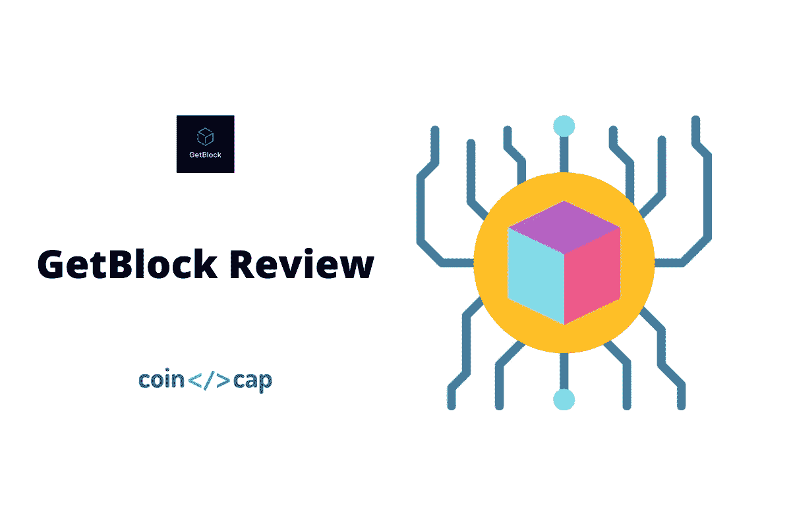
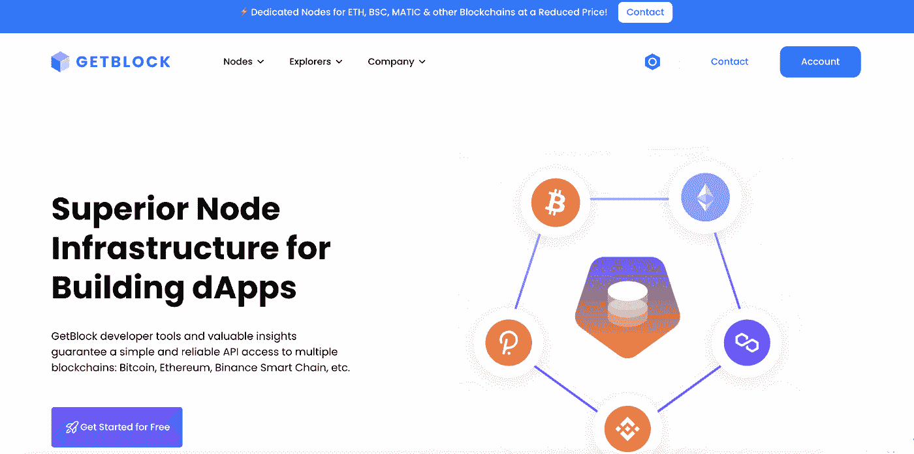
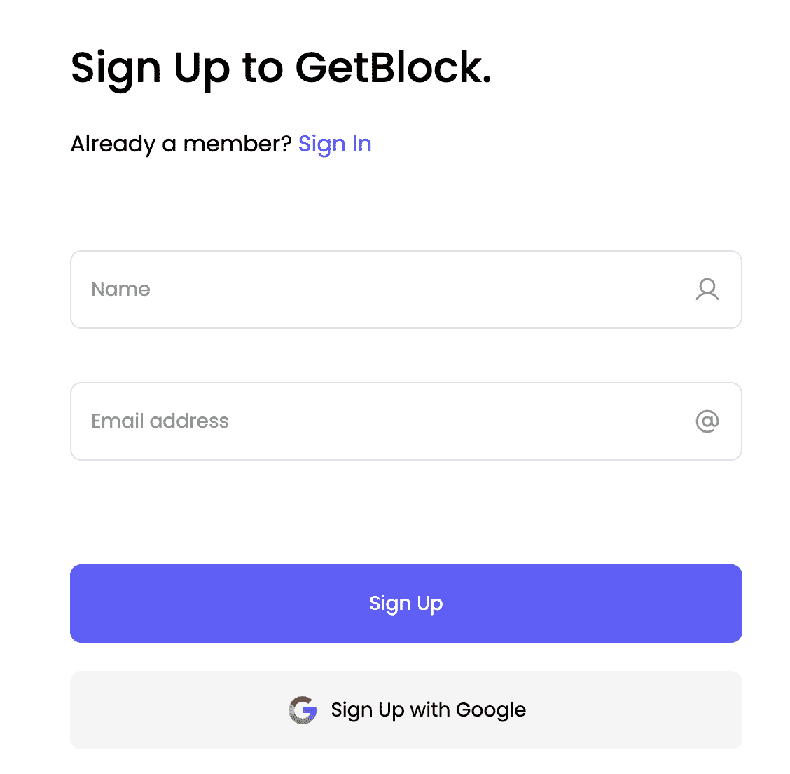
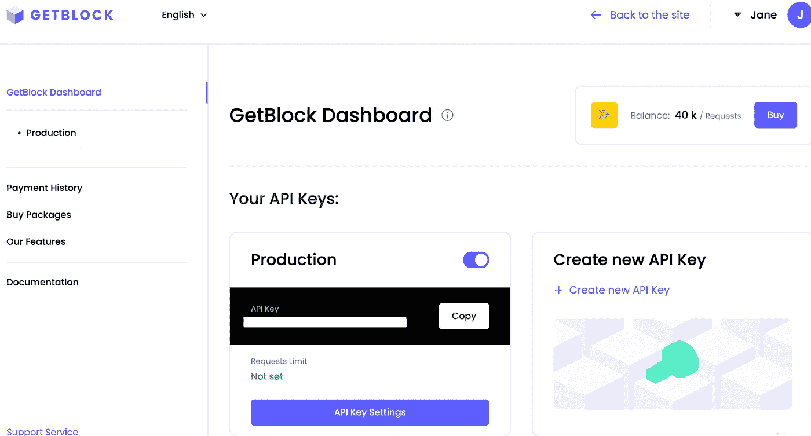
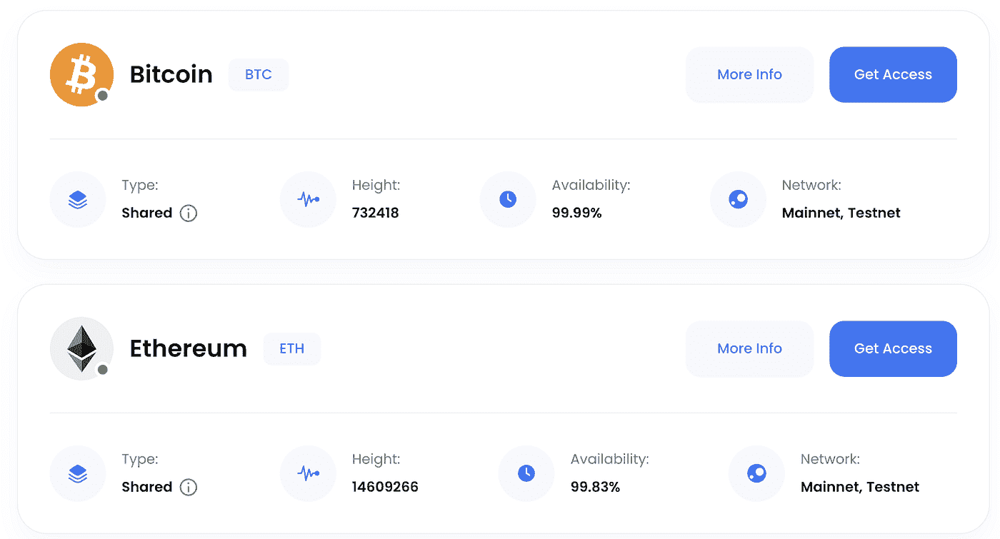
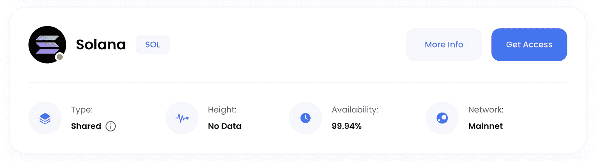
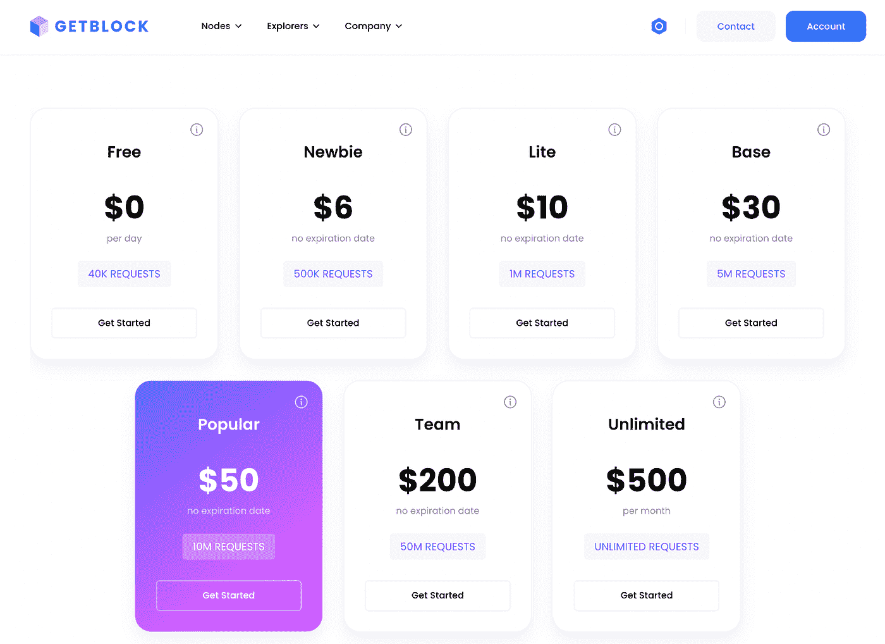
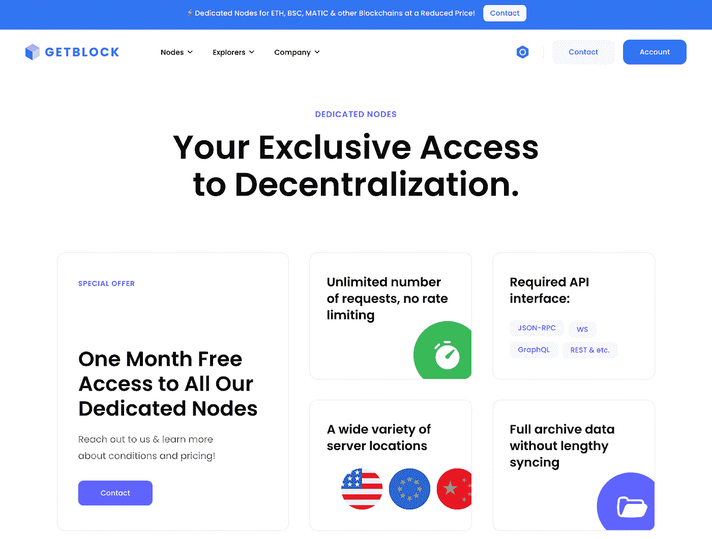

# GetBlock 评论:获取区块链全节点| CoinCodeCap 博客

> 原文：<https://medium.com/coinmonks/getblock-review-get-blockchain-full-nodes-coincodecap-blog-c9d50d228f6a?source=collection_archive---------1----------------------->

在本文中，我们将回顾 [GetBlock](https://getblock.io/?utm_source=coincodecap) ，这是一个从顶层区块链提供对完整节点的 API 访问的服务。要构建一个基于区块链的应用程序，你必须部署并运行几个节点，但这并不像听起来那么简单。GetBlock 的主要目标是通过为初创公司和开发人员提供一体化工具，快速轻松地将分散网络集成到他们的业务项目中，从而为他们的生活提供便利。

## **总结**

*   GetBlock 是一个区块链即服务(BaaS)平台，提供从多个区块链(以太坊、BNB 智能链、Solana、Polygon、Tron 等)对完整节点的即时 API 访问。
*   GetBlock 的客户可以通过一个直观的 API 驱动的仪表板将他们的钱包、dex、交易机器人和游戏带到 40+区块链。
*   位于德国、芬兰和荷兰的不间断工作的服务器保证了快速和安全的连接。
*   GetBlock 的客户端可以通过多种 API 方法向区块链发送请求:JSON RPC、WebSockets、GraphQL、REST API 等等。
*   GetBlock 提供的免费计划每天有 4 万次请求。
*   这是一个端到端的解决方案，易于安装和集成、自动更新和维护。

## **什么是 GetBlock？**

GetBlock 是一项为许多领先的区块链平台的完整节点提供即时 API 连接的服务，于 2019 年开始运营。GetBlock 项目的使命是确保经济高效的工具和基础设施，帮助企业和个人开发者更快地构建高质量的区块链应用。

GetBlock 是区块链即服务(BaaS)领域的领导者之一:其工具每天都被全球成千上万的用户使用。借助 GetBlock，分散的应用程序可以连接到首选节点，可用性高达 99%以上。该团队提供共享和专用节点连接。

## **用户体验**

GetBlock 最重要的特性之一就是它的易用性。无论你是一个加密新手还是一个成熟的专业人士，它直观的 UI 不需要任何解释。它相当清晰和简洁，这意味着你可以很容易地找到你需要的信息，并立即开始使用这项服务。

要开始使用 GetBlock，该平台的客户端必须注册一个帐户。然后，用户将看到一个基本的仪表板，其中有 API 键、配置文件名称、购买历史、项目文档和当前余额。查看[教程](https://getblock.io/docs/get-started/how-to-setup-an-account/)了解如何开始使用该服务。

新节点不断被添加到服务中并被监控，现有节点根据需要被更新。网站上始终显示可用节点的列表，以及它们的统计数据和所有相关文档:

## **定价**

至于[共享节点](https://getblock.io/nodes/)，GetBlock 提供了几个收费包——新手、轻量、基础、流行、团队、无限制——以适应各种预算和公司规模。此外，他们还提供一个免费的软件包，帮助他们的客户测试开发人员的技能和服务本身。

要获得专用节点的价格信息，[请联系客户支持经理](https://getblock.io/contact/)。

## **结论**

GetBlock 允许其客户专注于他们的项目和开发，只需几次点击就可以连接一个节点或在一个地方合并几个节点。这项服务适合年轻的创业者和初学者，也适合密码开发者和区块链用户，适合所有那些既没有时间也没有资源来运行自己的完整节点的人。

尝试一下，并在评论区告诉我们你对 GetBlock 评论的看法。

> 加入 Coinmonks [电报频道](https://t.me/coincodecap)和 [Youtube 频道](https://www.youtube.com/c/coinmonks/videos)了解加密交易和投资

## 另外，阅读

*   [如何在加拿大购买加密货币？](https://coincodecap.com/how-to-buy-cryptocurrency-in-canada)
*   [百无聊赖的猿游艇俱乐部(BAYC)评论](https://coincodecap.com/bored-ape-yacht-club-bayc-review)
*   [5 款最佳加密交易终端](https://coincodecap.com/crypto-trading-terminals) | [最佳 DeFi 应用](https://coincodecap.com/best-defi-apps)
*   [最佳网上赌场](https://coincodecap.com/best-online-casinos) | [币安评论](/coinmonks/binance-review-ee10d3bf3b6e) | [BitMEX 评论](https://coincodecap.com/bitmex-review)
*   [麻雀交换评论](https://coincodecap.com/sparrow-exchange-review) | [纳什交换评论](https://coincodecap.com/nash-exchange-review)
*   [美国最佳加密交易机器人](https://coincodecap.com/crypto-trading-bots-in-the-us) | [经常性回顾](https://coincodecap.com/changelly-review)
*   [在印度利用加密套利赚取被动收入](https://coincodecap.com/crypto-arbitrage-in-india)
*   [Godex.io 审核](/coinmonks/godex-io-review-7366086519fb) | [邀请审核](/coinmonks/invity-review-70f3030c0502) | [BitForex 审核](https://coincodecap.com/bitforex-review)