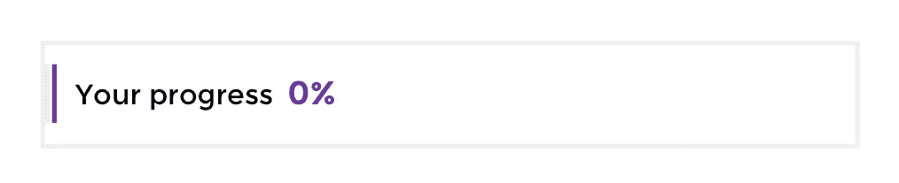
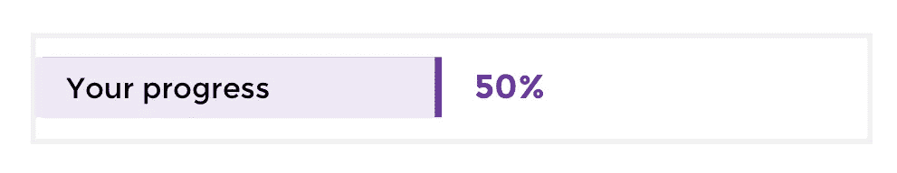
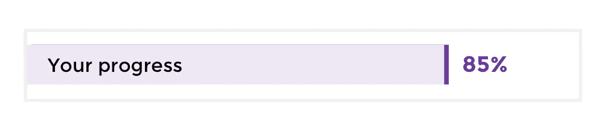
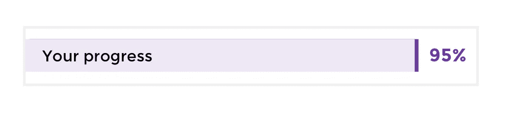

# 获得一份区块链理工大学的工作——面向非程序员

> 原文：<https://medium.com/coinmonks/getting-a-blockchain-tech-job-for-non-coders-a1e2f83605ba?source=collection_archive---------1----------------------->

## 对非编码区块链行业的工作有巨大的需求。以下是你如何脱颖而出并被录用的方法。

This article is written by the Comp Intel/Data Studio team at [https://www.datastudiopro.com/](https://www.datastudiopro.com/)

*开始之前:本指南的先决条件是您对区块链技术有基本的了解。如果你还没有，从我列出的* [***免费资源开始了解区块链***](/@8innovate/free-resources-to-get-a-blockchain-job-in-6-months-or-less-for-non-coders-5ddee72fbc7b) ***。***

[Source](https://giphy.com/gifs/loosekeys-animation-money-l1LcitrlHas5jQLhS)

## 那么，你想去区块链的公司工作？

也许你喜欢加密，或者你相信去中心化，或者甚至想要改革金融行业…不管是什么让你来到这里，我可以告诉你，区块链理工大学有一个地狱般的就业市场。

有太多的职位空缺。这个行业急需合格的候选人。

> “这是我们最关心的问题之一。我们找不到合格的人才。每次有新职位空缺，我们都要努力争取，这推高了自由职业者的起薪和时薪。”

这些高薪工作也不仅仅是程序员的。你能想到的每个职位都有需求:文案、社区经理、销售主管、项目经理、会计、UI/UX……如果你能想到，就有人在招人。

> 交易新手？尝试[加密交易机器人](/coinmonks/crypto-trading-bot-c2ffce8acb2a)或[复制交易](/coinmonks/top-10-crypto-copy-trading-platforms-for-beginners-d0c37c7d698c)

现在，我不能告诉你如何被每一种类型的工作录用。但是，我可以给你一个框架，可以提高你的胜算。

我会尽力开门，但你需要走过去。

综上所述，步骤很简单。只是坚持下去的问题。

1.  对你对区块链技术的实际了解程度要现实一点——大多数人都严重高估了自己的知识
2.  集中注意力。选择一项特定的技术或项目，并了解其来龙去脉。
3.  参与社区活动。与参与项目的人交谈。
4.  把正确的技能放在你的 LinkedIn 上。确保招聘人员能找到你
5.  让你自己努力工作。做自由职业者。建立投资组合。
6.  *志愿者。如果有必要，免费工作。展示你的价值。*
7.  被录用了！

# 那么，我们开始吧。

在你开始申请工作之前，有一些准备工作要做。

**首先**，**你需要现实地了解你对区块链科技的实际了解程度。雇主正收到大量不合格候选人的简历。
这告诉你什么？它告诉你，有很多人严重高估了他们的技能。**

*   首先，看看一些免费的比特币/区块链入门课程。我更喜欢[伯克利的](https://www.youtube.com/watch?v=ZWE3qFnSbMc&list=PLSONl1AVlZNX_JBggqZV40rDIGGB0FNHW)(他们所有的课程作业都可以在他们的 [**网站**](https://blockchain.berkeley.edu/decal/sp18/fund/) 和[**Youtube**](https://www.youtube.com/channel/UC5sgoRfoSp3jeX4DEqKLwKg/playlists)**)**。观看一些讲座，确保你能跟上。如果你在挣扎，那么你可能需要多学一点。先从: [**非编码人员学习区块链的免费资源**](/@8innovate/free-resources-to-get-a-blockchain-job-in-6-months-or-less-for-non-coders-5ddee72fbc7b) 。

*Completing this step puts you ahead of 50% of blockchain job applicants. Almost half of applicants can’t make it past a basic intro course about blockchain technologies.*

## 选择一个项目，做好你的尽职调查

如果您对特定项目或加密货币感兴趣，您需要进行加密尽职调查:

*   阅读白皮书
*   加入电报
*   加入子漩涡
*   加入电子邮件列表
*   阅读任何主要的新闻文章。
*   如果有可用的规范页面或维基，请阅读它，即使你并不理解你阅读的所有内容。

确保你理解人们在社区中讨论的话题。你**不**需要知道如何编写你自己的区块链，但是你**需要**了解核心技术如何工作以及它给客户/用户带来的价值。

这种对核心技术的理解让你在任何类型的工作中都有优势。即使是会计师或平面设计师也需要了解他们正在使用的核心技术。

This puts you ahead of 75% of applicants. Many applicants have little to no knowledge of the underlying technology and aren’t active in a project’s community .

## 走出去——建立个人档案

你必须走出去。走进舞池，向他们展示你的舞步。

**开始于** [**向上工作**](https://www.upwork.com/) 。它有最多的区块链自由职业工作供你选择。在申请全职职位之前，你需要建立自己的投资组合，积累一些经验。

*   学习如何写一份强有力的简介。我建议[这个网站](https://freelancetowin.com/creating-upwork-profile/)提供指导，免费的文章涵盖了你需要知道的一切。
*   **学习如何提出强有力的建议**。[这里有一些基本的指导。](https://freelancetowin.com/writing-upwork-proposals/)
*   **开始拉家常**。你正在寻找任何与你的技能相匹配的区块链相关的工作。先不要担心专注于一项技术。你只是想用你能得到的任何东西开始一个投资组合。
*   保持完全专注于让你的客户开心。你希望得到一些积极的评价。这会给你日后所需的可信度。
*   永远告诉客户你愿意再次与他们合作，并感谢他们的推荐。这以后会有回报的。

这说起来容易做起来难。如果需要时间，不要灰心丧气。如果你发出了 20 份建议书，却找不到工作，那么 **1)** 认真审查你的个人资料和建议书，并获得第二意见，以确保你没有犯明显的错误，然后 **2)** 转到[alpha bounty 0x . io](http://alpha.bounty0x.io)并开始在那里完成工作。记录你的经历。把它们用在你的文件夹里

## 当一切都失败的时候，写一些文章。

努力建立你的投资组合？找不到自由职业者的工作？找不到合适的奖金？

然后就该开始写了。如果你已经有了博客，那太好了。如果没有，就从这里开始用介质写。很容易上手。

*   选择一个你真正感兴趣的区块链话题(这很重要！).当你对一个话题感到兴奋时，读者可以看出来。
*   就你选择的主题写一篇信息性文章。你要做三件事:彻底，展示你的个性，展示你的才华。
*   使用格式，添加图片，如果你深入一个主题，确保它有趣。你的目标是保持读者的注意力。

这是一件你可以用来作为你作品的例子的作品。这是一个机会，让你讲述一个关于你是谁和你想做什么的故事。

Building a portfolio puts you ahead of 85% of applicants. Many applicants have little to no portfolio work that’s actually applicable to the job they apply to.

## 开始做志愿者。

一旦你的投资组合中有了一些工作，就该参与你最喜欢的项目了。

与参与项目的人交流。找出从事项目工作的人聚集的地方。他们有时在 telegram，有时在 reddit，有时在论坛。做你的研究，找出大多数人在哪里闲逛。

让他们知道你对这个项目感兴趣，并且愿意提供帮助。向他们展示你的经验。主动提出免费做一些工作。求参与的最佳地点。

如果你不能引起任何人的注意，那就试着自己做一些工作，然后公开发表——如果你是作家，那就写一篇文章，如果你做社交媒体，那就创建一个社交账户，如果你做营销，那就做一些营销宣传材料的例子。展现你的价值。做个好人，让他们不会忽视你。

This puts you ahead of 95% of applicants. Having actual volunteer work on a project shows real value and lets those hiring know that you’re someone they can work with.

## 开始找工作

更新你的 LinkedIn。这让人们知道你有空，并给你一个招聘人员可以找到的专业简介。确保包括所有适用的区块链技能。在你的个人资料中提到区块链，并在你的作品中包含一个样本项目。

现在你准备好了。首先，试着找份工作。

*   联系你想去工作的部门中的一个特定的人。不要给通用的工作岗位发邮件@____。com 地址。
*   告诉他们你感兴趣，解释你如何增加价值，如果有工作机会，请他们记住你。
*   保持适度的随意。

这比你想象的更有效。我的经验是，通过这种方式比向人力资源部门投一份标准简历更有可能找到工作。

*重要的是:如果没有成功，那就想想公司会在哪里发布新的职位。你将跳过标准的简历/求职信流程，直接找到重要的人。*

*   *像老鹰一样盯着新职位的空缺。关注社交媒体账户、电报等。*
*   如果你看到一份你感兴趣的工作，就等着递交正式的申请吧。首先，做一些谷歌搜索，找出你将向谁报告。
*   直接联系那个人。有很多技巧可以找到商务电子邮件地址，但最简单的是在谷歌上搜索公司名称和网址。如果这不起作用，只需谷歌“如何找到某人的商务邮件”并尝试一些其他技术。
*   当你给他们发邮件时，不要提及招聘启事，只要告诉他们你对他们正在做的工作感兴趣，并认为你可以为他们的团队增加很多价值。这会让你从人群中脱颖而出。

如果你已经尝试了所有其他的方法都没有效果，那么你可以试着发送一份标准的工作申请/求职信。如果你走这条路，你需要做研究，了解雇主在寻找什么。通过标准的求职申请获得工作的 90%是因为了解雇主到底想要什么。大多数人关注他们自己和他们的个人优势…这一点也不重要。你需要关注他们想要什么，而不是你喜欢自己什么。

希望你现在有一份好工作。如果没有，你需要一些支持，请随时联系我，我很乐意提供一些建议。

> 如果你从这篇文章中获得了一些价值，请随意捐赠给我的钱包。没有压力。但是一点一滴都是鼓励！

***比特币****:3c wjtuumpagrvxty 5 qu 1p 3 vt LG 8 nak ZP* ***以太坊****:0x 5 e 51 f 5c 06 EBD 40 BCE 325 a 5966 DD 4 bdcc 84 a 4d 1 CB* ***lite coin****:mqyfernrozmywrbzaaccq13 cm*

> *或者，使用我的推荐链接注册 coinbase 或币安:*

 [## 比特币基地-购买/出售数字货币

### 比特币基地是一个购买、出售、转移和存储数字货币的安全在线平台。

www.coinbase.com](https://www.coinbase.com/join/59594c35049ddb008cbf2524)  [## 区块链和加密资产交易所-币安

### 币安是一个区块链生态系统，由交易所、实验室、发射台和信息中心组成。币安交易所是…

www.binance.comm](https://www.binance.com/?ref=22177905) 

> 加入 Coinmonks [电报频道](https://t.me/coincodecap)和 [Youtube 频道](https://www.youtube.com/c/coinmonks/videos)获取每日[加密新闻](http://coincodecap.com/)

## 另外，阅读

*   [复制交易](/coinmonks/top-10-crypto-copy-trading-platforms-for-beginners-d0c37c7d698c) | [加密税务软件](/coinmonks/crypto-tax-software-ed4b4810e338)
*   [网格交易](https://coincodecap.com/grid-trading) | [加密硬件钱包](/coinmonks/the-best-cryptocurrency-hardware-wallets-of-2020-e28b1c124069)
*   [密码电报信号](/coinmonks/top-3-telegram-channels-for-crypto-traders-in-2021-8385f4411ff4) | [密码交易机器人](/coinmonks/crypto-trading-bot-c2ffce8acb2a)
*   [币安交易机器人](/coinmonks/binance-trading-bots-d0d57bb62c4c) | [OKEx 评论](/coinmonks/okex-review-6b369304110f) | [阿塔尼评论](https://coincodecap.com/atani-review)
*   [最佳加密交易信号电报](/coinmonks/best-crypto-signals-telegram-5785cdbc4b2b) | [MoonXBT 评论](/coinmonks/moonxbt-review-6e4ab26d037)
*   [如何在 Bitbns 上购买柴犬(SHIB)币？](https://coincodecap.com/buy-shiba-bitbns) | [买弗洛基](https://coincodecap.com/buy-floki-inu-token)
*   [CoinFLEX 评论](https://coincodecap.com/coinflex-review) | [AEX 交易所评论](https://coincodecap.com/aex-exchange-review) | [UPbit 评论](https://coincodecap.com/upbit-review)
*   [十大最佳加密货币博客](https://coincodecap.com/best-cryptocurrency-blogs) | [YouHodler 评论](https://coincodecap.com/youhodler-review)
*   [AscendEx 保证金交易](https://coincodecap.com/ascendex-margin-trading) | [Bitfinex 赌注](https://coincodecap.com/bitfinex-staking)
*   [最好的卡达诺钱包](https://coincodecap.com/best-cardano-wallets) | [Bingbon 副本交易](https://coincodecap.com/bingbon-copy-trading)
*   [最佳加密交易所](/coinmonks/crypto-exchange-dd2f9d6f3769) | [印度最佳加密交易所](/coinmonks/bitcoin-exchange-in-india-7f1fe79715c9)
*   开发人员的最佳加密 API
*   最佳[密码借贷平台](/coinmonks/top-5-crypto-lending-platforms-in-2020-that-you-need-to-know-a1b675cec3fa)
*   [免费加密信号](/coinmonks/free-crypto-signals-48b25e61a8da) | [加密交易机器人](/coinmonks/crypto-trading-bot-c2ffce8acb2a)
*   [杠杆代币](/coinmonks/leveraged-token-3f5257808b22)终极指南