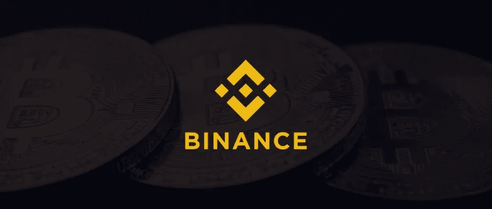

# 进入币安智能连锁？在这样做之前，请阅读这篇文章！

> 原文：<https://medium.com/coinmonks/getting-into-binance-smart-chain-read-this-before-you-do-so-43a1282b56ad?source=collection_archive---------6----------------------->

币安·柯恩已经暴跳如雷。它让许多人变得富有。它还表明，具有所需信任度的集中化可能会奏效。权力下放的故事暂时放缓了。

想来想去，这一步已经顺理成章。我对此已经直言不讳很长时间了。Uniswap 已无法使用。假设你在 AAVE 赚了一些利息，想套现，Uniswap 不会让你这么做。我是说，高昂的油费不会让你。币安低估了它已经建立了很长时间的生态系统。但 CZ 是那个继续埋头苦干的 CEO。集中式交易所的死亡是不可能的，至少不会马上发生。他知道这一点，因此，在很短的时间内，他带来了面包店交换和煎饼交换。我左右为难，不知该投资哪一个，于是我选择了面包店。倒霉的我！但那是后话了。

以太坊不会很快扩大规模，以太坊的竞争对手也没有完全推出。因此，币安智能链填补了这一空白。这种炒作会持续很久吗？可能不会。但是仍然会有持续的兴趣。去中心化是区块链的核心。因此，一旦其他平台的“交换功能”推出，人群就会转移。

然而，我还是会列出以下几点，它们会让集中交易所保持火爆。

**1。新用户登录:**任何进入 crypto 的新用户，创建一个币安或 Bitmax(或其他)账户。这永远不会消失。对区块链价值观的学习来自于不断的实践。这不是第一次。请记住，随着人口的增加，价值观会逐渐淡化。不幸的是是的。能做些什么？分散式协议需要迅速变得便宜。

一旦用户加入，他将获得交易所自己的生态系统中的项目。人们会开始探索它们。

**2。加密卡/加密的零售用途:加密交易和从市场波动中获利是少数有学问的人的游戏。这并不总是与真正的采用相关联。大多数项目都是实验。如果用户能够用 crypto 支付他们的日常需求，主流的采用将会到来。这是 Crypto.com 信用卡成功的地方，现在币安信用卡正慢慢看到成功。这非常适合集中式密码交换**

**3。产品汇集者:集中交易所也作为产品/服务汇集者发挥了巨大作用。他们同时扮演着分发空投物资、充当发射台、提供赌注服务、储蓄计划以及参与加密开采的角色。当然，这样做的代价是你没有自己的钥匙，而且回报也比实际少。然而，没有其他分散的平台提供这种收集和集成的服务。**

## **集中交易所的改进领域**

**1。基础设施:**当人群开始在币安智能链上移动时，币安倒下了。同样的事情也经常发生在比特币基地和其他交易所。这是不可接受的！交易者不能失去一分钟的买卖机会。交易所需要升级他们的服务器，修正他们的算法，并且更加安全。

**2。支持人员:**注册交易所的人数迅速增加，严重打击了交易所的支持功能。我开始与币安支持聊天，并被放在 400+的队列中！我 7 天前开出的罚单还没有回复。新来的人不会像我们这样有耐心。为了留住他们，交易所需要扩大规模

**3。流动性:**一个巨大的问题是，即使你使用 PancakeSwap，比如说，将 AAVE 转换成币安支持的 AAVE，你将在哪里出售？除了币安之外，还有哪个集中交易所会接受它吗？你唯一的选择就是换回。这也意味着，如果币安倒下，BSC 也会瘫痪。重大威胁。在你全面使用半分散式连锁店之前，要考虑这些情况。

**阅读上一篇文章:** [如何玩黑暗森林，zkSNARK powered MMO 游戏—第一部分](https://tulip311bit.medium.com/how-to-play-dark-forest-the-zksnark-powered-mmo-game-part-1-7222e2c3ab4)

***注:*** *本帖最初发表于* [*此处*](https://www.voice.com/post/@tulip/getting-into-binance-smart-chain-read-this-before-you-do-so-1613849243-2063051659) *为与 voice.com 有关联的密码作者。*

**通过我的推荐加入**

[Crypto.com](https://binance.com/en/register?ref=E8PCD3AF)——[币安](https://platinum.crypto.com/r/sut3pd9bzn)

跟我来吧

**👉** [推特](https://twitter.com/rumadas123)

**👉**[**Linkedin**](https://www.linkedin.com/in/ruma-das-a1439320/)

*   **包括附属链接**

> **加入 T42 电报集团，学习加密交易和投资**

## **另外，阅读**

*   **什么是[闪贷](https://blog.coincodecap.com/what-are-flash-loans-on-ethereum)？**
*   **最好的[密码交易机器人](/coinmonks/crypto-trading-bot-c2ffce8acb2a) | [网格交易](https://blog.coincodecap.com/grid-trading)**
*   **[3 商业评论](/coinmonks/3commas-review-an-excellent-crypto-trading-bot-2020-1313a58bec92) | [Pionex 评论](/coinmonks/pionex-review-exchange-with-crypto-trading-bot-1e459d0191ea) | [Coinrule 评论](https://blog.coincodecap.com/coinrule-review-a-perfect-trading-bot)**
*   **[AAX 交易所评论](/coinmonks/aax-exchange-review-2021-67c5ea09330c) | [德里比特评论](/coinmonks/deribit-review-options-fees-apis-and-testnet-2ca16c4bbdb2) | [FTX 交易所评论](/coinmonks/ftx-crypto-exchange-review-53664ac1198f)**
*   **[n ave 零点回顾](/coinmonks/ngrave-zero-review-c465cf8307fc) | [Phemex 回顾](/coinmonks/phemex-review-4cfba0b49e28) | [PrimeXBT 回顾](/coinmonks/primexbt-review-88e0815be858)**
*   **[Bybit Exchange 审查](/coinmonks/bybit-exchange-review-dbd570019b71) | [Bityard 审查](https://blog.coincodecap.com/bityard-reivew) | [CoinSpot 审查](https://blog.coincodecap.com/coinspot-review)**
*   **[3 commas vs crypto hopper](/coinmonks/3commas-vs-pionex-vs-cryptohopper-best-crypto-bot-6a98d2baa203)|[赚取加密利息](/coinmonks/earn-crypto-interest-b10b810fdda3)**
*   **最好的比特币[硬件钱包](/coinmonks/the-best-cryptocurrency-hardware-wallets-of-2020-e28b1c124069?source=friends_link&sk=324dd9ff8556ab578d71e7ad7658ad7c) | [BitBox02 回顾](/coinmonks/bitbox02-review-your-swiss-bitcoin-hardware-wallet-c36c88fff29)**
*   **[莱杰 vs n rave](https://blog.coincodecap.com/ngrave-vs-ledger)|[莱杰 nano s vs x](https://blog.coincodecap.com/ledger-nano-s-vs-x)**
*   **[加密复制交易平台](/coinmonks/top-10-crypto-copy-trading-platforms-for-beginners-d0c37c7d698c) | [比特码复制交易](https://blog.coincodecap.com/bityard-copy-trading)**
*   **[沃德评论](https://blog.coincodecap.com/vauld-review) | [尤霍德勒评论](/coinmonks/youhodler-4-easy-ways-to-make-money-98969b9689f2) | [区块链评论](/coinmonks/blockfi-review-53096053c097)**
*   **最好的[加密税务软件](/coinmonks/best-crypto-tax-tool-for-my-money-72d4b430816b) | [硬币追踪评论](/coinmonks/cointracking-review-a-reliable-cryptocurrency-tax-software-5114e3eb5737)**
*   **最佳[加密借贷平台](/coinmonks/top-5-crypto-lending-platforms-in-2020-that-you-need-to-know-a1b675cec3fa) | [杠杆令牌](/coinmonks/leveraged-token-3f5257808b22)**
*   **[莱杰纳米 S vs 特雷佐 one vs 特雷佐 T vs 莱杰纳米 X](https://blog.coincodecap.com/ledger-nano-s-vs-trezor-one-ledger-nano-x-trezor-t)**
*   **[block fi vs Celsius](/coinmonks/blockfi-vs-celsius-vs-hodlnaut-8a1cc8c26630)|[Hodlnaut 审查](https://blog.coincodecap.com/hodlnaut-review)**
*   **[Bitsgap 审查](https://blog.coincodecap.com/bitsgap-review) | [Quadency 审查](/coinmonks/quadency-review-a-crypto-trading-automation-platform-3068eaa374e1) | [Bitbns 审查](https://blog.coincodecap.com/bitbns-review)**
*   **[埃利帕尔泰坦评论](/coinmonks/ellipal-titan-review-85e9071dd029) | [赛克斯斯通评论](https://blog.coincodecap.com/secux-stone-hardware-wallet-review)**
*   **[DEX Explorer](https://explorer.bitquery.io/ethereum/dex)|[w](https://explorer.bitquery.io/graphql)|[local bitcoins 评论](https://blog.coincodecap.com/localbitcoins-review)**
*   **最佳[区块链分析](https://bitquery.io/blog/best-blockchain-analysis-tools-and-software)工具| [赚比特币](https://blog.coincodecap.com/earn-bitcoin)**
*   **[加密套利](/coinmonks/crypto-arbitrage-guide-how-to-make-money-as-a-beginner-62bfe5c868f6)指南:新手如何赚钱**
*   **最佳[加密制图工具](/coinmonks/what-are-the-best-charting-platforms-for-cryptocurrency-trading-85aade584d80) | [最佳加密交易所](/coinmonks/crypto-exchange-dd2f9d6f3769)**
*   **[如何在印度购买比特币](https://blog.coincodecap.com/buy-bitcoin-app-india)？**
*   **[印度比特币交易所](/coinmonks/bitcoin-exchange-in-india-7f1fe79715c9) | [比特币储蓄账户](https://blog.coincodecap.com/bitcoin-savings-account)**
*   **了解比特币最好的[书籍有哪些？](/coinmonks/what-are-the-best-books-to-learn-bitcoin-409aeb9aff4b)**

> **[直接在您的收件箱中获得最佳软件交易](/coinmonks/newsletters/coinmonks)**

****