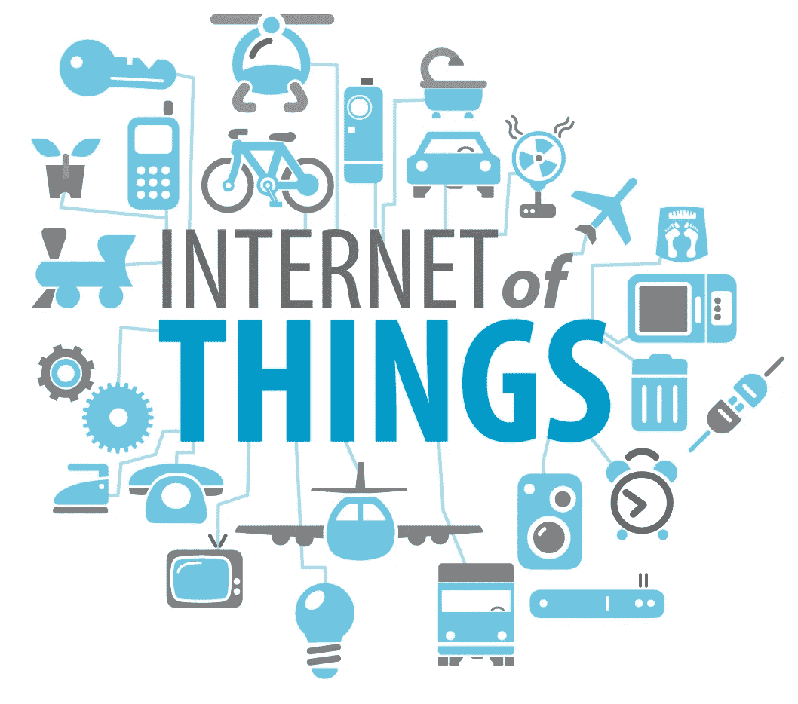

# 准备好迎接新的物联网世界:IOTA

> 原文：<https://medium.com/coinmonks/getting-ready-to-tangle-meet-the-new-world-of-iot-iota-2f0efbd5f1c6?source=collection_archive---------4----------------------->

加密货币和区块链的一个主要问题是，大多数人认为它只是价值和比特币。如果比特币的价值下降，我们会有“比特币泡沫破裂”的标题，但加密货币与比特币的价值无关，它们与可信电子代币的交易有关，这些代币具有一些价值——不仅仅是金钱——与…