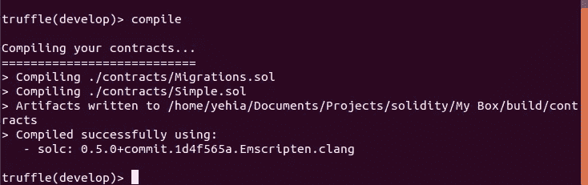

# 完全面向初学者的 Dapp 开发入门。

> 原文：<https://medium.com/coinmonks/getting-started-with-dapp-developments-af7088422629?source=collection_archive---------0----------------------->

在本教程中，你将学习如何使用 Truffle 框架开发你的第一个 Dapp。Truffle 是用于 Etherum 区块链的开发环境。它拥有开发、测试和部署您的 dapp 所需的所有工具。

本教程将涵盖:
1-Dapp 开发工具
2-安装框架
3-如何编写智能合约
4-如何测试
5-如何迁移
6-如何使用 web3js 从前端调用合约函数。

**您需要安装的工具:**

1-安装 [Metamask 扩展](https://chrome.google.com/webstore/detail/metamask/nkbihfbeogaeaoehlefnkodbefgpgknn?hl=en):用于与以太坊网络交互，以及上传您的以太坊钱包以存款和发送 ETH。从[这里](/publicaio/a-complete-guide-to-using-metamask-updated-version-cd0d6f8c338f)了解更多使用方法。
2-安装 Nodejs(这是安装 Truffle 的先决条件)

*   [对于 windows](https://nodejs.org/en/download/package-manager/#windows for Ubuntu/Linux Distributions)
*   [对于基于 Linux 的发行版](https://nodejs.org/en/download/package-manager/#debian-and-ubuntu-based-linux-distributions-enterprise-linux-fedora-and-snap-packages)

3-安装块菌(坚固框架)

```
npm install -g truffle
```

**创建你的第一个 Dapp hello 应用:**

首先，在您选择的开发文件夹中创建一个目录。

```
mkdir myFirstDapp
cd myFirstDapp
```

然后你需要使用一个 truffle box(Truffle box 是一个简单的样板文件或启动应用程序模板来启动你的项目)

```
truffle unbox yehia67/helloworldbox
```

安装依赖项

```
npm install
```

现在您需要启动您的开发环境。

```
truffle develop
```

这个命令将启动 truffle 控制台，并生成 10 个用于测试的假钱包地址。我们稍后将使用这个控制台进行编译和迁移。

转到 MetaMask 并导入从块菌生成的任何私钥。


(生产用主以太网..你应该导入 [http://127.0.0.1:9545/](http://127.0.0.1:9545/) 网络你的 Metamask 钱包)/
祝贺你...您已经准备好了 Dapp 和开发环境。

**探索项目结构:** 获得项目目录，选择 contracts 文件夹，然后选择 simple . sol(contracts/simple . sol)


您应该会看到类似这样的内容。获取并设置
值的简单智能契约。你可以使用下面的链接
[https://solidity.readthedocs.io/en/v0.5.10/](https://solidity.readthedocs.io/en/v0.5.10/)阅读更多关于写作可靠性的内容

写完代码后，你需要编译。
打开松露控制台

```
compile
```



(output should be like that)

既然我们已经成功地编辑了我们的合同，是时候将它们迁移到区块链了！
**迁移是一个部署脚本，意在改变你的
应用程序的契约状态，**将它从一个状态转移到下一个状态。对于第一次
迁移，您可能只是部署新代码，但是随着时间的推移，其他
迁移可能会移动数据或者用新的合同替换合同。
转到 migrations/2 _ deploy _ contracts . js 文件


您需要部署的任何智能合约都必须包含在
2_deploy_contracts.js 中才能进行迁移。你可以在第一行看到。json 文件，包含编译后在 build/directory 上生成的所有协定详细信息。它被称为神器。在第四行中，您部署合同，并开始迁移回我们的终端，将合同迁移到区块链。

```
migrate
```


(Output should be similar to that)

测试智能合约
转到 test/Simple.test.js
这是我们如何为每个功能编写测试用例。


将您的测试用例检查回您的终端

```
test
```


现在是使用 web3js 库从前端调用您的函数的时候了
Web3js 已经安装并准备好在 helloworldbox 中使用您需要做的就是
调用函数
转到 src/app.js
初始化您的合同:


使用 await 关键字和契约加载的
对象从契约调用方法。


This is exactly how to get and set value to your blockchain

我希望你觉得这个教程有用，如果你有任何问题，请在下面评论。谢谢！

> [直接在您的收件箱中获得最佳软件交易](https://coincodecap.com/?utm_source=coinmonks)

[](https://coincodecap.com/?utm_source=coinmonks)