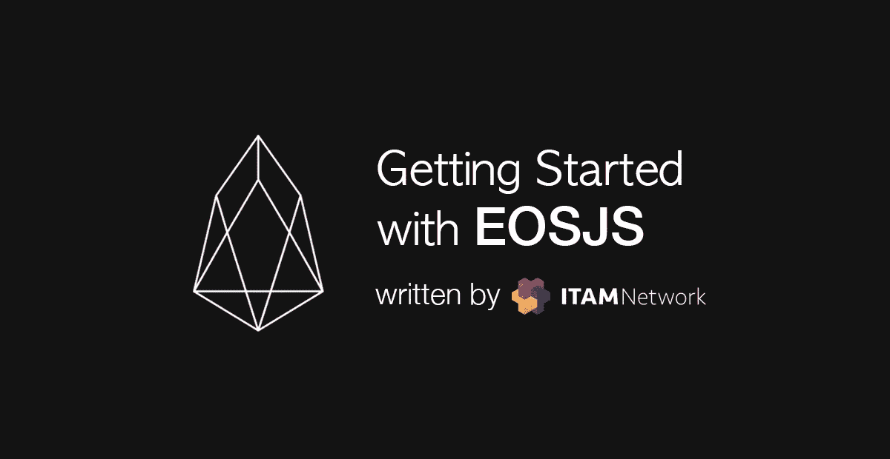
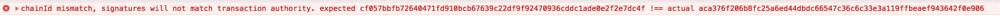
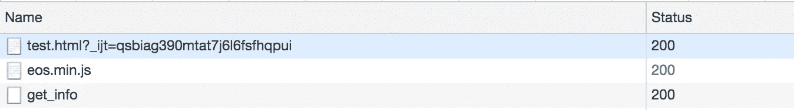

# EOSJS 入门

> 原文：<https://medium.com/coinmonks/getting-started-with-eosjs-6be29dbb71be?source=collection_archive---------6----------------------->



为了容易理解 EOSJS 是什么，可以把它想象成一个用 Javascript 轻松控制 EOS 区块链的库。再深入一点，可以说是为了方便使用 EOS 的(nodeos) HTTP API 而做的。([以太坊里的 web3.js](https://github.com/ethereum/web3.js) ，Neo 里的 [neon-js](https://github.com/CityOfZion/neon-js)

> 因为 EOSJS 也使用 EOS 的 HTTP API，所以 BP 的选择至关重要。(响应时间、可用性等。)

# **安装**

有两种安装方式。

## **用 NPM 简单安装**

```
> npm install eosjs
```

## **CDN 的使用**

# **EOS 连接**

## **使用 EOSJS 进行 EOS 连接**

如果 EOS 没有在 localhost 上运行，那么如果您运行上面的代码，将会得到下面的错误。(使用错误的 EOS http endpoint 进行连接也会出现如下错误。)

```
{ FetchError: request to [http://127.0.0.1:8888/v1/chain/get_info](http://127.0.0.1:8888/v1/chain/get_info) failed, reason: connect ECONNREFUSED 127.0.0.1:8888
    at ClientRequest.<anonymous> (/Users/mayajuni/Projects/eos-scan/node_modules/node-fetch/index.js:133:11)
    at ClientRequest.emit (events.js:182:13)
    at Socket.socketErrorListener (_http_client.js:382:9)
    at Socket.emit (events.js:182:13)
    at emitErrorNT (internal/streams/destroy.js:82:8)
    at emitErrorAndCloseNT (internal/streams/destroy.js:50:3)
    at process._tickCallback (internal/process/next_tick.js:63:19)
  name: 'FetchError',
  message:
   'request to [http://127.0.0.1:8888/v1/chain/get_info](http://127.0.0.1:8888/v1/chain/get_info) failed, reason: connect ECONNREFUSED 127.0.0.1:8888',
  type: 'system',
  errno: 'ECONNREFUSED',
  code: 'ECONNREFUSED' }
```

## Mainnet 连接

如果您尝试像上面那样连接，将会出现如下的错误消息。



即使出现错误， *getInfo* 也是可能的，所以让我们使用它来检查并输入 chainId。

> 以 Mainnet 为例，ACA 376 f 206 b 8 fc 25 a 6 ed 44 dbdc 66547 c 36 c 6 c 33 e 3a 119 FB beaef 943642 f 0 e 906 是常用的 chainId，所以输入这个。

如果使用上述方法连接，第一个 get_info api 将被调用一次，如下所示。(起初，我不是很了解，每次都连接，这导致了 mobile L 上大量的数据使用)



> *你可以在* [*查看 mainnet 地址 https://API . eosnewyork . io .*](https://api.eosnewyork.io.)*因为每个 BP 提供的信息量、响应时间等都不一样。，找到并选择适合自己需求的 BP 至关重要。(也有直接获取完整节点并连接的方法)。*

## **连接配置**

这部分的详细描述在 github 上。(github-配置)

## **getInfo — api**

可以得到 EOS 的基本网络信息。代码如下所示。

> *有趣的事实:其他 API 都是基于承诺的，只有 getInfo 是回调方法。*

返回值如下所示。

```
{
    server_version: '36a043c5',
    chain_id:
        'aca376f206b8fc25a6ed44dbdc66547c36c6c33e3a119ffbeaef943642f0e906',
    head_block_num: 5469047,
    last_irreversible_block_num: 5468711,
    last_irreversible_block_id:
        '00537227a657d1f4fd74de877e9ad1a3839540ece45eedeaf177b20e51b2da1b',
    head_block_id:
        '005373770504c59e992214b3056c7bdabb07c53c5a9c4785909b90fe595a119f',
    head_block_time: '2018-07-12T08:58:05.500',
    head_block_producer: 'helloeoscnbp',
    virtual_block_cpu_limit: 200000000,
    virtual_block_net_limit: 1048576000,
    block_cpu_limit: 199900,
    block_net_limit: 1048576
}
```

如果您不知道上面提到的 chainId(EOS Connect)，您可以通过 getInfo 获得并使用 chainId。

这篇文章写得很轻松，因为这只是使用 EOSJS 的 install、connect 和 getInfo 的第一步。我们将在未来更深入地研究 EOSJS。

## ITAM 游戏是一个透明的游戏生态系统的区块链平台

订阅 ITAM 游戏并接收最新信息。

访问 ITAM 游戏电讯，就 ITAM 游戏和区块链进行交流。点击下面的链接加入！👫

网址:**[https://itam . games](https://itam.games)电报:[https://t.me/itamgames](https://t.me/itamgames)**