# 以太坊入门和使用 Truffle、Metamask & Ganache-CLI 构建基本 Dapp

> 原文：<https://medium.com/coinmonks/getting-started-with-ethereum-and-building-basic-dapp-ebb681fb3748?source=collection_archive---------0----------------------->

*注意——本文更新了 Truffle、Solidity、Metamask、web3js 和 Ganache-CLI 的最新版本*

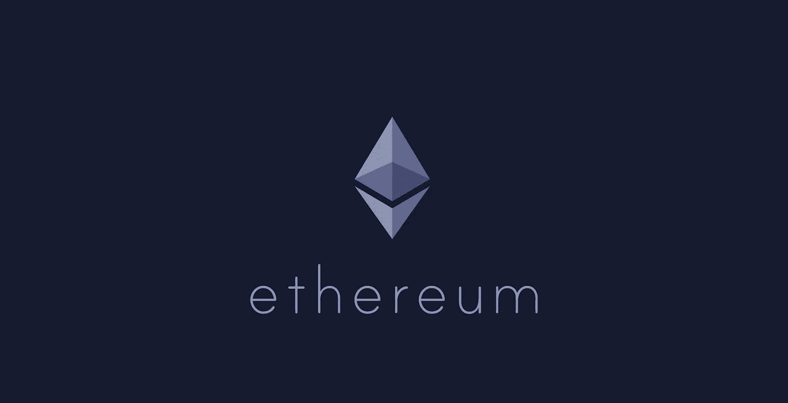

Ethereum

# 什么是以太坊

以太坊是计算机/节点的去中心化网络；网络中的每个节点执行一些字节码(即智能合同)并将结果状态存储在区块链中。由于代表应用程序状态的区块链的属性，这导致“应用程序完全按照编程运行，没有任何停机、审查、欺诈或第三方干扰的可能性”。

# 以太坊和比特币类似吗？

好吧。算是吧，但也不尽然。相似之处在于两者都使用区块链，但也仅此而已。由于以太坊不仅仅是一种数字货币，它提供了一个平台来开发基于区块链的应用程序，这些应用程序具有智能合约的特点，以太坊虚拟机(EVM)，并使用其名为以太的货币进行点对点合约。

# 什么是智能合同？

一个[智能合同](https://blockchainhub.net/blog/infographics/smart-contracts-explained/)是一个运行在区块链之上的计算机代码，它包含一组规则，根据这些规则，智能合同的各方同意彼此进行交互。如果满足预定义的规则，则自动执行协议。执行它的平台赋予这段代码一些属性，比如不变性、确定性操作、分布式&可验证状态等。由该代码管理的状态存储在一个区块链上，并且是不可变的，任何人都可以通过从链的开始重放所有事务来双重检查当前状态是否正确。

# EVM——以太坊虚拟机

EVM(或以太坊虚拟机)是以太坊智能合约的字节码执行环境。网络中的每个节点都运行 EVM。所有节点都使用 EVM 执行指向智能合约的所有事务，因此每个节点都执行相同的计算并存储相同的值。此外，EVM 确保程序无法访问彼此的状态，从而确保可以在没有任何潜在干扰的情况下建立通信。

# Web3 和技术堆栈

众所周知，在 90 年代初，万维网(WWW)带来了信息革命。从那时起，互联网变得更加成熟和可编程，我们看到了所谓的 Web2 的兴起，它给我们带来了社交媒体和电子商务平台，彻底改变了社交互动，使信息、商品和服务的生产者和消费者更加紧密地联系在一起，并允许我们在全球范围内享受 P2P 互动。但总会有一个中间人:一个在彼此不了解或不信任的 A 和 B 之间充当可信中介的平台。虽然这些平台在创造 P2P 经济方面取得了惊人的成就，拥有越来越复杂的内容发现层，但它们也决定了所有的交易规则，这些平台拥有我们所有的数据。

在这种背景下，区块链似乎是下一代互联网，即去中心化 Web 或 Web3 的驱动力，并产生了去中心化 Web 堆栈。

与构建普通的 web 或移动应用程序类似，创建 dApp(分散式应用程序)通常需要几样东西:计算、文件存储、外部数据、货币化和支付，如下所述。

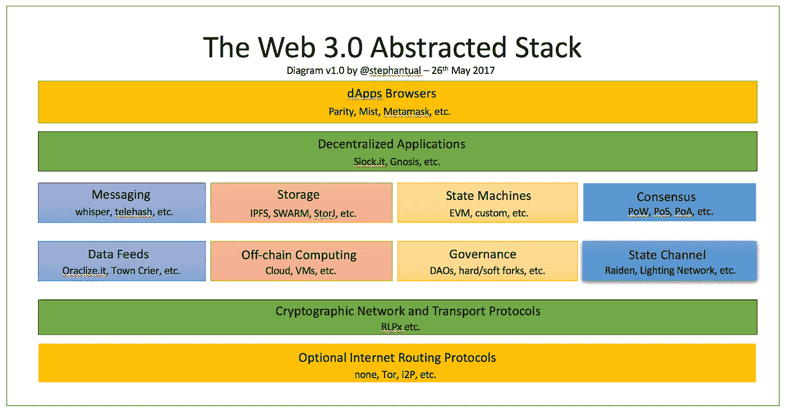

Web 3.0 Abstracted Stack

当我们向分散系统发展时，这并不意味着我们将完全摆脱集中系统。从客户机-服务器互联网到分散式网络的过渡似乎是渐进的，而不是激进的。由于去中心化的 web 栈仍在不断成熟，这种转变似乎正在从集中向部分去中心化再向完全去中心化转变。

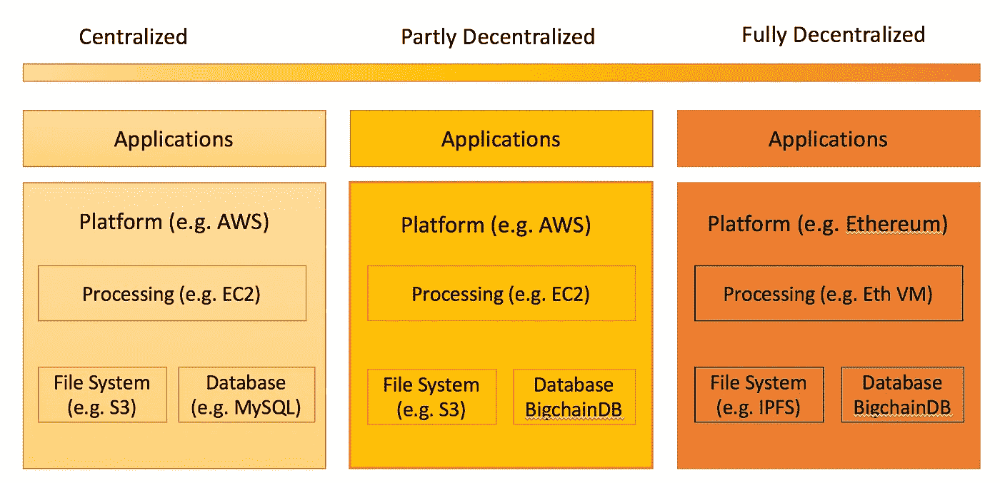

The shift from Centralized to Fully Decentralized Apps

# 开发 DApp。如何进入以太坊？

试图从开发者的角度解释以太坊。

## 当前客户端-服务器 webapp 架构处于非常高的水平

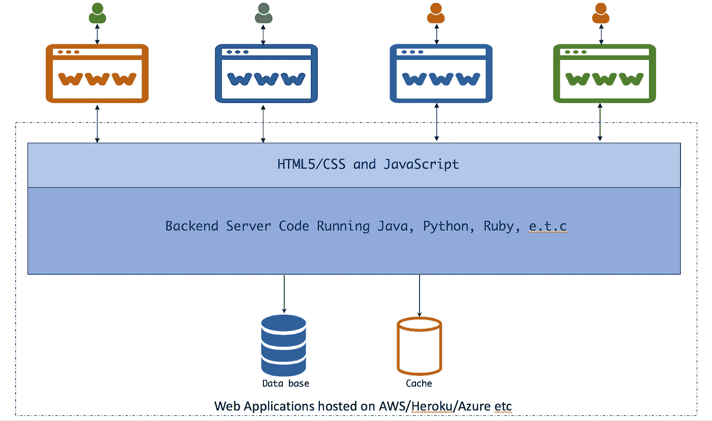

Current Client-Server Application Architecture

web 应用程序托管在托管提供商上，如 AWS、Heroku 或任何其他 VPS。客户端与这个中央应用程序进行交互。客户端可以是浏览器、小部件、curl 命令或其他使用 API 的服务。当客户端通过 web 浏览器向服务器发出请求时，所实现的服务器代码与数据库和/或缓存进行交互，以进行 CRUD 操作，并为客户端提供服务。

## 这是以太坊 Dapp 的高级外观:

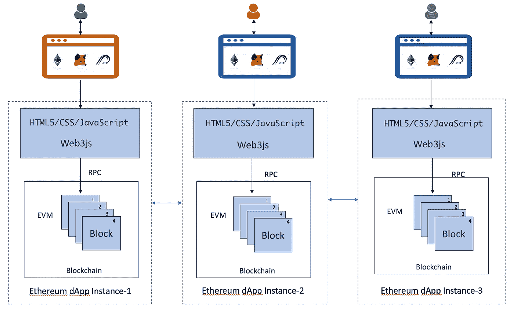

Futuristic Decentralized Application Architecture

如果观察到每个客户端(浏览器)都与自己的应用程序实例通信。不存在所有客户端都连接到的中央服务器。这意味着每个想要与 dapp(分散式应用程序)交互的人都需要在他们的电脑/手机等设备上运行区块链的完整副本。这意味着，在使用应用程序之前，你必须下载整个区块链，然后开始使用该应用程序。这一开始听起来可能很荒谬，但它的优势在于不依赖于明天可能会消失的单一中央服务器。

# 入门指南

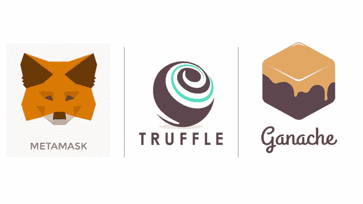

Basic Dapp using Metamask, Truffle & Ganache

## 我们需要的基本工具-

*节点包管理器(npm)* — NPM 是 Node.js 包或模块的包管理器。

Ganache(早期的 TestRPC)是一个用于以太坊开发的个人区块链，开发者可以使用它来部署合同、开发应用程序和运行测试。它 100%在本地运行，模拟一个完整的以太坊客户端，但是速度快得多，非常适合测试和开发。它有两种风格——Ganache(GUI)&Ganache-CLI。

*Truffle* — Truffle 是区块链使用以太坊虚拟机(EVM)的开发环境、测试框架和资产管道。基本上，它帮助您将合同部署到区块链，用新合同替换旧合同(称为迁移)，并将您的前端与您部署的合同挂钩

*MetaMask* — MetaMask 是一个以太坊轻客户端和 Chrome 扩展，让用户无需下载整个区块链就能与区块链互动。换句话说，它允许你在普通的 Chrome 浏览器中与 dApps 进行交互

首先，我们需要安装我们的工具。如果您没有 npm，我们先安装它。[这里](https://www.npmjs.com/get-npm)是如何安装它的说明。

一旦安装了 npm，我们就可以用它来安装 ganache-cli，这是一个 Node.js 以太坊客户端，模拟了一个真实的以太坊节点。

```
$ npm install -g ganache-cli
```

接下来，我们需要安装松露

```
$ npm install -g truffle
```

最后一个，MetaMask Chrome 插件，你可以在这里找到。

## 启动 Ganache-CLI

```
$ ganache-cli
```

这将启动客户端并生成 10 个帐户供您使用，每个帐户有 100 个 ETH。您应该会看到类似这样的内容:

```
Ganache CLI v6.4.3 (ganache-core: 2.5.5)Available Accounts
==================
(0) 0xb862683d666eccd3c5bda90b9019eea2d88fcf4c (~100 ETH)
(1) 0xeb6c0c8b164fe4159ebbcdc2310783d19d905fc9 (~100 ETH)
(2) 0x7e29526a7a8ea68577132857c8e325ed45ca7826 (~100 ETH)
(3) 0xa5656ecbe6cf02f8e897f884a70c59a6a6a77ddc (~100 ETH)
(4) 0xc25ab5ae4606fb43c33b56c7ab002dd4fd19334e (~100 ETH)
(5) 0xf32fd21fe9e5e21cec8585aff81be38cad1ebd8b (~100 ETH)
(6) 0xc0ce713452c43460896020dfb9cbff3cea900795 (~100 ETH)
(7) 0x92174af56993b801046b4873db090ccd99eeed6a (~100 ETH)
(8) 0x1556fab5afa931ea18447c03658e82cd2764329a (~100 ETH)
(9) 0xc054b69b1ff4f66829c2e345ff3fd852aaf89ede (~100 ETH)Private Keys
==================
(0) 0xc8763205e691a0e9f75c70a33c6f03d74a3eb4f5eabb3cc2df2e1418f5ae009a
(1) 0x8831d3c067bcbde12d9a4b7f3aaa1b35c93583af0f21b4b42975ab33da41ac9d
(2) 0xfa9058ce63d3637968ca1503e591af98320464e9ebb280e7926a1808292c25a6
(3) 0x854e7e468d6faa3848159a280c9ba5f4fadca5917f591290af67638034abbd87
(4) 0xed4caecb8a582c88d5c2aa060edf4164c0dac01272a96c11c1fb4a5133df3663
(5) 0x1a9baa245b21b6a496ffc1470d1da5dc09fe82dac8f09e1a09c359d1d051a6d2
(6) 0xa4d31de11decc250566df5049eff2fbc4b561bc3546f4799a4f20f7220f5da1d
(7) 0xf06baf2fce426775db8161159851f39cdcdd10e1e5b1799a2afc082dff74d2fc
(8) 0x6d46370b574ae74ef318f113c3333c158e3d796f481545d982a588ae2ca26d68
(9) 0xf0a6a838ba4a4e906a9663a90521d13968abd2a664e7ac5c7217666a4994deabHD Wallet
==================
Mnemonic:      staff pottery include obscure design siege cannon bounce dust bone dawn surprise
Base HD Path:  m/44'/60'/0'/0/{account_index}Gas Price
==================
20000000000Gas Limit
==================
6721975Listening on 127.0.0.1:8545
```

第一个列表是 10 个帐户中每个帐户的公共地址，第二个列表是与每个帐户相关联的私有密钥。

## 设置元掩码

现在，让我们设置 MetaMask 来使用我们的 Ganache-CLI 作为它的网络。打开 MetaMask，按照初始设置步骤进行操作。

设置元掩码后，选择左上角的网络菜单。然后选择“Localhost 8545”作为您的网络，如下所示。

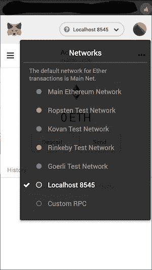

Metamask connected to Ganache

接下来，将几个帐户添加到 MetaMask，方法是转到右上方的彩色圆圈-> Import Account，然后从启动 Ganache-CLI 时在终端中打印出来的列表中复制一个私钥。我的情况是—0xc 8763205 e 691 a 0e 9 f 75 c 70 a 33 c 6 f 03d 74 a 3 EB 4 f 5 eab B3 cc 2d f 2e 1418 f 5 AE 009 a。

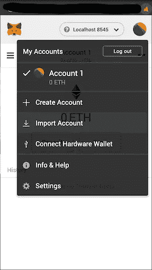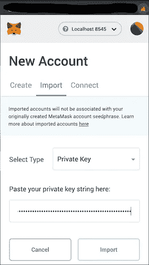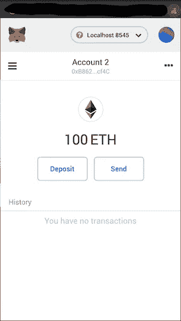

Account 2 is from Ganache-CLI

如上图所示，我们可以看到 account 2，它只不过是运行 ganache-cli 后在终端中显示的第一个帐户。

我们的环境现在已经设置好了，我们准备创建和部署我们的 dApp。让我们从创建一个新的项目目录开始，并打开集成了 Webpack 的 Truffle dApp。我将把我的项目命名为 *ethereumdapp* ，但是你可以随意命名你的项目。

## 初始化松露

```
$ mkdir ethereumdapp$ cd ethereumdapp$ truffle unbox webpack
```

## 部署合同和运行 dApp

要将您的合同部署到 ganache-cli，请运行以下命令:

```
$ truffle compile$ truffle migrate
```

一旦迁移完成，我们就可以运行 dApp 了。运行 dApp

```
$ cd app$ npm run dev
```

在浏览器中打开[**http://localhost:8080/**](http://localhost:8080/)

**我们应该看到我们的 dApp 正在运行并准备使用！如果我们将当前元掩码帐户切换到由 Ganache-CLI 生成的第一个帐户，并刷新页面，我们应该会看到余额为 10，000 元。现在，我们可以使用 dApp 接口将 META 发送到其他帐户。**

**为了在本地检查交易，我们可以安装 etherparty explorer**

## **安装以太方**

**因为我们已经安装了 node 和 npm，所以唯一需要安装的是 git。[这里](https://git-scm.com/book/en/v2/Getting-Started-Installing-Git)是安装的步骤。安装 git 后，打开一个终端并键入以下内容**

```
$ git clone [https:*//github.com/etherparty/explorer*](https://github.com/etherparty/explorer)
```

**这将把以太方资源管理器克隆到本地目录资源管理器。转到此目录**

```
$ cd explorer
```

**现在让我们启动资源管理器**

```
$ npm start> EthereumExplorer@0.1.0 start /Users/XXXX/explorer> http-server ./app -a localhost -p 8000 -c-1Starting up http-server, serving ./app on port: 8000Hit CTRL-C to stop the server
```

**导航到 [http://localhost:8000/。](http://localhost:8000/.)你会看到下面这样的东西。**

**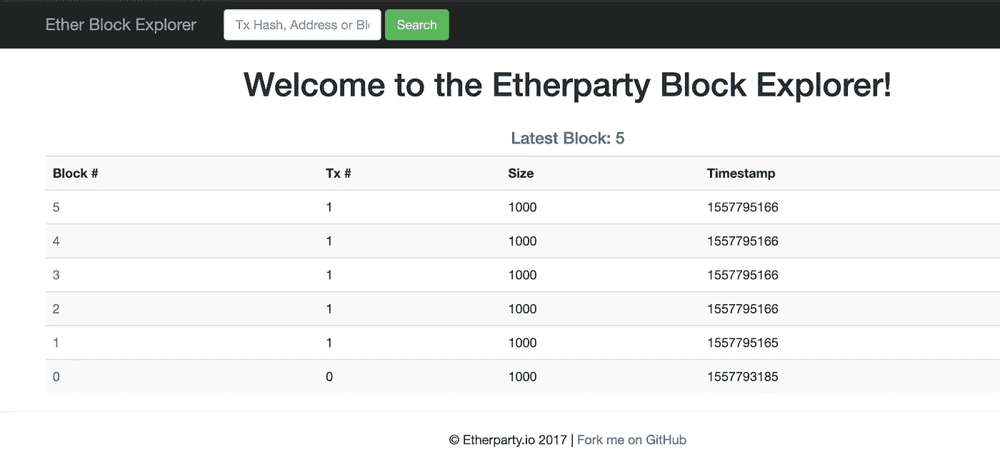**

**现在让我们把一些元币(10 元币)从 ganache-cli 账户(账户 2)转到 metamask 账户(账户 1)。**

**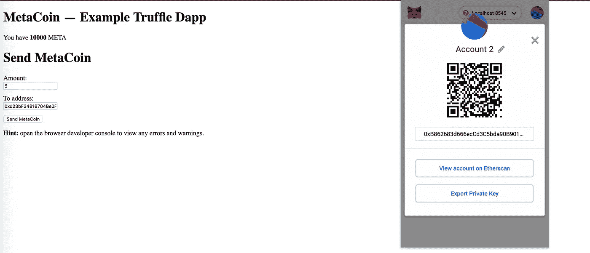****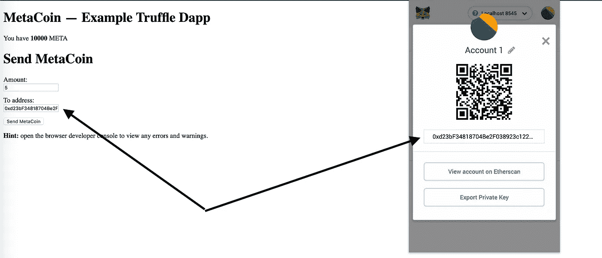**

**一旦事务启动，元掩码将显示如下通知**

**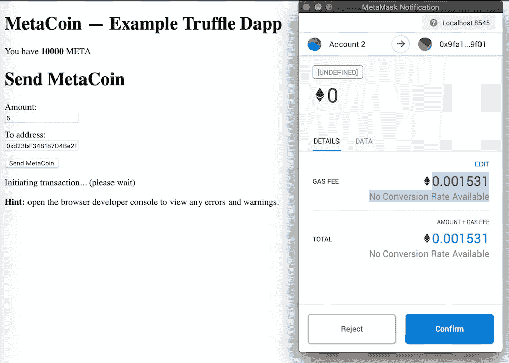**

**在确认交易时，我们可以看到元币被借记账户 2，贷记账户 1。**

**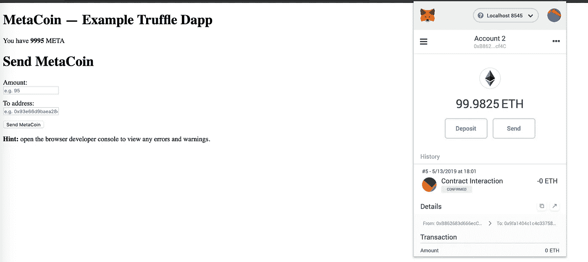**

**Account 2**

**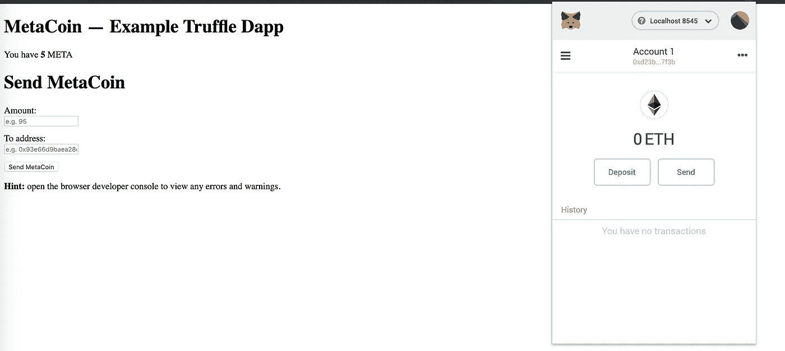**

**Account 1**

**我们也可以在 explorer 中验证交易，如下所示。块#6 是为该事务创建的块。**

**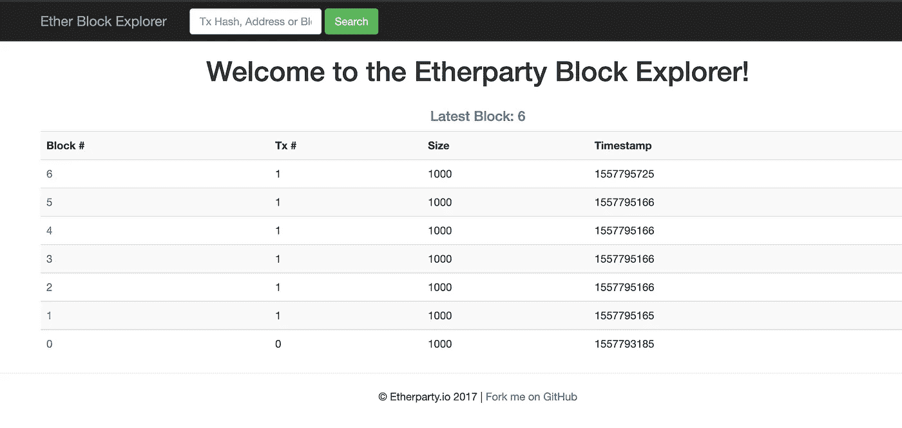****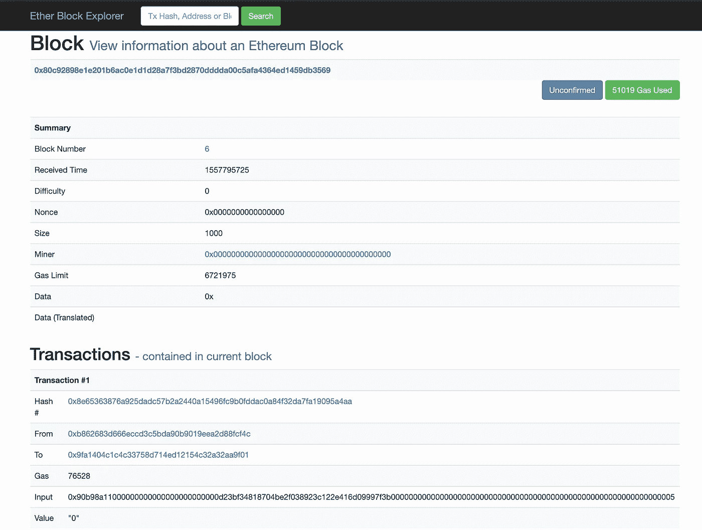**

**完整的代码可以在[这里](https://github.com/itsromiljain/ethereumdapps/tree/master/metacoin)找到。在[第 2 部分](/@itsromiljain/get-started-with-building-ethereum-dapps-and-smart-contracts-d86b9f7bd1c)中，我们将创建一个简单的经过公证的智能契约，并展示使用 web3js 库和 Ganache-CLI 以及 Truffle 来部署它的方法。**

***请分享您的想法、反馈、评论和澄清。这将有助于我随机应变。***

***如果你喜欢这篇文章，你可以帮我把它推荐到❤下面***

***关注我上*[*Linkedin*](https://www.linkedin.com/in/romiljain)*和* [*Twitter*](https://twitter.com/itsromiljain)**

> **[直接在您的收件箱中获得最佳软件交易](https://coincodecap.com/?utm_source=coinmonks)**

**[](https://coincodecap.com/?utm_source=coinmonks)**