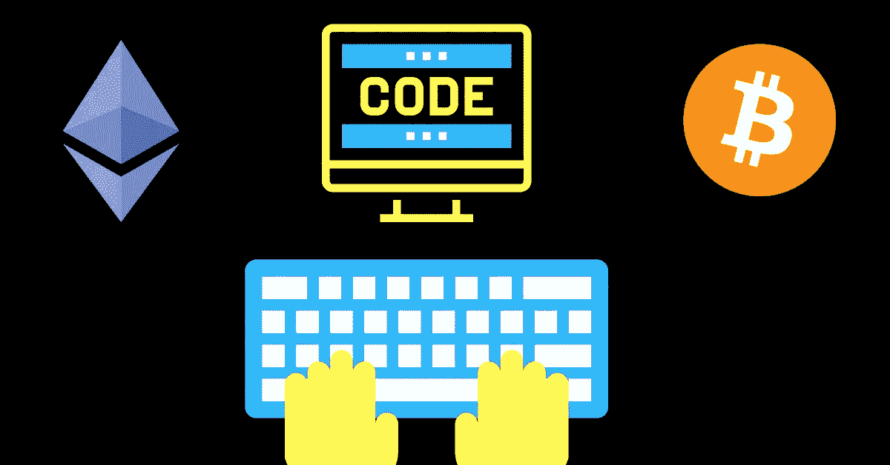
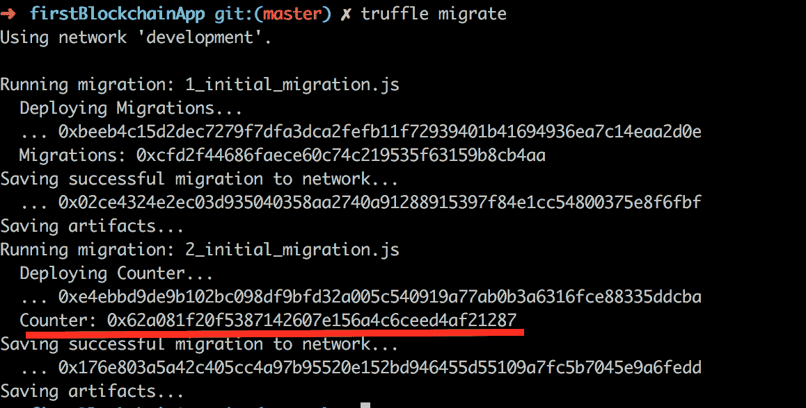

# 以太坊区块链开发入门:第 2 部分

> 原文：<https://medium.com/coinmonks/getting-started-with-ethereum-blockchain-development-921eb42975e6?source=collection_archive---------4----------------------->



在第一篇博客[以太坊区块链开发入门:第 1 部分](http://demystifyblockchain.com/2018/06/29/getting-started-with-ethereum-blockchain-development-part-1/)中，我展示了如何创建简单的智能契约并将其部署在 ganache-cli 上。我还演示了如何为合同编写松露测试。你可以在 [Github 中找到代码。](https://github.com/sarveshgs/firstBlockchainApp)

在本文中，我将演示如何编写交互层来与智能契约交互。我们将使用 [web3](https://www.npmjs.com/package/web3) npm 包来编写交互层。本文假设您已经按照本文第 1 部分[中提到的步骤为区块链开发设置了本地机器。](http://demystifyblockchain.com/2018/06/29/getting-started-with-ethereum-blockchain-development-part-1/)

让我们编写交互层来与'**计数器** ' [契约](https://github.com/sarveshgs/firstBlockchainApp/blob/master/contracts/Counter.sol)进行交互。

在继续之前，让我们再进行一些设置:

1.  **设置基本代码:**如果您已经完成了第 1 部分，您可以跳过这一步。否则从 github 中检查代码。

```
 ***git clone*** [***https://github.com/sarveshgs/firstBlockchainApp.git***](https://github.com/sarveshgs/firstBlockchainApp.git)***git checkout tutorial-part-1***
```

1.  **初始化节点项目:**使用 npm 初始化节点项目。

```
 ***npm init***
```

3.[**web 3**](https://web3js.readthedocs.io/en/1.0/)**:**web 3 是一个库，它帮助你使用 HTTP 或 IPC 连接与本地或远程以太坊节点交互。可以使用 npm 来安装。

```
***npm install web3 — save***
```

# **让我们从一些编码开始**

1.  **部署合同:**让我们部署 Counter.sol 合同，它将创建一个合同地址。Web3 需要合同地址来进行交互。

一、运行 ganache-cli:通过运行 ganache-cli 设置以太坊节点。

# ***ganache-cli***

二。解锁帐户:解锁由 ganache-cli.a 创建的第一个帐户。

打开松露控制台:

```
 ***truffle console***
```

b.解锁帐户:运行 ganache-cli 解锁帐户时，使用控制台上打印的第一个帐户地址和私钥。此解锁帐户用于部署合同。

```
***web3.personal.unlockAccount(firstAccountAdress,firstPrivateKey,15000)***
```

三。部署契约:你可以使用 truffle 来部署契约。记下图像中用红线下划线标出的合同地址。

```
***truffle migrate***
```



2.**编写 Js 脚本与合同交互:**成功完成第一步后，您现在应该有了合同地址。我们将把这个地址传递给 web3，以识别部署在以太坊节点上的契约。

一、在你的项目结构中创建一个文件夹，在交互文件夹中命名为“**交互**”和“**交互. js** ”。

二。使 web3 与本地以太坊节点连接:ganache-cli 运行于[*http://localhost:8545*](http://localhost:8545)

```
**const** Web3 = require('web3');
**const** web3 = **new** Web3(**new** Web3.providers.HttpProvider("http://localhost:8545"));
```

三。初始化合同:要初始化合同，我们需要两样东西

*   合同地址:在步骤 1 中成功部署合同后，您必须拥有合同地址
*   ABI: ABI 代表*应用二进制接口*。基本上，它是 json 格式的合同元数据。您可以在项目的' ***build* '** 文件夹中找到 abi。它是在合同汇编后生成的。

```
**const** metadata = require('../build/contracts/Counter');
**const** abi = metadata.abi;
**const** contractAddress = "0x42f18096c12db0b85ce999dbe5cceb4316f1e0be";
**const** counter = **new** web3.eth.Contract(abi, contractAddress);
```

四。调用契约方法:最后，需要做的是调用契约方法。调用合同方法将在以太坊区块链形成交易。一旦交易被执行，它将返回一个交易收据。此收据可用于从方法和事件中检索返回值。

在下面的代码片段中，我们调用' [incrementCounter](https://github.com/sarveshgs/firstBlockchainApp/blob/master/contracts/Counter.sol) '方法，并监听'收到时接收事件'

动词 （verb 的缩写）运行 interaction.js:使用 node 运行 interaction.js。

***节点互动/互动. js***

很好，你现在知道了，如何使用 web3 编写智能契约和交互层来与契约方法进行交互。

Github 上有完整的源代码:[sarveshgs/first block chain app](https://github.com/sarveshgs/firstBlockchainApp)

[](https://github.com/sarveshgs/firstBlockchainApp) [## sarveshgs/firstBlockchainApp

### 这是一个简单的区块链应用程序，演示了智能合同和松露框架的用法…

github.com](https://github.com/sarveshgs/firstBlockchainApp) 

感谢你阅读这两篇博客，我希望它给了你一些关于如何写 dapps 的基本理解。

在接下来的几篇博客中，我解释了关于气体消耗和有效的内存管理。

## Solidity 中的内存和存储是什么？

请继续关注，回复或发表对问题和建议的评论。

快乐编码:)

[linkedin.com/in/jainsarvesh](https://www.linkedin.com/in/jainsarvesh/)medium.com/@sarvesh.sgsits