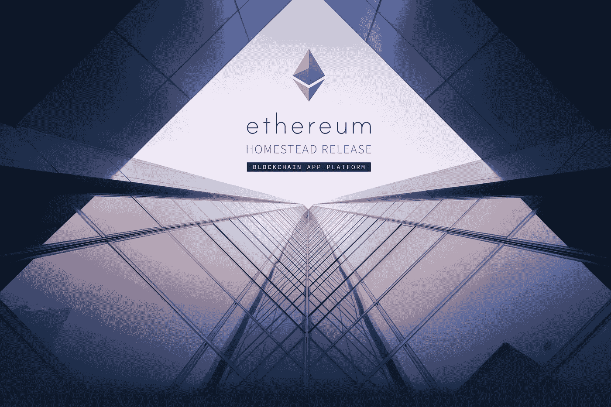
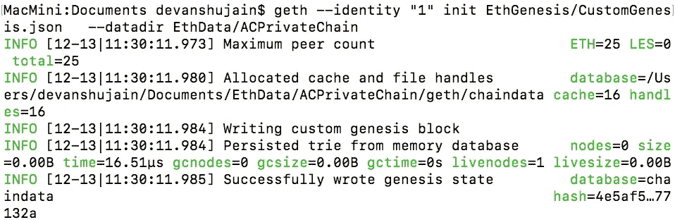
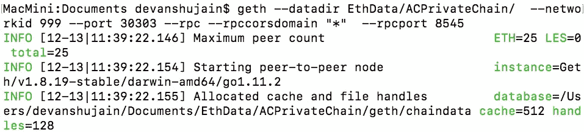
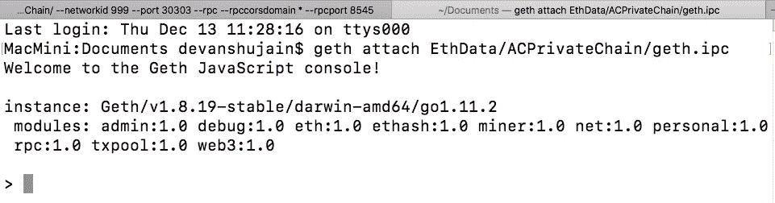
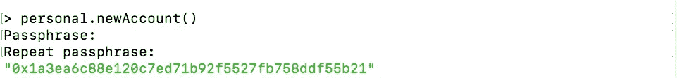
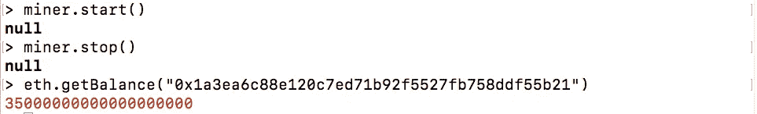
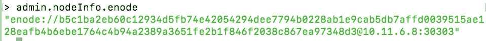
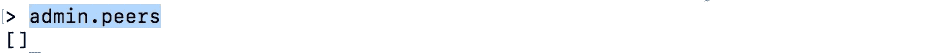

# 以太坊和智能合约入门—第 2 部分

> 原文：<https://medium.com/coinmonks/getting-started-with-ethereum-smart-contracts-part-2-dc59beea2340?source=collection_archive---------3----------------------->

嗨，欢迎回来！这是以太坊和智能合约入门的第 2 部分。如果你是第一次登陆，欢迎！[这里是第一部分关于什么是区块链和以太坊？](/@devanshujain95/getting-started-with-ethereum-smart-contracts-219e59a5b562)



# **Eth — Eth —以太坊**

以太坊区块链网络是由许多 EVM(以太坊虚拟机)或“节点”连接到其他节点而形成的一个网络。 ***每个节点运行整个区块链*** 的副本，并竞争挖掘下一个块以验证事务。每当添加新数据块时，区块链都会更新并传播到整个网络，这样每个节点都是同步的。这意味着区块链的数据库由所有这些连接到网络的节点维护和更新。网络中的每个节点都运行 EVM 并执行相同的指令。由于这个原因，**以太坊有时被形象地描述为“世界计算机”**。

要成为以太坊网络中的一个节点，我们的计算机必须下载并更新整个以太坊区块链的副本。为了实现这一点，以太坊提供了一些工具，我们可以下载、连接到以太坊网络，然后与之交互(基本上是设置 EVM)。这些工具是:

> ***Geth*****—**“……如果你有 web 开发经验，并且对为 dapps 构建前端感兴趣，你应该尝试一下 Geth。”
> 
> ***Eth*—**“…如果您想要通过并行运行两个不同的实现来增加安全性，或者非常重视 GPU 挖掘，那么 c++“Eth”客户端就是您的选择。”
> 
> ***Pyethapp*—**“…如果你是一个想要构建分散式应用程序的 Python 开发者，或者出于研究或学术目的对以太坊感兴趣，这是一个很好的客户端”

这些工具中的每一个都将最终为我们提供一个*控制台。在接下来的教程中，我们将使用 **Geth** 作为我们的 EVM 来开始我们的开发。*

# **安装 GETH**


Geth 是一个与以太网通信的命令行(CLI)工具。它充当计算机、硬件和网络中其他以太坊节点之间的接口。如果一个数据块被另一个节点挖掘，我们的 Geth 程序(也就是我们的 EVM)会把它捡起来，然后把新的信息传递给 CPU 来更新区块链。

# Mac:

要在 Mac 上安装 GETH，最简单的方法是使用**自制软件**。如果没有，先从这里的[安装](https://brew.sh/)。

安装家酿后，只需在终端输入以下命令:

```
# brew tap ethereum/ethereum
# brew install ethereum
```

# **视窗:**

首先根据你的机器类型在这里下载[最新的 64 位稳定版 Geth。下载稳定的二进制文件后，从 zip 中提取 geth.exe 并执行“geth . exe”或打开命令终端并键入:](https://geth.ethereum.org/downloads/)

```
# chdir 'path of extracted binary'
# open geth.exe
```

# Linux:

对于 ubuntu，请遵循以下步骤:

```
#sudo apt-get install software-properties-common
#sudo add-apt-repository -y ppa:ethereum/ethereum
#sudo apt-get update
#sudo apt-get install ethereum
```

对于其他 linux 发行版，下载这些包及其相应的包管理器，如`yum`和 all。

一旦你在你各自的机器上安装了 Geth*，*你就可以在技术上连接到主要的或公共的以太坊区块链网络并运行一个完整的以太坊节点。

# 创建私有以太坊区块链

Geth 使我们能够建立一个测试网(私人)以太坊区块链。这是学习你在互联网上听到和读到的区块链概念的最好方法。你可以建立智能合同，使交易成为一个均匀分布的应用程序，而不需要真正的以太网*。您可以创建自己的虚拟以太网，将以太网预先分配到您的帐户，然后使用它进行交易、转账或部署智能合同。*

# 区块链及其起源区块

> 每个区块链从一个创世块开始，创世块是链中的第一个块，即零块——唯一没有前身的块。

为了创建我们的私人区块链，我们将创建一个创世纪块。为此，我们将创建一个定制的 genesis 文件，并要求 Geth 使用该 genesis 文件来创建我们自己的 Genesis 块，这反过来将是我们定制的私有区块链的开始。我们的创世纪文件看起来像这样:

```
{
    "config": {  
        "chainId": 999,              
        "homesteadBlock": 0,         
        "eip155Block": 0,
        "eip158Block": 0
    },
    "difficulty": "0x500",           
    "gasLimit": "0x9000000",         
    "alloc": {}}
```

> **chainId** :标识我们的区块链，并将它设置为我们私有链的唯一值。主以太坊链有自己的 ID。
> 
> **Homestead block**:Homestead 是以太坊平台的第二个主要版本，也是以太坊的第一个量产版本。它包括几项协议变更。由于我们已经在 homestead 版本上，所以这个属性是`0`。
> 
> **EIP 155 block/EIP 158 block**:Homestead 版本发布时对向后不兼容的协议做了一些更改，因此需要一个硬分叉。这些协议更改/改进是通过以太坊流程改进提案(EIP)提出的。然而我们的链不会为这些变化而硬分叉，所以 0。
> 
> **难度**:该值用于控制区块的开采时间。
> 
> **gasLimit** : Gas 是以太坊的燃料(加密燃料)，在交易过程中消耗掉。在我们的例子中，我们将把这个值标记得足够高，以避免在测试过程中受到限制。这个气体极限值规定了我们区块可以使用的气体消耗的最大极限。
> 
> **alloc** :我们可以在这里创造我们的钱包，并预先装满假乙醚。但是在这里，我们将快速地在本地挖掘我们的醚，所以将其保留为空白。

*首先在系统中创建两个名为 EthGenesis 和 EthData 的空文件夹。这些文件夹将帮助我们存储链数据和链对应的起源文件。*

# 创建私人区块链

在 **EthGenesis** 文件夹中创建一个名为 **CustomGenesis.json** 的文件，并将上面的 Genesis 文件代码粘贴到其中。现在打开终端并执行以下命令:`**# geth --identity "1" init EthGenesis/CustomGenesis.json --datadir EthData/ACPrivateChain**`



这个代码片段指示 Geth 使用您创建的`CustomGenesis.json`文件作为您的自定义区块链的第一个块。然后，我们还指定一个数据目录，我们的私有链数据将存储在这个目录中。Geth 将为您创建数据目录。一旦您在终端窗口上运行这个代码片段，您应该看到 Geth 连接到 genesis 文件并提供相同的确认。

接下来，要启动我们的专用网络，以便我们可以开采新的区块，请执行以下命令:`**# geth —-datadir EthData/ACPrivateChain/ --networkid 999 —-port 30303 —-rpc —-rpccorsdomain “*” —-rpcport 8545**`



My own private network

在这一点上，我们可以看到我们的以太坊专用网络已经创建，我们的区块链已经用我们的 genesis 块初始化。

现在在同一个终端中打开**新标签，并将这个新标签连接到运行以太坊私有网络的标签，输入:`**# geth attach EthData/ACPrivateChain/geth.ipc**`**



**显然，在 Windows 上，我们必须指定 IPC 路径**。因此，对于 windows 用户来说，不要执行上面的命令，而是在 cmd 中键入以下命令

```
**# geth attach ipc:\\.\pipe\geth.ipc**
```

通过这样做，我们可以看到我们的终端中现在有了控制台。这意味着我们现在成功地连接到我们的私有链。

要在我们的私有链中创建一个帐户，请在控制台中执行此操作



通过这个我们可以得到我们的账户地址。保存此帐户地址以备将来使用。

此时，我们已经用 genesis 文件参数初始化了我们的链，我们的链正在我们的网络 id 为 999 的私有网络上运行。到目前为止，我们还有一个余额为零的账户。核对账户余额

```
**> eth.getBalance('accountAddress')**
```

# 开采一些乙醚

为了得到一些假乙醚，我们需要开始开采石块。开始采矿，让它进行 30-40 秒，以获得一些平衡。在它停止采矿之后。



一旦我们执行命令 miner.start()，我们就可以在主选项卡中看到挖掘描述。停止采矿后，再次用天平检查，我们可以看到乙醚(魏)的平衡。

> **祝贺你！我们已经创建了我们自己的私人(测试网)以太坊支持的区块链与一个帐户有假醚。**

# 对等连接

> 到目前为止，我们已经开始在我们的私有网络上使用我们自己的链。但是我们如何将同行连接到我们的链上呢？

要添加对等点，我们必须遵循相同的程序，用相同的源文件初始化链，并创建具有相同网络 id 的网络。按照我们想要连接到链条的新机器的流程进行操作。**我们也可以打开一个新的终端，而不是另一台机器，并将终端连接到我们的连锁店。**

打开终端(在新机器上/或在同一台机器上),像我们之前做的那样执行这些命令。**记住，Geth 需要安装在新机器上。**

```
**# geth --identity "2" init Eth1Genesis/CustomGenesis.json  --datadir Eth1Data/ACPrivateChain** **# geth --datadir Eth1Data/ACPrivateChain --networkid 999 --port  30304 --rpc --rpccorsdomain "*" --rpcport 8546**
```

您会注意到以下不同之处:

> **身份**:这是我们用 genesis 块初始化链的身份。它需要与众不同
> 
> **网络 id** :它需要与我们想要连接到的网络相同
> 
> **端口**:如果我们在同一台机器上连接一个新的终端，那么端口需要不同。否则，它将给出“端口已在使用中”的错误。如果我们试图连接另一台机器，那么端口可以是任何未使用的端口。
> 
> **rpcport** :原因同上

打开一个新标签，通过`**# geth attach Eth1Data/ACPrivateChain/geth.ipc**`将其与跑步链连接

在这个网络上添加一个帐号，用和上面一样的方法挖掘一些新的乙醚。

现在，要将这个节点连接到我们现有的链，我们需要知道这个新节点的 enode 地址。要获得这个新节点的 enode，使用这个并保存这个新机器(终端)的地址



回到我们的主要机器(或终端),检查现在有多少对等体连接到它



这意味着还没有对等体连接到它。要将机器连接到我们的主网络，我们需要从我们的主机手动添加它。

```
**# admin.addPeer(“enode address of the new machine”)**
```

现在，如果我们通过`**admin.peers** .`进行检查，我们可以看到数组不为空。

要连接更多的对等点，请遵循相同的步骤。

## 耶！大获全胜！我们已经成功地创建了自己的专用网络，区块链在其上运行，并且有一个对等体连接到该网络。

> [直接在您的收件箱中获得最佳软件交易](https://coincodecap.com/?utm_source=coinmonks)

[](https://coincodecap.com/?utm_source=coinmonks)[](http://bit.ly/2G71Sp7)

[**Click to read today’s top story**](http://bit.ly/2G71Sp7)