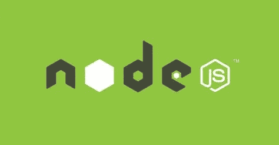

# Fi 入门

> 原文：<https://medium.com/coinmonks/getting-started-with-fi-a8eea75733db?source=collection_archive---------2----------------------->

Fi 是什么？Fi 是 Tezos 生态系统中一种看起来很简单的智能契约语言。与 javascript 在语法上相似，Fi 为更多的开发者打开了为 Tezos 编写智能合同的大门。Fi 就像它的同胞流动性一样，编译成 Tezos 的本地智能合约语言 Michelson。

如果你以前没有看过迈克尔逊，看看这个节目:

```
parameter bytes;
storage (map address (pair string (pair mutez nat)));
code{DUP;
CDR;
NIL operation;
PAIR;
SWAP;
CAR;
DUP;
PUSH nat 4;
PUSH nat 0;
SLICE;
IF_NONE{PUSH nat 100;
FAILWITH}{};
DUP;
PUSH bytes 0xc3ed8123;
COMPARE;
EQ;
IF{DROP;
DUP;
SIZE;
PUSH nat 4;
SWAP;
SUB;
DUP;
GT;
IF{}{PUSH nat 102;
FAILWITH};
ABS;
PUSH nat 4;
SLICE;
IF_NONE{PUSH nat 101;
FAILWITH}{};
UNPACK (pair string (pair mutez nat));
IF_NONE{PUSH nat 103;
FAILWITH}{};
PAIR;
SENDER;
DIP{DUP;
CAR;
SOME;
};
DIIP{
DUP;
CDDR;
};
UPDATE;
SWAP;
SET_CDDR;
CDR;
}
{DUP;
PUSH bytes 0x65a00f8a;
COMPARE;
EQ;
IF{DROP;
DUP;
SIZE;
PUSH nat 4;
SWAP;
SUB;
DUP;
GT;
IF{}{PUSH nat 102;
FAILWITH};
ABS;
PUSH nat 4;
SLICE;
IF_NONE{PUSH nat 101;
FAILWITH}{};
UNPACK (pair string nat);
IF_NONE{PUSH nat 103;
FAILWITH}{};
PAIR;
NONE (pair string (pair mutez nat));
PAIR;
SENDER;
DIP{DUP;
CDDDR;
};
GET;
IF_NONE{PUSH string "Key not found in map";
FAILWITH
}{};
SWAP;
SET_CAR;
DUP;
CDAAR;
SWAP;
SET_CAAR;
DUP;
CDADR;
SWAP;
SET_CADDR;
SENDER;
DIP{
DUP;CAR;
SOME;
};
DIIP
{
DUP;CDDDR;
};
UPDATE;
SWAP;
SET_CDDDR;
CDDR;
}
{DROP;
PUSH nat 400;
FAILWITH;
}
}
};
```

如你所见，这并不容易理解。Tezos 使用 Michelson 是有原因的，因为它为像语言这样的堆栈打开了形式验证的大门。然而，迈克尔逊没有提供大多数人熟悉的编码语法。不过我们很幸运，Fi 试图弥补这个差距！

# **所以让我们开始建造吧！**


我们将在 Fi 中构建上述相同的迈克尔逊程序，使用 Fi 的编译器将其向下编译到迈克尔逊，在 Tezos 上初始化契约，并与契约进行交互。

让我们从定义我们的程序做什么开始。上面的程序允许你存储一个人的信息，包括他们的名字、余额(mutez)和年龄。每个人由发送者地址(与合同交互的 KT1 地址的地址)映射。

让我们首先通过如下定义 person 对象来表示一个人在 Fi 中是什么。

```
struct Person(
  string name,  
  mutez balance,  // The mutez type is a positive natural number
  nat age // Natural number, think integer
);
```

现在，我们需要让特佐斯·区块链知道，我们将存储这些人的信息。

```
storage map[address=>Person] users;
```

上面的存储语句告诉 Tezos，我们打算以地图的形式按照发件人的地址来存储人员。对于任何开发人员来说，地图都应该是一个熟悉的概念，但是它本质上是存储一个可以通过键检索的值。在这种情况下，人是价值，地址是关键。

下一步是创建一种与人员存储交互的方式。让我们创建添加一个人的能力。要在 Tezos 中与智能合约进行交互，有一些东西叫做入口点。您可以将它们视为公共函数，公开给任何人调用。在 Fi 中，用于入口点的关键字是 entry。

```
entry add(Person person){
  storage.users.push(SENDER, input.person);
}
```

上面我们创建了一个名为 add 的入口点，它需要一个参数 Person 来存储。然后，我们获取存储并将人员和发送者(调用者)的地址推送到我们之前定义的映射中。

因此，现在我们可以通过添加一个人来与智能合同进行交互，如果这个人已经存在于存储中，我们还应该能够更新这个人的年龄和姓名。

```
entry update(string newName, nat newAge){
  let Person me = storage.users.get(SENDER);
  me.name = input.newName;
  me.age = input.newAge;
  storage.users.push(SENDER, me);
}
```

在这个条目中，我们做的第一件事是获取与发送者相关联的人。接下来我们要做的是给这个人分配新的名字和年龄。最后我们把这个人放回仓库。

将所有这些放在一起:

```
struct Person(
  string name,
  mutez balance,
  nat age
);storage map[address=>Person] users;entry add(Person person){
  storage.users.push(SENDER, input.person);
}entry update(string newName, nat newAge){
  let Person me = storage.users.get(SENDER);
  me.name = input.newName;
  me.age = input.newAge;
  storage.users.push(SENDER, me);
}
```

Tada！您已经在 Fi 中编写了您的第一个 Tezos 智能合约。现在怎么办？让我们当然运行它！

# **编译 Fi**

让我们从克隆 Fi 编译器开始。

```
git clone [https://github.com/TezTech/fi-compiler.git](https://github.com/TezTech/fi-compiler.git)
```

接下来你需要在你的系统上安装 NPM。一旦你安装了 NPM，你现在可以安装 fi-编译器。

```
npm i -g fi-cli
```

运行上面的 install 命令后，您会发现 fi 程序与您克隆的程序在同一个目录中。为了使用它，创建一个名为 person.fi 的文件，并存储我们之前编写的代码。然后，我们将使用 fi 程序将该文件编译成迈克尔逊。

```
fi compile person.fi
```

然后，您将看到创建了两个文件 person.fi.abi 和 person.fi.ml。现在，我们将忽略 person.fi.abi 文件，而专注于 person.fi.ml。我们稍后将回到 person.fi.abi。

现在我们已经从 Fi 编译了我们的 Michelson 程序，让我们使用您的 Tezos 节点来运行它。我们可以通过下面的命令做到这一点。

```
./tezos-client originate contract person for wallet transferring 0 from wallet running person.fi.ml --init '{Elt "tz1gH29qAVaNfv7imhPthCwpUBcqmMdLWxPG" (Pair "Jackson" (Pair 100000 23))}' --burn-cap 1.297
```

有道理吗？可能不是，或者至少不是全部。基本上，上面的命令所做的就是创建合同人(任意名称),其所有者是本地 tz1 地址，在本例中是 wallet。然后我们将 0 XTZ 从 wallet 转移到契约中(因为这个契约不需要存储 XTZ)，然后将客户端指向 person.fi.ml 文件。

最后，我们初始化与杰克逊的联系，他有 100000 mutez，23 岁。Jackson 作为存储映射中的一个值存储在中，并通过他的键地址 tz 1 GH 29 qavanfv 7 imhpthcwpubcqmdlwxpg 进行检索。

接下来，让我们看看如何以开发人员友好的方式与智能合约进行交互。

# **使用 Fi 和 NodeJs**



之前我提到了一个扩展名为*.abi 的文件。我们很快就会处理这个文件，但首先我们要看看针对 node 的 fi 编译器包的功能。

首先安装 fi 编译器模块。

```
npm install fi-compiler
```

现在让我们编写一个 NodeJS 程序来编译我们的 Fi 程序，并允许我们为我们的契约生成字节输入。

```
var fi = require("fi-compiler");  // 1.var ficode = `   // 2.
struct Person(
   string name,
   mutez balance,
   nat age
);storage map[address=>Person] users;entry add(Person person){
   storage.users.push(SENDER, input.person);
}entry update(string newName, nat newAge){
   let Person me = storage.users.get(SENDER);
   me.name = input.newName;
   me.age = input.newAge;
   storage.users.push(SENDER, me);
}
`;var compiled = fi.compile(ficode); // 3.fi.abi.load(compiled.abi); // 4.var input = {  // 5.
 person : {
    name : "Jackson",
    balance : 100000,
    age : 23
 }
};console.log(fi.abi.entry("add", input)); // 6.
```

让我们一步一步地完成这个程序:

1.  导入 fi 编译器模块。
2.  将我们的 fi 程序存储到一个名为 ficode 的变量中。
3.  编译 ficode 并将结果存储到编译的。
4.  由于编译了 fi 代码，现在编译的变量可以访问 abi。Abi 是一个助手定义，用于将类型定义为迈克尔逊原语。
5.  现在我们在一个 json 结构中创建输入值，我们将用它来调用 add 函数。
6.  然后，我们打印出一个迈克尔逊可读的字节表示，作为调用智能契约的输入。

通过运行该程序，您应该会看到以下输出:

```
0xc3ed812305070701000000074a61636b736f6e070700909c010017
```

然后，您可以使用上述字节添加 NodeJs 应用程序中定义的人员。我们将调用下面的 add 函数。


Adding People to the Contract

```
./tezos-client transfer 0 from wallet to person --arg '0xc3ed812305070701000000074a61636b736f6e070700909c010017' --burn-cap 0.002
```

正如您在上面的命令中看到的，我们再次传输 0 tez，因为没有值会存储在契约中。然后，我们用参数 add(以字节为单位)调用我们的合同人员。这里需要注意的一点是，在契约中调用入口点不是免费的，所以不幸的是，我们将不得不烧掉一些 XTZ。

最后，让我们检查合同的存储，看看我们是否成功。

```
./tezos-client get script storage for person
```

上述命令会产生以下输出:

```
{ Elt "tz1gH29qAVaNfv7imhPthCwpUBcqmMdLWxPG" (Pair "Jackson" (Pair 10000 23)) }
```

瞧啊。您已成功将一个人添加到智能合同中。

# **结论**

如果你能走到这一步，恭喜你，我知道这并不容易。幸运的是，Fi 让普通人更容易管理 Tezos 智能合约。只是回顾一下我们所学的内容:

1.  如何在 Fi 中写一个简单的智能合约？
2.  如何将 Fi 编译成迈克尔逊？
3.  如何管理你在泰佐斯的合同？
4.  如何通过 Nodejs 的 fi-compiler 模块让你的契约更易管理？
5.  如何与你的智能合约互动？

我希望你喜欢这篇教程，以后还有更多。本教程由斯蒂芬·安德鲁斯(Stephen Andrews)创建的 Tezos 公司 TezTech 赞助并创作。

# 资源

*   fi-编译器:[https://github.com/TezTech/fi-compiler](https://github.com/TezTech/fi-compiler)
*   Fi 在线编辑:【https://fi-code.com/】T2

> [在您的收件箱中直接获得最佳软件交易](https://coincodecap.com/?utm_source=coinmonks)

[](https://coincodecap.com/?utm_source=coinmonks)