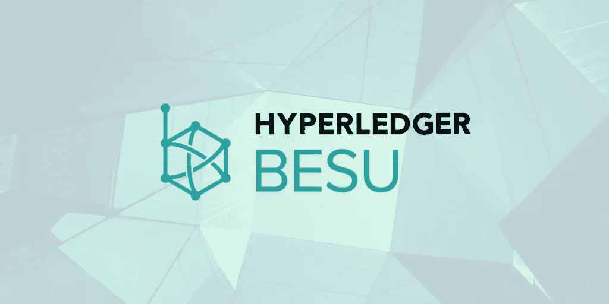
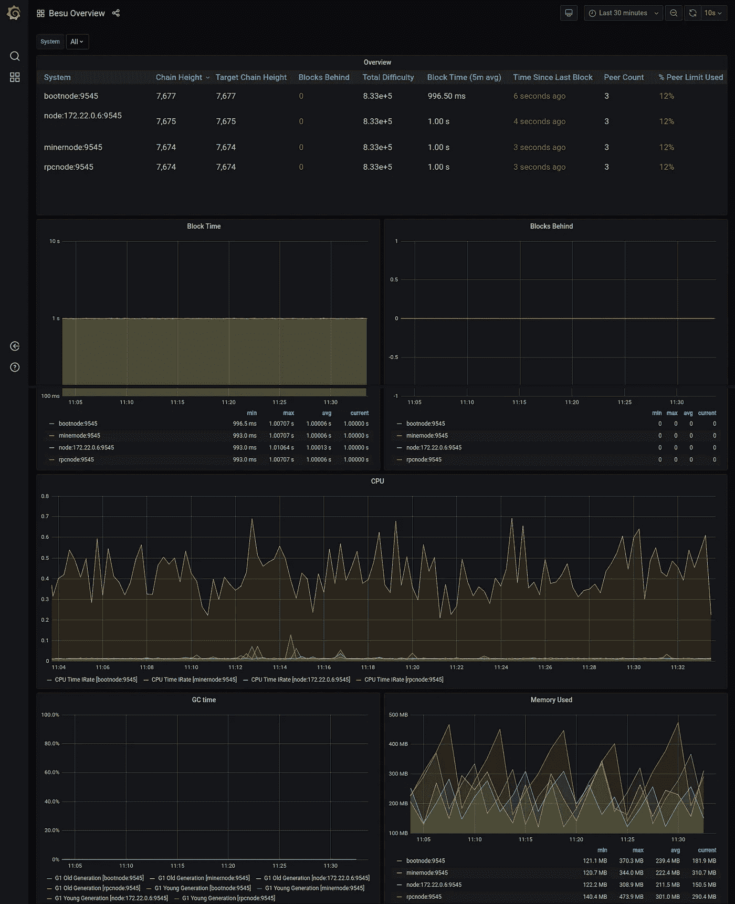
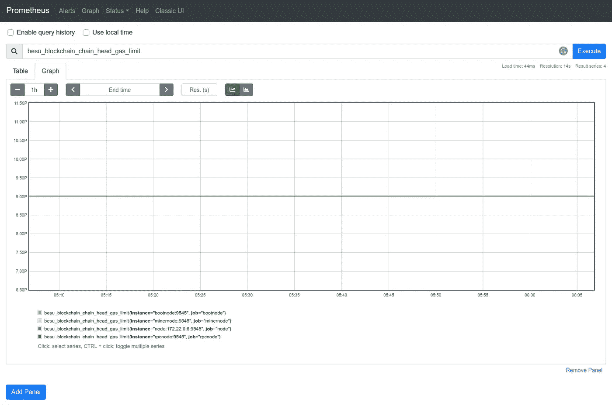
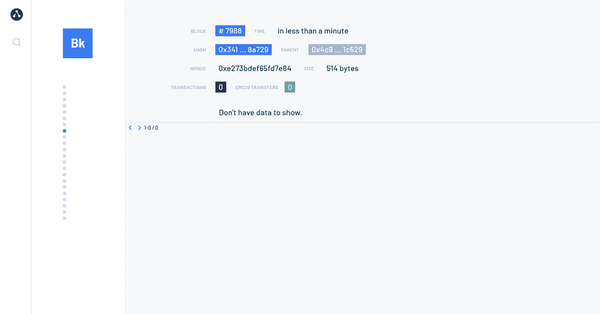

# Hyperledger Besu —入门:第 1 部分

> 原文：<https://medium.com/coinmonks/getting-started-with-hyperledger-besu-6657598ebcfe?source=collection_archive---------0----------------------->

我一直在使用各种区块链框架，并对它们进行试验。我与区块链的公共和私人许可网络合作过，发现 hyperledger besu 是我长期以来一直在寻找的以太坊的替代品。Besu 允许您建立一个私人和公共的区块链网络。

> **TL DR:** 你可以在这里找到 [**Part 2**](https://adityaajoshi.medium.com/hyperledger-besu-getting-started-part-2-a5388f14462b) 。

# 什么是 Hyperledger Besu？

Hyperledger Besu 是一个开源的以太坊客户端，在 Apache 2.0 许可下开发，用 Java 编写。它可以在以太坊公共网络或私有许可网络上运行，也可以在 Rinkeby、Ropsten 和 rli 等测试网络上运行。Hyperledger Besu 包括几个共识算法，包括 PoW、PoA 和 IBFT，并具有专门为在联盟环境中使用而设计的全面许可方案。

Hyperledger Besu 是一个基于 Java 的以太坊客户端，以前称为 Pantheon，是提交给 Hyperledger 的第一个区块链项目，可以在公共区块链上运行。Besu 代表了企业对为其应用程序构建许可和公共网络用例的日益增长的兴趣。

# **Hyperledger Besu 的特性**

*   以太坊虚拟机(EVM):EVM 是图灵完全虚拟机，允许通过以太坊区块链内的交易部署和执行智能合同。
*   共识算法:Hyperledger Besu 实现了各种共识算法，这些算法涉及事务验证、块验证和块生产(即工作证明中的挖掘)。它们包括*权威证明(IBFT 2.0，小团体)和工作证明* (Ethash)。
*   存储:Hyperledger Besu 使用 RocksDB 键值数据库在本地保存链数据。这些数据分为几个子类:
*   区块链:区块链数据由区块头组成，这些区块头形成了用于加密验证区块链状态的数据“链”；包含每个块中包含的有序事务列表的块主体，以及包含与事务执行相关的元数据(包括事务日志)的事务收据。
*   世界状态:每个块头通过 stateRoot 散列引用一个世界状态。世界状态是从地址到帐户的映射。外部拥有的帐户包含一个以太网余额，而智能合约帐户还包含可执行代码和存储。
*   P2P 网络:Hyperledger Besu 实现了以太坊的 devp2p 网络协议，用于客户端之间的通信，并为 IBFT2 提供了一个额外的子协议:
*   面向用户的 API:Hyperledger Besu 提供了基于 HTTP 和 WebSocket 协议的 mainnet Ethereum 和 EEA JSON-RPC API 以及一个 GraphQL API。
*   监控:Hyperledger Besu 允许您监控节点和网络性能。使用 Prometheus 或 debug_metrics JSON-RPC API 方法监视节点性能。使用 Block Explorer 和 EthStats Network Monitor 等工具监控网络性能。
*   隐私:Hyperledger Besu 中的隐私是指在相关方之间保持交易私密的能力。其他方无法访问交易内容、发送方或参与方列表。Besu 使用私有事务管理器来实现隐私。
*   许可:通过在网络上启用节点许可和/或帐户许可，许可网络仅允许指定的节点和帐户参与。

# besu 的监控工具

1.  Grafana 仪表板

grafana dashboard for besu network

2.普罗米修斯仪表板

Prometheus Dashboard

3.块浏览器

ethstats- blockchain explorer

我计划了许多与 besu 相关的事情，并将在接下来的文章中分享。如果你觉得这很有帮助，请点击拍手按钮。也可以关注我 [Aditya Joshi](https://medium.com/u/63332736e4ac?source=post_page-----6657598ebcfe--------------------------------) 或者 [LinkedIn](https://www.linkedin.com/in/adityajoshi12/) 。你可以在 [GitHub](https://github.com/adityajoshi12) 上找到我？如果这对你来说太社交化了，如果你想和我讨论技术，就给 adityaprakashjoshi1@gmail.com 发封邮件。

祝您愉快！

> 加入 Coinmonks [Telegram group](https://t.me/joinchat/EPmjKpNYwRMsBI4p) 并了解加密交易和投资

## 另外，阅读

*   什么是[闪贷](https://blog.coincodecap.com/what-are-flash-loans-on-ethereum)？
*   最好的[密码交易机器人](/coinmonks/crypto-trading-bot-c2ffce8acb2a) | [网格交易](https://blog.coincodecap.com/grid-trading)
*   [3 商业评论](/coinmonks/3commas-review-an-excellent-crypto-trading-bot-2020-1313a58bec92) | [Pionex 评论](/coinmonks/pionex-review-exchange-with-crypto-trading-bot-1e459d0191ea) | [Coinrule 评论](https://blog.coincodecap.com/coinrule-review-a-perfect-trading-bot)
*   [AAX 交易所评论](/coinmonks/aax-exchange-review-2021-67c5ea09330c) | [德里比特评论](/coinmonks/deribit-review-options-fees-apis-and-testnet-2ca16c4bbdb2) | [FTX 交易所评论](/coinmonks/ftx-crypto-exchange-review-53664ac1198f)
*   [n 零复习](/coinmonks/ngrave-zero-review-c465cf8307fc) | [Phemex 复习](/coinmonks/phemex-review-4cfba0b49e28) | [PrimeXBT 复习](/coinmonks/primexbt-review-88e0815be858)
*   [Bybit Exchange 审查](/coinmonks/bybit-exchange-review-dbd570019b71) | [Bityard 审查](https://blog.coincodecap.com/bityard-reivew) | [CoinSpot 审查](https://blog.coincodecap.com/coinspot-review)
*   [3 commas vs crypto hopper](/coinmonks/3commas-vs-pionex-vs-cryptohopper-best-crypto-bot-6a98d2baa203)|[赚取加密利息](/coinmonks/earn-crypto-interest-b10b810fdda3)
*   最好的比特币[硬件钱包](/coinmonks/the-best-cryptocurrency-hardware-wallets-of-2020-e28b1c124069?source=friends_link&sk=324dd9ff8556ab578d71e7ad7658ad7c) | [BitBox02 回顾](/coinmonks/bitbox02-review-your-swiss-bitcoin-hardware-wallet-c36c88fff29)
*   [莱杰 vs n rave](https://blog.coincodecap.com/ngrave-vs-ledger)|[莱杰 nano s vs x](https://blog.coincodecap.com/ledger-nano-s-vs-x)
*   [密码拷贝交易平台](/coinmonks/top-10-crypto-copy-trading-platforms-for-beginners-d0c37c7d698c) | [比特码拷贝交易](https://blog.coincodecap.com/bityard-copy-trading)
*   [Vauld 审查](https://blog.coincodecap.com/vauld-review) | [YouHodler 审查](/coinmonks/youhodler-4-easy-ways-to-make-money-98969b9689f2) | [BlockFi 审查](/coinmonks/blockfi-review-53096053c097)
*   最好的[加密税务软件](/coinmonks/best-crypto-tax-tool-for-my-money-72d4b430816b) | [硬币追踪评论](/coinmonks/cointracking-review-a-reliable-cryptocurrency-tax-software-5114e3eb5737)
*   最佳[加密借贷平台](/coinmonks/top-5-crypto-lending-platforms-in-2020-that-you-need-to-know-a1b675cec3fa) | [杠杆令牌](/coinmonks/leveraged-token-3f5257808b22)
*   [莱杰纳米 S vs 特雷佐 one vs 特雷佐 T vs 莱杰纳米 X](https://blog.coincodecap.com/ledger-nano-s-vs-trezor-one-ledger-nano-x-trezor-t)
*   [block fi vs Celsius](/coinmonks/blockfi-vs-celsius-vs-hodlnaut-8a1cc8c26630)|[Hodlnaut 回顾](https://blog.coincodecap.com/hodlnaut-review)
*   [Bitsgap 审查](/coinmonks/bitsgap-review-a-crypto-trading-bot-that-makes-easy-money-a5d88a336df2) | [四元审查](/coinmonks/quadency-review-a-crypto-trading-automation-platform-3068eaa374e1)
*   [埃利帕尔泰坦评论](/coinmonks/ellipal-titan-review-85e9071dd029) | [赛克斯斯通评论](https://blog.coincodecap.com/secux-stone-hardware-wallet-review)
*   [DEX Explorer](https://explorer.bitquery.io/ethereum/dex)|[w](https://explorer.bitquery.io/graphql)|[local bitcoins 评论](https://blog.coincodecap.com/localbitcoins-review)
*   最佳[区块链分析](https://bitquery.io/blog/best-blockchain-analysis-tools-and-software)工具| [赚比特币](https://blog.coincodecap.com/earn-bitcoin)
*   [加密套利](/coinmonks/crypto-arbitrage-guide-how-to-make-money-as-a-beginner-62bfe5c868f6)指南:新手如何赚钱
*   最佳[加密制图工具](/coinmonks/what-are-the-best-charting-platforms-for-cryptocurrency-trading-85aade584d80) | [最佳加密交易所](/coinmonks/crypto-exchange-dd2f9d6f3769)
*   [如何在印度购买比特币](https://blog.coincodecap.com/buy-bitcoin-app-india)？
*   [印度比特币交易所](/coinmonks/bitcoin-exchange-in-india-7f1fe79715c9) | [比特币储蓄账户](https://blog.coincodecap.com/bitcoin-savings-account)
*   了解比特币最好的[书籍有哪些？](/coinmonks/what-are-the-best-books-to-learn-bitcoin-409aeb9aff4b)

> [在您的收件箱中直接获得最佳软件交易](/coinmonks/newsletters/coinmonks)

