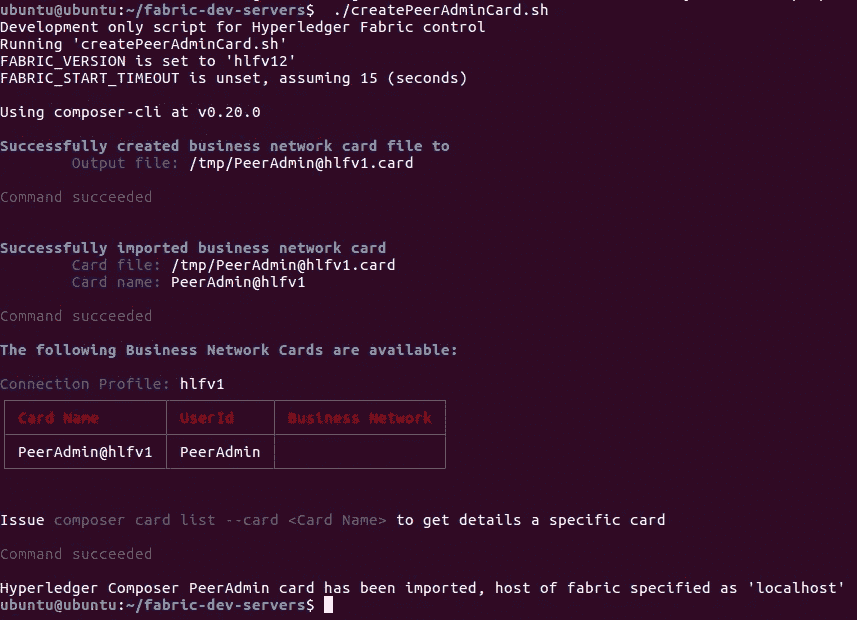

# Hyperledger Composer 入门

> 原文：<https://medium.com/coinmonks/getting-started-with-hyperledger-composer-34cb7228d44c?source=collection_archive---------2----------------------->

在第一篇文章中，我想介绍一下 Hyperledger Composer 在 Ubuntu 16.0.4 LTS 版上的安装过程。在第二部分，我们将创建一个简单的 SAP 移动应用程序，它使用 Hyperledger Composer 的 REST API。

> [发现并回顾最佳区块链软件](https://coincodecap.com)

# **什么是 Hyperledger 作曲家？**

根据他们的网站:Hyperledger Composer 是一套用于构建区块链商业网络的协作工具，使企业主和开发人员能够简单快速地创建智能合同和区块链应用程序来解决商业问题。Composer 采用 JavaScript 构建，利用 node.js、npm、CLI 和流行编辑器等现代工具，提供以业务为中心的抽象以及带有易于测试的 devops 流程的示例应用，以创建强大的区块链解决方案，推动业务需求与技术开发保持一致。

【https://www.hyperledger.org/projects/composer 


# **Hyperledger Composer 安装**

在您的主目录中，通过运行以下脚本安装必备组件:

```
cd $HOME
curl -O -k [https://hyperledger.github.io/composer/latest/prereqs-ubuntu.sh](https://hyperledger.github.io/composer/latest/prereqs-ubuntu.sh)
chmod u+x prereqs-ubuntu.sh
```

运行命令安装:

```
sudo apt-get install -y software-properties-common
```

一旦没有任何错误地完成，您将收到以下消息:


## **安装所需组件**

```
npm install -g composer-cli@0.20
npm install -g composer-rest-server@0.20
npm install -g generator-hyperledger-composer@0.20
npm install -g yo
```

## **安装游乐场**

```
npm install -g composer-playground@0.20
```

## **安装 Hyperledger Fabric**

在您的主目录下创建一个目录 fabric-dev-servers。

```
mkdir ~/fabric-dev-servers && cd ~/fabric-dev-servers
```

并运行 curl 命令下载该工具并将其解压缩。

```
curl -O [https://raw.githubusercontent.com/hyperledger/composer-tools/master/packages/fabric-dev-servers/fabric-dev-servers.tar.gz](https://raw.githubusercontent.com/hyperledger/composer-tools/master/packages/fabric-dev-servers/fabric-dev-servers.tar.gz)tar -xvf fabric-dev-servers.tar.gz
```

## **下载运行时:**

```
export FABRIC_VERSION=hlfv12
./downloadFabric.sh
```

## **第一次运行**

```
cd ~/fabric-dev-servers
 export FABRIC_VERSION=hlfv12
 ./startFabric.sh
 ./createPeerAdminCard.sh
```



要停止，请运行以下命令:

```
~/fabric-dev-servers/stopFabric.sh
```

## **启动游乐场**

要开始，请运行以下命令:

```
composer-playground
```

它会自动打开浏览器，重定向到[http://localhost:8080/log in](http://localhost:8080/login)


# **使用命令行创建新的业务网络**

在你的主文件夹下创建一个新文件夹，命名为 **blockchainDocker** 。转到该文件夹并运行以下命令:

```
yo hyperledger-composer:businessnetwork
```

填写业务网络名称:**教程-网络**，命名空间: **org.basic.server** 剩下的就看你自己了。


成功后，您将看到新文件夹**教程-网络**被创建。


转到文件夹 **tutorial-network/lib** ，用以下内容更新 **logic.js** :

用以下内容更新**教程-网络/模型**中的 **org.basic.server.cto** :

我们将保持 **permissions.acl** 文件不变。

# 生成业务网络档案

在我们定义了业务网络之后，必须将它打包到一个可部署的业务网络档案中。bna)文件。转到 **tutorial-network** 文件夹并运行这个命令。

```
composer archive create -t dir -n .
```


# 部署业务网络存档

运行以下命令从 t **utorial-network** 目录安装业务网络:

```
composer network install --card PeerAdmin@hlfv1 --archiveFile tutorial-network@0.0.1.bna
```


要启动业务网络，请运行以下命令:

```
composer network start --networkName tutorial-network --networkVersion 0.0.1 --networkAdmin admin --networkAdminEnrollSecret adminpw --card PeerAdmin@hlfv1 --file networkadmin.card
```


要将网络管理员身份作为可用的业务网卡导入，请运行以下命令:

```
composer card import --file networkadmin.card
```


一旦导入，你就会在游乐场看到卡:[http://localhost:8080/log in](http://localhost:8080/login)


要检查业务网络是否已成功部署，请运行以下命令来 ping 网络:

```
composer network ping --card admin@tutorial-network
```


## **测试网络**

我们将通过填充资产 **DataCenterId** 的先决条件信息来测试网络。本例中的参与者**人员**未被使用。一旦我们填充了数据中心 ID，我们就可以根据特定的数据中心 ID 和服务器参数(如安装了多少内存、安装了多少 CPU 等)提交事务。

*   转到[http://localhost:8080/log in](http://localhost:8080/login)
*   点击**立即连接**连接网络


*   转到**测试**选项卡。
*   填充先决条件信息。在**参与者**下，选择**人员**，点击**新增参与者**。


*   创建完成后，您将在**参与者**下看到注册表条目。


*   创建资产 **DataCenterId** (例如 **DC1** )。


*   向一个特定的数据中心提交一个事务，在这个例子中是我们刚刚创建的数据中心 Id **DC1** 。


*   如果我们将事务提交给不存在的数据中心 Id，它将抛出一个错误消息。在下面的示例中，数据中心 Id **DC2** 尚未定义，我们将收到一条错误消息。


*   成功提交交易后，您将看到服务器参数信息被填充到您提交的数据中心 Id 下(在本例中为 **DC1** )。


*   要查看交易日志，选择**所有交易。**点击**查看记录**查看所有详细日志交易。


## **休息服务器**

我们最不想构建的是 REST 服务器。这样，我们就可以公开我们创建的资产、参与者和交易，这样就可以通过客户端应用程序(如 web 或移动应用程序)来使用它们。

为此，我们将通过以下步骤创建一个 docker 容器:

*   为 MongoDB 安装环回连接器:

```
npm install -g loopback-connector-mongodb
```

*   确保你能 ping 通**教程-网络**。运行以下命令:

```
composer network ping -c admin@tutorial-network
```


*   启动一个名为 **mongo** 的 docker 实例。这个实例将用于为 REST 服务器保存所有关于已验证用户及其钱包的信息。

```
docker run -d --name mongo --network composer_default -p 27017:27017 mongo
```

*   在新文件夹下新建一个名为 **Dockerfile** 的文件，内容如下:

```
FROM hyperledger/composer-rest-server
RUN npm install --production loopback-connector-mongodb passport-github && \
    npm cache clean --force && \
    ln -s node_modules .node_modules
```


*   运行以下命令:

```
docker build -t myorg/my-composer-rest-server .
```

*   在同一文件夹中创建一个新文件 **envvars.txt** ，内容如下:

```
COMPOSER_CARD=admin@tutorial-network
COMPOSER_NAMESPACES=never
COMPOSER_AUTHENTICATION=true
COMPOSER_MULTIUSER=false
COMPOSER_PROVIDERS='{
    "github": {
        "provider": "github",
        "module": "passport-github",
        "clientID": "REPLACE_WITH_CLIENT_ID",
        "clientSecret": "REPLACE_WITH_CLIENT_SECRET",
        "authPath": "/auth/github",
        "callbackURL": "/auth/github/callback",
        "successRedirect": "/",
        "failureRedirect": "/"
    }
}'
COMPOSER_DATASOURCES='{
    "db": {
        "name": "db",
        "connector": "mongodb",
        "host": "mongo"
    }
}'
```

*   运行以下命令将其加载到环境变量中:

```
source envvars.txt
```

*   我们需要更新 **~/上的 localhost 字符串。composer/cards/admin @ tutorial-network/connection . JSON**。

```
sed -e ‘s/localhost:7051/peer0.org1.example.com:7051/’ -e ‘s/localhost:7053/peer0.org1.example.com:7053/’ -e ‘s/localhost:7054/ca.org1.example.com:7054/’ -e ‘s/localhost:7050/orderer.example.com:7050/’ < $HOME/.composer/cards/admin@tutorial-network/connection.json > /tmp/connection.json && cp -p /tmp/connection.json $HOME/.composer/cards/admin@tutorial-network/
```

*   运行 docker:

```
docker run \
    -d \
    -e COMPOSER_CARD=${COMPOSER_CARD} \
    -e COMPOSER_NAMESPACES=${COMPOSER_NAMESPACES} \
    -e COMPOSER_AUTHENTICATION=${COMPOSER_AUTHENTICATION} \
    -e COMPOSER_MULTIUSER=${COMPOSER_MULTIUSER} \
    -e COMPOSER_PROVIDERS="${COMPOSER_PROVIDERS}" \
    -e COMPOSER_DATASOURCES="${COMPOSER_DATASOURCES}" \
    -v ~/.composer:/home/composer/.composer \
    --name rest \
    --network composer_default \
    -p 3000:3000 \
    myorg/my-composer-rest-server
```

*   检查服务器是否运行正常，你会看到如下截图所示的信息。

```
docker logs -f rest
```


*   打开网络浏览器并转到以下 URL:[http://localhost:3000/auth/github](http://localhost:3000/auth/github)
*   点击**授权**。


*   如果没有错误，您将看到下面的页面，其中包含访问令牌信息。


*   选择**服务器:一个名为**的事务，点击**发布**。用下面的数据填充并点击**试试看！**。

```
{
 “$class”: “org.basic.server.Server”,
 “Active_Memory”: 4,
 “HW_Model”: “Dell”,
 “Installed_CPUs”: 2,
 “Installed_RAM”: 4,
 “Server_Model”: “Model A”,
 “datacenterid”: “DC1”
}
```


*   现在选择**获取**并点击**尝试一下！**。您将看到您发布的数据。


请继续关注第 2 部分，我们将构建一个使用 REST API 的 SAP 移动应用程序(SAPUI5)。感谢您阅读我的帖子。

> [直接在您的收件箱中获得最佳软件交易](https://coincodecap.com/?utm_source=coinmonks)

[](https://coincodecap.com/?utm_source=coinmonks)