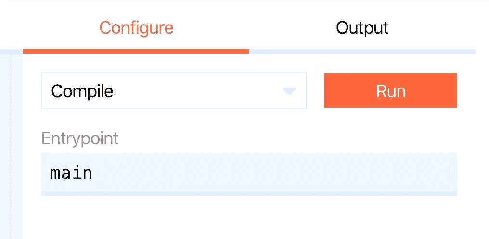
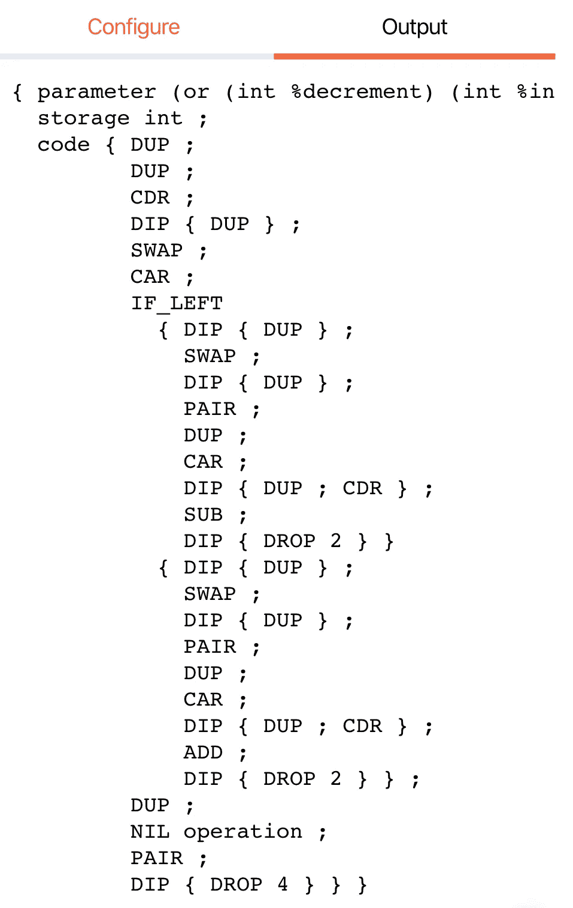

# Ligo 入门

> 原文：<https://medium.com/coinmonks/getting-started-with-ligo-13ea2c4e844e?source=collection_archive---------2----------------------->

## 使用 Ligo 为 Tezos 区块链创建智能合约(第 1 部分)


LigoLang

在我写完第一篇关于流动性的文章后，我在 Twitter 上进行了一次非常有趣的交流。其中，据我所知，Liquidity 正在远离 Tezos，转而致力于 Dune network，Tezos 平台上语言的未来可能不确定。

由于我想为我的编程(和我的一般知识)保留一种函数式语言，我看了一下 Tezos 的另一种流行的函数式语言，LigoLang(或 Ligo)。这不是我的第一选择，因为在线编辑器中没有契约的例子，除了我们将在本教程中讨论的“简单存储”的例子。网站上还有一个教程，对于精通 OCaml 的人来说可能不错，但对我来说太模糊了。

于是我决定在探索 Tezos 开发生态系统的过程中采用 Ligo，并写一篇关于它的基础教程，这将帮助我更好地理解这种语言，并且(我希望)帮助其他可能遇到同样障碍的人。和 Liquidity 一样，我会选择 ReasonML 语法，我相信对于像我这样来自 JavaScript 或 Solidity 的开发者来说，它看起来更容易。

我们将在 Ligo 网站的编辑器中写下[这个合同](https://ide.ligolang.org/p/QlLBsoG1-gF-zQYiKeVNlQ)。契约增加和减少存储中的变量。这是一个很好的例子，因为它将介绍用 Ligo 编写智能合同的细节。

# 合同的结构

## 仓库

区块链上的每个[智能契约](https://blog.coincodecap.com/tag/smart-contact/)都包含一个存储器，它是保存契约状态的内存的一部分。Ligo 也不例外。存储被声明为与您选择的类型(整数、字符串、记录等)相等的单一类型。)
在这种情况下，我们将创建类型**存储**，它将接收类型 **int** 的值:

```
**type storage = int;**
```

## 伪入口点

Ligo 中的契约有一个特殊性，即只有一个入口点，即主函数。每个传入的事务都将与一个模式进行匹配，并被重定向到匹配函数。
为了让它工作，我们必须创建一个定义伪多入口点操作的变体。*变量*是包含不同案例的类型，其值将根据案例而变化。这是语言的一个非常强大的方面。这是我们合同的例子:

```
type storage = int;**type action =
| Increment(int)
| Decrement(int);**
```

正如你所看到的，我们声明了一个新的类型叫做“动作”。它可以有两个值:可以递增并接收一个整数，也可以递减并接收一个整数。

## 这些功能

现在让我们为伪入口点编写函数。我们需要两个函数:一个增加状态，一个减少状态。它们必须接收两个参数:第一个是当前存储，第二个是要加到或减去存储的值。请注意，这是 Ligo 中的一般模式:您将存储传递给函数，更新它并返回它，没有从函数内部访问[智能契约](https://blog.coincodecap.com/tag/smart-contact/)存储。Ligo 文档称它们为*【a】*和*【b】*，但是为了更清楚起见，我们称它们为*【存储】*和*【计数】*:

```
type storage = int;type action =
| Increment(int)
| Decrement(int);**let add = ((storage, count): (int, int)): int => storage + count;
let sub = ((storage, count): (int, int)): int => storage - count;**
```

如果您不熟悉这个语法，让我们来看看函数:

1.  **let add** :使用“let”关键字声明函数，后跟函数名(add)。
2.  **((storage，count): (int，int))** :这个块表示我们需要两个参数(实际上是一个[元组](https://ligolang.org/docs/next/language-basics/sets-lists-tuples/#tuples)，稍后会详细介绍)，存储空间和要对其加减的数字，两个参数都是整数。
3.  **: int** :这部分函数表示我们将返回一个整数，这将是我们新的存储。
4.  **存储+计数/存储—计数**:将“计数”变量加或减到存储中并返回。请注意，不需要显式返回。

## 真正的入口点(主函数)

现在是我们写合同的真正切入点的时候了:

```
type storage = int;type action =
| Increment(int)
| Decrement(int);let add = ((storage, count): (int, int)): int => storage + count;
let sub = ((storage, count): (int, int)): int => storage - count;**let main = ((p,s): (action, storage)) => {
    let storage = 
        switch (p) {
            | Increment(n) => add((s, n))
            | Decrement(n) => sub((s, n))
        };
    ([]: list(operation), storage);
};**
```

这实际上比看起来容易！

Ligo 中的一个[智能契约](https://blog.coincodecap.com/tag/smart-contact/)必须包含一个 **main** 函数，这将是“真正的”入口点。这个函数有两个参数:随事务发送的参数和存储。在本例中，我们将当前存储称为“s ”,新存储称为“storage ”,以避免混淆。(action，storage)部分表示第一个参数的类型是 action(我们前面声明的变体)，第二个参数的类型是“storage”(智能协定存储)。

接下来，我们将使用新值更新存储。然后，我们将在名为“storage”(我们的新存储)的变量中获得新值。下一行是奇迹发生的地方！

## 开关

描述 Ligo(以及一般的 ML 语言)中所有复杂的模式匹配有点太长了，超出了本文的范围。如果您不熟悉这个语法，这里有一个简单的方法来理解它:您发送的参数与不同的选项匹配，并且必须是可用选项之一。这使得 JavaScript 中不可能有未定义的值。
在本例中，“p”被传递给开关，并与两个选项“增量”和“减量”匹配。这是唯一的选择。除此之外，契约将确保传递的值是之前在“action”变量中声明的类型(在本例中是一个整数)。如果参数与其中一个选项匹配，将使用适当的参数调用箭头右侧的关联函数。
比如调用“Increment”并传递“2”，就会调用“add”函数，将“2”添加到存储中。

## 退回的存储

main 函数返回两个值:操作列表(在本例中是两个空方括号，类型为“list(operation)”)和新存储(由开关的一个选项返回的值)。在事务结束时，新的存储被保存，假设一切都按计划进行。

## 编译成迈克尔逊

现在，我们必须确保契约能够正常工作和编译。使用提供的接口很容易做到这一点。在右侧，您会看到一个包含多个选项的栏:



Compiler step

默认情况下，应该已经选择了“编译”选项，您只需单击“运行”按钮。您将获得以下代码:



如果是这样的话，恭喜你！你编写并编译了你的第一个 Ligo 代码🥳

# 丰富

现在让我们改进合同！

假设我们希望保存一个作为参数传递的名称。让我们列一个清单，列出我们必须做出的改变:

*   我们必须更改存储类型，因为我们现在必须保存两种不同类型(整数和字符串)的两个不同值。
*   我们必须在我们的*动作*变体中添加一个新选项来分派正确的函数并保存名称。
*   我们必须编写函数来将名称保存在存储器中。
*   我们必须把我们的选项加到主开关上。

让我们一步一步来:

对于存储，我们现在使用一个名为“[记录](https://ligolang.org/docs/next/language-basics/maps-records/)的类型，它允许我们存储不同类型的数据:“计数”字段将保存我们递增和递减的整数，而“名称”字段将保存我们发送的字符串:

```
**type storage = {
  count: int,
  name: string
};**
```

我们现在添加一个“SaveName”选项，该选项接受一个指向契约的伪入口点的字符串:

```
type storage = {
  count: int,
  name: string
};**type action =
  | Increment(int)
  | Decrement(int)
  | SaveName(string);**
```

现在，让我们(重新)编写更新状态的函数。这里有两件事需要考虑:首先，我们必须从头开始编写一个新函数来存储名称，其次，我们必须更新前面的函数，这些函数当前为存储返回一个整数，而不是一条记录。

新函数的语法非常相似:我们传递两个参数，当前存储和名称，并返回新的存储:

```
let saveName = 
  ((s, name): (storage, string)): storage => {...s, name: name};
```

如果你懂 JavaScript，语法看起来一定很熟悉！(这也是我认为 ReasonLigo 是一个很棒的选择的原因之一。)该函数期望元组具有两个*组件*(或值)，一个是“存储”类型，一个是“字符串”类型。为了清楚起见，我将实际的存储称为“s ”,以免与它的类型(也是存储)混淆。
该函数返回存储类型的值。Reason 语法允许非常方便的快捷方式来更新和返回记录:首先，[扩展操作符](https://reasonml.github.io/docs/en/record#immutable-update)将记录的所有字段复制到一个新记录中，然后，[双关](https://reasonml.github.io/docs/en/record#syntax-shorthand)技术允许我们只写与字段名称匹配的值的名称(即" *name* "而不是" *name: name* ")。

接下来，我们可以更新前面的两个函数:

```
type storage = {
  count: int,
  name: string
};type action =
| Increment(int)
| Decrement(int)
| SaveName(string);**let add = 
  ((s, count): (storage, int)): storage => 
    {...s, count: s.count + count};
let sub = 
  ((s, count): (storage, int)): storage => 
    {...s, count: s.count - count};
let saveName = 
((s, name): (storage, string)): storage => {...s, name: name};**
```

快到了！现在唯一缺少的是更新主函数的开关，契约的实际入口点:

```
type storage = {
  count: int,
  name: string
};type action =
| Increment(int)
| Decrement(int)
| SaveName(string);let add = 
  ((s, count): (storage, int)): storage => 
    {...s, count: s.count + count};
let sub = 
  ((s, count): (storage, int)): storage => 
    {...s, count: s.count - count};
let saveName = 
((s, name): (storage, string)): storage => {...s, name: name};**let main = ((p,s): (action, storage)) => {
  let storage =
    switch (p) {
    | Increment(n) => add((s, n))
    | Decrement(n) => sub((s, n))
    | SaveName(n) => saveName((s, n))
  };
  ([]: list(operation), storage);
};**
```

在这里！现在让我们确保它能正确编译。选择右栏中的“编译”选项并点击“运行”，如果你得到以下代码，你做到了！

```
{ parameter (or (or (int %decrement) (int %increment)) (string %saveName)) ;
  storage (pair (int %count) (string %name)) ;
  code { DUP ;
         DUP ;
         CDR ;
         DIP { DUP } ;
         SWAP ;
         CAR ;
         IF_LEFT
           { DUP ;
             IF_LEFT
               { DIP 2 { DUP } ;
                 DIG 2 ;
                 DIP { DUP } ;
                 PAIR ;
                 DUP ;
                 CAR ;
                 DUP ;
                 DIP { DUP } ;
                 SWAP ;
                 CAR ;
                 DIP { DIP 2 { DUP } ; DIG 2 ; CDR } ;
                 SUB ;
                 SWAP ;
                 CDR ;
                 SWAP ;
                 PAIR ;
                 DIP { DROP 3 } }
               { DIP 2 { DUP } ;
                 DIG 2 ;
                 DIP { DUP } ;
                 PAIR ;
                 DUP ;
                 CAR ;
                 DUP ;
                 DIP { DUP } ;
                 SWAP ;
                 CAR ;
                 DIP { DIP 2 { DUP } ; DIG 2 ; CDR } ;
                 ADD ;
                 SWAP ;
                 CDR ;
                 SWAP ;
                 PAIR ;
                 DIP { DROP 3 } } ;
             DIP { DROP } }
           { DIP { DUP } ;
             SWAP ;
             DIP { DUP } ;
             PAIR ;
             DUP ;
             CAR ;
             DIP { DUP } ;
             SWAP ;
             CDR ;
             SWAP ;
             CAR ;
             PAIR ;
             DIP { DROP 2 } } ;
         DUP ;
         NIL operation ;
         PAIR ;
         DIP { DROP 4 } } }
```

如果你对代码有任何问题，或者它不适合你，不要犹豫，在评论中提出问题，我很乐意帮助你😊
你也可以通过点击链接直接在 Ligo 在线编辑器中查看完整的代码[。](https://ide.ligolang.org/p/O6URqlH2e7JmawDRaBfDxA)

这篇文章可以在我的博客[分散发展](https://decentradev.netlify.com/#/post/ligo-lesson-1)上找到(文章被托管在 IPFS 上)。

在下一篇文章中，我们将使用在线编辑器，并测试我们刚刚编写的代码。
在以后的文章中，我们将开始深入 Ligo，学习高级概念来编写更复杂的智能合约。

回头见！！

> [在此阅读第二部分](/coinmonks/getting-started-with-ligo-part-2-fb0c000e40c6)
> 
> [直接在您的收件箱中获得最佳软件交易](https://coincodecap.com/?utm_source=coinmonks)

[](https://coincodecap.com/?utm_source=coinmonks)