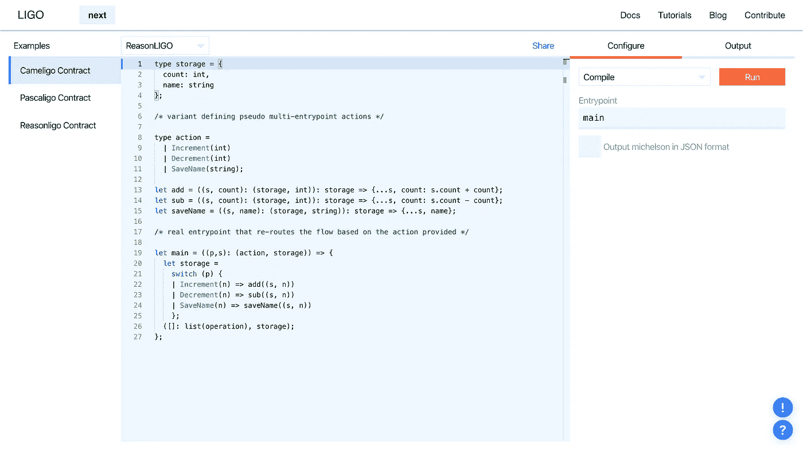
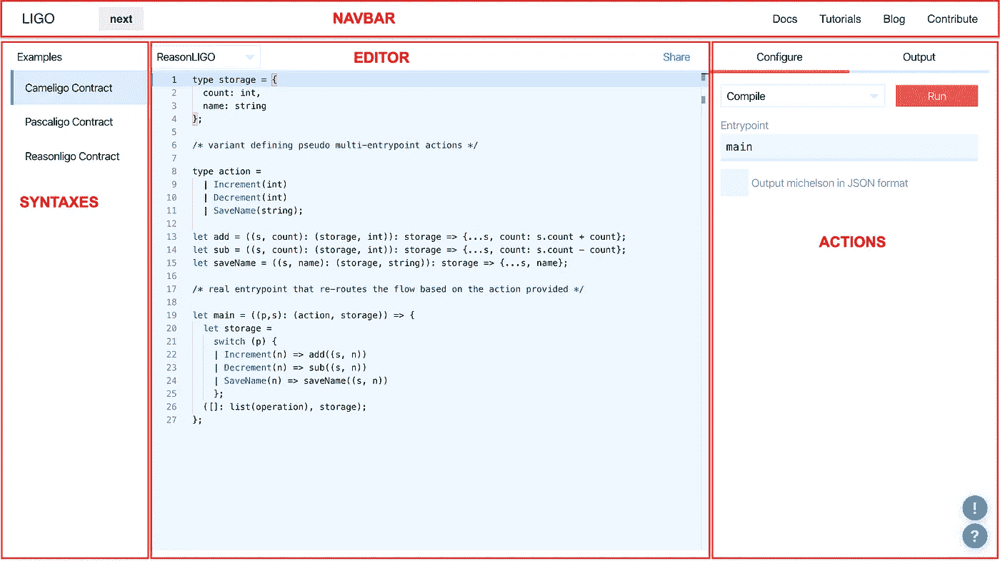
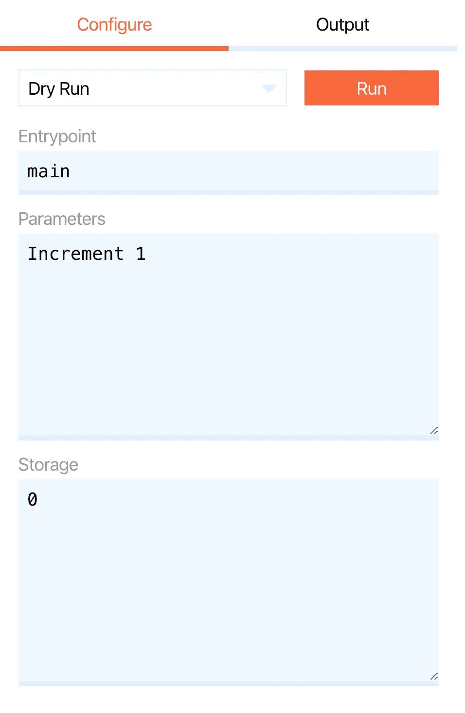
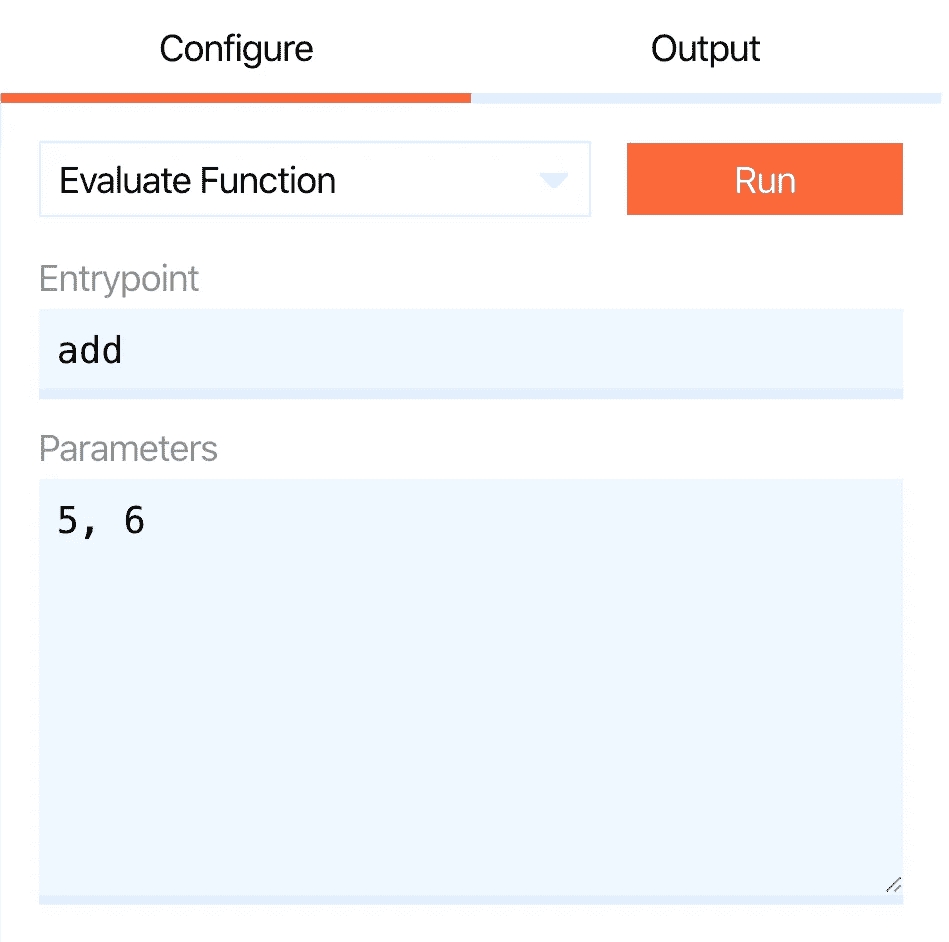

# Ligo 入门(第 2 部分)

> 原文：<https://medium.com/coinmonks/getting-started-with-ligo-part-2-fb0c000e40c6?source=collection_archive---------2----------------------->

## 使用 Ligo 为 Tezos 区块链创建智能合约

(这是关于 Ligolang 的系列教程的第 2 部分，LIGO lang 是 Tezos 的一种智能契约语言。你可以在这里 *找到 part 1* [*。)*](/@claudebarde/getting-started-with-ligo-13ea2c4e844e)

在本系列的第 1 部分中，我们基于打开[在线编辑器](https://ide.ligolang.org/)时提供的契约创建了一个简单的契约。您可以通过[链接](https://ide.ligolang.org/p/DzQ592x-s-IBBzGzWtV4Tw)轻松访问我们创建的合同。

编写智能合同的一大部分是测试它们，以验证它们是否按计划运行。在线 IDE 提供了一些功能可以帮助我们实现它，这将是本教程的主题。在按下某些按钮之前，我们将先看看不同的功能:)

# 界面

无论您是从头开始输入第 1 部分的代码，还是点击上面的链接，您都应该看到一个看起来或多或少像下面这样的界面(截至 2020 年 2 月):

Screenshot of Ligo online IDE

IDE 可以大致分为 4 个部分:

*   **导航条区域**:现在这不是很有用，但是当你写代码的时候，如果需要的话，你可以找到一个快速访问文档的链接。
*   **语法区** : Ligo 支持三种不同的语法，Cameligo(受 OCaml 的启发，我们将在未来的教程中更好地了解它)、Pascal(我们很可能不会在这里谈论它)和 ReasonML(这是我们在这里使用的一个，在我看来，它是来自 JavaScript/Solidity 的程序员的一个很好的入口)。注意，当加载页面时，默认选择“Cameligo”，尽管我们使用的是 Reasonligo。在这种情况下，只需手动将其切换到 Reasonligo。
*   编辑区:这是你写代码的地方！有一个简单但有用的高亮语法，自动缩进，但是不支持你输入的语法错误(Ligo 团队，如果你读了这篇文章！)
*   **“actions”区域**:这是我如何调用 IDE 的区域，在这里你可以编译、部署、模拟运行和评估你的代码的函数和值。在本教程中，我们将使用这个区域来测试我们的[智能合约](https://blog.coincodecap.com/tag/smart-contact/)。

现在，我们来看一下“Configure”选项卡下拉菜单中给出的不同选项。

## 编译智能合同

既然我们的智能契约已经准备好了，我们必须首先确保它能够正确编译。编译过程将我们的 Ligo 代码转换成迈克尔逊语言，这种语言实际上是用来在 Tezos [区块链](https://blog.coincodecap.com/tag/blockchain/)上运行智能合约的。
大多数时候，你不打算更改入口点的名称而使用 *main* ，所以你不必在“entry point”字段中更改它。你只需要按下“运行”，然后等几秒钟，编译器就会吐出迈克尔逊代码。如果您的代码有任何问题，此时您将会收到一条错误消息。一旦你的代码被编译并且你看到了迈克尔逊代码，你可以使用“输出”栏顶部的两个图标选择复制它或者下载到一个文本文件中。

您不会对这段代码编译成功感到惊讶🙂

## 部署智能合同

我们在这里不打算使用这个函数，因为我们的目标只是在本地测试智能合约，只需知道它会将合约部署到 Babylon 网络。

## 试运行智能合同

这就是我们将要测试智能合约的地方！模拟运行允许您测试契约的不同伪入口点，就好像契约已经部署并且您正在发送一个事务一样。选择“模拟运行”后，屏幕右侧的面板应如下所示:

Dry Run

正如您所看到的，有 3 个不同的字段:“ *Entrypoint* ”字段必须包含契约的真正入口点，也就是我们例子中的 main 函数；“ *Parameters* ”字段接收您想要测试的伪入口点的名称及其参数(如果有的话)；“*存储*”字段获取当前的存储值。

虽然字段中的默认参数是正确的，但是存储是错误的，因为我们用记录替换了默认的整数。您现在可以通过键入:`{count: 0, name: ""}`(即您可能会在部署时为您的合同提供的默认存储)来修复它。

你现在可以点击“运行”。等待几秒钟后，您应该在“Output”列中看到下面的结果:`(list[] , record[count->1, name->""])`。你可能猜到了它的意思，这是主函数的返回值，一个操作列表和新的存储。您可以看到*计数*值已经增加到 1，而*名称*值保持不变。还需要注意的是，IDE 不会将新的存储空间保存在内存中，它将始终使用您在“存储空间”字段中提供的存储空间值进行模拟运行。

现在让我们在存储中保存一个名称！我相信你现在知道怎么做了😏
我们将从“参数”字段中删除`Increment 1`,并添加`SaveName "John"`。不要忘记将值放在双引号中，因为 Ligo 编译器在这里需要一个字符串。您可以使用相同的值保留默认存储，并试运行合同。如果一切顺利，你应该去看看`(list[] , record[count->0, name->"John"])`。

这是在在线编辑器中测试智能合约的一个非常基本的方法，以验证您获得的值是您期望的值。这是一个非常简单的智能合约，因此测试也很简单，但是我们将在以后的教程中使用它来测试更复杂的智能合约。

## 评估功能

如果您只想测试分配给伪入口点的其中一个函数，而不是整个智能协定，那么这个选项会很有用。选择它后，您应该会看到以下界面:

Evaluating a function

我们在代码中保留了 *add* 函数，所以我们不必改变入口点，但是，参数现在不同了，因为我们期望存储一个记录。删除“参数”字段中的默认值，并输入`({count:0,name:""}, 6)`。这将传递一个带有默认值和值 6 的存储记录。点击“运行”，几秒钟后，你会在“输出”栏看到:`record[count -> 6 , name -> ""]`。事实上，我们期待字段计数等于 6 的记录！

您还可以测试“sub”和“saveName”函数，以验证存储是否正确更新。

# 结论

您现在对 Ligo 在线编辑器的界面工作方式有了更好的理解。该接口对于编写合同、将合同编译到 Michelson、测试合同和部署合同非常有用。

在本教程的下一部分，我们将开始深入研究 Ligo，并编写一个处理不同类型的数据和 tez 的真实世界的契约！

敬请期待！

这篇文章也可以在我的 IPFS 博客[上找到，地址是](https://decentradev.netlify.com/#/post/ligo-lesson-2)。

> [在此阅读第 3 部分](/coinmonks/getting-started-with-ligo-part-3-c1c4a403c5e4)
> 
> [直接在您的收件箱中获得最佳软件交易](https://coincodecap.com/?utm_source=coinmonks)

