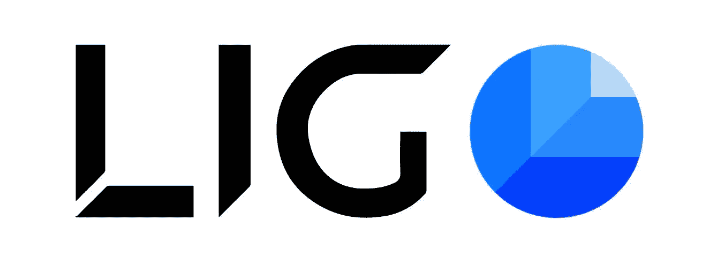
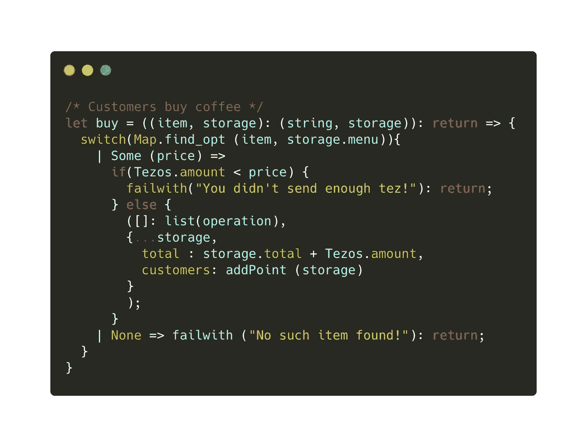
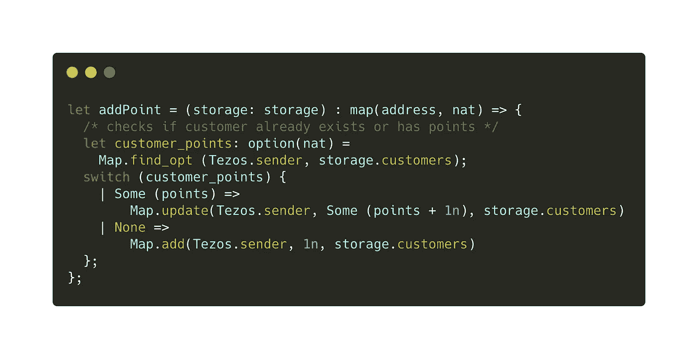
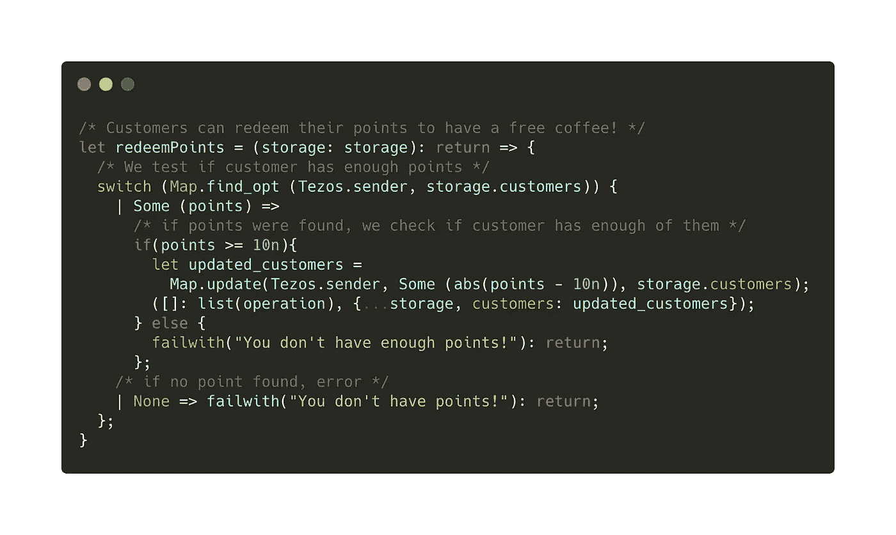
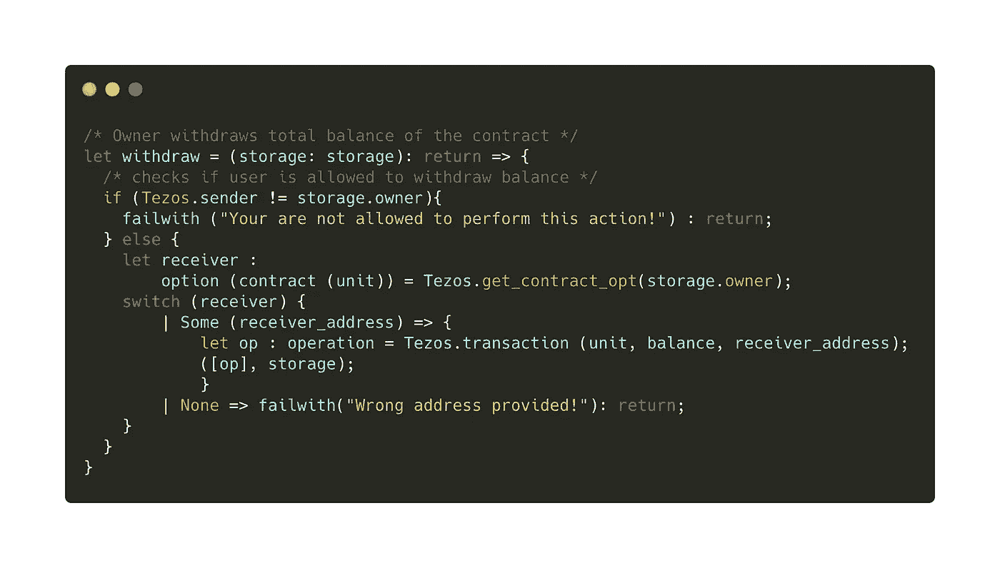

# Ligo 入门(第 3 部分)

> 原文：<https://medium.com/coinmonks/getting-started-with-ligo-part-3-c1c4a403c5e4?source=collection_archive---------1----------------------->

## 使用 Ligo 为 Tezos 区块链创建智能合约



(这是关于 Ligolang 的系列教程的第 3 部分，LIGO lang 是 Tezos 的一种智能契约语言。你可以在这里找到第一部分[](/@claudebarde/getting-started-with-ligo-13ea2c4e844e)**和第二部分*[](/@claudebarde/getting-started-with-ligo-part-2-fb0c000e40c6)**。这篇文章也可以在我的 IPFS 博客* [*上找到，这里*](https://decentradev.netlify.com/#/post/ligo-lesson-3) *)***

**现在是开始编写“严肃的”智能合同的时候了！增加或减少一个整数是可以的，但是现实世界中可以处理用户事务的智能契约怎么办？这将是本教程的主题。**

**两年前，当我开始学习以太坊开发的 Solidity 时，我在寻找一些简单的代码，但有足够的深度来了解我对讲座概念的理解程度。可能是因为有了[以太坊](https://blog.coincodecap.com/tag/ethereum/)或[泰佐斯](/coinmonks/search?q=tezos)，我对区块链在普通人日常生活中的应用以及它如何改变我们的日常生活产生了浓厚的兴趣。我希望我能去一家咖啡馆，用乙醚或咖啡付账，买我最喜欢的饮料。这就是我如何决定尝试创建一个智能合同来处理这种交易的原因。**

**我们将一起创建一个智能合同，允许顾客为他们的咖啡付款，同时获得忠诚度积分，他们可以在以后兑换免费饮料。智能合同还将允许所有者在他们认为合适的任何时候提取收入。这将是介绍 Ligo 关键概念的绝佳机会，也是智能合约开发的绝佳机会。如果您想查看最终结果，可以从这个地址获得完整的智能合同[。和之前的教程一样，你只需要 Ligo 团队提供的](https://gitlab.com/claudebarde/ligolang-contracts/-/blob/master/personal-contracts/point-of-sale.religo)[在线 IDE](https://ide.ligolang.org/) 就可以跟随了。我将使用代码截图，因为语法突出显示使理解不同部分更容易，但是，你可以在上面的链接中参考完整的代码。**

**还值得注意的是，尽管智能合约如预期的那样工作，但它是为了学习 Ligo 语言的关键特性而创建的，并且可能包括或排除在现实世界应用程序中使用更安全的部分。**

**开始吧！**

# **创建智能合同的结构**

**每一份智能合同的第一步都是考虑我们想要达到的目标。在这种情况下，我们希望客户能够用 tezzies 支付他们的咖啡，同时积累积分，兑换这些积分以获得免费饮料，我们希望合同的所有者能够提取合同的余额。这是 3 个不同的操作，因此需要 3 个不同的入口点:**

```
****type action =
| RedeemPoints
| Buy (string)
| Withdraw****
```

**入口点的名称不言自明，**兑换积分**允许顾客兑换积分，**提取积分**允许店主提取余额，**购买积分**允许顾客购买咖啡。注意, **Buy** 入口点需要一个字符串，它是所选饮料的名称。**

**现在让我们创建存储。我们希望在智能合约中保存 4 种不同的东西:一个菜单，我们可以使用它来比较客户的选择和他们发送的金额，并验证他们发送了足够的 tezzies，一个客户列表和他们的积分，以验证他们是否有足够的积分来兑换它们，一个总额，它将跟踪所有发送到智能合约的金额和[智能合约](https://blog.coincodecap.com/tag/smart-contact/)所有者的地址。这将看起来像这样:**

```
**type action =
| RedeemPoints
| Buy (string)
| Withdraw**type storage = {
  menu: map (string, tez),
  customers: map(address, nat),
  total: tez,
  owner: address
}****
```

**像在前面的教程中一样，存储是一个[记录](https://ligolang.org/docs/next/language-basics/maps-records/#records)，您只需打开一组花括号并添加键的名称、冒号和字段的预期类型来声明它。**

**让我们检查一下我们拥有的不同字段:**

1.  ***菜单*:该菜单将保存一个咖啡及其相关价格的列表，我们将使用一个名为“ *map* 的类型来保存它们。根据[文档](https://ligolang.org/docs/next/language-basics/maps-records/#maps):“映射是一种将相同类型的键关联到相同类型的值的数据结构。”想象一个只有两列的表。左边一栏是我们出售的咖啡。在右边一栏，是咖啡的价格。当声明一个映射时，你还必须告诉编译器你要把什么类型的值放在那里。对于咖啡的名字，我们将使用一个字符串(例如一个单词或一个句子的字符序列)，咖啡的价格将以 tez(Tezos[区块链](https://blog.coincodecap.com/tag/blockchain/)的本地[加密货币](https://blog.coincodecap.com/tag/cryptocurrency/)表示)，因此在这种情况下，我们将写`map (string, tez)`。**
2.  ***客户*:有积分的客户列表也是一张地图。这里有另一个例子，说明如何用键和值的类型来声明一个映射。请记住，一旦映射被声明，就不能使用任何其他类型作为键或值。例如，如果您试图将一个字符串作为一个键，而实际上应该是一个地址，编译器将会抛出一个错误。这里向您介绍了两种新类型:*地址*类型(在 Ligo 中，它表示 Tezos 地址，如 tz1、tz2、tz3、KT1 等。)和 *nat* 类型(“自然数”或正整数)。**
3.  ***总计*:该字段将是一个计数器，它将记录自创建以来发送给智能合同的金额(可能是为了税务目的😅)**
4.  ***业主*:该字段保存合同发起人即业主的地址。我们将使用它来验证除了所有者之外没有其他人可以提取合同的余额。**

**现在，我们可以继续编写智能合约的主要入口点。这一步看起来很熟悉，因为它看起来类似于我们在前一个教程中编写的函数:**

```
**type action =
| RedeemPoints
| Buy (string)
| Withdrawtype storage = {
  menu: map (string, tez),
  customers: map(address, nat),
  total: tez,
  owner: address
}**type return = (list (operation), storage);****let main = ((parameter, storage): (action, storage)) : return =>
  switch(parameter) {
  | RedeemPoints => redeemPoints (storage)
  | Buy (item) => buy ((item, storage))
  | Withdraw => withdraw (storage)
}****
```

**然而，您可能已经注意到了这里的一些新东西:我们没有在切换结束时显式返回`([]: list(operation), storage)`。相反，我们创建一个新的类型来表示总是从 main 函数返回的值:一个包含操作列表和(更新的)存储的元组。通过这样做，记住与每个伪入口点关联的每个函数必须返回相同类型的值是很重要的。我们将通过在函数参数后的箭头前添加这种类型来告诉编译器期待这种类型。声明一个新的类型将会变得更加有用，并且会使我们的代码在以后更加易读。**

**开关由我们在类型操作中声明的三个入口点组成。每个入口点都与一个函数相关联，我们马上就要编写这个函数。**兑换点**和**提取**是非常基本的，而**购买**在名为*项目*的变量下接收所选咖啡的名称，然后传递给*购买*函数。**

**您可能已经注意到，契约的主要功能通常相当简短，它的唯一目标是将传入的事务分派给实际执行工作的功能！**

# **买咖啡**

## **功能概述**

**现在让我们继续关注我们的第一个入口点:buy 函数。**

**这很简单:顾客发送他们想要的饮料名称以及适量的饮料，我们将检查价格是否匹配，然后增加交易总额并在顾客账户上加 1 分。**

****

**那里发生了一些有趣的事情，让我们来分析一下:**

1.  **`**let buy = ((item, storage): (string, storage)): return**` - >我们声明一个名为 *buy* 的函数，它接受两个参数:string 类型的项目(饮料名称)和存储(记住，存储必须被传递以进行更新)。返回值的类型为 *return* (如前所述)。**
2.  **`**switch**`->Ligo 最惊人的特性之一无疑是[模式匹配](https://ligolang.org/docs/next/language-basics/unit-option-pattern-matching/#pattern-matching)。模式匹配允许我们检查一个值是否匹配一个变量的几个选项之一，并相应地采取行动。它的强大之处在于，如果你忘记考虑一个可能的选项，编译器会警告你！当我们在 map 中搜索一个值时，switch 表达式在这里会很方便。**
3.  **现在我们想知道我们的咖啡爱好者是否点了我们菜单上实际提供的饮料！当我们有了键时，为了在 map 中找到一个值，我们使用了 **Map.find_opt** 。这个函数有两个参数:我们要找的键和地图。它返回一种称为“选项”的特殊变量，基本上，选项变量只有两个值:一些(以及任何类型的值)或没有。这是有意义的，当在地图中寻找一个值时，我们要么找到它，要么找不到它。Map.find_opt 如果找到( *Some (value)* )或 nothing ( *None* )将返回与键关联的值。我们将在开关的以下部分使用返回值。**
4.  **`**| Some (price) =>**` - >如果找到了与饮料名称相关的值(即其价格)，将选择此选项，饮料的价格将在箭头右侧传递。**
5.  **`**if (Tezos.amount < price){} else {}**` - >既然我们找到了顾客选择的饮料的价格，我们必须检查他们是否支付了正确的价格！每次将 tezzies 发送到智能合约时，发送的金额在 tez 类型的名为" [*Tezos.amount*](https://ligolang.org/docs/next/reference/current-reference/#amount) "的全局变量中可用。我们在这里用它来和我们刚刚在菜单上找到的价格进行比较。请注意，您必须比较可比较的值！在我们的例子中，我们比较了 Tezos .类型 tez 的数量和类型 tez 的价格，所以我们很好😅**
6.  **`**failwith("You didn't send enough tez!"): return;**` - >在这一行，你可以看到另一个非常有用的特性。当你的智能合约中发生了不该发生的事情时，你想停止一切。这就是*失败和*的作用。如果我们的客户送来的 tez 数量不等于或高于预期价格(也许他也送了小费！)，它将导致合同失败并显示一条错误消息。请注意，我们将类型 *return* 赋予带有的*fail，因为这是主函数的切换所期望返回的。***
7.  **`**| None => failwith("No such item found!"): return;**` - >又一个你希望智能合约停止一切的例子！如果你在菜单上找不到顾客点的饮料，就没有理由继续任何东西。你可以用*fail 和*抛出一个错误，然后结束这个过程。**

## **“添加点”功能**

**在我们检查了所选的饮料是否存在以及发送到智能合同的价格是否正确之后，我们不想忘记通过向您的客户帐户增加一个点来感谢他们的忠诚度。实现它的函数看起来是这样的:**

****

**我们将逐步介绍该功能:**

1.  **`**let addPoint = (storage: storage): map (address, nat)**` - >你现在肯定对函数的声明方式更加得心应手了！我们的 *addPoint* 函数接受一个类型为 storage 的参数，并返回一个 map，它的键是地址，值是自然数。**
2.  **`**let customer_points: option(nat) = Map.find_opt(Tezos.sender, storage.customers);**` - >这一次，我们不打算增加我们的交换机，而是将我们的选项类型存储在 *customer_points* 变量中。您也可以像我们之前所做的那样，将 *Map.find_opt* 放在开关的括号内，但是这种方式会更清楚一些。你现在看到的是[*tezos . sender*](https://ligolang.org/docs/next/reference/current-reference/#sender)*，*另一个全局变量，它总是保存发起事务的地址。**
3.  **`**Map.update / Map.add**` - >这是一个很好的机会来看看两个在 Ligo 中使用地图的有用工具。 [**Map.update**](https://ligolang.org/docs/next/language-basics/maps-records/#updating-a-map) 允许我们修改一个已经在 Map 中的值，它需要 3 个参数:你要修改的值的键，新值和要修改的 map。请注意，要修改的值必须是 option 类型(部分/无)。事实上，如果您想删除映射中的绑定，可以传递 *None* 作为新值。 [**Map.add**](https://ligolang.org/docs/next/language-basics/maps-records/#updating-a-map) 允许我们向映射添加一个新的键/值对(也称为绑定),它也需要 3 个参数:要创建的新键、与它关联的值和要修改的映射。
    如果顾客已经有积分，我们只需在总数`Some (points + 1n)`上加 1 分，并更新地图。如果在地图上找不到客户，我们将添加他们的地址，并给他们 1 点`1n`。点数是自然数，因为我们不会给客户留下负的点数余额😬**

# **兑换顾客积分**

**当你是一名程序员时，世界上最好的感觉之一就是获得免费咖啡，我说得对吗？！现在，让我们的忠实客户能够用积分兑换免费饮料:**

****

**像往常一样，让我们来分解一下这个函数，看看每个部分是如何发挥其魔力的，其中很多你现在应该已经很熟悉了:**

1.  **`**let redeemPoints = (storage: storage): return**` - >这里没什么开创性的，我们接收存储并返回一个类型为 *return* 的值。**
2.  **另一个开关接受由 *Map.find_opt* 返回的值，即如果找到客户的地址( *Tezos.sender* )则带有 *Some* 的选项，如果没有找到则带有 *None* 的选项。如果在地图中找不到客户，我们抛出一个错误*和*。**
3.  **`**if(points >= 10n)**` - >我们一些最聪明的顾客可以尝试调用*兑换积分*功能来获得一份免费饮料，尽管他们没有足够的积分！所以，我们必须先检查他们是否有足够的分数。点数以自然数`nat`的形式存储，因此我们将 *Map.find_opt* 返回的值与一杯免费咖啡所需的点数(这里是 10 点)进行比较。如果点数小于 10，我们抛出一个错误。**
4.  **`**let updated_customers = Map.update(Tezos.sender, Some (abs(points — 10n), storage.customers)**`->“*updated _ customers*”变量将保存我们修改后的地图，其中包含我们忠诚客户的新点数。 **Map.update** 照常取 3 个参数:我们要更新的值的键( *Tezos.sender* ，事务的发起者)，一个带有新值的选项和要更新的 Map。新值有点复杂，原因很简单:在 Ligo 中，[当减去两个 NAT 时，得到一个 int](https://ligolang.org/docs/next/language-basics/math-numbers-tez/#subtraction) 。为了得到一个`nat`，我们将把减法包装在 **abs** 函数中，该函数将返回减法的绝对值(即 nat)。**
5.  **`**([]: list(operation), {...storage, customers: updated_customers})**` - >更新地图后，我们可以返回操作列表和新的存储。我们将使用 spread 操作符来更新存储记录的*客户*字段。**

***兑换积分*功能到此为止！现在，您对存储操作和安全检查有了更好的理解，您可以实施这些操作和检查来验证您从事务或事务发起者那里收到的参数是您所期望的。**

**在与我们满意的客户打了这么多交道之后，让我们从智能合同中收回我们的收入吧。**

# **收回合同余额**

**这种操作在智能合约中可能有点敏感。事实上，你希望有一个简单的方法来收回你的收入，但你不希望其他人有机会获得它，并窃取你的钱！**

**我们将使用一种稍早解释过的方法。在创建合同时，您将在存储记录的*所有者*字段中保存您的地址。这样，你就可以用它来检查请求撤销 tezzies 的地址是否是创建合同的地址(即你的地址)。它看起来是这样的:**

****

**除了最后一步，这个函数没有什么新内容。我们将存储作为参数传递，因为我们需要里面的*所有者*地址。`if (Tezos.sender != storage.owner)`验证提取余额的请求来自合同的所有者。如果没有，它会抛出一个错误`failwith`。如果请求来自所有者，我们将分三步进行:**

1.  **我们必须将保存在存储器中的地址更改为一个`option(contract(unit))`类型，以便将 tez 发送给它。文档对这个主题不是很清楚，但是根据我找到的几个例子，下一个函数期望一个持有合同类型的选项作为事务的接收者。您可以使用带有适当地址的`Tezos.get_contract_opt()`来获得包装在选项中的 contract 类型的变量。选择这种模式是为了确保`get_contract_opt`返回我们想要的值。然后，我们使用一个开关来匹配该值，或者如果该值是`None`，则抛出一个错误。**
2.  **得到可用地址后，就该发送 tezzies 了！这是通过接受 3 个参数的`Tezos.transaction`函数来完成的:一个单位、你想转账的金额和转账的接收者。这个函数返回一个我们将包含在返回值中的操作。**
3.  **`([op], storage)` - >在我们教程里返回了这么多操作的空单之后，终于要在里面收录点东西了！你只需要把新创建的操作放到列表中，它会从函数中返回，并在主函数的末尾执行。现在坐好放松，你的狗已经在路上了🚀**

# **概述**

**本教程是一个很好的机会来学习 Ligo 的一些重要特性，这些特性将成为你创建合同的基础。变量操作、功能和安全检查是 Tezos 区块链上安全和高效合同的基础。**

**以下是你今天学到的一些东西的回顾:**

*   ****存储更新**:reason LIGO 的 spread 运算符让我们可以轻松清晰地更新存储- > `{...s, counter: s.counter + 1}`**
*   ****地图操作**:地图是一种结构，您将经常使用它来存储智能合约中的数据。了解它们的工作原理以及如何充分利用它们是至关重要的。映射被设计用来保存一定数量的键/值对，称为相同类型的绑定，并被声明为`map (key type/value type)`。您可以使用`Map.add()`向地图添加新绑定，或者使用`Map.update`更新现有绑定。您也可以使用`Map.remove`移除绑定。这些函数都返回更新后的地图。**
*   ****期权类型**:期权类型对于验证你得到了你期望得到的价值非常有用！它是一种特殊的变体，只需要两个选项:`|Some (value) | None`。这种模式帮助我们避免可能破坏智能契约的意外值。**
*   ****全局变量**:在智能合约中，了解和访问大量关于当前交易的信息至关重要，例如，谁发送了交易、发送了多少 tez 以及合约的当前余额。许多可以作为 *Tezos* 全局变量的属性来访问，你可以在这里了解更多关于它们的内容，但是我们也将在以后的教程中介绍它们。**
*   ****条件和错误** : Ligo 使用`if () { "this" } else { "that" }`允许一个非常简单的条件逻辑，你可以根据接收到的值采取行动。这与`failwith`结合使用非常有用，如果收到的值与某个条件不匹配，就会抛出错误并停止进程。**

# **结论**

**现在，您已经更好地了解了如何为 Tezos 区块链撰写与 Ligo 的智能合约。本教程中的信息足以编写基本的合同。**

**如果你想了解更多，你可以查看全文中官方文档的各种链接。我建议你在在线 IDE 中复制粘贴这个智能合约的代码(或者[在这里直接访问](https://ide.ligolang.org/p/v8eTmkAKZjwPXqjaDnCzTg))然后玩一玩。修改一些变量，添加新函数(例如向菜单中添加一个新项目)并检查您的代码是否正确编译。**

**正如介绍中所指出的，这个智能契约是在牢记 Ligo 的核心特性的基础上创建的。生产就绪合同的重要步骤可能缺失，其他步骤应该更改。例如，如果外部用户可以给自己添加新的地图绑定，你应该使用一个[大地图](https://ligolang.org/docs/next/language-basics/maps-records/#big-maps)而不是地图，原因如下(引用自我在 Ligo Telegram 上关于这个主题的讨论):**

> **(……)对“地图”的担心是，有人可以从许多地址“购买”,使存储变得如此之大，以至于没有进一步的操作(特别是提取！)可以符合气体限制**

**在接下来的教程中，我计划详细讨论不同的类型(比如大地图或列表),并编写用 Ligo 编写的已发布合同的演练。**

**如果你喜欢这个教程，可以考虑给**tz 1 sjr neue 4 zypgszpogdz D5 tvryixndsd 2v**发一些 tezzies，我保证它们 100%会被下注，不会被兑换成[比特币](https://blog.coincodecap.com/tag/bitcoin/)😅**

**敬请期待！**

> **阅读其他与 Tezos 相关的文章**

**[](https://coincodecap.com)**

> **[直接在您的收件箱中获得最佳软件交易](https://coincodecap.com/?utm_source=coinmonks)**

**[](https://coincodecap.com/?utm_source=coinmonks)**