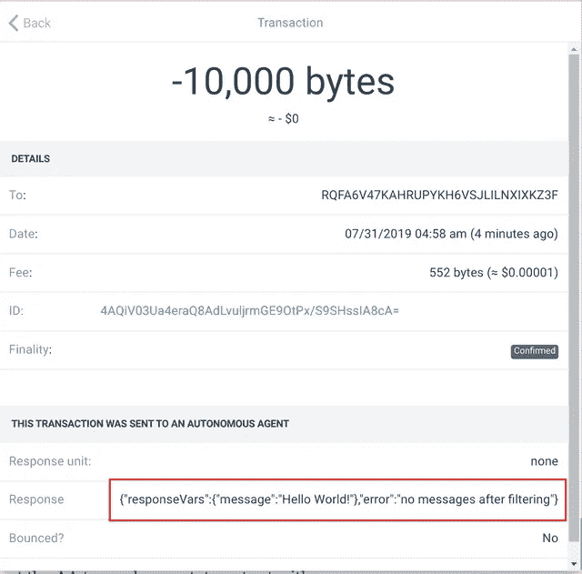
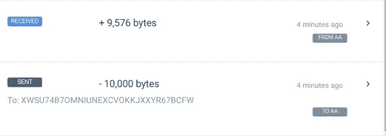
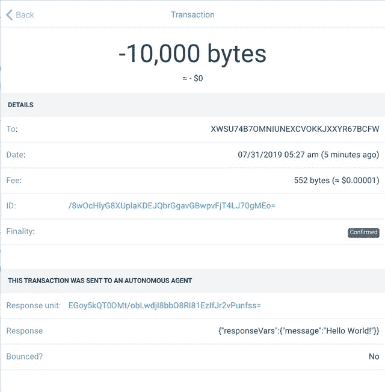

# Obyte 自治代理入门

> 原文：<https://medium.com/coinmonks/getting-started-with-obyte-autonomous-agents-f3013681f601?source=collection_archive---------0----------------------->

## 自治代理是运行在 Obyte 加密货币分类账上的分散式应用程序。在本文中，我们学习如何编写一个简单的“Hello World”代理。


在 Obyte 生态系统中，我们已经有了智能合约和聊天机器人很长一段时间了:智能合约提供了一种根据 Obyte 分类账强制执行的不可变预定义条件锁定和解锁资金的方法，而聊天机器人带来了动态和复杂的用户交互。虽然智能合同由每个节点评估，并且是去中心化的，但是聊天机器人是系统的外部用户，并且它们不是去中心化的。Obyte 没有一个分散的可编程电抗组件…直到现在！

自主代理(AAs)是 Obyte 生态系统的新成员。AAs 是存在于 Obyte 分类账上的程序，当它们被触发时以分散的方式执行。事实上，它们并不是自己一直在运行，它们必须被用户激活，或者事实上被其他 AAs 激活，这些用户通过向 AAs 发送事务来与 AAs 进行交互。这种触发交易通常是简单的支付，但是它们也可以携带例如数据元素。

AAs 是用所谓的[脚本](https://developer.obyte.org/autonomous-agents/oscript-language-reference)语言编写的程序代码，由网络中的每个完整节点存储和执行。鉴于 AAs 的独特属性，它们是确定性的，并且在每个节点上独立地进行相同的评估。典型的流程如下:

*   用户将交易发送到 AA
*   当事务变得稳定时，AA 程序代码在所有节点上执行，由用户创建的事务作为输入
*   AA 计算结果并输出捆绑在交易中的一条或多条消息
*   AA 的输出变得稳定，并且交互被认为完成

AA 的输出可以是很多东西，可以是对用户、其他用户或 AA 的支付，可以是新资产的定义或在数据馈送中发布的数据等，但最重要的是状态更改输出。每个 AA 可以将其状态存储在状态变量中，这些变量可以在连续执行中读取和更新。

让我们将经典的 Hello World 应用程序创建为一个自主代理。最简单的方法是使用基于网络的[脚本编辑器(testnet)](https://testnet.oscript.org/) 。
AA 程序代码是一个 JSON 对象，它可以在 JSON 对象的值部分包含可执行的 Oscript 语句。强制对象是`messages`，它声明了 AA 的输出。让我们从一个简单的代码开始，它将`Hello World!`字符串返回给调用者，例如用户钱包。

```
{
    messages: [
        {
            app: 'state',
            state: `{
                response['message'] = 'Hello World!';
            }`
        }
    ]
}
```

上面我们指示 AA 产生一个状态输出，带有一个名为`message`的响应变量。`response`是给触发 AA 的用户的信息，并不存储在 Obyte 分类帐中。以下是用户在“付款历史记录”选项卡中可以看到的内容:



在这里我们可以观察到几件事:

*   我们向`RQFA6V47KAHRUPYKH6VSJLILNXIXKZ3F`支付了一笔款项，这是 Hello World AA 的地址，也是 AA 定义的简单散列
*   我们发送了 10000 字节，这是 AA 可以被触发的最小量，选择它是为了使垃圾邮件更加昂贵，它也被称为“反弹费”，当 AA 被无效输入触发时收取
*   `Response unit`为空，因为我们只有一个不导致新 Obyte 事务的状态消息
*   `Response`包含使用`response`数组返回的变量
*   `Bounced? No`表示 AA 正常执行

现在，让我们通过返还用户发送来触发 AA 的一些钱来改进我们的 Hello World AA。我们可以通过添加额外的付款信息来实现:

```
{
    messages: [
        {
            app: 'payment',
            payload: {
                asset: 'base',
                outputs: [{address: "{trigger.address}"}]
            }
        },
        {
            app: 'state',
            state: `{
                response['message'] = 'Hello World!'; 
            }`
        }
    ]
}
```

看看付款信息:

*   它声明支付是在基础资产中进行的，基础资产是名为`bytes`的 Obyte 平台的本地货币。
*   它还声明将 AA 的全部余额发送回调用者地址。注意地址的特殊值:`{trigger.address}`。这是一个计算触发单元地址的 Oscript 表达式。

部署这个脚本会产生一个新的 AA 地址(`XWSU74B7OMNIUNEXCVOKKJXXYR67BCFW`)，这是意料之中的，因为代码已经发生了变化，AA 定义的散列也发生了变化。如果我们现在触发这个 AA，我们将看到 AA 返回一些钱，基本上是原始的 10000 字节减去 Obyte 协议收取的过账费用:



这里我们可以看到,`Response unit`现在填充了指向 AA 输出的单元哈希，这实际上是返回的支付交易:



# 进一步阅读和其他资源

*   原始公告:[引入自主代理](/obyte/introducing-autonomous-agents-6fe12fb12aa3)
*   [开发者指南](https://developer.obyte.org/autonomous-agents)
*   [Testnet 脚本编辑器](https://testnet.oscript.org/)

*原载于 2019 年 7 月 31 日*[*【https://steemit.com】*](https://steemit.com/obyte/@pmiklos/getting-started-with-obyte-autonomous-agents)*。*

*原载于 2019 年 7 月 31 日*[*https://steemit.com*](https://steemit.com/obyte/@pmiklos/getting-started-with-obyte-autonomous-agents)*。*

> [直接在您的收件箱中获得最佳软件交易](https://coincodecap.com/?utm_source=coinmonks)

[](https://coincodecap.com/?utm_source=coinmonks)