# 面向高级用户的 QTUM staking 入门

> 原文：<https://medium.com/coinmonks/getting-started-with-qtum-staking-for-advanced-users-qtumd-qtum-cli-node-wallet-b076a2ccfb64?source=collection_archive---------3----------------------->

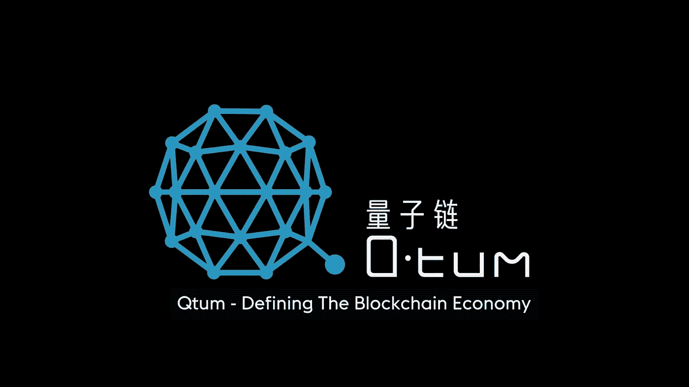

[Qtum](https://medium.com/u/f359dfbd44b0?source=post_page-----b076a2ccfb64--------------------------------) combines the Bitcoin UTXO model with Ethereum Virtual Machine based smart contracts.

Qtum 是一个分散的区块链项目，建立在比特币的 UTXO 模型上，支持基于以太坊虚拟机的智能合约，并通过利益一致模型的证明来保护。下注 QTUM 硬币是用你的硬币重量来保护网络的过程，这反过来会奖励你新的 QTUM。

# 赌注经济和风险

为了让赌注变得有意义，你需要获得比花费更多的赌注奖励。

## 最小 QTUM 标桩量

**基于成本:**目前，你应该通过投资至少**160 qtum**来覆盖所有的基础设施成本。请注意，这个数字会根据当前标桩的 QTUM 数量而变化。

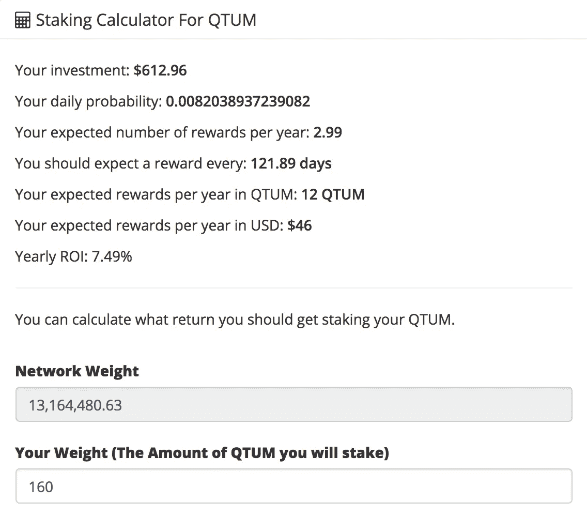

Qtum Staking Calculator: [https://qtumexplorer.io/qtum-staking-calculator](https://qtumexplorer.io/qtum-staking-calculator), required staking amount for covering the infrastructure costs.

**基于支付频率:**假设平均每月收到奖励，您应该下注 **640 Qtums** 。

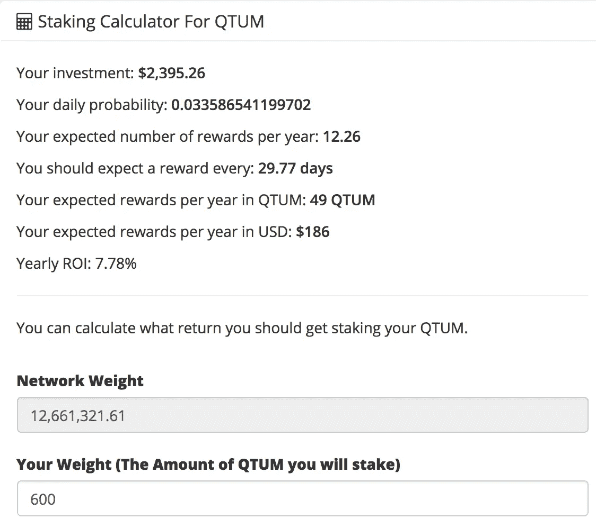

Qtum Staking Calculator: [https://qtumexplorer.io/qtum-staking-calculator](https://qtumexplorer.io/qtum-staking-calculator), required QTUM staking amount for monthly rewards

## 投资回报率

根据你投资的多少，预期回报率可能在每年 7%左右。这看起来似乎是一笔不错的交易，但存在 QTUM 加密货币价值下跌超过这一金额的风险。目前，1 QTUM 硬币的价格约为 4 美元，而在其高峰期，它是 102 美元。价格非常不稳定，这使得它成为一项风险很高的投资，而且只有当你持有相当数量的 QTUM 令牌时才是合理的。

## 税收影响

根据您的税务管辖区，您可能有义务为您收到的每项奖励纳税。就我个人而言，我至少会清算收到的奖励数量，以便可以覆盖未来的纳税义务。

# 推荐的基础设施设置

## AWS 和实例类型

我们可以在 AWS 上提供一台 Linux 机器。出于测试目的，我们可以以最低的成本使用一个按需 EC2 实例。EC2 实例 t2.micro 配 1GB RAM 应该和 8GB 存储应该没问题。

在下载了整个 QTUM 区块链之后，我们还有大约 36%的磁盘空间，应该足够接下来的 2-3 年使用。

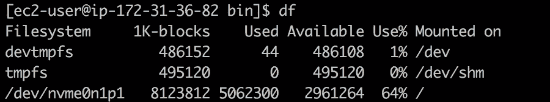

## 保留实例而不是按需 EC2

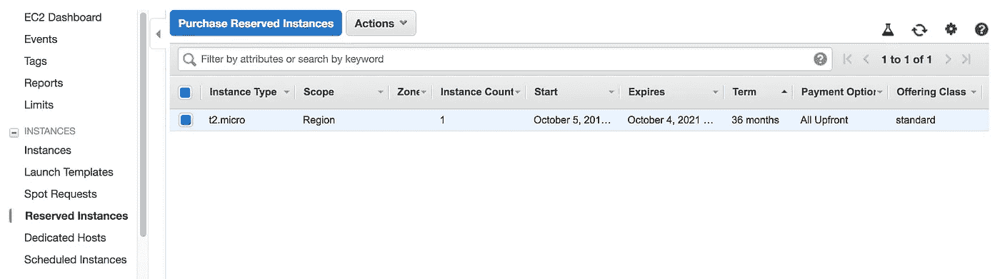

如果您打算长期投资，那么将一个实例保留更长时间会便宜得多。通常，t2.micro 每月收费 15 美元。如果预订 36 个月，你可能每月只需支付 4 美元。

## 最便宜的 AWS 区域

我们还可以通过在最便宜的 AWS 地区(如 N. Virginia、Ohio 或 Oregon)提供基础架构来节省大量资金。

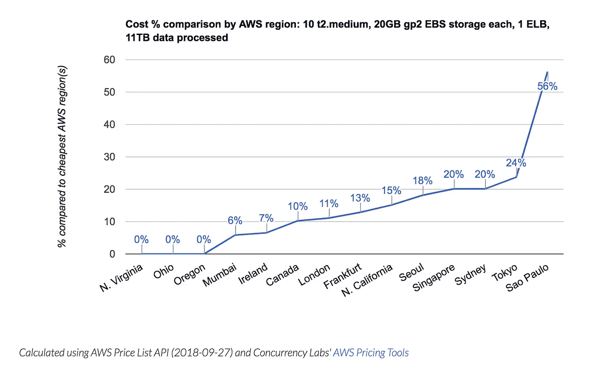

Pricing comparison for QTUM node infrastructure hosted on AWS

## 亚马逊 Linux

基于 CentOS 的亚马逊 Linux 比标准的 Ubuntu 便宜 20%左右。这不是我最喜欢的 Linux 版本，但是如果它能省钱，那就太好了！

## 总成本

如果您承诺应用上述准则运行一个节点 3 年，总成本应该在 126 美元或每月 3.5 美元左右。

# 设置 QTUM 节点

首先，我们想下载 QTUM 节点的最新版本:

```
wget [https://github.com](https://github.com/qtumproject/qtum/releases/download/mainnet-ignition-v0.16.1/qtum-0.16.1-i686-pc-linux-gnu.tar.gz)/qtumproject/qtum/releases/download/mainnet-ignition-v0.17.6/qtum-0.17.6-i686-pc-linux-gnu.tar.gz
```

你可以在这里下载最新版本的 QTUM 节点:
[https://github.com/qtumproject/qtum/releases](https://github.com/qtumproject/qtum/releases)

下一步是解压缩下载的包:

```
tar -xzf qtum-0.17.6-i686-pc-linux-gnu.tar.gz
```

## WTF: qtumd，qtum-cli，qtum-qt？

首先，我对不同的可执行文件有点困惑，所以我想我应该写一点相关的解释。

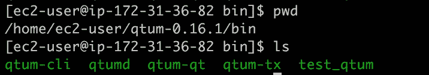

Executables in the QTUM node

qtumd 是一个无头守护进程。它还为同一个守护进程捆绑了一个测试工具。它提供了一个 JSON-RPC 接口，允许在本地或远程控制它，这使得它有利于与其他软件集成。API 提供了各种命令。

**qtum-cli** 是与 qtumd 交互的命令行界面。我们可以使用 qtum-cli 并进行本地 RPC 调用。

**qtum-qt** 是图形界面。这对我们来说没什么意思。

远程过程调用(RPC)的 QTUM 协议受到比特币的强烈启发。

**启动 QTUM 守护进程(qtumd)**

现在，让我们开始吧:

```
# we navigate to the folder with executables
cd qtum-0.17.6
cd bin/
# we start the qtum deamon
./qtumd -daemon
```

守护程序将启动并开始下载 QTUM 区块链。

通过使用 **qtum-cli** 调用 **getblockchaininfo** 过程，您将能够检查区块链是否已经完全下载:

```
./qtum-cli getblockchaininfo
```

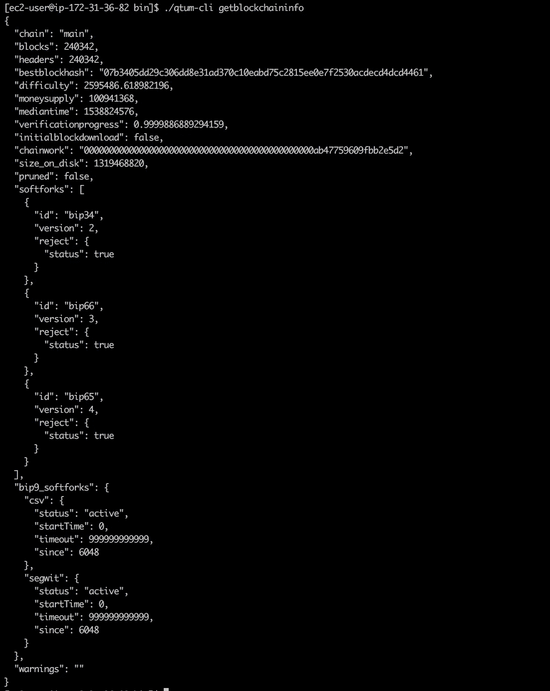

The result of **getblockchaininfo** remote procedure call.

响应中有趣的属性是 **verificationinprocess** 和 **initialblockdownload:**

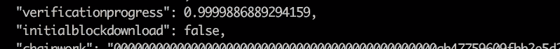

属性 **verificationinprogress** 表示已经下载了现有块的哪一部分(从 0 到 1)，属性 **initialblockdownload** 表示我们是否仍在第一次同步区块链。

**指定配置**

现在我们想为我们的节点指定配置。我们将在。qtum/文件夹。它应该放在您的用户文件夹中:

```
touch /home/ec2-user/.qtum/qtum.conf
```

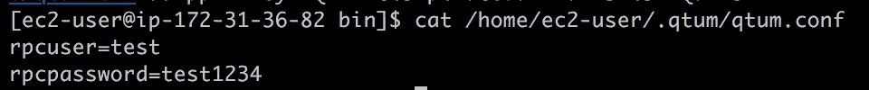

Example of QTUM configuration file: qtum.conf

为 RFC 指定您的用户名和密码。如果您想通过 web 公开 RPC 函数，您也需要在这里定义它。我们现在将调整 QTUM 守护进程的 rpc 用户名和密码:

```
./qtumd -daemon -rpcuser=test -rpcpassword=test1234
```

## 加密和备份您的钱包

出于安全原因，我们希望加密 qtumd 守护进程新生成的钱包。即使你的机器被入侵，攻击者没有密码也无法窃取你的资金。

```
./qtum-cli encryptwallet yourpassword
```

记住每次在控制台中输入密码后从历史记录中删除包含密码的命令:

```
rm ~/.bash_history
```

现在，我们将保护您的钱包文件以及私钥。我们去找个地址。注意钱包可以有很多地址，每个地址都有自己的私钥！

```
./qtum-cli getnewaddress
```

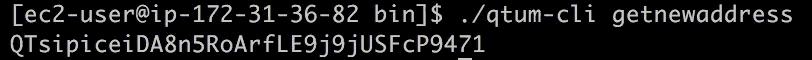

为了查看地址的相应私钥:

```
# it will unlock your wallet for 60 seconds
./qtum-cli walletpassphrase yourpassword 60# it will show the corresponding private key:
./qtum-cli dumpprivkey "address"
```

确保保存公钥和私钥。最好的选择是把它写在纸上。

接下来，我们还想保护整个钱包文件。从远程机器的 shell 中注销，并在本地计算机上运行它。

```
scp -i /path/to/your/key.pem ec2-user@ipAddress:/home/ec2-user/.qtum/wallets/wallet.dat ./wallet.dat
```

它会将钱包文件复制到您的本地机器上。这是已经加密的文件，相对安全。在冷存储中保存一份副本，例如在一个移动硬盘上。

## 为 QTUM 赌注设置您的钱包

首先，等待整个区块链数据库同步完成。然后就可以向 **getnewaddress** 生成的地址发送 QTUM 令牌。

强烈建议先发送少量，如 0.1 QTUM 用于测试。一旦区块链完全同步并且交易被确认，您应该通过调用 **getbalance** 方法来查看金额:

```
# shows a balance of an account (all address agreggated)
./qtum-cli getbalance ""
```

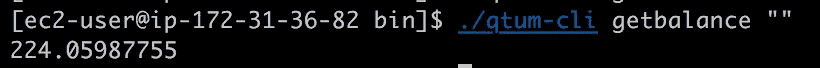

Example call of the getbalance method of qtum-cli

现在你应该打开你的钱包，以便下注。否则，QTUM 定位将是不可能的:

```
/qtum-cli walletpassphrase passphrase 999999 true
```

你都准备好了！请记住，QTUM 标记需要先成熟，然后才能用于 QTUM 定位。这个过程需要+500 次确认，大约 20 小时。

过了这段时间，您可以验证一切是否正常:

```
./qtum-cli getstakinginfo
```

输出应该是:

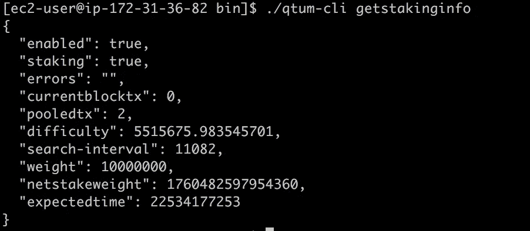

Staking is enabled (->enabled: true), and there are some mature coins (->staking: true)

如果**下注**字段为假，这意味着您目前没有下注，即您的硬币尚未到期。

## 有用的命令

```
# dumps your wallet file
./qtum-cli dumpwallet "filename"# displays relevant information about your wallet, among others if the staking is enabled and if the coins are actually being staked
./qtum-cli getwalletinfo# displays relevant information about your wallet, among others the balance and stake amounts.
./qtum-cli getstakinginfo# gets new address for your wallet (wallet can have many addresses)
./qtum-cli getnewaddress# displays all the addresses generated by the method "getnewaddress"
./qtum-cli getaddressesbyaccount ""# displays the private key for an address
./qtum-cli dumpprivkey "address"# unlocks wallet for staking
./qtum-cli walletpassphrase "passphrase" 999999 true# shows balance of an account (all address agreggated)
./qtum-cli getbalance ""
```

# 有什么问题吗？

如果您有任何其他问题，请随时通过以下任何渠道联系我们，或发送电子邮件至 contact @[alpha team hackers](https://alphateamhackers.com). com。

你来自德国，你有兴趣加入一个共享赌注池吗？也给我们写信吧！

如果这些内容对您的项目有所帮助，或者您只是喜欢我们所做的工作，并且愿意帮助我们增加现有的内容和产品，请考虑给我们一个提示…

**ETH:**0x 61063208393 bad 596 a 10 be 2e E5 Fe 04 e 2 ad 681 b 35
**QTUM:**qple udm 9 a fn 5 ahxcf 3wk 7 lzao 5 jda ao 5 r

> [直接在您的收件箱中获得最佳软件交易](https://coincodecap.com/?utm_source=coinmonks)

[](https://coincodecap.com/?utm_source=coinmonks)