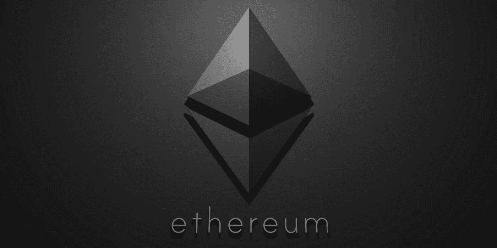

# 使用 Truffle 开始 Solidity 开发

> 原文：<https://medium.com/coinmonks/getting-started-with-solidity-development-using-truffle-2cc6c1df9133?source=collection_archive---------1----------------------->

**由** [**约克罗德斯**](https://www.linkedin.com/in/yorke-rhodes-iv/)**2017 年 1 月 31 日**

**更新于** [**约瑟夫·德龙**](https://www.linkedin.com/in/joseph-delong-b3084332/)2018 年 4 月 9 日

# 先决条件

*   [NodeJS](https://nodejs.org/en/download/)
*   [节点包管理器(NPM)](https://www.npmjs.com/)

# 游戏攻略

## **安装**

1.  我们需要先安装松露包`sudo npm install -g truffle`
2.  验证是否已成功下载`truffle`
3.  我们还需要安装 TestRPC `sudo npm install -g ethereumjs-testrpc`
4.  验证是否已成功下载`testrpc`

设置初始化一个默认的 truffle 项目，导航到所需的目录并运行`truffle init`

要配置 truffle 来使用我们的 testRPC 客户端，用以下内容填充`truffle.js`:

## 合同

让我们写下我们的第一份合同。在 contracts 目录下创建一个名为`SimpleStorage.sol`的新文件

用以下内容填充`SimpleStorage.sol`:

让我们起草合同吧。在我们的块菌项目的根目录中运行`truffle compile`。您应该会收到一些有用的警告。您还应该被通知一个新的工件已经被编写。

## 部署

我们现在必须配置 truffle 来将这个工件部署到我们的网络中。在迁移目录中创建一个名为`2_deploy_contracts.js`的新文件。

用以下内容填充`2_deploy_contracts.js`:

现在，如果我们运行`truffle deploy`,我们应该会看到我们的迁移脚本正在运行，最终 truffle 会告诉我们创建合同帐户的地址。

## 试验

我们现在能拿合同做什么？我们应该在考虑永久部署它之前对它进行测试(在一个活跃的以太网上)！

让我们编写第一个测试。在测试目录中创建一个名为`simpleStorage.js`的新文件。

用以下内容填充`simpleStorage.js`:

在运行我们的测试之前，我们需要确保我们的以太坊客户端正在运行。打开另一个终端窗口并运行`testrpc`(如果你还没有运行的话)。

现在回到你的松露项目并运行`truffle test`。我们的一项测试应该会失败。找到错误并修复它。

# 解决纷争

如果您遇到问题，我有一个 GitHub 存储库，里面有本指南的工作版本。在您的终端运行中:

`git clone [https://github.com/dangerousfood/hello_contract.git](https://github.com/dangerousfood/hello_contract.git)`

如果`truffle compile`或`truffle test`在新克隆的文件夹中失败，那么可能存在环境问题。确保 NodeJS 和 NPM 安装正确。

# 进一步链接

*   [稠度文件](https://solidity.readthedocs.io/en/develop/index.html#)
*   [松露文件](http://truffleframework.com/docs/)

> [直接在您的收件箱中获取最佳软件交易](https://coincodecap.com/?utm_source=coinmonks)

