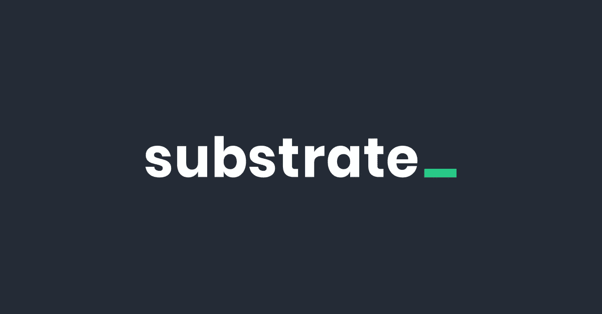
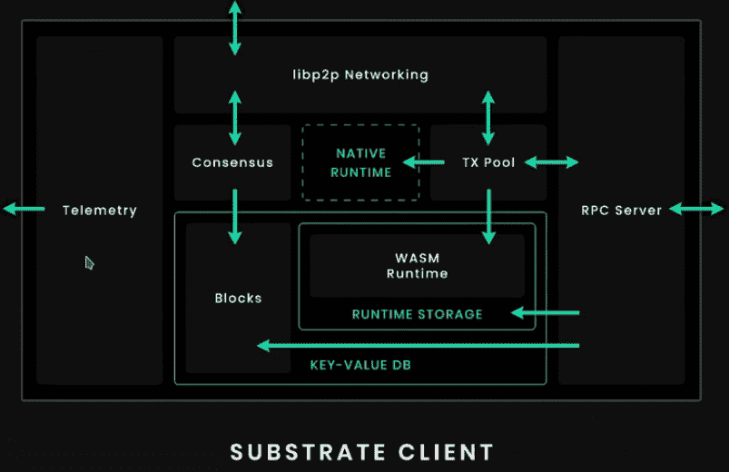
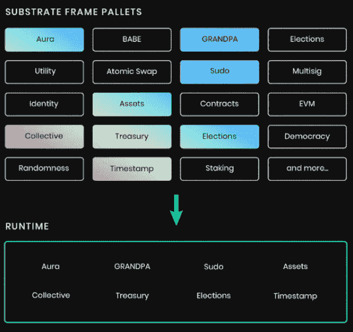
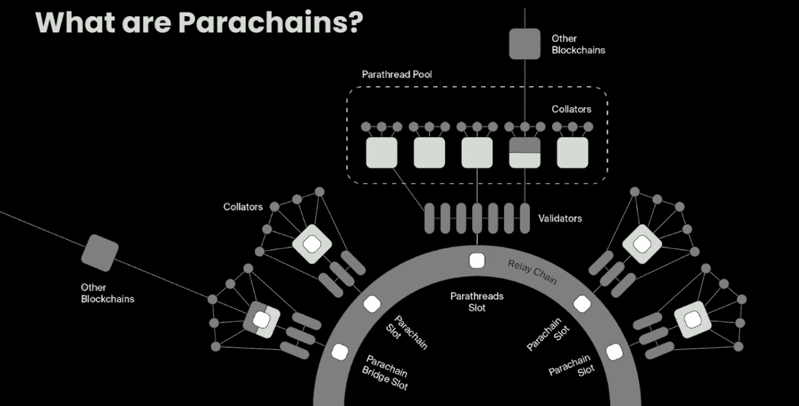

# 把基板弄直，给所有的圆点打点

> 原文：<https://medium.com/coinmonks/getting-the-substrate-straight-and-dotting-all-the-polkadots-11518cec4563?source=collection_archive---------11----------------------->

~dwulf

**发展基板工艺的发展**

一开始我只关心比特币，建立了一个闪电网络，开了几张发票，开通了几个渠道。然后是以太坊，一个叫做 Solidity 的编程环境，然后是 Viper，写了几个智能合同，花了几个以太网来实现它们。现在，加密空间又有了新的发展，令牌被称为点，编程环境被称为底层。

这种变化是如此之快，以至于当我注意到它的时候，在看到 Gavin Wood 博士的演讲之前，我已经落后了 3 年。10 月 15 日凌晨 03:00(太平洋标准时间),我将实际上参加[sub 0 Online——基板开发者社区会议](https://sub0.parity.io/),试图解决这个已经被构建的技术恐怖。

值得称赞的是，我在这之前就开始了，试图在 Raspberry Pi 上实现这一点，就像我对 MyNode Lightning 项目所做的那样，这有些复杂，因为 ARM cpu 上的 WASM 编译与 x86 上的 WASM 编译不同。有一个修复，但我决定放弃尝试，在 x86 设备上再试一次，这是一台我用 Ubuntu 安装重新启动的旧笔记本电脑，它一直工作到构建 UI 的地步。

**今晚早点睡…**

今晚我要早睡，在太平洋标准时间凌晨 3:00 起床，为 sub 0 Online——基板开发者社区会议做准备，重新评估一个更好的策略，为一个完全运行的基板环境提供一个功能 UI。我买了 24 个 DOT tokens 来使用，并将在会议之前浏览尽可能多的 Web3 视频，以了解 Substrate、Polkadot (DOT)和 Kusama (KSM)的最新情况。

**Docker 选项？**

一种策略是构建一个内置了所有这些技术的 Docker 容器，因为我试图手工编织，从头开始编写量子代码来构建这个容器，首先是在 Raspberry Pi 上(由于 WASM 兼容性问题而失败)，然后是在我的华硕 i7 x86 笔记本电脑上，在构建功能性 UI 时部分失败。

第三次尝试将在一个 Docker 容器上进行，它应该可以工作，没有错误，因为毫无疑问会有一个 YAML 文件，预先配置在云上，这将使其可操作。等我熬过大会之后，我会继续在代码的熔炉中锻造，编织我最后的魔法，打造一个无愧于诸神的区块链…

未完待续…

**更多关于我在基板上的冒险经历**

好的，所以我很早就起来准备展示，当我写这篇文章的时候，我还在看着这些研讨会。我将更多地写这篇文章作为我的指南，因为我正在向你们解释我所理解的。稍后我将制作视频短片，以充分展示例子，但首先是理论。

**区块链制造的零部件**

好了，把这个建立起来，我们就能理解这个技术怪物的各个部分了。Polkadot/Substrate 项目的核心是几年前开始的，奇偶校验公司为特定的区块链开发其他系统。首先是比特币，然后是以太坊，甚至是 Zcash，直到他们整合了 Polkadot 上的冗余功能，这是他们自己的一个从零开始的系统，拥有自己的非 ERC-20 代币，称为 dot。

从那里开始，创建了 Substrate，这是一个在精神上类似于以太坊的 Solidity 的开发环境。还有其他组件，但是一般的客户端布局是这样的。

当我第一次在我的 Raspberry Pi 上构建 Substrate 时，我遇到了一些问题，特别是 WASM 编译与 Raspberry Pi 上的 ARM 芯片组不兼容，有一个解决办法，但我决定只在我周围放置的 i7 华硕笔记本电脑上构建它，它可以工作，但我在 UI 上有问题。

**托盘**

模块化是他们最引以为豪的一个主题，开箱即用，你就可以拥有一个基本的区块链及其所有的铃铛和哨子。但如果你想修改任何东西，你可以添加和删除“托盘”，这将添加或删除你的区块链的功能。

托盘可以被放入您的运行时环境中，这可以为您的区块链提供任何给定区块链将具有的所有当代功能。例如，用于实际代币/硬币的资产、实现代币投票管理的选举、作为混合一致方法的祖父(基于幽灵的递归祖先导出前缀协定)等。

模块化解决方案的主要思想是建立在称为副链的思想上，这为其他区块链提供了互操作性，这使得它成为一种非常强大的理解机制。

**副链**

副链是底物系统灵活性的核心。hub 通过验证器连接，顾名思义，验证器验证通过它们运行的事务。

我将深入探讨 Substrate 的独特特性，展示已经构建和部署了基于 Substrate 的解决方案的项目。当我学习技术技能时，我会发现构建更好的区块链基础设施和应用程序的技术工具。

多轨道会议迎合基板，并为现有的基板制造商谁想要扩展他们的专业知识。

了解更多信息并查看议程:

[https://sub0.parity.io/](https://sub0.parity.io/)

欲了解更多关于底物的信息，请访问:

[http://substrate.dev](http://substrate.dev)

了解更多关于 Polkadot 的信息，请访问:

[http://polkadot . network](http://polkadot.network)

波尔卡多特不和谐服务器:

[https://discord.gg/yPygyk6](https://discord.gg/yPygyk6)

结论:

关于基板的核心技术，以及延伸出来的草间弥生和波尔卡多特，几乎没有什么疑问。这当然迫使我学习铁锈和衬底，旋转一个节点等等。我已经是提名人，并且已经特别为大众贷款拍卖，特别是 Acala 和 Astar，在第 0 层基底/ Polkadot 框架的基础上，为各自的第 1 层功能做出了最大贡献。

我被锁定在这一点上，不仅了解核心，而且了解如何从核心构建系统。

> 加入 Coinmonks [电报频道](https://t.me/coincodecap)和 [Youtube 频道](https://www.youtube.com/c/coinmonks/videos)了解加密交易和投资

## 另外，阅读

*   [CoinLoan 点评](https://blog.coincodecap.com/coinloan-review)|[Crypto.com 点评](/coinmonks/crypto-com-review-f143dca1f74c) | [火币保证金交易](/coinmonks/huobi-margin-trading-b3b06cdc1519)
*   [Bybit vs 币安](https://blog.coincodecap.com/bybit-binance-moonxbt)|[stealth x 回顾](/coinmonks/stealthex-review-396c67309988) | [Probit 回顾](https://blog.coincodecap.com/probit-review)
*   [顶级付费加密货币和区块链课程](https://blog.coincodecap.com/blockchain-courses)
*   [在美国如何使用 BitMEX？](https://blog.coincodecap.com/use-bitmex-in-usa) | [BitMEX 评论](https://blog.coincodecap.com/bitmex-review)
*   [最佳期货交易信号](https://blog.coincodecap.com/futures-trading-signals) | [流动性交易所评论](https://blog.coincodecap.com/liquid-exchange-review)
*   [南非的加密交易所](https://blog.coincodecap.com/crypto-exchanges-in-south-africa) | [BitMEX 加密信号](https://blog.coincodecap.com/bitmex-crypto-signals)
*   [MoonXBT 副本交易](https://blog.coincodecap.com/moonxbt-copy-trading) | [阿联酋的加密钱包](https://blog.coincodecap.com/crypto-wallets-in-uae)
*   [雷米塔诺评论](https://blog.coincodecap.com/remitano-review)|[1 英寸协议指南](https://blog.coincodecap.com/1inch) | [购买 Floki](https://blog.coincodecap.com/buy-floki-inu-token)
*   [MoonXBT vs Bybit vs 币安](https://blog.coincodecap.com/bybit-binance-moonxbt) | [Arbitrum:第二层解决方案](https://blog.coincodecap.com/arbitrum)
*   [买 PancakeSwap(蛋糕)](https://blog.coincodecap.com/buy-pancakeswap)|[matrix export Review](https://blog.coincodecap.com/matrixport-review)
*   [最佳免费加密信号](https://blog.coincodecap.com/free-crypto-signals) | [YoBit 评论](/coinmonks/yobit-review-175464162c62) | [Bitbns 评论](/coinmonks/bitbns-review-38256a07e161)
*   [OKEx 回顾](/coinmonks/okex-review-6b369304110f) | [Kucoin 交易机器人](/coinmonks/kucoin-trading-bot-automate-your-trades-8cf0ca2138e0) | [期货交易机器人](/coinmonks/futures-trading-bots-5a282ccee3f5)