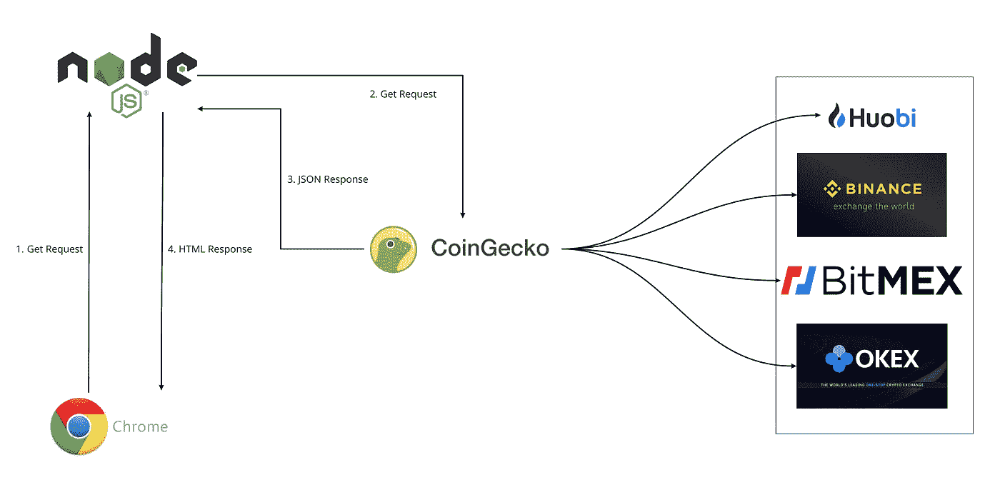

# 金吉尔:加密货币仪表板

> 原文：<https://medium.com/coinmonks/ginger-crypto-currency-dashboard-8e1f179ee467?source=collection_archive---------0----------------------->

## 一步一步的教程，以建立自己的加密货币仪表板，并部署到服务器上

# 体系结构

## 生姜的加工