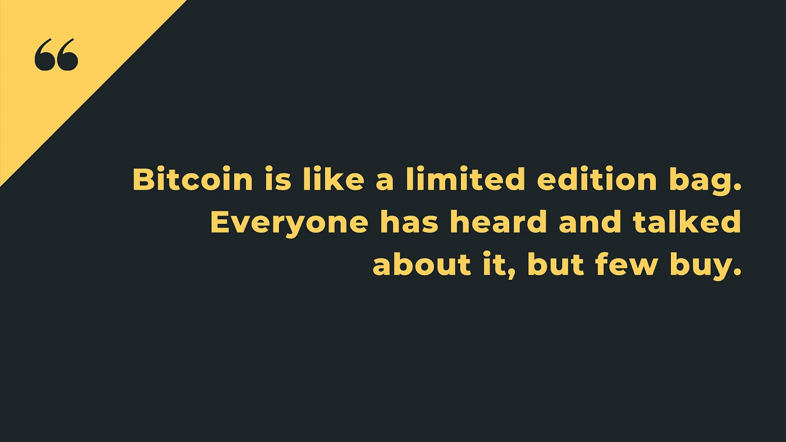
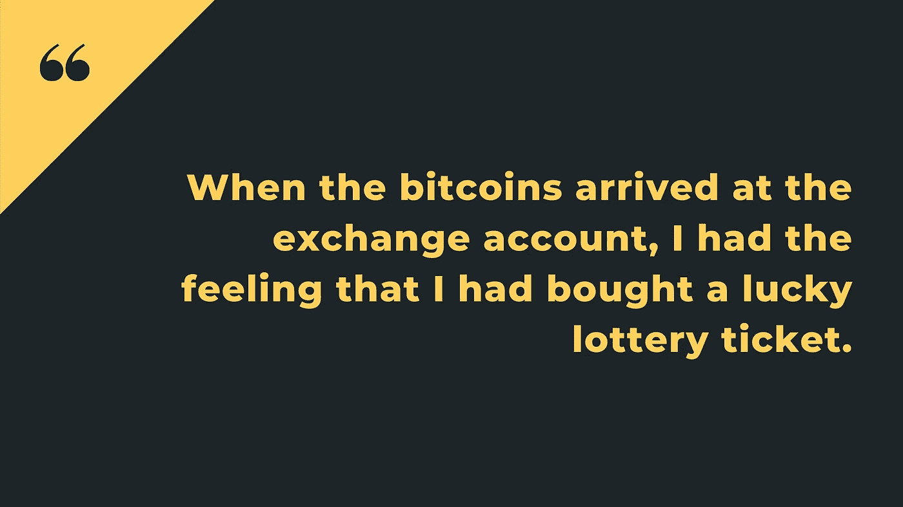
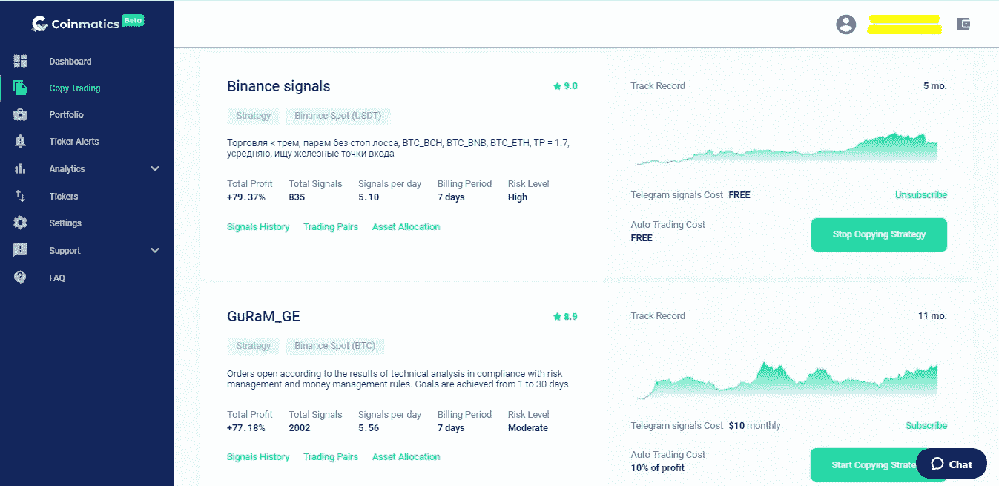
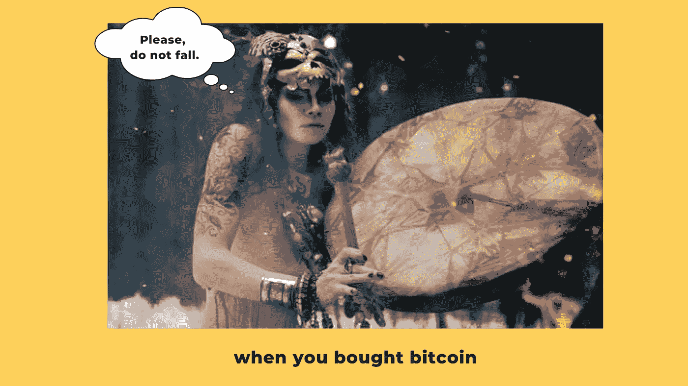

# “乔瓦尼改变了我的生活”。通过拷贝交易获利 40 美元

> 原文：<https://medium.com/coinmonks/giovanni-has-changed-my-life-40-profit-by-copy-trading-29243a18f425?source=collection_archive---------3----------------------->

Coinmatics 公司的一个假设是:**“我们正在为自己制造一个产品，并且每天都在使用它！”**听起来自命不凡？一点也不。这是真的，今天我们会说服你。

一位造币工人分享了她的复制交易故事(顺便说一句，非常感谢她！).

# 欢迎阅读她的密码本交易故事！

*“我已经在复制交易平台 Coinmatics 工作了几个月。每天我都看到团队热情地培育他们的产品。并且，尽管我个人对加密货币世界有偏见，但我意识到是时候尝试加密货币复制交易* ***【在我的钱包上】*** *。所以，让我分享一下我个人的造币评论吧！*

*我不是专业交易者，所以我行事谨慎，有分寸。我从成熟的自动复制交易开始。俗话说:“* ***自己做一件事的能力是从模仿开始的。***

> *这件事发生在 7 月 22 日。这一天，我人生第一次买了[比特币](https://blog.coincodecap.com/a-candid-explanation-of-bitcoin)。我骄傲自大。*

**

*最低存款为 100 美元的交易最好复印。因此，那笔钱进入了我的外汇账户。当然，我很担心。我按下了兑换钱的按钮，呼吸停止了一会儿。“我的钱，”我想。我知道加密货币是一个去中心化的东西，独立生存。Crypto 教会你做出自己的决定，并为自己的决定负责。所以，如果交易石沉大海，那就没人赔偿我了。嗯，也许妈妈会试着安慰我，烤我最喜欢的蛋糕。*

**

# *如何打开加密副本交易*

*我喜欢 Coinmatics 网站柔和明亮的绿色。颜色似乎在说:“是的，亲爱的，你做了正确的选择。”*

**一个技术点:要启用自动币安复制交易，首先你* [*注册币安*](https://www.binance.com/ru) *账户并进行存款，比如购买比特币。二、在* [*Coinmatics 平台*](https://coinmatics.com/?utm_source=medium&utm_medium=article&utm_campaign=coinmonks_copy-trading_case_en_f) *和* [*上注册绑定 API key*](/coinmatics/how-to-create-an-api-key-in-3-minutes-without-a-nervous-breakdown-5e18bef75f9a) *。**

**

*Strategies Rating. More than 35 crypto traders to follow.*

# *如何选择策略*

*在我的 Coinmatics 账户上，我点击了复制交易——策略评级标签。目前，网站上有超过 35 种策略可供选择——选择你想要的。这让我想起了一场招聘会:)我选择了密码交易员的策略/投资组合“沃尔特多头”(高总回报率+ 58.67%和 12 个月的漫长交易期让我印象深刻)。*

**然后最有趣、最令人兴奋的事情开始了——等待。对于无法忍受自己无法控制的事情的人来说，加密货币是被禁止的。也适用于紧张和鲁莽的人。**

**“歇斯底里”模式开启得如此之快，以至于我都没有注意到。我曾经每 20 分钟刷新一次页面，看看交易是否成功，我的余额是多少。还经常看着货币工厂，甚至祈求加密货币神的怜悯。**

**

# *我向你展示一份独特的交易者日记:*

# *7 月 22 日*

*我在币安交易所的余额是 91.3366 USDT。我存了 100 美元，但显然转换委员会拿走了它的费用，在 USDT 的金额似乎略少。*

****状态*** *:忧心忡忡；我每小时检查一次余额:)**

# *7 月 31 日(自开始复制交易以来已经过去了 9 天)*

**我的余额是 120.5890 USDT (+29.2524 USDT 增益)。我一天只看一次我的文件夹。我明白“缩小视野”看大局是很重要的。到目前为止，我还不打算退出到菲亚特(=真正的钱)，因为我想把钱留给复制交易活动，并最终获得更多的利润。所以我等着。**

****状态*** *:满足，担忧期结束；我为我的机会感到兴奋；思考自动交易对我来说是最好的赚钱方式。**

# *8 月 5 日(两周过去了)*

*我有一个怪癖。我真的很想取钱。还有我认购的交易策略掉到了第 4 位。我想取消订阅，订阅评级中的第一策略。但后来我改变了主意:新策略的资产分配与目前比特币逐渐增多的策略有很大不同。我不想在自动校准上失去任何东西。所以我改变了主意，再次重新订阅了沃尔特多头策略。*

****状态*** *:满意；我自己的复制交易策略的草图正在我脑海中诞生；学会有时如何关闭情绪。**

# *8 月 14 日(差不多 4 周过去了)*

*我以为我不能这样存一个月的钱。我必须慢慢退出。有时我的余额会跳到 135 USDT，可惜我没有抓住这个机会，所以我坚持到 7 月 22 日——我的实验结束。*

****状态*** *:满足；我已经找到了拷贝交易的方法；顺便说一句，金融投资是如此迷人。**

# *8 月 22 日*

**结果，我在一个月内使用 crypto copy 交易平台总共赚了 40 USDT。**

****状态*** *:开心，喜悦；我计划投资更多。**

# *这个故事的寓意是*

****是否投资加密货币，只是你的决定。就我个人而言，这些社交交易的投资不仅给我带来了收入，也给我带来了自制力、承担足够风险的能力和自信。****

****乔瓦尼改变了我的生活。祝你找到“你的乔瓦尼”。****

*如果你对这个话题有什么要补充的，不要犹豫。*

## *另外，阅读*

*   *最好的[密码交易机器人](/coinmonks/crypto-trading-bot-c2ffce8acb2a)*
*   *[密码本交易平台](/coinmonks/top-10-crypto-copy-trading-platforms-for-beginners-d0c37c7d698c)*
*   *最好的[加密税务软件](/coinmonks/best-crypto-tax-tool-for-my-money-72d4b430816b)*
*   *[最佳加密交易平台](/coinmonks/the-best-crypto-trading-platforms-in-2020-the-definitive-guide-updated-c72f8b874555)*
*   *最佳[加密贷款平台](/coinmonks/top-5-crypto-lending-platforms-in-2020-that-you-need-to-know-a1b675cec3fa)*
*   *[最佳区块链分析工具](https://bitquery.io/blog/best-blockchain-analysis-tools-and-software)*
*   *[加密套利](/coinmonks/crypto-arbitrage-guide-how-to-make-money-as-a-beginner-62bfe5c868f6)指南:新手如何赚钱*
*   *最佳[加密制图工具](/coinmonks/what-are-the-best-charting-platforms-for-cryptocurrency-trading-85aade584d80)*
*   *[莱杰 vs 特雷佐](/coinmonks/ledger-vs-trezor-best-hardware-wallet-to-secure-cryptocurrency-22c7a3fd391e)*
*   *了解比特币的[最佳书籍有哪些？](/coinmonks/what-are-the-best-books-to-learn-bitcoin-409aeb9aff4b)*
*   *[3 商业评论](/coinmonks/3commas-review-an-excellent-crypto-trading-bot-2020-1313a58bec92)*
*   *[AAX 交易所评论](/coinmonks/aax-exchange-review-2021-67c5ea09330c) |推荐代码、交易费用、利弊*
*   *[Deribit 审查](/coinmonks/deribit-review-options-fees-apis-and-testnet-2ca16c4bbdb2) |选项、费用、API 和 Testnet*
*   *[FTX 密码交易所评论](/coinmonks/ftx-crypto-exchange-review-53664ac1198f)*
*   *[n 零审核](/coinmonks/ngrave-zero-review-c465cf8307fc)*
*   *[Bybit 交换评论](/coinmonks/bybit-exchange-review-dbd570019b71)*
*   *[3Commas vs Cryptohopper](/coinmonks/cryptohopper-vs-3commas-vs-shrimpy-a2c16095b8fe)*
*   *最好的比特币[硬件钱包](/coinmonks/the-best-cryptocurrency-hardware-wallets-of-2020-e28b1c124069?source=friends_link&sk=324dd9ff8556ab578d71e7ad7658ad7c)*
*   *最佳 [monero 钱包](https://blog.coincodecap.com/best-monero-wallets)*
*   *[莱杰 nano s vs x](https://blog.coincodecap.com/ledger-nano-s-vs-x)*
*   *[bits gap vs 3 commas vs quad ency](https://blog.coincodecap.com/bitsgap-3commas-quadency)*
*   *[莱杰纳米 S vs 特雷佐 one vs 特雷佐 T vs 莱杰纳米 X](https://blog.coincodecap.com/ledger-nano-s-vs-trezor-one-ledger-nano-x-trezor-t)*
*   *[block fi vs Celsius](/coinmonks/blockfi-vs-celsius-vs-hodlnaut-8a1cc8c26630)vs Hodlnaut*
*   *Bitsgap 评论——一个轻松赚钱的加密交易机器人*
*   *为专业人士设计的加密交易机器人*
*   *[PrimeXBT 审查](/coinmonks/primexbt-review-88e0815be858) |杠杆交易、费用和交易*
*   *[埃利帕尔泰坦评论](/coinmonks/ellipal-titan-review-85e9071dd029)*
*   *[赛克斯石评论](https://blog.coincodecap.com/secux-stone-hardware-wallet-review)*
*   *[BlockFi 评论](/coinmonks/blockfi-review-53096053c097) |赚取高达 8.6%的加密利息*