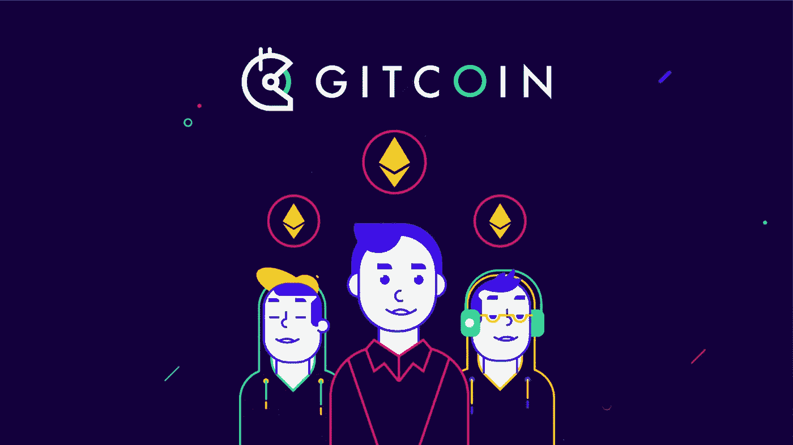

# Gitcoin:一场开源软件革命

> 原文：<https://medium.com/coinmonks/gitcoin-an-open-source-software-revolution-396947669d1b?source=collection_archive---------9----------------------->

软件构成了我们网络生活的全部。无论你是一个普通的互联网用户还是铁杆互联网用户，你都有可能对什么是软件有所了解。软件只是指导计算机如何操作的代码。一些公司已经成功地将其整个商业模式建立在将这些代码作为软件出售给消费者的基础上。这些公司通常对他们的代码保密，并声称这是可以被窃取的知识产权(IP)。我们称这类软件为闭源软件或专有软件。像 Adobe 这样的软件公司对他们流行软件背后的代码严加保密。这是因为复制和粘贴软件代码可以给你一个原始软件的精确复制品。编写构建软件的初始代码可能是劳动和资本密集型的，但是复制和修改代码通常变得越来越不困难。如果我们把代码想象成乐高积木，把软件想象成“成品”，这个概念就变得更容易理解了。任何完成的乐高积木都可以通过增减来改变。这种像乐高积木一样的代码结构就是为什么开源软件对网络开发如此有利。开源软件指的是软件背后代码的透明性。这种透明性允许开发人员确切地看到特定软件的幕后发生了什么，并鼓励他们重用、修改或仔细检查底层代码。世界各地的开发人员对开源代码的操作和研究使得开源软件能够以一种在闭源软件中非常资本密集型的方式进行实战测试。以这种方式测试软件可以找出错误，确保正常运行，并确认代码不是恶意软件，通常是良性的。已经有像 GitHub T1 或 T2 Fossil T3 这样的大型存储库充当着装满开源代码的图书馆。开发人员可以使用这些开源库站在彼此的肩膀上，快速而廉价地构建他们想要的软件。然而，开源软件的一个问题是，开发者传统上很难将他们的努力货币化。这使得许多有技能的开发人员进入私营行业，他们的时间和才能远离开源软件。进来的是[金币](https://gitcoin.co/)。

Gitcoin 的使命是通过开源软件的部署和完善来建立和资助公共产品。他们的精神集中在解决软件开发人员之间的协调困境上。Gitcoin 是一个网站，开发者可以通过开发开源软件获得加密货币。Gitcoin 旨在通过为有用的开源代码的开发提供报酬，为开源社区夺回人才。开发者可以通过 Gitcoin 赚取奖金、补助金或黑客马拉松。Gitcoin 奖金由个人或项目发布，并以发布者选择的加密货币进行奖励。开发者可以完成任意多的奖金，并收集后续的加密货币。所有加密货币转移都由智能合同管理，该合同确保双方诚信行事。具体来说，Gitcoin 使用开源智能合约，可以在这里查看[。Gitcoin 还允许开发人员通过赞助的“黑客马拉松”将他们的才能货币化，在那里开发人员组队开发 Web 3.0 软件。最后，Gitcoin 将开源软件货币化的最有趣的方式可能是通过 Gitcoin 赠款。Gitcoin 资助是基于](https://github.com/Bounties-Network/StandardBounties)[二次资助](https://poseidon01.ssrn.com/delivery.php?ID=817078078116005005099109078094091068001008007085063041068117124105027026066002120072026035111101049057019018014027097127002112012022021021058030089098006103090071015028023095001002112111007091106089097113097092015031127084067068110110071120017126102084&EXT=pdf&INDEX=TRUE)。从理论上讲，这种资助方法可以确保个人贡献最多的想法得到最好的资助，而不管这些个人贡献的金额有多少。点击这个[链接](https://wtfisqf.com/?grant=&grant=&grant=&grant=&match=1000)直接观看 Gitcoin 对二次基金的简短解释，并使用他们的二次基金资助计算器。

## 【Gitcoin 的幕后黑手是谁？

Kevin Owocki 是 Gitcoin 的创始人，也是科技领域的资深人士，他的简历与之相匹配。Owocki 参与了多个初创企业，是 GO 脸书 games 和 Step-Out 的联合创始人。他也是简单能源公司的工程副总裁。Owocki 拥有深厚的软件开发背景，自 2015 年以来一直致力于区块链技术。2017 年，Owocki 决定在区块链空间全职工作，此后举办了许多区块链聚会活动。Gitcoin 从 Paradigm、Electric Capital 和 MetaCartel Ventures 等公司获得了初始资金。Owocki 是去中心化的积极支持者，他创建 Gitcoin 的初衷是希望有一天将控制权交给一个去中心化的自治组织(DAO)。2021 年 5 月 25 日运营控制权成功交接，Gitcoin DAO 目前运行 Gitcoin。这个 DAO 有一个名为$GTC 的治理令牌，可以委托给代表或用于个人投票。您可以在此查看金币道的高层代表人物并分析他们的参与[。这个 DAO 由开源软件的活跃开发者和该软件的资助者组成，他们相信并期待进一步推动 Gitcoin 的开源软件自我维持环境的愿景。到目前为止，Gitcoin DAO 取得了很大的成功。自成立以来，Gitcoin 已经为开源软件提供了超过](https://stewards.eth.limo/)[64，000，000](https://gitcoin.co/results) 美元的资金，其中约 20，000，000 美元已于 2021 年到位。Gitcoin 声称拥有 311，668 名活跃开发者，每小时费率分布为 27-123 美元。在 2021 年第四季度，仅通过小费功能，Gitcoin 就帮助开发者转移了约 20 万美元。随着传统工作的工资停滞不前，越来越多的人转向零工。Gitcoin 通过零工提供了可维持生活的工资。Web 3.0 的开发将是开源的，正因为如此，它将会以指数级的速度发展。Gitcoin 被完美地定位于 Web 3.0 开发的中心。

**我们为什么投资？**

Gitcoin 的使命与我们希望看到的 Web 3.0 的发展方向一致。我们相信一个由大众管理的开源技术的未来正是社会所需要的。我们相信，Gitcoin 所提供的是对社会有益的东西，而作为一个整体，这个世界正遭受着协调失败的困扰，Gitcoin 正致力于解决这一问题。$GTC 令牌是 Gitcoin DAO 的[治理令牌](https://gitcoin.co/blog/introducing-gtc-gitcoins-governance-token/)，两者于 2021 年 5 月 25 日同时推出。$GTC 是$COMP 的一个分支，它是[复合道](https://compound.finance/)的治理令牌。$COMP 目前市值约 325 美元，市值 20 亿美元。$GTC 目前价值约 10 美元，市值 1.42 亿美元。GTC 美元的潜在增长与呈指数增长的开源软件的增长直接相关。购买 Gitcoin 的治理令牌是对 Web 3.0 数字革命的支持。

*作者 David Coryat，Istari Capital LP 的加密专家和分析师。*

[https://www.istari.io/](https://www.istari.io/)

*此内容仅供参考，您不应将任何此类信息或其他材料理解为法律、税务、投资、财务或其他建议。本报告中的任何内容均不构成 Istari 或任何第三方服务提供商在该司法管辖区或任何其他司法管辖区购买或出售任何证券或其他金融工具的邀约、建议、认可或要约，根据该司法管辖区的证券法，此类邀约或要约是非法的。请注意，Istari Capital LP 投资于本文讨论的项目或与本文相关的项目。*

> 加入 Coinmonks [电报频道](https://t.me/coincodecap)和 [Youtube 频道](https://www.youtube.com/c/coinmonks/videos)了解加密交易和投资

## 另外，阅读

*   [如何购买 Ripple (XRP)](https://blog.coincodecap.com/buy-ripple-india) | [非洲最好的加密交易所](https://blog.coincodecap.com/crypto-exchange-africa)
*   [非洲最佳加密交易所](https://blog.coincodecap.com/crypto-exchange-africa) | [胡交易所评论](https://blog.coincodecap.com/hoo-exchange-review)
*   [eToro vs robin hood](https://blog.coincodecap.com/etoro-robinhood)|[MoonXBT vs Bybit vs Bityard](https://blog.coincodecap.com/bybit-bityard-moonxbt)
*   [Stormgain 回顾](https://blog.coincodecap.com/stormgain-review) | [Bexplus 回顾](https://blog.coincodecap.com/bexplus-review) | [币安 vs Bittrex](https://blog.coincodecap.com/binance-vs-bittrex)
*   [Bookmap 评论](https://blog.coincodecap.com/bookmap-review-2021-best-trading-software) | [美国 5 大最佳加密交易所](https://blog.coincodecap.com/crypto-exchange-usa)
*   [如何在 FTX 交易所交易期货](https://blog.coincodecap.com/ftx-futures-trading) | [OKEx vs 币安](https://blog.coincodecap.com/okex-vs-binance)
*   [如何在势不可挡的域名上购买域名？](https://blog.coincodecap.com/buy-domain-on-unstoppable-domains)
*   [印度的秘密税](https://blog.coincodecap.com/crypto-tax-india) | [altFINS 审查](https://blog.coincodecap.com/altfins-review) | [Prokey 审查](/coinmonks/prokey-review-26611173c13c)
*   [布洛克菲 vs 比特币基地](https://blog.coincodecap.com/blockfi-vs-coinbase) | [比特坎评论](https://blog.coincodecap.com/bitkan-review) | [币安评论](/coinmonks/binance-review-ee10d3bf3b6e)
*   [Coldcard 评论](https://blog.coincodecap.com/coldcard-review) | [BOXtradEX 评论](https://blog.coincodecap.com/boxtradex-review)|[unis WAP 指南](https://blog.coincodecap.com/uniswap)
*   [阿联酋 5 大最佳加密交易所](https://blog.coincodecap.com/best-crypto-exchanges-in-uae) | [SimpleSwap 评论](https://blog.coincodecap.com/simpleswap-review)
*   购买 Dogecoin 的 7 种最佳方式 | [ZebPay 评论](https://blog.coincodecap.com/zebpay-review)
*   [美国最佳加密交易机器人](https://blog.coincodecap.com/crypto-trading-bots-in-the-us) | [经常性评论](https://blog.coincodecap.com/changelly-review)
*   [A-Ads 审查](https://blog.coincodecap.com/a-ads-review) | [Bingbon 审查](https://blog.coincodecap.com/bingbon-review) | [Mudrex 投资](https://blog.coincodecap.com/mudrex-invest-review-the-best-way-to-invest-in-crypto)