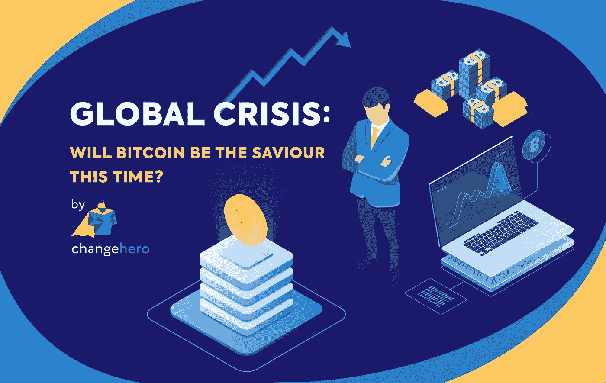
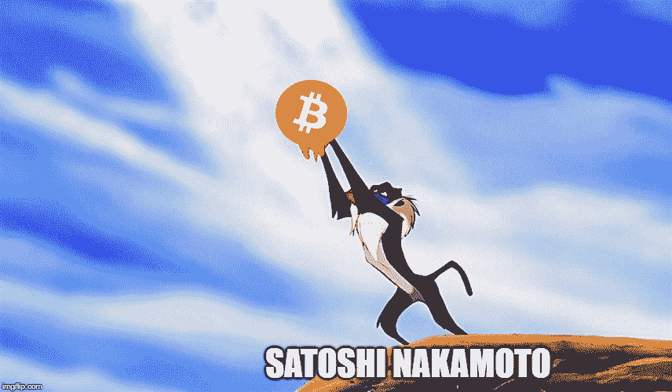
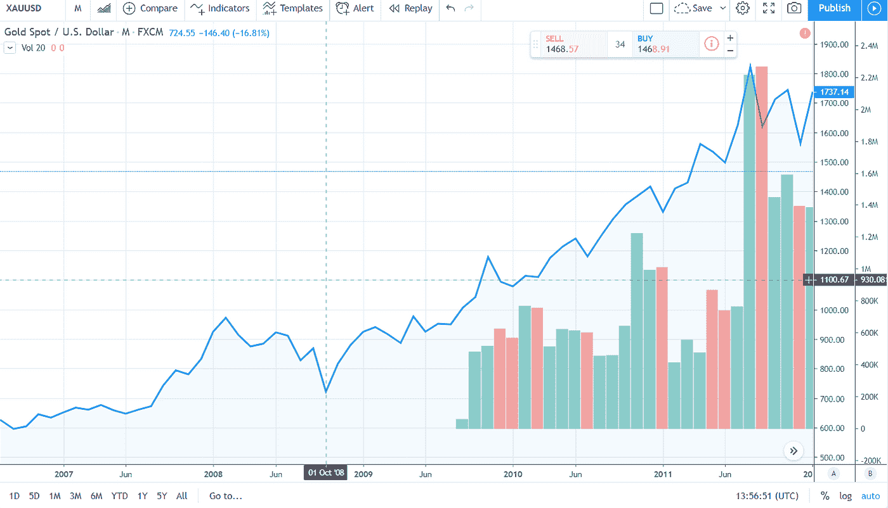
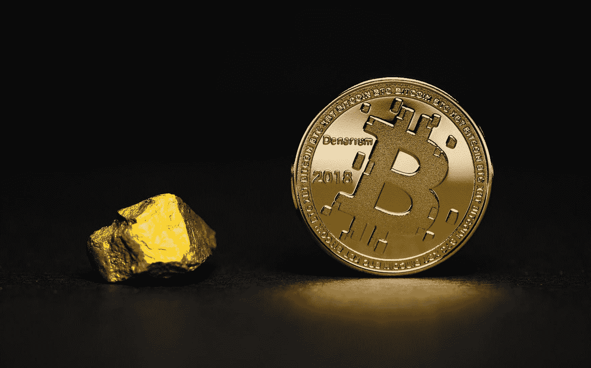

# 全球危机:这次比特币会成为救世主吗？

> 原文：<https://medium.com/coinmonks/global-crisis-will-bitcoin-be-the-saviour-this-time-7025b721ab22?source=collection_archive---------2----------------------->

尽管金融危机已经在十年前结束，但全球经济仍存在明显的动荡。许多专家认为，2020 年**将很快爆发一场危机，并可能导致另一场经济灾难。随着对经济衰退的猜测，对作为传统投资**替代品**的**加密货币**的好奇心一直在飙升。虽然密码狂热者认为比特币是数字黄金，保险箱，经济学家对此持怀疑态度。**

在本帖中， [**ChangeHero**](http://changehero.io/) 将阐述比特币在经济衰退中的表现，以及经济危机对它的影响。

## 在一片混乱中

首先，金融危机是指资产价值突然下跌的情况。在这种情况下，消费者和企业将无力偿还债务。这导致了一种混乱的行为，就像投资者**抛售** **资产** **资产**和**提取**储蓄。2007—2008 年的金融危机影响最为严重。这是由于美国的次贷危机和席卷全球的股市暴跌引起的。

Source: [ChangeHero on imgflip](https://imgflip.com/i/3gboyl)

在全球经济衰退的喧嚣声中，**中本聪** **中本聪**在 **2008** 推出了**比特币**。区块链有史以来第一笔交易的**成因** **区块**包含以下信息**“泰晤士报 03/Jan/2009 财政大臣处于第二次银行救助的边缘”**。这句话表达了聪对传统金融体系缺陷的不满。很明显，2008 年的全球金融危机激发了比特币的诞生，刺激了一场从实体银行中解放经济的激进运动。

## **一诺千金**

直到 70 年代，美元受到黄金储备的支持，黄金在 T4 货币的 T2 层级中享有最高地位。人们认为黄金可以保值，而美元的价值会因通货膨胀而贬值。尽管金本位制被放弃了，黄金仍然被认为是投资的安全避风港，并起到对冲的作用。在政治和经济动荡时期，投资者将目光投向硬资产，投资黄金。此外，黄金也是一种多元化投资，与股票、债券和房地产无关。

Gold price in USD during the Global Crisis 2007 -2008; Source: [Trading View](https://www.tradingview.com/chart/?symbol=FX%3AXAUUSD)

与普遍认为黄金会在通胀期间上涨的观点相反，黄金价格在 2007—2008 年全球危机期间下跌，尽管没有其他时候那么严重。这可能与银行面临的严重的流动性短缺和有缺陷的应对措施有关。更糟糕的是，银行用完了符合条件的****抵押品**，想出了权宜之计**卖掉** **卖掉****借入** **黄金**。这使得市场上的黄金供应量暴涨，价格下跌了大约 30%，达到 740 美元。尽管如此，黄金还是在危机后率先复苏，并在接下来的几年里重新获得了避险天堂的地位。**

****

**Photo by [Aleksi Räisä](https://unsplash.com/@denarium_bitcoin?utm_source=unsplash&utm_medium=referral&utm_content=creditCopyText) on [Unsplash](https://unsplash.com/s/photos/bitcoin-and-gold?utm_source=unsplash&utm_medium=referral&utm_content=creditCopyText)**

**最近，由于与黄金的相似性，比特币被称为**、**。比特币是稀缺的，因为只有数百万 T42 会被开采，黄金也被认为是稀缺商品。两者都是极其耐用的**和可替换的**。在某些情况下，比特币比前者更有优势，如**存储** **能力****移动性****安全性**和**易用性**。******

## ****迫在眉睫的危机****

**如果发生经济危机，有两种****可能的** **情景**。****

****第一个是流动性危机，人们发现很难还清债务，资金告罄。在这种情况下，人们将**卖掉**他们的**比特币**来支付账单。这将导致**供给**的**过剩**，并导致数字货币的**价格**下跌**。******

****另一方面，如果发生货币危机，比特币将会表现良好。在货币危机中，货币贬值，人们对其失去信任。在这方面，人们倾向于像黄金一样储存财富的资产。比特币更有可能吸引观众，因为在经济不稳定时期，它更容易获得。****

****越来越多的**证据**表明，在**遭受危机打击的经济体**中，货币高度膨胀，**加密**正在发挥**日常驱动**的作用。在货币危机期间，比特币有**潜力**成为投资者的**安全** **避风港**。虽然看起来**很有前途**，但是也有一些关于**的污点**比如**波动**、**技术**、**局限**、**缺乏**、 **认知**和**信任**。尽管有负面影响，加密爱好者和投资者认为，在经济放缓期间，比特币将是黄金的可行替代品。****

## ******长期安全的避风港******

****比特币是**【数字黄金】**的概念是**可行的**。然而，获得**大众**的**信心**需要巨大的**时间**，从**长期**来看，这可能是投资者的**避风港**。如果在不久的将来发生这样的危机，它将**触发**对**比特币**和**加密货币**的**认知**和**采纳**。尽管如此，比特币拥有**潜力**来实现**即时** **支付**用于**日常** **使用**。****

****如果你喜欢这个帖子，给我们一个**掌声**并给我们留下**评论**来引发讨论。在 [**Twitter**](https://twitter.com/Changehero_io?lang=en) 、 [**Medium**](/@changehero) **、**和 [**、脸书**](https://www.facebook.com/Changehero.io/) 上关注 [**ChangeHero** 、Twitter](https://changehero.io/) 、Medium**、以及**[**让自己了解 crypto 的最新消息和精彩优惠。**](https://www.facebook.com/Changehero.io/)****

********

> ****[直接在您的收件箱中获得最佳软件交易](https://coincodecap.com/?utm_source=coinmonks)****

********