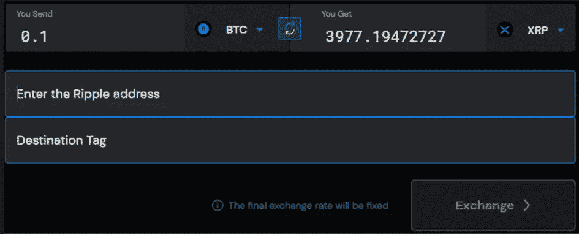
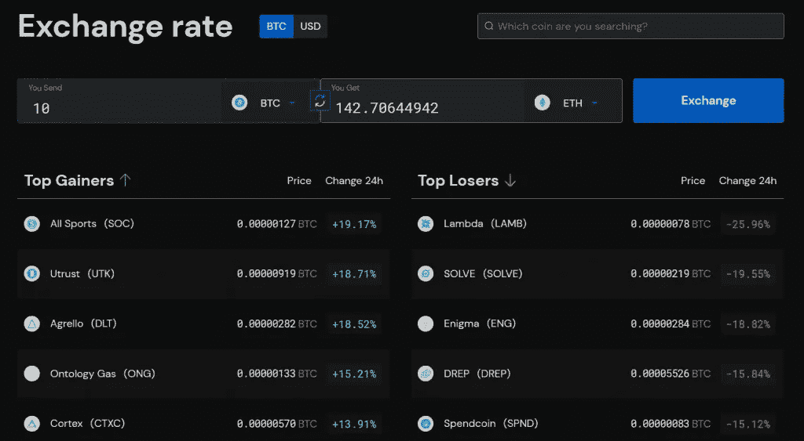
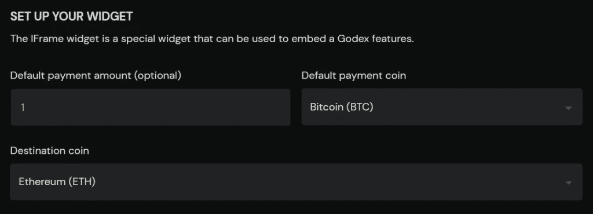
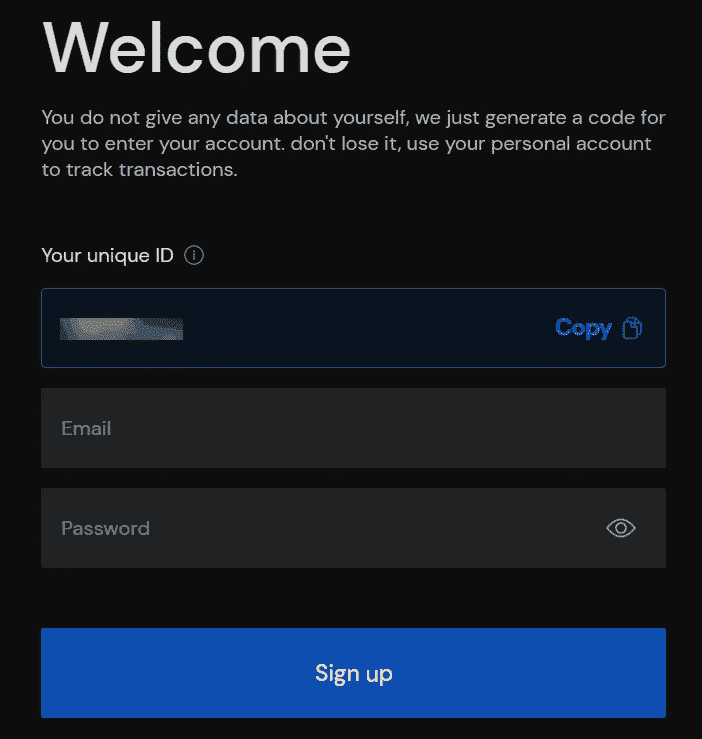
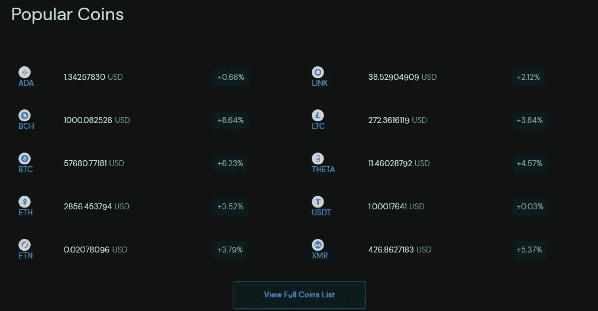
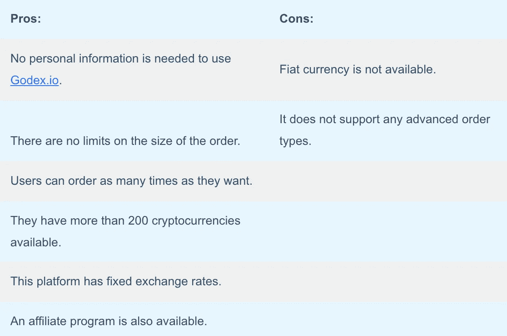
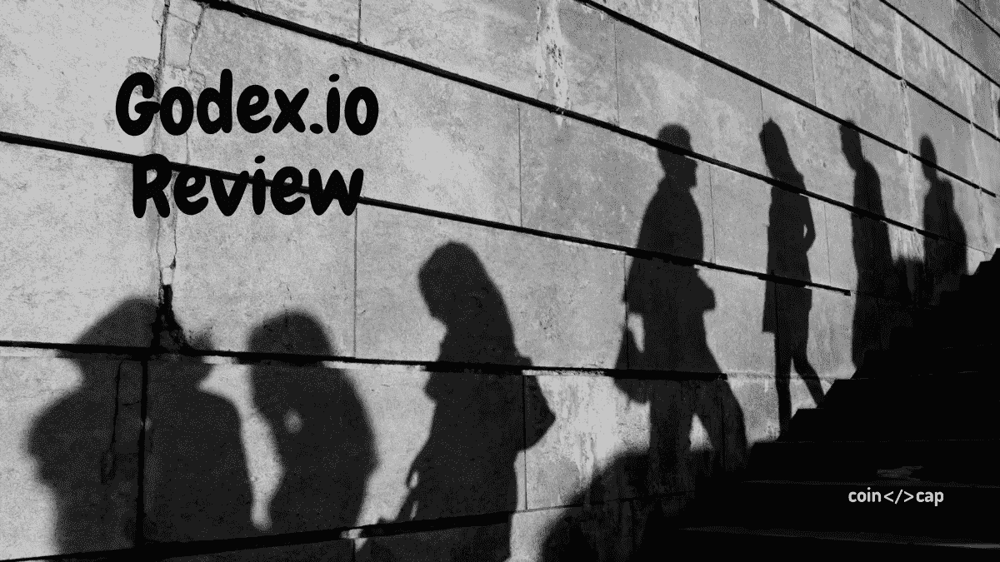

# Godex.io 评论——安全合法吗？

> 原文：<https://medium.com/coinmonks/godex-io-review-7366086519fb?source=collection_archive---------3----------------------->

本文将回顾 [**Godex**](https://coincodecap.com/go/godex) ，一个允许用户匿名兑换多种加密货币的加密货币交易平台。因为该平台拒绝收集和保留客户的个人数据。

## 摘要

*   [**Godex**](https://coincodecap.com/go/godex) 是一个专注于隐私的加密交换平台。
*   创建交易账户不是强制性的。
*   Godex 支持 200 多种加密货币。
*   订单执行只需 5-30 分钟。
*   兑换硬币没有限制。
*   用户每次交易可以兑换任意金额。
*   每日交易次数不限。
*   汇率是固定的。

## Godex.io 是什么？

[**Godex**](https://coincodecap.com/go/godex) 是一个加密货币的交换平台，允许用户私下交换不同的加密资产。 [Godex](https://blog.coincodecap.com/go/godex) 于 2018 年正式推出，主打简洁和流畅的用户体验。它的独特之处在于，用户不需要创建一个帐户来在不同的加密货币之间进行交换。

平台所有者称自己为“实业家”，因为他们在这个行业有丰富的经验。他们与主要参与者的沟通或关系以及对市场的深入了解形成了服务的原则。这使得 Godex 服务在他们不断扩大的客户名单面前具有功能性和最大的吸引力。

考虑到加密货币的隐私性和本质，Godex 交易所平台拒绝了收集和存储客户个人信息的想法。因此，通过这种方式，它尊重了用户的保密权和财务保密权。

Godex.io 目前是最快的交易所服务市场，订单执行时间从 5 分钟到 30 分钟不等。这个时间高度依赖于分散网络中的确认速度。比如超过 1 BTC 的金额需要更长的时间。用户可以放心，因为这项服务的可靠性是基于对服务器和现代安全协议的物理保护。

## Godex 是如何工作的？

*   **第一步:**你首先需要选择一对要兑换的加密货币，原币和你需要的，比如 BTC 和 XRP。汇率不会波动，将保持固定。因此，在此之后，您需要用 XRP 地址和交易加密货币将登陆的位置来填充字段。

*   **第二步:**系统会将选定金额的比特币发送到您提到的地址。这一步之后将出现一个确认窗口，再次核对所有内容。比特币交易几分钟后，Godex 最初会将 XRP 发送到你选择的地址。

请注意，这个平台说存款的时间在 5 到 30 分钟之间。如果体积在 1 BTC 以上，这个时间也可以超过。

## Godex 评论:汇率

在此部分，您可以在一个地方查看完整的硬币列表及其[汇率](https://godex.io/exchange-rate)。Godex 允许你查看比特币(BTC)和美元的价格。他们也有一个单独的部分，在那里他们提到了价值上升和下降的加密资产。

## Godex 评论:小工具

[Godex](https://coincodecap.com/go/godex) 提供了一个 IFrame 小部件，用户可以使用它将 Godex 特性嵌入到他们的程序中。您可以根据自己的选择设置默认支付金额、支付硬币和目的硬币。您还可以选择小部件的大小，以及是否要添加他们的徽标。一般来说，小部件在 HTML iframe 中提供交换接口。然而，用户可以[联系](https://godex.io/contact)他们，将小工具翻译成他们喜欢的语言。请注意，要使用这个小工具，用户必须注册会员计划。

## Godex.io:联盟计划

联盟计划给每个注册用户大约 0.005 BTC 作为奖励。除此之外，他们还可以从每笔交易中获得高达 0.6%的佣金。您还可以享受使用 [Godex](https://blog.coincodecap.com/go/godex) 小部件的优势。要成为 Godex 会员并开始赚钱，您首先必须注册。

注册过程简单；你所需要做的就是输入你的电子邮件地址和有效的密码。您还会看到一个唯一的 ID，您可以用它来进一步登录。

注册后，你会收到一封确认邮件。点击链接并确认。现在，登录您的帐户，您就可以享受这些优势了。

## Godex.io 评论:支持的加密货币

这个交易平台提供了一个具有竞争力的加密货币选择。用户可以从 200 多种不同的硬币进行交易。它还支持重要的加密货币，如比特币 BTC(2.91%)和以太坊以太币(7.10%)，以及一些更奇特的虚拟替代币。总的来说， **Godex** 在支持的硬币方面很容易与最传统的[加密货币交易所](https://blog.coincodecap.com/go/crypto-exchange)竞争。

## Godex.io:隐私

[**Godex**](https://coincodecap.com/go/godex) 对于许多加密货币爱好者来说，隐私是重中之重。它还试图迎合隐私特定的观众。要在 Godex exchange 平台上进行交易，用户不必自己注册或提供个人详细信息。锦上添花的是，Godex 还支持 Monero XMR 的集成地址，3.36%，以及 Zcash ZEC 的屏蔽地址，-1.08%。这两种硬币是当今市场上最受欢迎的隐私硬币。

## Godex.io:固定利率

您在 [**Godex**](https://blog.coincodecap.com/go/godex) 上初始化交易时看到的汇率将是您执行交易时的汇率。与其他平台不同，Godex 不会波动硬币的汇率。这个特性很有用，因为它保护用户免受交易过程中可能发生的突然波动的影响。这项服务是另一个吸引用户的地方。

## Godex.io 客户支持评论

Godex 有一个 FAQ 部分，包含与一般查询相关的信息。如果用户想直接联系他们，可以去 [Godex 联系](https://godex.io/contact)页面。联系页面有两个部分:当用户想做一个一般性的查询或问他们一些问题时。另一个用于咨询技术或客户支持。一般来说，他们会在 24 小时内回复。

## Godex.io 评论:利弊

## Godex.io 审查:结论

如果你优先考虑隐私或者重视隐私， [**Godex**](https://coincodecap.com/go/godex) 绝对是个不错的选择。它允许用户快速、无限制地交换不同的加密资产。这个交换过程很简单；所有用户必须做的是访问他们的网站，并开始交换。Godex 在 Trustpilot 上的高评级表明了其客户的满意度。但是，如果您正在寻找高级交易功能，我们建议您选择另一个平台。为此，你可以阅读[最佳加密货币交易所](https://blog.coincodecap.com/crypto-exchange)。

## 常见问题

**godex . io 合法吗？**

是的，这个平台是合法的，并且运行正常。没有关于客户丢失资金的案例或新闻，也没有关于任何安全漏洞或与泄露敏感信息有关的任何事情。但是，最好从较小的金额开始，一旦信任平台就增加金额。

**godex . io 处理用户订单的速度有多快？**

根据他们的网站，这个平台的执行时间从 5 到 30 分钟不等。这个时间取决于交易多快得到网络的确认，在区块链网络中会形成一个新的区块。另外，请注意不同的硬币需要不同的确认时间。

**用户必须注册才能加入联盟计划吗？**

要成为 [Godex.io](https://blog.coincodecap.com/go/godex) 的附属合作伙伴，快速开始赚钱，Godex.io 有一个简单的注册过程。需要它来访问会员链接、用户余额、小部件等等。

***包括附属链接**

