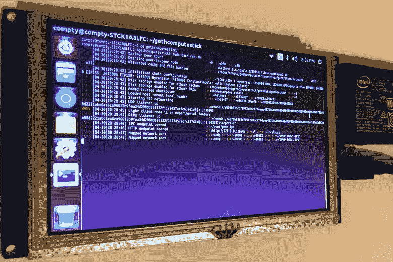

# 以低廉的价格实现完全去中心化

> 原文：<https://medium.com/coinmonks/going-fully-decentralized-on-the-cheap-33e6e718131a?source=collection_archive---------4----------------------->


## 以 35 美元的硬件成本建立一个“轻型”Geth 节点

获得以太坊钱包最便宜也最容易的方式是通过 [MetaMask](https://metamask.io/) 或[Trust](https://trustwalletapp.com/)/[Cipher](https://www.cipherbrowser.com/)/[Toshi](https://www.toshi.org/)。这些公司都有一些不同的网络选项，从他们自己的服务器到 Infura。但是，如果我们想完全去中心化，控制一个直接与以太坊网络对话的节点呢？

首先，我应该赞扬彼得·斯拉吉(péter szilágyi)的平稳运行:

我选择了我能在亚马逊上找到的最便宜的机器:[英特尔 BOXSTCK1A8LFC 计算棒](https://www.amazon.com/Intel-Corp-BOXSTCK1A8LFC-Compute-STCK1A8LFC/dp/B00W7KAABK)。它拥有足够的计算能力和存储空间，能够在“轻”模式下满足区块链的需求。


Intel Compute Stick

拆开计算棒的包装，连接键盘、鼠标和显示器。你可能也需要一个 USB 集线器。为了奖励积分，我将把我的连接到一个 [$40 的触摸屏显示器](https://www.amazon.com/gp/product/B01L6O2NEE):


当 Ubuntu 第一次启动时，你将经历设置语言、wifi、密码和更新。现在要注意的是，如果你搞砸了什么，你可以重启你的电脑棒，恢复出厂设置。这会让你重新开始。


“Restore to factory state” in Grub

当操作系统准备就绪时，您将需要启动一个终端。(Ctrl + Alt + T)然后，运行以下命令来安装 git:

```
sudo apt-get update
sudo apt-get install git -y
```

一旦安装了 git，您就可以克隆存储库，因此您不必担心其余的配置，我们可以运行准备好的脚本！我写了一组快速的开源 bash 脚本，任何人都可以在这里使用和贡献:

[](https://github.com/austintgriffith/gethcomputestick) [## Austin Griffith/gethcomputerstick

### 在 GitHub 上创建一个帐户，为 gethcomputestick 开发做贡献。

github.com](https://github.com/austintgriffith/gethcomputestick) 

```
git clone https://github.com/austintgriffith/gethcomputestick.git
cd gethcomputestick
```

现在您可以安装 Geth 了:

```
sudo bash install.sh
```

您可以通过以下方式启动 Geth 节点:

```
sudo bash run.sh
```



一分钟后，您将开始实时同步块:


I went to bed after firing it up so I have no idea how long it took to sync, sorry :)

现在，您已经在端口 8545 上启动并运行了一个本地 Geth 节点，它具有开放的 CORS 和完全的 RPC 访问权限。

警告:你不应该在公共网络上这样做。

如果您想将 USB 棒用于多个可以换出的帐户，run.sh 已经配置为在本地驱动器上运行 IPC 节点。你需要做的只是将上面的报告复制到 u 盘上:

```
cd /media/*nameofthecomputestick*/*nameoftheusb*
git clone https://github.com/austintgriffith/gethcomputestick.git
cd gethcomputestick
sudo bash install.sh
sudo bash run.sh
```

(如果您正面临存储限制，这也很方便。)

从这里开始，我通常会启动一些从命令行运行的节点脚本，并编排我的智能合约功能( [clevis.io](https://github.com/austintgriffith/clevis) )，但是让我们使用更容易理解的元掩码:


Selecting the **local** Geth RPC from MetaMask (Localhost 8545)

如果选择 Localhost 8545，MetaMask 将与您的本地 Geth 节点对话，而不是与其他“集中式”系统对话。


Making a fully decentralized transaction!

所以我们有它！您的本地节点让您无需接触任何中央系统即可访问以太坊网络，并且只需 35 美元！

让我们玩得更开心一点，无耻地插几个我的 Dapps:


Playing [Cryptogs.io](https://cryptogs.io) was really, really slow on that cheap processor.


[Galleass.io](https://galleass.io) looks pretty weird on that cheap screen too! Heck, it looks pretty weird all the time…

我所有的脚本/游戏都是开源的:【https://github.com/austintgriffith 

请在 [Twitter](https://twitter.com/austingriffith) 或[peepes](https://peepeth.com/austingriffith)上给我留言或建议。

在这里了解更多关于我的信息:[https://austingriffith.com](https://austingriffith.com)谢谢！

