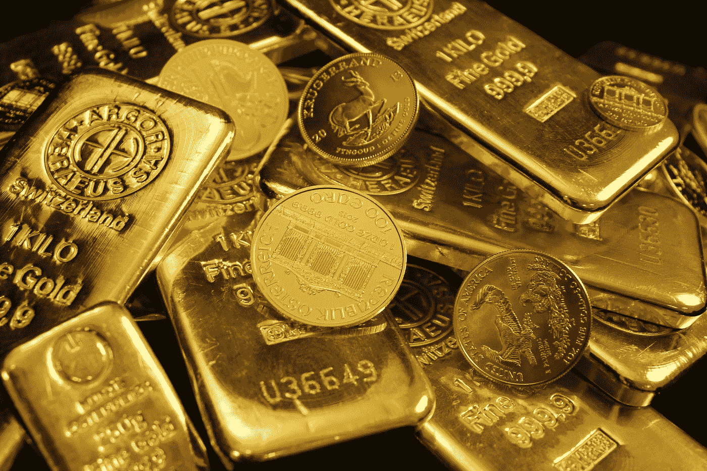

# 黄金:我保持看涨的三个理由

> 原文：<https://medium.com/coinmonks/gold-3-reasons-why-i-remain-bullish-54dee1065516?source=collection_archive---------2----------------------->

## 以及为什么每个人都应该考虑在自己的投资组合中持有一些

Photo by [Zlaťáky.cz](https://unsplash.com/@zlataky?utm_source=medium&utm_medium=referral) on [Unsplash](https://unsplash.com?utm_source=medium&utm_medium=referral)

我必须承认，在我投资的过去 20 年的大部分时间里，我从未对持有黄金感兴趣。我在短期内交易它已经很多年了，但是从来没有把它看作是我长期“买入并持有”投资策略的一个关键部分。