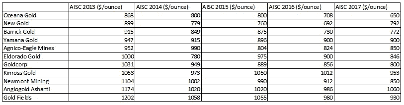

# 黄金和 BTC 成本分析:以黄金计算，比特币的价格将远高于今天的 7000 美元。

> 原文：<https://medium.com/coinmonks/gold-and-btc-cost-analysis-bitcoin-in-gold-terms-would-be-substantially-higher-in-price-than-9e44f43a55d6?source=collection_archive---------7----------------------->

Photo by [Glenn Carstens-Peters](https://unsplash.com/@glenncarstenspeters?utm_source=medium&utm_medium=referral) on [Unsplash](https://unsplash.com?utm_source=medium&utm_medium=referral)

更新(2020 年 6 月):自这篇文章首次发表以来，已经过去了两年多。当时黄金 1330，比特币 7000。有趣的是，此后两者都上涨了约 30%。有趣的是，从 2 年前的角度来看每一个的成本基础，并了解估值争论如何强烈地转向两者的库存到流量分析。此外，从那时起，比特币的表现就更像黄金，因为与价值稀缺商店的采用相比，零售层面的使用采用相形见绌。然而，即便如此，比特币与股票的关联度还是高于黄金。因此，我想把这篇旧文章拿出来，让那些对这些话题感兴趣的人重读。(顺便说一句——我喜欢上面的对比照片——这是您对哪个项目对应于哪个资产的猜测！)

在本文中，我们将从生产成本方面比较黄金和[比特币](https://blog.coincodecap.com/a-candid-explanation-of-bitcoin/)，并尝试得出一些比较结论。

黄金
黄金 AISC 是指黄金的全部维持成本。根据世界黄金协会，这包括生产黄金的每一项成本，除了未来的非持续性成本，如新的开采。

[https://www . gold . org/news-and-events/press-releases/world-gold-Council-guidance-note-non-GAAP-metrics-all-sustaining](https://www.gold.org/news-and-events/press-releases/world-gold-council-guidance-note-non-gaap-metrics-all-sustaining)

目前来看，AISC 是充分反映黄金现金成本基础的良好指标。自 2013 年以来，这一数字下降了约 15%，至约 850 美元。相比之下，公司的成本基础包括运营成本之上的资本支出和资本化费用。

因此，以 1330 美元的市场价计算，矿商的黄金现金利润率为 480 美元(减去交易费等)。这是一个巨大的差额还是一个不可持续的高数字，时间将会证明。在此期间，美元的相对价值和风险意识似乎扮演着更为重要的角色。

..

比特币
现在我们从比特币的角度来看..

首先，比特币的数字稀缺性是有上限的。在这方面，可以比作黄金。随着时间的推移，它的供应增长远低于黄金，而且增长路径是可以预测的。比特币和黄金都有生产成本，后者如上所述，比特币是因为其工作证明算法，除了劳动力和管理成本之外，还将设备和电力等物理费用联系起来。

这是一张电费表:

现在我们可以一步一步地开发比特币的成本基础..

A.装备

亚马逊列出了 1700 美元的 Antminer S9。加上运输、安装和额外的硬件成本，我们估计至少需要 2，000 美元来进行安装。

[https://www . Amazon . com/ant miner-S9-13-0TH-0-098 w-bit coin/DP/b 01 hfx q 7 ag](https://www.amazon.com/AntMiner-S9-13-0TH-0-098W-Bitcoin/dp/B01HFXQ7AG)

有了这个设置，你将获得 13 级(terra hashes)力量。鉴于目前的困难，该电力公司每月开采 0.0283 BTC。根据相当保守的估计，从这一点开始，网络功率每年增长 100%，该采矿机在第一年每月将产生约 0.021 BTC，然后在第二年接近 0.0105 BTC，并在第二年减半。

所以三年后，这个钻机将生产大约 0.5 BTC。如果我们将成本转换为 1 BTC，那么设备成本将为 4，000 美元，并且假设这 3 年内任何设备都没有维护成本，那么设备已经相当陈旧。此外，在此使用期过后，我们将为设备分配 0 残值。

https://alloscomp.com/bitcoin/calculator

B.电流

各地差异巨大，但如果我们以美国为参照，我们可以使用每 1 BTC 4，800 美元，这实际上是低估了，因为在开采范围内生产相同的 BTC 需要每 0.xxx 单位 BTC 更多的电力。我们暂时不考虑这一点。

C.劳动

鉴于这不是一个高度劳动密集型的行业，让我们假设所有的劳动力成本，包括管理成本为电力成本的 1/4。

D.行政费用

这是一个广泛的话题，包括会计、租赁、法律、仓库费用等等。目前，让我们假设它与劳动力成本相同。

E.其他人

用于其他成本的插件，目前将被分配为 0。

..

结论
将所有成本加起来，在美国开采比特币的 AISC 成本为 9200 美元。如果电费是美国平均水平的 1/2，那么电费可以降到 5600 美元。在本例中，将使用这两者的平均值，即 7，400 美元。

我认为这种分析忽视了组织成本、风险和业务连续性问题。为此，AISC 可比成本可能会更高。然而，鉴于电力成本显著降低，这种情况将得到缓解。然而，随着网络难度和总开销的增加，这些成本也会增加。

因此，黄金的成本基数为 850 美元，价格为 1330 美元。

比特币的成本基础是 7400 美元，目前的价格是 7000 美元。

生活中的一切都是不可比的，但如果这两种资产在某种程度上是可比的，那么要么黄金必须降到 850 美元以下才能具有可比性，要么比特币必须涨到 11，500 美元。或者，黄金可能会下跌一些，而比特币的涨幅可能会低于这一水平。

未来几天可能什么都不会发生，但很明显，目前比特币并未受益于黄金的安全价值。然而，生产成本和投资团体将挑选这些细节，对它们进行阐述，只要 BTC 网络继续发挥作用和创新，我不会对这些因素在不久的将来导致合理的更高价格感到惊讶。

> [在您的收件箱中直接获得最佳软件交易](https://coincodecap.com/?utm_source=coinmonks)

