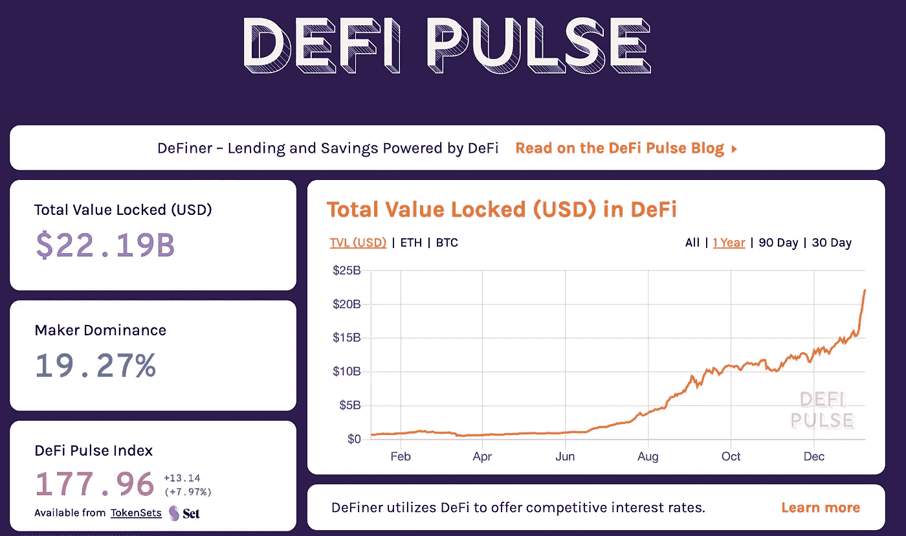
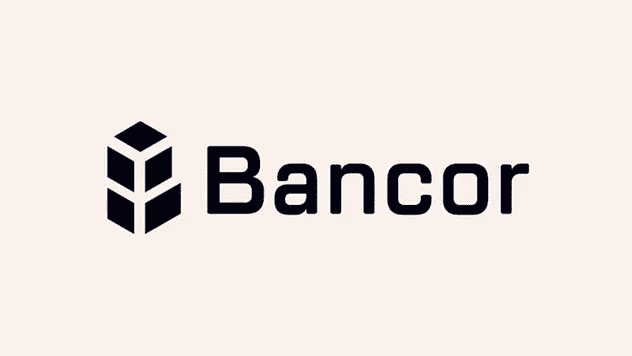
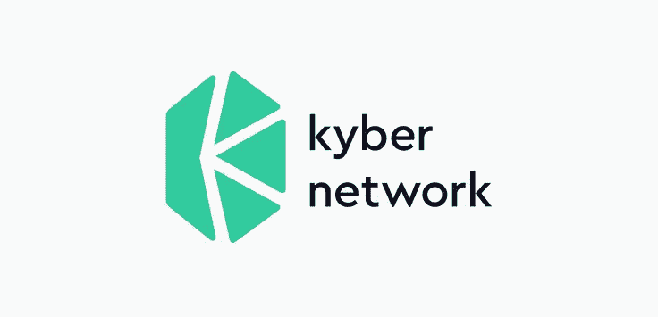
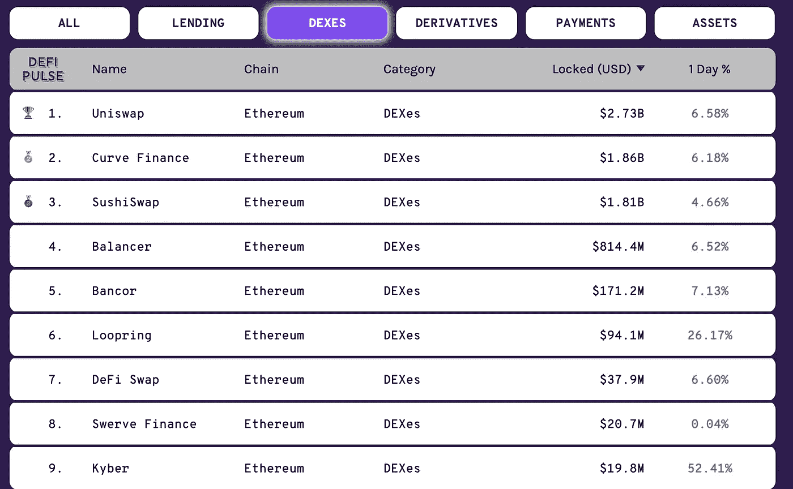
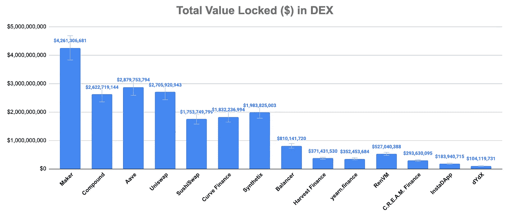
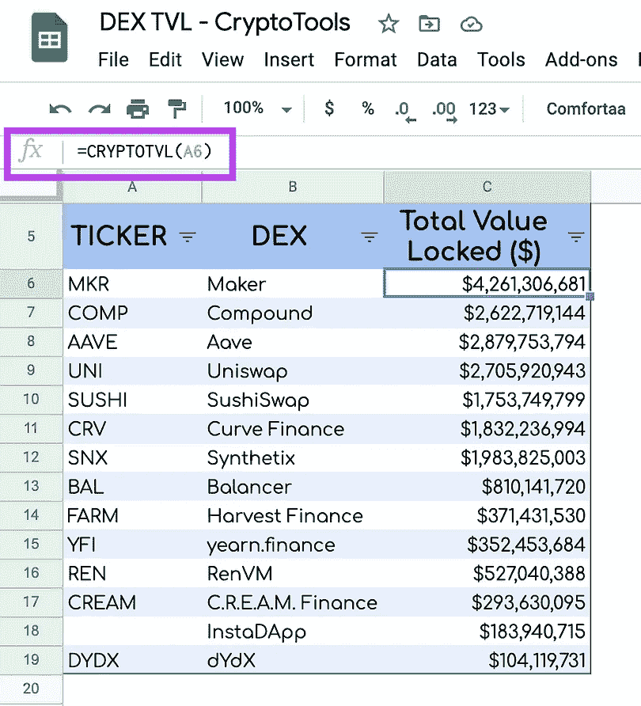
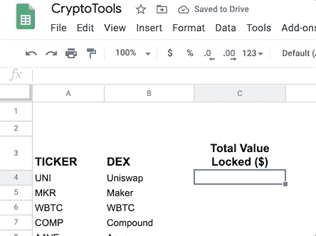

# Google Sheets Analytics:总价值锁定在 DeFi

> 原文：<https://medium.com/coinmonks/google-sheets-analytics-total-value-locked-in-defi-33b926c18a9f?source=collection_archive---------1----------------------->

Source: [https://defipulse.com/](https://defipulse.com/)

> [此处为实时谷歌表单](https://docs.google.com/spreadsheets/d/1IlFNnejkiuxbzS6aSQZWJPv-TmUw7jSajo8_iW_kK3Y/edit?usp=sharing)

# 什么是 TVL——锁定在 DeFi 中的总价值？

根据[【ZDL】密码维基](https://zdl-crypto.fandom.com/)*[*多*](https://defirate.com/)*[*DeFi*](https://zdl-crypto.fandom.com/wiki/DeFi)*追踪站点使用总锁定值(TVL)作为参考点。简而言之，* ***TVL 代表当前在特定协议*** *中下注的资产数量。该值绝不代表未偿还贷款的金额，而是由特定应用和/或 DeFi 整体担保的基础供应总量。”***

******TVL 测量锁定在这些 dapp 中的*** [***令牌***](https://zdl-crypto.fandom.com/wiki/Tokens) ***的总值，其论点是锁定在 DeFi dapp 中的值越高越好。******

************

**Decentralized exchange networks examples: Uniswap, Bancor, Kyber Network**

*****我们要反驳的是，这可能是一个比较流动性提供者的扭曲指标，因为它没有考虑每单位锁定令牌的利用率*** *。比如说；* [*Uniswap*](https://zdl-crypto.fandom.com/wiki/Uniswap) *上的每个令牌对都需要自己单独的*[*ETH*](https://zdl-crypto.fandom.com/wiki/ETH)*池。另一方面，凯博储备管理公司可以为来自同一个 ETH 池的多个代币提供流动性。1 ETH 可能服务于 10 个不同的* [*ERC20 令牌*](https://zdl-crypto.fandom.com/wiki/ERC20_tokens)*【Kyber 上的流动性需求，而 Uniswap 将需要 10 个 ETH 来服务于同样的 10 个令牌。因此，Kyber Network 需要更少的锁定资产来提供相同水平的流动性(正如 Kyber 的紧密利差和低滑点所证实的那样)，因此，在 Kyber 锁定的 100 万美元不同于在 Uniswap 锁定的 100 万美元或在*[*Bancor*](https://zdl-crypto.fandom.com/wiki/Bancor)*锁定的 100 万美元。”***

# **数字**

**2018 年，TVL 增长了两倍多，从 7000 万美元增长到 3 亿美元。**

**2019 年，截至 2019 年 12 月 31 日，增长了一倍多，达到 6.67 亿美元。**

**2020 年 6 月 2 日，该公司市值突破 10 亿美元。**

**截至今天(1 月 7 日。2021 年)，市值突破 200 亿美元。**

# **去哪里找 TVL？**

## **[来自 DeFi 数据和可视化资源](/coinmonks/defi-resources-and-data-visualization-9aff00842cdc)作者@vivekcrypto**

**[**DeFi 脉冲(DeFipulse.com)**](https://defipulse.com/)**是寻找高水平 DeFi 数据的绝佳资源**和起点。**总值“锁定”数据点显示了在 DeFi 生态系统中使用的比特币、以太坊或 DAI 的总数**。以太坊上的贷款、衍生产品、支付、交换和资产协议的这些数据被跟踪并制成图表。主页列出了所有协议及其锁定总值排名。每个协议页面都有关键的增长统计数据、简单的图表、应用摘要和相关链接。DeFi 列表页面有一套完整的资源，包括项目、钱包、界面、时事通讯和播客。**

****

**Source: [https://defipulse.com/](https://defipulse.com/)**

# **用于数据分析目的的谷歌工作表中的 TVL**

## **密码函数**

**我创建了 CRYPTOTVL 函数，在集中交换(DEX)中获取锁定的总值($)。以下是一些可用的平台:**

***uni swap Maker WBTC Compound Aave Curve Finance Synthetix Harvest Finance earn . Finance Balancer sushi swap insta dapp c . r . e . a . m . Finance Nexus Mutual dForce Flexa ms table dYdX Set 协议 DODO Bancor looping Lightning Network bZx Kyber Gnosis PieDAO Melon RenVM 等…***

**语法:***cryptovl*(id，[可选刷新属性])****

*****第一个参数:****DEX 的代号或名称 ex: compound、AAVE、UNI、Uniswap。* ***第二个参数*** *一个可选的固定单元格用于自动刷新数据，此参数***

> **[此处为实时谷歌表单](https://docs.google.com/spreadsheets/d/1IlFNnejkiuxbzS6aSQZWJPv-TmUw7jSajo8_iW_kK3Y/edit?usp=sharing)**

****

**Source : [Google Sheets](https://docs.google.com/spreadsheets/d/1IlFNnejkiuxbzS6aSQZWJPv-TmUw7jSajo8_iW_kK3Y/edit?usp=sharing)**

******

=CRYPTOTVL(“UNI”)** 

**上面的例子显示了如何获取 Uniswap 中锁定的总金额。**

# **一些批评家认为 TVL 是一个评估标准**

**[*“孤立的 TVL 是一个* ***不完全的度量*** *。首先，以美元计价的 TVL 有点误导，通常是由 ETH 价格波动驱动的。此外，对于将抵押品锁定在 ETH 和像戴这样的稳定货币的项目，当 ETH 价格下降时，以 ETH 计价的 TVL 实际上增加了，因为戴/ETH 价格比率变大，反之亦然。*](https://zdl-crypto.fandom.com/wiki/Total_Locked_Value_(TLV))**

***需要查看* ***用户总数，以补充*** *锁定的总值，并提供更全面的 DeFi 采用视图***

**这是正在进行的工作。如果你发现错误，请不要犹豫让我知道。非常欢迎反馈。一个 [*电报聊天*](https://t.me/TheCryptoCurious) *也可供支持。如果这个项目为你增加了任何价值，或者正在你的谷歌表单上寻找个性化编码，请不要犹豫，留下你的信息。***

***所表达的观点仅供一般参考，是* ***而非*** *旨在为任何个人或任何特定的证券或投资产品提供具体的* ***建议*** *或推荐。它只是为了提供关于* ***金融*** *行业的教育。***

**非常感谢你花时间阅读这篇文章。**

**在这个充满挑战的时代，照顾好你自己和你的家人！2021 新年快乐！**

> **加入 Coinmonks [Telegram group](https://t.me/joinchat/EPmjKpNYwRMsBI4p) 并了解加密交易和投资**

## **另外，阅读**

*   **[学习以太坊和 Web3 开发](http://blog.coincodecap.com/go/learn)**
*   **最好的[密码交易机器人](/coinmonks/crypto-trading-bot-c2ffce8acb2a)**
*   **[3 商业评论](/coinmonks/3commas-review-an-excellent-crypto-trading-bot-2020-1313a58bec92)**
*   **[Pionex 审查](/coinmonks/pionex-review-exchange-with-crypto-trading-bot-1e459d0191ea)**
*   **[AAX 交易所评论](/coinmonks/aax-exchange-review-2021-67c5ea09330c) |推荐代码、交易费用、利弊**
*   **[Deribit 审查](/coinmonks/deribit-review-options-fees-apis-and-testnet-2ca16c4bbdb2) |选项、费用、API 和 Testnet**
*   **[FTX 密码交易所评论](/coinmonks/ftx-crypto-exchange-review-53664ac1198f)**
*   **[n 零审核](/coinmonks/ngrave-zero-review-c465cf8307fc)**
*   **[Bybit 交换审查](/coinmonks/bybit-exchange-review-dbd570019b71)**
*   **3Commas vs Cryptohopper**
*   **最好的比特币[硬件钱包](/coinmonks/the-best-cryptocurrency-hardware-wallets-of-2020-e28b1c124069?source=friends_link&sk=324dd9ff8556ab578d71e7ad7658ad7c)**
*   **[密码本交易平台](/coinmonks/top-10-crypto-copy-trading-platforms-for-beginners-d0c37c7d698c)**
*   **[莱杰纳米 s vs x](https://blog.coincodecap.com/ledger-nano-s-vs-x)**
*   **[沃德评论](https://blog.coincodecap.com/vauld-review)**
*   **最好的[加密税务软件](/coinmonks/best-crypto-tax-tool-for-my-money-72d4b430816b)**
*   **[最佳加密交易平台](/coinmonks/the-best-crypto-trading-platforms-in-2020-the-definitive-guide-updated-c72f8b874555)**
*   **最佳[加密贷款平台](/coinmonks/top-5-crypto-lending-platforms-in-2020-that-you-need-to-know-a1b675cec3fa)**
*   **[莱杰纳米 S vs 特雷佐 one vs 特雷佐 T vs 莱杰纳米 X](https://blog.coincodecap.com/ledger-nano-s-vs-trezor-one-ledger-nano-x-trezor-t)**
*   **[block fi vs Celsius](/coinmonks/blockfi-vs-celsius-vs-hodlnaut-8a1cc8c26630)vs Hodlnaut**
*   **Bitsgap 评论——一个轻松赚钱的加密交易机器人**
*   **[Quadency Review](/coinmonks/quadency-review-a-crypto-trading-automation-platform-3068eaa374e1) -为专业人士打造的加密交易机器人**
*   **[硬币追踪评论](/coinmonks/cointracking-review-a-reliable-cryptocurrency-tax-software-5114e3eb5737)**
*   **[YouHodler 点评](/coinmonks/youhodler-4-easy-ways-to-make-money-98969b9689f2)**
*   **[埃利帕尔泰坦评论](/coinmonks/ellipal-titan-review-85e9071dd029)**
*   **[SecuX Stone 评论](https://blog.coincodecap.com/secux-stone-hardware-wallet-review)**
*   **[BlockFi 评论](/coinmonks/blockfi-review-53096053c097) |赚取高达 8.6%的加密利息**
*   **[共同规则审查](https://blog.coincodecap.com/coinrule-review-a-perfect-trading-bot)**
*   **[最佳区块链分析工具](https://bitquery.io/blog/best-blockchain-analysis-tools-and-software)**
*   **[加密套利](/coinmonks/crypto-arbitrage-guide-how-to-make-money-as-a-beginner-62bfe5c868f6)指南:新手如何赚钱**
*   **最佳加密制图工具**
*   **了解比特币的[最佳书籍有哪些？](/coinmonks/what-are-the-best-books-to-learn-bitcoin-409aeb9aff4b)**

> **[直接在您的收件箱中获得最佳软件交易](/coinmonks/newsletters/coinmonks)**

****