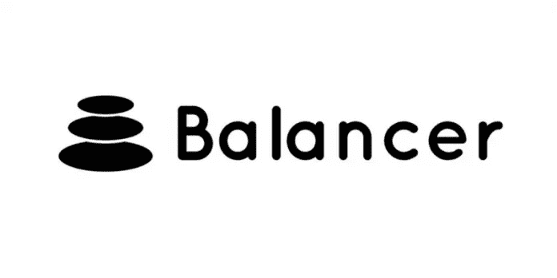
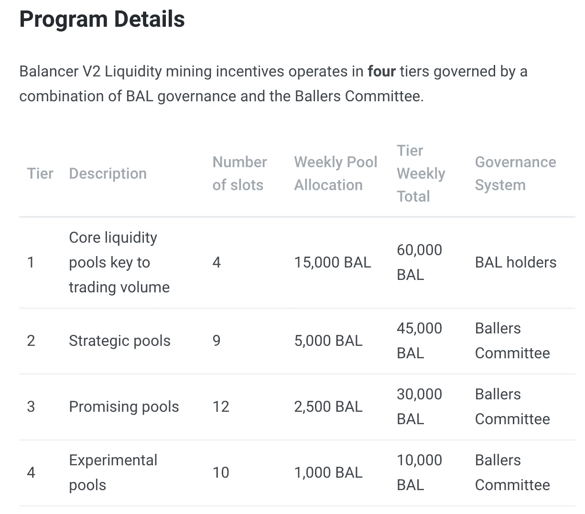

# 治理节拍—平衡器

> 原文：<https://medium.com/coinmonks/governance-beat-balancer-72948458a819?source=collection_archive---------12----------------------->

你有多少次进入 LP 头寸，几个小时后才发现你的三位数 APY 迅速缩水？这是加密货币世界中的一个现实问题——一个 DeFi 爱好者都太熟悉的问题。先是汽油价格将大众引向 Polygon，现在奖励的减少将他们引向一场永无止境的跳房子游戏，从一个池子跳到另一个池子。所有这些跳来跳去为项目的 TVL 创造了一个混乱的景观。不一定是理想的，特别是对于那些被抛弃的供应商来说，他们不得不做出非永久性损失或传统回报的决定。就在上周，[平衡器协议](https://medium.com/balancer-protocol)进行了一次有趣的治理投票来解决这个问题。如果你错过了，最近的提案， [**“用灵活的 BAL 替换多边形上的流动性挖掘层”**](https://snapshot.org/#/balancer.eth/proposal/QmQiatrqfsNZ4eSPCwBwaujBujwzhu2QqHEBSHqEoXs8g5) 于 10 月 1 日以 98.98%的赞成率(337.63k BAL)通过。

首先，什么是流动性挖掘层？要更好地理解 Balancer 上的挖掘层系统，请参考下面的。

*Source:* [*Balancer*](https://docs.balancer.fi/gov-initiatives/liquidity-mining)

这个系统是一个治理倡议平衡器，用于解决加密可以移动的闪电般的速度(如上所述)。它允许协议通过持续瞄准更有利的池来吸引更多的流动性。周五批准的内容偏离了这一计划。虽然目前只在[多边形](https://medium.com/u/ea91a1cf958?source=post_page-----72948458a819--------------------------------)网络上，但如果成功，目的是扩大实施。

该提案用 25，000 BAL/周的灵活 BAL 分配取代了采矿层，供 Ballers 委员会做他们认为合适的事情。(Ballers 委员会在之前的投票中获得了分配权力，您可以在此处查看。)该提案概述了其“动机如下:

> 像这样引入完全灵活性的一个核心好处是，当流动性挖掘委员会希望激励一个新的池时，它可以很容易地从多个池中取走少量的 BAL，而不是不得不从非常少的池中大幅贬值或减少奖励，这往往会导致 TVL 外逃。

该协议的观察结果是，快速的奖励减少会引发移民，而微小的减少在很大程度上维持了流动性。灵活的余额分配将允许协议激励更多的池，并在未来的合作机会中更加灵活，从而提高平衡器的整体 TVL。

虽然 Balancer 拥有独特的配置来采用这样的解决方案，但这可能标志着 AMMs 趋势的全面转变。TVL 航班问题非常普遍，对所有相关方都有负面影响。也许这给了 Balancer 一个有竞争力的市场优势，动员其他 AMM 提供有意义的反驳。

*—布兰登·戈斯*

> 加入 Coinmonks [电报频道](https://t.me/coincodecap)和 [Youtube 频道](https://www.youtube.com/c/coinmonks/videos)了解加密交易和投资

## 另外，阅读

*   [尤霍德勒 vs 科恩洛 vs 霍德诺特](/coinmonks/youhodler-vs-coinloan-vs-hodlnaut-b1050acde55a) | [Cryptohopper vs 哈斯博特](https://blog.coincodecap.com/cryptohopper-vs-haasbot)
*   [如何匿名购买比特币](https://blog.coincodecap.com/buy-bitcoin-anonymously) | [比特币现金钱包](https://blog.coincodecap.com/bitcoin-cash-wallets)
*   [币安 vs FTX](https://blog.coincodecap.com/binance-vs-ftx) | [最佳(SOL)索拉纳钱包](https://blog.coincodecap.com/solana-wallets)
*   [如何在 Uniswap 上交换加密？](https://blog.coincodecap.com/swap-crypto-on-uniswap)
*   [加密保证金交易交易所](/coinmonks/crypto-margin-trading-exchanges-428b1f7ad108) | [赚取比特币](/coinmonks/earn-bitcoin-6e8bd3c592d9) | [Mudrex 投资](https://blog.coincodecap.com/mudrex-invest-review-the-best-way-to-invest-in-crypto)