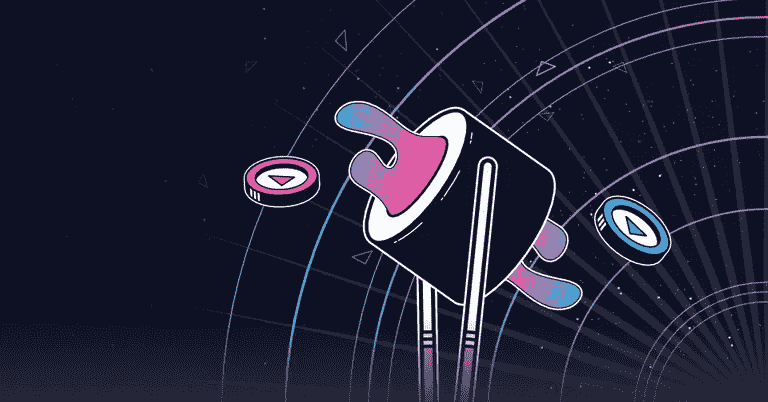
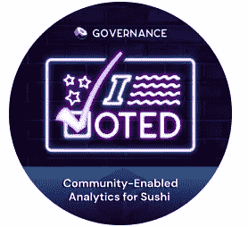

# 治理节拍——寿司 CEA

> 原文：<https://medium.com/coinmonks/governance-beat-sushi-cea-d6098be62dac?source=collection_archive---------9----------------------->

通常，我们会报道最近关闭的治理投票，但让机构群体了解正在进行的投票也很重要，这样他们就可以参与进来。毕竟，这是这些职位背后的驱动力——提高选民参与度。因此，我们将在美国东部时间明天下午 3:00 研究最新的 SushiSwap 提案。

$SUSHI 持有者目前正在就一项提案进行投票，该提案将实施一项社区支持的分析(CEA)计划，该计划每年资助约 500 名分析师，以解决协议的实时分析问题。提案的细节很长，但你可以在这里查看全部内容[。](https://forum.sushi.com/t/proposal-community-enabled-analytics-for-sushi/5516)

## 什么是社区支持的分析？

> 社区支持分析(CEA)是一个免费的分析解决方案，结合了广泛的奖金计划，旨在奖励社区成员了解、分析和发布区块链数据。

需要明确的是，CEA 是一个由 [Flipside Crypto](https://medium.com/u/5122969a34a0?source=post_page-----d6098be62dac--------------------------------) 提供支持的分析平台，Flipside Crypto 是一家广受尊敬和使用的区块链分析供应商。这是一次非常严肃和有影响力的投票，是在大规模和分散的层面上进行的。看到在这个行业中有多少不同形式的治理是令人兴奋的。在这篇短文中，我们将涵盖要点，如果你有投票权，希望能激励你参与 SushiSwap 的治理。

# 主要要点

## 提供资金

*   CEA 资助:100 万美元(以寿司计价)，每年更新
*   50%以奖金形式给 CEA 社区(41，667 美元/月)
*   50%用于补贴运营和基础设施成本(41，667 美元/月)

## 动机

*   **需求/增长** -需要提供广泛的分析资源来发展 SushiSwap Trident
*   **收购** -教育&奖励计划平均有 69%的新协议用户参与
*   **保留率** -在可比较的协议程序(ALCX、COMP、UNI、TERRA)中，用户平均持有 77%的绑定令牌。相比之下，流动性挖掘计划的绑定令牌保留率很少超过 35% (TVL 外逃，在之前的治理节拍[中讨论过，此处](/coinmonks/governance-beat-balancer-72948458a819))。

## 疏忽

*   由 5 名机构群体选出的成员组成的委员会将每季度召开一次会议，以确保按照预期目的和范围实施拨款
*   需要通过投票进行年度计划更新

## 第 1 年预测

*   460 名受过教育的分析师为 SushiSwap 提供按需见解
*   生态系统中保留了约 27，000 美元的寿司
*   350 多种独特的仪表板、查询、可视化和深入分析，以及包括 Trident 集中流动性计算器在内的高级交互式解决方案

## 行动

*   点击此处阅读完整的治理提案
*   如果你持有$寿司，可以考虑在这里投

你觉得怎么样？？如果你想成为那些致力于奖金的分析师之一，听起来很令人兴奋。但更重要的是，将这些数据合成并以易于理解的格式呈现出来，将对该协议的发展大有裨益。这只是 DeFi 引领我们进入全球金融新时代所需的垫脚石之一。

*—布兰登·戈斯*

注意:请对治理事件的任何不准确的发现或其他细节进行评论。治理节拍是出于教育目的，只是为了扩大协议治理的覆盖范围和讨论。

参考

[1]寿司论坛，*提案:寿司的社区化分析*，[https://Forum . Sushi . com/t/Proposal-Community-Enabled-Analytics-for-Sushi/5516](https://forum.sushi.com/t/proposal-community-enabled-analytics-for-sushi/5516)

> 加入 Coinmonks [电报频道](https://t.me/coincodecap)和 [Youtube 频道](https://www.youtube.com/c/coinmonks/videos)了解加密交易和投资

## 也阅读

*   [BigONE 交易所评论](/coinmonks/bigone-exchange-review-64705d85a1d4) | [CEX。IO 审查](https://blog.coincodecap.com/cex-io-review) | [交换区审查](/coinmonks/swapzone-review-crypto-exchange-data-aggregator-e0ad78e55ed7)
*   [最佳比特币保证金交易](/coinmonks/bitcoin-margin-trading-exchange-bcbfcbf7b8e3) | [比特币保证金交易](https://blog.coincodecap.com/bityard-margin-trading)
*   [加密保证金交易交易所](/coinmonks/crypto-margin-trading-exchanges-428b1f7ad108) | [赚取比特币](/coinmonks/earn-bitcoin-6e8bd3c592d9)
*   [WazirX vs CoinDCX vs bit bns](/coinmonks/wazirx-vs-coindcx-vs-bitbns-149f4f19a2f1)|[block fi vs coin loan vs Nexo](/coinmonks/blockfi-vs-coinloan-vs-nexo-cb624635230d)
*   [BlockFi 信用卡](https://blog.coincodecap.com/blockfi-credit-card) | [如何在币安购买比特币](https://blog.coincodecap.com/buy-bitcoin-binance)
*   [火币交易机器人](https://blog.coincodecap.com/huobi-trading-bot) | [如何购买 ADA](https://blog.coincodecap.com/buy-ada-cardano) | [Geco？一次回顾](https://blog.coincodecap.com/geco-one-review)
*   [加密副本交易平台](/coinmonks/top-10-crypto-copy-trading-platforms-for-beginners-d0c37c7d698c) | [五大 BlockFi 替代方案](https://blog.coincodecap.com/blockfi-alternatives)