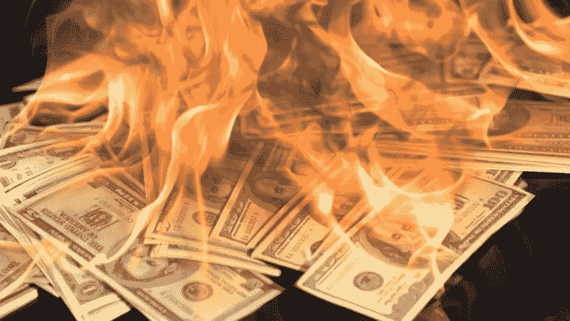

# 政府违约不可避免

> 原文：<https://medium.com/coinmonks/government-default-is-inevitable-15380824872d?source=collection_archive---------4----------------------->

我们的世界正被债务淹没。美国政府最近决定将债务限额进一步提高 2.5 万亿美元，达到约 31.4 万亿美元。尽管共和党众议员阿灵顿称“我们并未处于战争之中”，但债务限额仍处于二战以来的最高水平。[【1】](https://www.reuters.com/markets/rates-bonds/us-congress-vote-debt-limit-hike-averting-default-risk-2021-12-14/)

然而，随着世界各国政府因可怕的奥米克隆变种再次宣布限制，我们似乎正在与 COVID 进行一场持久的战争。我国最近宣布了另一项全面封锁，以拉平曲线。[【2】](https://nos.nl/artikel/2409934-omt-adviseert-harde-lockdown-vandaag-spoedoverleg-kabinet)我怀疑所有这些措施都不能有效减少债务负担，但这只是我的看法。

**如此高的债务与 GDP 比率意味着什么？**

美国债务占 GDP 的比例去年达到 130%，随着债务限额的提高，这一比例似乎有可能进一步增长。债务负担达到了比二战时期更高的水平。

*Source: Longtermtrends.net — U.S. total public debt-to-GDP ratio.*

从历史上看，这意味着他们处于危险的境地。赫希曼资本分析指出，自 1800 年以来，52 个债务比率高于 130%的国家中有 51 个已经违约。[【3】](https://seekingalpha.com/article/4359674-hirschmann-capital-1h-2020-letter)这通常发生在此后的 0-15 年间。[【4】](https://www.lynalden.com/fiscal-and-monetary-policy/)最常见的催化剂是世界大战、革命、金融崩溃和自然灾害。

*Source: Hirschmann Capital Analysis* — Sovereign debt defaults over the years

日本是最引人注目的成功避免违约的国家(目前而言),尽管其债务与 GDP 之比超过了 130%。事实上，截至 2021 年 12 月 16 日，它们的债务与 GDP 之比超过了两倍，达到了 260%。[【5】](https://commodity.com/data/japan/debt-clock/)

尽管日本没有解决他们的问题，但他们只是设法在不违约的情况下缓解了问题。日本政府债务以日元计价，主要是欠日本投资者的。

以本国货币计价的债务非常有用，因为你可以发行更多的货币来偿还之前的债务。

然而，日本也注定有一天会违约。如果日本政府债务的利息仅略有增加，光是利息支出就将超过政府收入。[【6】](https://6a29c7c5-4d35-4429-8c98-d306824aff19.filesusr.com/ugd/dc7287_b48207f22a234219af878f64709add96.pdf?index=true)

欧元区的债务

相比之下，像希腊和意大利这样的国家不能让自己的货币贬值。2021 年，意大利的债务占 GDP 的比例达到创纪录的 158%，是欧元区第二高的，仅次于希腊今年达到的 206%。两国政府都需要大力推动经济增长来摆脱债务，但这似乎是一个过于乐观、坦率而不现实的情景。

像意大利这样的国家还没有违约的唯一原因是因为负债较少的欧洲国家(如德国/荷兰)的支持。包括意大利在内，违约似乎不可避免。意大利人不会容忍更严厉的紧缩措施，他们的债务负担不但没有改善，反而越来越重。

*Source: Italy’s Government debt-to-GDP per year —* [*https://cdn.tradingeconomics.com/italy/government-debt-to-gdp*](https://cdn.tradingeconomics.com/italy/government-debt-to-gdp)

**各种方式违约**

要知道历史上大多数国家在债务占 GDP 的比例超过 130%后都会违约，了解政府违约的各种方式是很重要的。政府债务违约有三种方式，即通过:**重组、直接名义违约**或**贬值/通胀。**

1.  **重组**

如果一个主权国家断定重组不可避免，那么挑战就在于与债权人达成协议。处理债务减少了总的债务负担和利息支出。迄今为止历史上规模最大的主权债务重组是 2012 年的希腊债务重组。[【7】](https://voxeu.org/article/greek-debt-restructuring-lessons-learned)

当重组发生时，国家可以采取部分取消债务或重组到更有利的条件。实现这一点的常用方法包括:

-减少债务的本金金额，也称为“剃头”

-降低债务利率(“息票调整”)

-偿还债务的最后期限可以延长。[【8】](https://www.lankabusinessonline.com/what-really-is-a-sovereign-debt-restructuring-process/)

当一个国家出现债务违约时，它的风险就变得更高，对投资者的吸引力也变得更小，从国际债券市场获得新资金可能会面临挑战。

这通常是一个非常忙乱和痛苦的过程。

**2。直接名义违约**

让我们想象一下，美国国债完全违约，会发生什么？这将导致几乎所有商业银行破产。

这是因为他们持有大量美国国债，作为其“无风险资本”的一部分。这将导致美国银行系统丑陋的金融崩溃。

美联储将完全资不抵债，因为他们的资产负债表主要由美国国债组成。如果美国政府在国债上违约，这将在美联储资产负债表的资产端留下 5 万多亿美元的缺口。

许多外国央行持有美国国债作为外汇储备，这将变得一文不值。他们本国货币的价值将受到巨大冲击，而神秘的离岸美元体系不太可能在此之后继续存在。

到那时，美元将失去所有意义，每一家拥有美国国债的银行/机构都将资不抵债。外国银行也会资不抵债，损害本国货币。

这种类型的美国国债违约将是灾难性的，以至于整个金融系统停止运转。全球贸易将破裂，人们可能会囤积不易腐烂的食物，用实物交易来生存。

这将造成一种如此怪异的局面，以至于政府永远不会选择这种类型的违约。然而，各个国家仍在通过分散外汇储备来为这一厄运场景做准备，因此如果美国国债违约，他们可以避免破产。

*Source:* [*https://www.zenconomics.com/why-the-u-s-faces-a-currency-crisis*](https://www.zenconomics.com/why-the-u-s-faces-a-currency-crisis)

**3。贬值/通货膨胀**

国家债务违约最不诚实的方式是对他们的货币违约。对于政治家来说，这是最有吸引力的方式之一。大多数人不会立即注意到这一点，并且可以将责任转移到其他地方。

在货币贬值期间，货币供应量大幅增加。货币本身没有内在价值，预先存在的债务是以固定数量的货币欠下的，因此创造新的货币会部分膨胀债务。人们为此付出了购买力损失的代价。这就是所谓的“金融抑制”。

*Source:* [*https://www.visualcapitalist.com/purchasing-power-of-the-u-s-dollar-over-time/*](https://www.visualcapitalist.com/purchasing-power-of-the-u-s-dollar-over-time/)

国际货币基金组织写了一份工作文件，其中他们写道:*“债务也可以通过* ***金融抑制*** *来减少，即通过负利率或低于市场实际利率对债券持有人和储户征税。”*

他们认为*“金融抑制可能是应对发达经济体最近公共债务激增的工具之一。”。*[【11】](https://www.imf.org/en/Publications/WP/Issues/2016/12/31/The-Liquidation-of-Government-Debt-42610)

这意味着长期债券持有人和储户将不得不应对实际收益率为负的情况。他们的回报将低于通货膨胀率，这意味着他们正在积极地失去购买力，而购买力正被用来通过通货膨胀来消除公共债务。

***Source:*** [***https://www.lynalden.com/fiscal-anLyn%20-monetary-policy/***](https://www.lynalden.com/fiscal-anLyn%20-monetary-policy/)

林恩·奥尔登的这张图表展示了 21 世纪 20 年代与 20 世纪 30 年代和 40 年代的相似之处。从本质上讲，通过收益率曲线控制，利率处于低水平，而且存在巨额财政赤字。

这可能导致货币大幅贬值，让政府降低名义债务占 GDP 的比例，基本上更缓慢、更安静地违约。

美国国债名义上获得了一些利息，但很大一部分购买力将因通货膨胀而丧失。这与上世纪 40 年代的情况类似，当时持有大量主权债券或储蓄的所有人都丧失了巨大的购买力。这些人实质上为违约买单。

*Source: Data Sources: Robert Shiller, Aswath Damodaran*

在未偿债务膨胀到一定程度后，就会转向稳定和相对紧缩的措施。在 21 世纪 20 年代，我们可能会看到类似的动态，其特征是高财政赤字支出(由央行货币化)、实际储蓄和债券收益率低于通胀率(金融抑制)，或许还有类似于上世纪 40 年代的通胀飙升和反通胀之间的波动性转变:

*Source:* [*https://inflationdata.com/articles/wp-content/uploads/2014/04/1940-1949.jpg*](https://inflationdata.com/articles/wp-content/uploads/2014/04/1940-1949.jpg)

未来十年可能会非常动荡。保护自己免受金融抑制和不确定性的最佳方式是拥有不会被中央机构贬值的硬资产和稀缺资产。在我看来，这包括大宗商品、房地产和比特币。

> 加入 Coinmonks [电报频道](https://t.me/coincodecap)和 [Youtube 频道](https://www.youtube.com/c/coinmonks/videos)了解加密交易和投资

## 也阅读

 [## 2021 年最佳免费加密交易机器人

### 2021 年币安、比特币基地、库币和其他密码交易所的最佳密码交易机器人。四进制，位间隙…

medium.com](/coinmonks/crypto-trading-bot-c2ffce8acb2a)  [## 最佳 4 个加密交易信号电报通道

### 这是乏味的找到正确的加密交易信号提供商。因此，在本文中，我们将讨论最好的…

medium.com](/coinmonks/best-crypto-signals-telegram-5785cdbc4b2b)  [## 获取信号、交易机器人和套利

### 编辑描述

blog.coincodecap.com](https://blog.coincodecap.com/bitsgap-review)  [## 40 个最佳电报频道，用于加密、电影、表演和演讲| CoinCodeCap

### 编辑描述

blog.coincodecap.com](https://blog.coincodecap.com/best-telegram-channels)  [## BlockFi 评论 2021:利弊和利率| CoinCodeCap

### 编辑描述

blog.coincodecap.com](https://blog.coincodecap.com/blockfi-review)  [## 如何在印度购买比特币？2021 年购买比特币的 7 款最佳应用[手机版]

### 如何使用移动应用程序购买比特币印度

medium.com](/coinmonks/buy-bitcoin-in-india-feb50ddfef94)  [## 加密税务软件——五大最佳比特币税务计算器[2021]

### 不管你是刚接触加密还是已经在这个领域呆了一段时间，你都需要交税。

medium.com](/coinmonks/best-crypto-tax-tool-for-my-money-72d4b430816b)  [## Pionex 评论 2021 |免费加密交易机器人和交换

### Pionex 是为交易自动化提供工具的后起之秀。Pionex 上提供了 9 个加密交易机器人…

medium.com](/coinmonks/pionex-review-exchange-with-crypto-trading-bot-1e459d0191ea)  [## 仙境提供了 83，412%的 APY 赌注:仙境是一个骗局吗？CoinCodeCap

### 仙境是雪崩网络的第一个基于时间令牌的分散储备货币协议。一篮子…

blog.coincodecap.com](https://blog.coincodecap.com/wonderland-offers-an-83412-apy-on-staking-is-wonderland-a-scam)  [## 天秤座货币——脸书的加密货币

### 编辑描述

blog.coincodecap.com](https://blog.coincodecap.com/libra-currency-a-cryptocurrency-by-facebook)