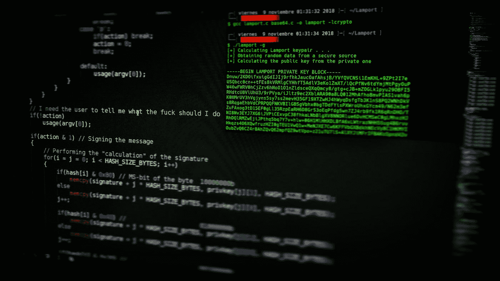

# Goxyq:将异步

> 原文：<https://medium.com/coinmonks/goxyq-sequentializing-the-asynchronous-4d3f80198a93?source=collection_archive---------1----------------------->

Photo by [Arget](https://unsplash.com/@arget?utm_source=medium&utm_medium=referral) on [Unsplash](https://unsplash.com?utm_source=medium&utm_medium=referral)

今天，我想和你们分享我开发 goxyq 的原因**, goxyq 是一个 http 代理服务器，它有一个嵌入式队列，可以顺序化对系统的异步和并行调用**。

但首先，让我给你一些背景:**我们正在建立一个全新的区块链系统。**该数据模型基于分类账中存储的一组资产。由于使用案例的特殊性…