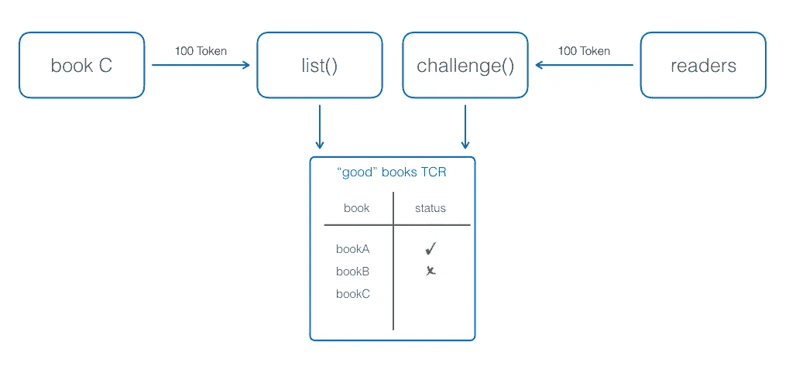
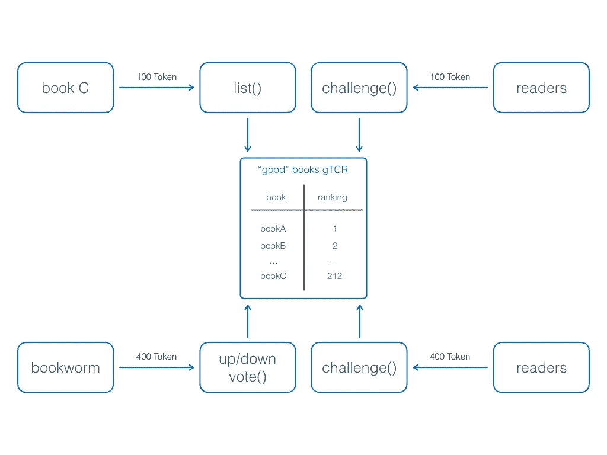

# 具有向上/向下投票的分级令牌管理决策——设计加密经济排名和声誉系统

> 原文：<https://medium.com/coinmonks/graded-token-curated-decisions-with-up-downvoting-designing-cryptoeconomic-ranking-and-2ce7c000bb51?source=collection_archive---------2----------------------->

与 [Sidd Bhasin](https://medium.com/u/42ad7d7cabdd?source=post_page-----2ce7c000bb51--------------------------------) 的联合工作。下面的视频。

> 分级令牌管理决策协议是一种密码经济机制，允许一组无定形的令牌持有者对一个对象进行向上或向下排序。分级令牌管理的注册管理机构通过减少对集中式第三方的需求，并通过抑制参与者提供虚假或有偏见的决策，来实现公平的排名和声誉系统。

# 1.介绍

令牌管理的注册管理机构(简称 TCR)是区块链社区中的新生事物，主要是因为它们独特地展示了每个区块链的两个核心属性，即与加密经济激励机制相结合的应用程序设计。他们解决了一些非常重要的问题，并有能力扰乱监管名单。一些世界上最富有的科技公司，如谷歌、亚马逊和脸书，之所以如此成功，是因为它们是相关数据和商品的专家管理者。然而，现有的监管协议有一个不稳定的机制:人们必须信任集中的监管者(如谷歌数据监管的情况)，或者恶意的审查者可以偏见排名的结果(如亚马逊的声誉系统的情况)。在这篇文章中，我们提出了*分级令牌管理决策*的理论，该理论建立在 TCRs 的基础上，并大大扩展了 TCRs 对条目进行分级上下投票的概念。它们弥补了集中式策展人的上述缺点，并显著增加了策展列表的信任度和价值。分级令牌管理决策(gtcd)*催生了大量新的应用和服务。我们通过展示一个分散的、不可信的排名/声誉系统来展示 gTCDs 的多功能性和实用性。*

# ***2。令牌管理的决策及其在注册管理机构中的应用——概述***

*每个公共区块链都使用代币作为激励参与网络的方式。机制设计非常关键，因为它代表了用户对令牌价值的共同信念。代币使公司能够创造全新的商业模式，尤其是分散的商业模式。例如， [Steem](https://medium.com/steem-stories) 使用其代币来激励其用户贡献新闻和内容，这些用户最终会因其对平台的贡献而获得 Steem 代币。另一个有趣的例子是[占卜](https://medium.com/u/f4d568271227?source=post_page-----2ce7c000bb51--------------------------------)，人们通过令牌作为‘神谕’对事件的结果做出贡献。甚至以太坊和比特币本身也为提供处理交易的计算能力的人们提供了货币激励。*

*根据预定义的规则，利用代币的价值来激励好的行为和抑制坏的行为，这是进一步探索 TCR 的前提。正如[迈克·戈尔丁](https://medium.com/u/4380e912132e?source=post_page-----2ce7c000bb51--------------------------------)所说:*

> *令牌管理的注册中心是分散管理的列表，具有内在的经济激励，让令牌持有者明智地管理列表的内容。*

*TCR 有很多有趣的应用，包括但不限于*

*   *按照[元认证](https://medium.com/u/85e2b2265fa3?source=post_page-----2ce7c000bb51--------------------------------)的规定，将好的网站列入白名单，以防范诈骗和网络钓鱼*
*   *在最适合投放广告的网站上为广告商提供社区审核的批准章，例如由[广告链](https://medium.com/u/c3499bb723af?source=post_page-----2ce7c000bb51--------------------------------)部署的*
*   *由 [FOAM](https://medium.com/u/959e75125558?source=post_page-----2ce7c000bb51--------------------------------) 推出的基于加密空间坐标的分散式社区管理的兴趣点地图*

*TCRs 实现的机制可以被视为一个机构群体审核的列表。简而言之，如图 1 所示，令牌管理的决策协议在被列表者和社区之间运行*

**

*Fig.1: Principals of Token-Curated Registries*

***协议目标:**生成并维护一个好对象列表(例如，网站)。*

***协议假设:** Listee 希望在列表上，例如，因为她接收到对某些独家服务或折扣的访问。*

***协议设置:**智能合约实现令牌辅助决策机制。任何第三方都可以执行合同。区块链的性质使得契约是可信的，因为代码是*可公开验证的*，并且决策机制的正确实现是由*不可信的*区块链网络审查的。因此，区块链的最大优点是实现了信任，并减少了对可信第三方的需求(顺便说一下，这在实践中很难找到)。*

***协议:**协议在 listee Alice 和一组社区成员(缩写为投票者)之间运行，其方式如下:*

*   ***List():** Alice 用 TCR 标记一些令牌来注册一个对象。在前面的例子中，对象是一个应该做广告的网站。*
*   ***Challenge():** 投票者下注与投票者总数成比例的相同数量的代币。每个投票者投下一票，并决定该物品是否被列出。(在我们的例子中，投票者是广告网络的参与者，并决定她是否喜欢看到该站点提供的广告。)投票者的法定人数决定对象是否上 TCR。作为参与该过程的奖励，偏离法定人数选择的投票者的赌注(包括在拒绝的情况下 Alice 的赌注)在获胜的投票者之间分享。*
*   ***Unlist():** 在任何时间点，Alice 都可以请求取消其对象的列表。作为回报，她拿回了她的股份。*

*分析令牌管理的决策协议，让我们看看所有参与者的激励策略。被列表者被激励去下注代币，因为他们希望在列表上(通过假设)。但是，值得注意的是，他们在 TCR 上的预期结果必须与赌注令牌一起摊销(严格的分析需要考虑这一点)。选民被激励参与挑战，因为他们获得了奖励。最重要的是，恶意投票者不愿意投有偏见或不公平的票，因为这会导致他们的股份被没收。*

# *3.分级令牌管理的决策和对注册管理机构的应用*

*总而言之，令牌管理的决策是实现有吸引力的和排他的列表的一种强大的新技术。这些列表对于许多业务模型和应用程序都有重要的价值。在我看来，超出我们目前理解的大量应用是可能的。TCR 是第一个应用，但它们的广泛应用可能会在各种紧急情况下受到阻碍。当前形式的 TCR 有两方面的局限性。*

*   ***静态列表:** TCRs 以 in-or-out 的方式判断一个列表。这就像在 [Berghain 俱乐部](/cuepoint/the-berghain-backstory-building-berlins-most-legendary-nightclub-87ad2d901ee9)(以柏林最严格的大门政策而闻名)经过门卫一样。一旦你进去了，你就会享受到一种永恒的夜总会体验。但是生活不是二元的。它是严格动态的，并且不断变化。假设我们策划了一份二氧化碳排放友好型汽车的清单。在[丑闻](/climate-desk/the-volkswagen-scandal-is-just-the-beginning-ba02110925cf)之前，大众汽车符合名单要求。但在披露之后，一些没有达到二氧化碳排放标准的汽车应该从名单中删除。虽然大众汽车丑闻只是一个说明性的目的，但这里要指出的是，TCR 可能会过时，并失去其作为信任和验证锚的价值。解决方法是创建一个新的 TCR，并要求所有被列名者申请新的列名，这通常是一个低效且耗时的过程。*
*   ***二进制度量:**TCR 假设对象的唯一性。但是对象共存于一个环境中。我们确实经历相似的物体。例如，假设您想在一个令牌管理的注册表中列出餐馆。泰国餐馆的 TCR 只允许你对餐馆进行分类。但是它忽略了添加关于餐馆的更有价值的信息的能力，即与相关餐馆相比的食物质量。*

*为了利用令牌管理决策的全部潜力，我们引入了分级令牌管理决策的概念。分级令牌管理注册中心(gTCRs)弥补了上述缺点，并通过使用动态对象上/下投票来扩展 TCR。该附加特征导致排名和声誉系统的加密经济双重应用，其中对象可以与相关对象竞争。*

*如前所述，用于排序列表的令牌管理的决策协议在被列表者和一组投票者之间运行，如图 2 所示。*

**

*Fig.2: Principals of graded Token-Curated Registries supporting the Ranking of Books*

***协议目标:**生成并维护一个由*排序的*对象的列表(例如，网页内容)。*

***协议假设:**与之前相同。被列表者希望在列表上，例如，如果她的排名达到阈值，她就可以获得一些独家服务或折扣。*

***协议设置:**同前。智能合约实现了令牌管理的决策机制。任何第三方都可以执行合同。*

***协议:**协议在 listee Alice 和一组社区成员(缩写为投票者)之间运行，其方式如下:*

*   ***List(x):** Alice 向 TCR 标记 x 个令牌来注册一个对象。这里 x 是 gTCR 要求的最低股份。作为对请求的回应，Alice 受到了社区的质疑。如果她通过了挑战，她的对象将根据锁定赌注的总数排名。*
*   ***Upvote(x):** 爱丽丝或任何其他方向 TCR 添加 x 个令牌，以便对某个对象进行 Upvote。例如，鲍勃喜欢爱丽丝的对象，并认为它应该获得更高的排名。由于列表是公开的，Bob 可以容易地识别对象的当前排名，并推动更高的排名。*
*   ***否决(x):** 爱丽丝或其他任何一方向 TCR 添加 x 个令牌，以否决一个对象。例如，Bob 不喜欢该对象，因为经过一段时间后，该对象不符合预期。为了反映这些变化，Bob 发起挑战，要求降低 Alice 的排名。如果标记的总数为零，则从 gTCR 中取出对象。*
*   ***挑战(x):** 投票者按投票者总数的比例反投相同数量的代币，即 x 个代币。每个投票人投下一票，并决定该物品是否通过法定投票被列入清单。作为参与该过程的奖励，偏离法定人数的投票者的赌注(包括 Alice 或在拒绝的情况下代表她的赌注者的赌注)在获胜的投票者之间分享。*
*   *在任何时间点，Alice 都可以请求取消其对象的列表。作为回报，她和她的支持者拿回了股份。*

*分析用于分级注册管理机构的分级令牌管理决策机制，与之前分析的不同之处在于 upstake 和 downstake 函数。排名靠前显然符合被列表者(和她的支持者)的利益，因为这可能会导致更高的排名。为了偏向排名而恶意上调或下调是不利的，因为上调/下调投票者冒着失去其股份的风险。*

# *致谢*

*分级令牌管理的决策理论和对排名注册管理机构的申请显然是社区努力的结果，也是与这一年轻研究领域的关键参与者互动的结果——无论是通过面对面的讨论，还是通过电子邮件、电报、媒体帖子、白皮书或 github 发布等远程渠道。向提出这个话题的 Consensys 人员 [Wayne Chang](https://medium.com/u/fffaa52a0aa3?source=post_page-----2ce7c000bb51--------------------------------) 和 [Harrison Hines](https://medium.com/u/150894c225b6?source=post_page-----2ce7c000bb51--------------------------------) 以及用他们的项目展示了第一个有意义的应用的 [Mike Goldin](https://medium.com/u/4380e912132e?source=post_page-----2ce7c000bb51--------------------------------) 、 [Ryan 约翰·金](https://medium.com/u/c322d55a1fc2?source=post_page-----2ce7c000bb51--------------------------------)、 [Paul Walsh](https://medium.com/u/8ddd87ca44ba?source=post_page-----2ce7c000bb51--------------------------------) 致敬。我还要对阿奇尔·鲁道夫、迪米特里·德·容格、特伦特·麦康纳和布鲁斯·彭大呼小叫，他们基于监管市场的协议影响了 gTCRs 背后的理念。(事实上，下次我们见面喝点啤酒时，我们应该把不同之处具体化。)*

# *附录*

*下面是 a 关于分级令牌管理注册中心的两次演讲视频。第一次发生在 2018 年纽约区块链周期间的 Token Engineering Meetup。第二个是一周后在柏林举行的策展市场会议#3 上录制的。功劳归于海洋队和 Way 队。*