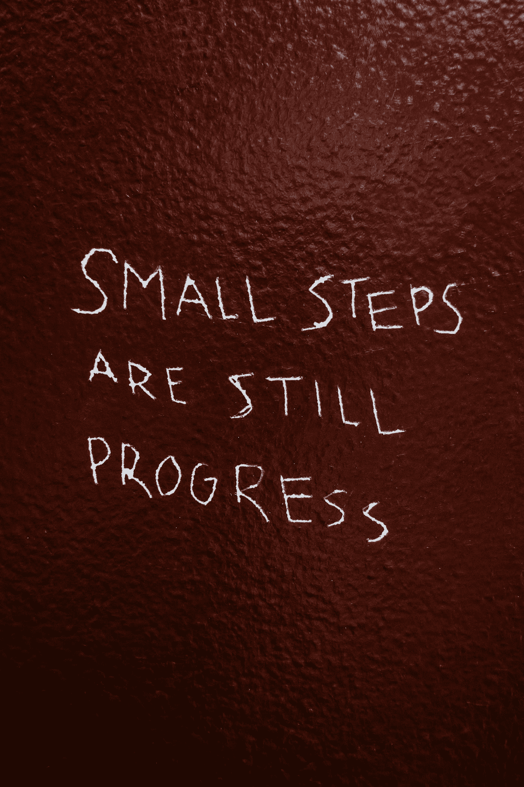

# 绿色比特币挖矿

> 原文：<https://medium.com/coinmonks/green-bitcoin-mining-92ba45393643?source=collection_archive---------6----------------------->

Photo by [Hayley Catherine](https://unsplash.com/@hcatherinephoto?utm_source=medium&utm_medium=referral) on [Unsplash](https://unsplash.com?utm_source=medium&utm_medium=referral)

*比特币挖矿对环境有害。*这是一场旧仗变新。然而，这一次，这个 [FUD](https://twitter.com/elonmusk/status/1392780304138473473/photo/1) 因埃隆·马斯克而变得流行，他最近让特斯拉购买了 15 亿美元的比特币。来自剑桥[大学](https://cbeci.org/)的新数据表明，由于比特币价格上涨，开采比特币所用的电力出现了爆炸式增长。Elon 引用了一篇文章，将比特币的高价与“[僵尸化石燃料发电厂](https://arstechnica.com/tech-policy/2021/05/private-equity-firm-revives-zombie-fossil-fuel-power-plant-to-mine-bitcoin/)”重新上线使用煤炭开采比特币联系起来。这一新数据导致埃隆·马斯克(Elon Musk)停止特斯拉接受比特币作为一种支付形式，直到比特币变得更加环保(反正谁真的用比特币买了一辆特斯拉)。

过去，许多人批评比特币对环境有害。这不是新消息。众所周知，随着时间的推移，挖掘比特币变得更加困难，从而消耗更多的能量。然而，在全球范围内，我们正处于向可再生能源过渡的过程中。这种转变不会在一夜之间发生。我们需要踏脚石来实现碳中和的未来。比特币挖矿也是如此。幸运的是，绿色比特币开采已经取得了很大进展。

有许多比特币采矿公司正在证明采矿可以以有助于环境的方式进行。[CleanSpark](https://www.cleanspark.com/)(CLSK)[大美矿业](https://gam.ai/)，[上游数据](https://www.upstreamdata.ca/) [。](https://www.crusoeenergy.com/)是一个很好的例子，它是迈向更高效、更环保的比特币开采方式的“垫脚石”。在本文中，我将简要介绍这些公司，以及它们如何帮助减少地球的碳足迹。

人们下班和放学回家的晚上通常是电力需求最高的时候。爸爸开始做饭，妈妈把一堆要洗的衣服放进去。小麦克斯打开了电暖器旁边的电视。你明白了。明显的模式是，当人们不需要能源时，可再生能源提供了最多的能源。根据下面的鸭曲线，在上午 9 点到下午 5 点之间，太阳能平均没有被使用。这导致了太阳能的过度发电。这是一种浪费，但 CleanSpark 的 mPulse 结合微电网可以帮助解决这个问题。

Solar energy over generation from 9am-5pm. Source [IER](https://www.instituteforenergyresearch.org/solar-energys-duck-curve/)

**CLSK 的微电网软件—**

什么是微电网？**微电网是一组资源，与储能一起为当地社区提供能源；就像国家电网一样，只是更小。**微电网可以连接到主电网，也可以随着条件的变化而断开。

CleanSparks

微电网包含太阳能和风能生产资源。太阳能和风能对环境有益，但目前还不实用。白天阳光明媚，晚上风力最强。

CleanSpark 的 mPulse 软件是一个自适应分布式能源管理系统。mPulse 可以监控各个微电网，确定可用的能源，并根据用户的需求最有效地利用能源。它通过使用专有算法来实现这一点。

**那么，这和比特币挖矿有什么关系呢？**

mPulse 可以将可再生能源(太阳能、风能、蓄电池)的电力输送到比特币采矿设施。因为在太阳能或风能最丰富的时候，并不是所有的电能都能被消耗掉。**比特币挖矿可以购买原本浪费的电力。**这防止了可再生能源的浪费，允许能源转化为价值储存，同时最终不会增加地球的碳足迹。

CleanSpark 收购了比特币开采设施 ATL datacenter，目前正在实时演示他们如何利用微电网的 mPulse 软件可持续地开采比特币。在最近的 Q2 -2021 [收益电话会议](https://seekingalpha.com/article/4425905-cleansparks-clsk-ceo-zach-bradford-on-q2-2021-results-earnings-call-transcript)中，CleanSpark 的首席执行官扎克·布拉德福德表示

“我们还认为，我们是美国唯一一家公开交易的加密货币开采公司，其开采 95%的碳中和，我们正在改善这一点。我们不仅正在接近碳中和，而且我们正在以全国比特币开采的最低能源成本实现这一目标。”

如果你问我的话，95%碳自然的采矿是非常好的..

接下来，我们有燃烧和排气。燃烧是燃烧油田中多余的石油和/或天然气的过程。这个过程通常是为了释放系统中积聚的过多压力。甲烷经常发生燃烧，这是一种温室气体，据说对环境的损害是二氧化碳的 25 倍。在这一过程中，甲烷被燃烧或燃烧，并产生副产品二氧化碳。

然而，这一过程并不是 100%有效，许多甲烷没有燃烧，因此逃逸到大气中。根据 [IEA](https://www.iea.org/reports/flaring-emissions) 的数据，2018 年全球燃烧了 1450 亿立方米(BCM)。燃烧导致 275 公吨二氧化碳(MtCO2)和一些甲烷释放到大气中。国际能源署估计，2018 年，北美占全球二氧化碳排放量的 13%。燃烧是一个双重打击，因为这个过程会增加大气中的二氧化碳和甲烷。

[IEA](https://www.iea.org/data-and-statistics/charts/flaring-by-region-in-the-sustainable-development-scenario-1985-2030)

然而，在石油和天然气公司(O&G 公司)和比特币采矿之间有一个双赢的局面。最终，两家公司都寻求更高的利润。O&G 公司希望出售其闲置或浪费的资源，而不是将其烧掉(字面意思是烧钱)，比特币矿工希望以低廉的成本利用这些闲置或浪费的天然气。这种关系使废气有了用途，并减少了向空气中燃烧/排放甲烷。

**伟大的美国矿业**有两种产品:

1.  承购协议
2.  采矿基础设施采购。

在第一个产品(承购协议)中，伟大的美国矿业公司与 O&G 生产商达成协议，购买他们不想要的和滞留的天然气，为他们自己的比特币采矿业务提供动力。

在第二个产品(采矿基础设施购买)中，伟大的美国矿业公司将他们的比特币采矿基础设施出售给 O&G 公司，因此 O&G 公司可以通过比特币采矿直接产生利润。Great American Mining company 将提供采矿钻机，在现场安装钻机，并根据 O&G 公司的具体业务监控/优化钻机。这是伟大的美国矿业公司提供的价值主张。

**上游数据**为滞留气井部署采矿数据中心。滞留天然气是指天然气副产品，通常不可用，没有需求，也无法转移。相反，滞留气体通常被排放或燃烧到大气中。[据比特币杂志报道，Upstream Data 提供 3 种套餐。](https://bitcoinmagazine.com/business/oil-field-alchemy-how-bitcoin-can-turn-waste-emissions-proof-work)

“上游服务为客户提供三种不同的采矿包。如上所述，其中一个包括购买采矿钻机，供应天然气并将天然气转化为电力，生产商获得所有采矿利润。对于选项二，他们只提供天然气和电力转换，而不购买滑轨，上游数据保留一部分利润。

然后还有第三种选择。Upstream Data 将滑轨停放在现场，并将天然气转换为能源，免费提供转换，以换取免费的天然气。听到这些公司愿意在没有任何采矿回报承诺的情况下供应天然气，这听起来可能有些奇怪，但正如 Barbour 告诉我们的那样，回报是消除副产品，而不必为燃烧付费，并遵守法规。

**我的想法——**

在我个人看来，Elon 关于特斯拉对化石燃料驱动的比特币电力消耗加速的担忧是错误的信息，没有更多的背景。**总能耗不等于污染**。

能量有许多来源。我们是一个用煤和天然气发电的社会。它在我们的社会中根深蒂固。向其他来源过渡需要时间，但这种过渡正在进行中。这方面的例子有美国大型矿业公司 Cleanspark 和 Upstream Data。

现在，我意识到我上面提到的三家公司并没有消除碳排放，而是在技术上增加了碳排放。然而，如果没有他们的技术，化石燃料驱动的采矿、燃烧和排气过程中释放到空气中的甲烷和二氧化碳的量会高得多。想象一下，如果这些技术不存在，矿工继续通过化石燃料运营，公司继续燃烧/排放。这可不好。

比特币正在推动能源领域的创新。我们目前生活在一个绿色比特币开采不断取得进展的时代。结果现在看起来可能很小，但这些渐进的步骤将在未来彻底改变我们使用能源的方式。这曾经是，现在仍然是我对特斯拉的看法。那些汽车、电池和太阳能屋顶都会产生碳足迹，但我们的想法是，在未来的某一天，这对地球来说是积极的。

Electric vehicle charging station: powered by coal. [Source](/tantra-labs/3-reasons-why-we-shouldnt-worry-about-the-energy-consumption-of-bitcoin-35261a2fda4f)

我就把这张照片留给你..

## 另外，阅读

*   [n ave 零点回顾](/coinmonks/ngrave-zero-review-c465cf8307fc) | [Phemex 回顾](/coinmonks/phemex-review-4cfba0b49e28) | [PrimeXBT 回顾](/coinmonks/primexbt-review-88e0815be858)
*   最佳[区块链分析](https://bitquery.io/blog/best-blockchain-analysis-tools-and-software)工具| [赚比特币](/coinmonks/earn-bitcoin-6e8bd3c592d9)
*   [加密套利](/coinmonks/crypto-arbitrage-guide-how-to-make-money-as-a-beginner-62bfe5c868f6)指南| [如何做空比特币](/coinmonks/how-to-short-bitcoin-568a2d0b4ae5)