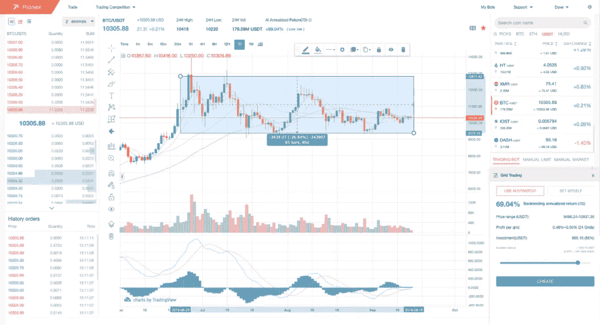
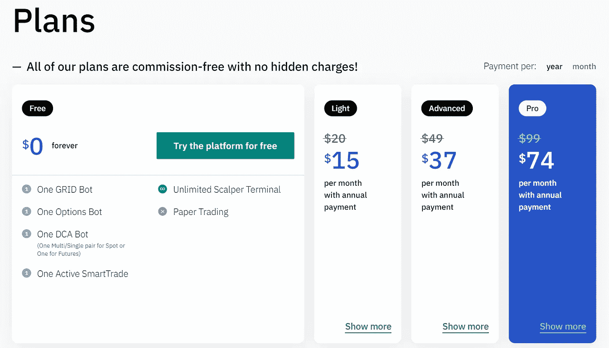
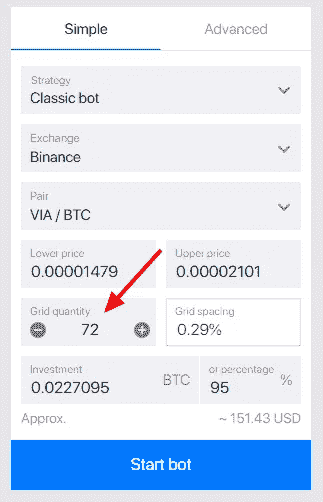
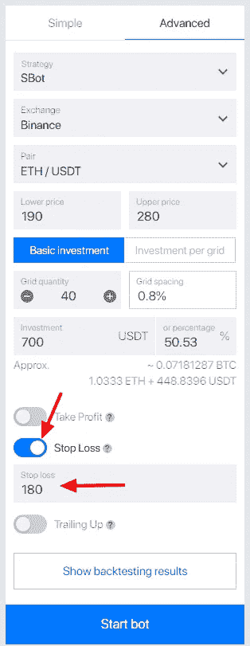
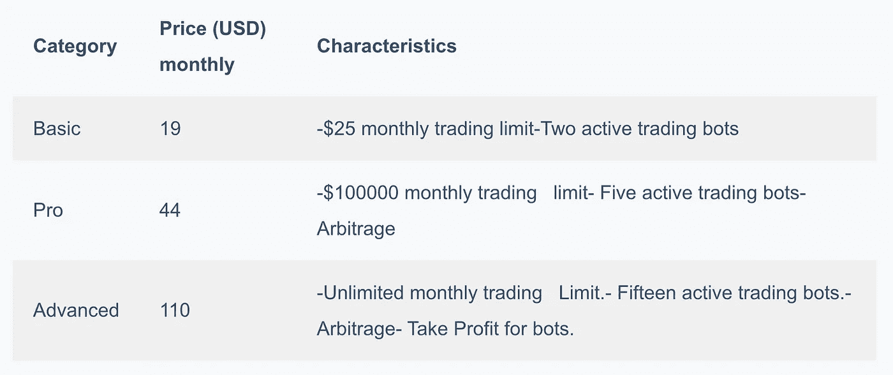
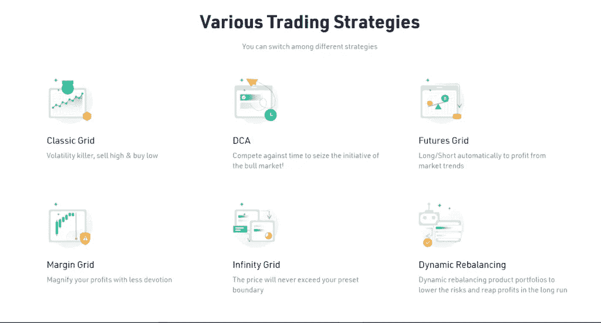
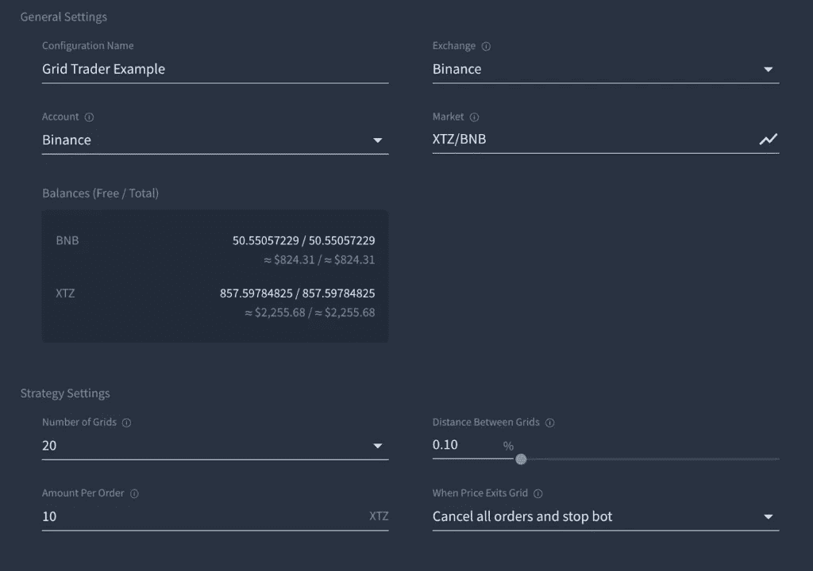
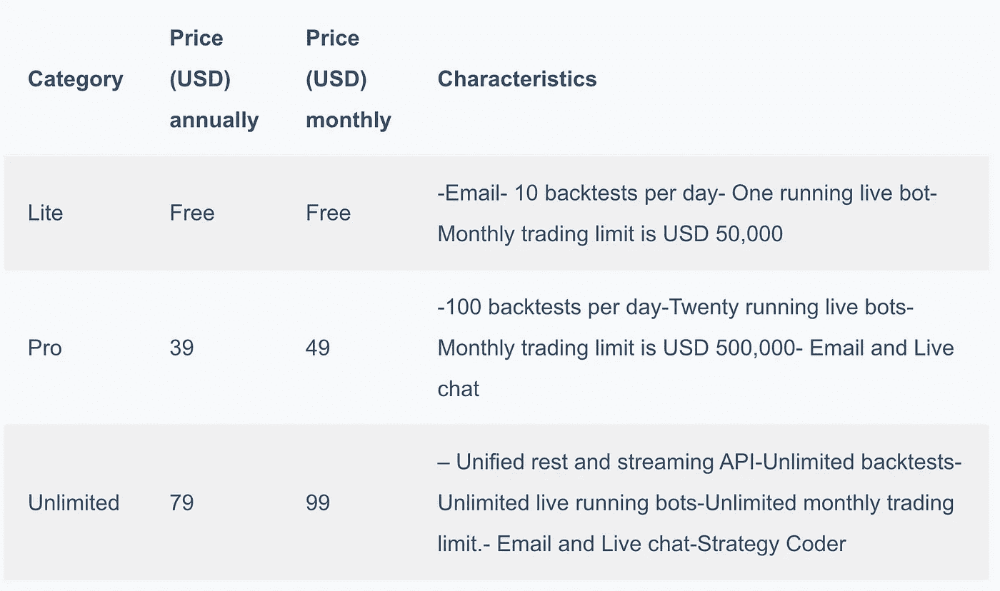
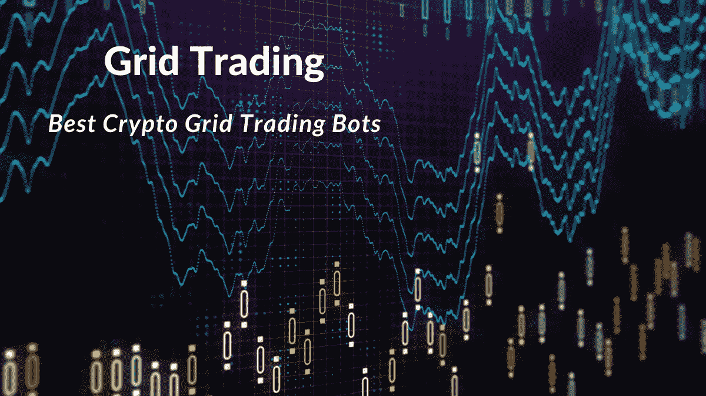

# 5 款最佳加密网格交易机器人|网格机器人

> 原文：<https://medium.com/coinmonks/grid-trading-cf4bba9b3fe5?source=collection_archive---------0----------------------->

## 我们将讨论[**Pionex**](https://www.pionex.com/offers/#/grid-4?r=BI2UEarX)[Bitsgap](https://bitsgap.com/?ref=2cb1231&utm_source=coincodecap&utm_medium=article&utm_campaign=promo)[**3 commas**](https://coincodecap.com/go/best-crypto-grid-trading-bots)等网格机器人。最近一些交易所也开始提供网格机器人，我们也将讨论这一点。

# 什么是网格交易？

网格交易允许你在预定的价格区间买卖订单。该系列分为多个级别，形成一个网格。您可以根据自己的需要选择级数。

级别数越高，交易频率越高。这也将减少每个级别之间的价格差异，即每个网格的数量，这将减少每个订单的利润。因此，你必须选择，你是希望在利润较低的情况下执行更多的交易，还是希望在利润较高的情况下执行更少的交易。

买入和卖出订单分别设置在当前价格的下方和上方。一旦卖出指令被执行，你就可以在它的下一层发出买入指令。类似地，如果一个买入订单被执行，你可以在它上面的级别下一个卖出订单。

# 为什么要进行网格交易？

网格交易帮助你从资产市场价格的涨跌中获利。事实证明，在横盘整理的市场中，它们是最好的交易策略之一。

# 网格交易机器人:摘要

*   网格交易通过在预先定义的价格区间买卖订单来帮助你获利。它允许你利用波动的市场价格。
*   网格交易机器人允许你自动化网格交易策略。
*   排名前五的网格交易机器人由 Pionex、Bitsgap、3Commas、KuCoin 和 Quadency 提供。
*   [**Pionex**](https://www.pionex.com/offers/#/grid-4?r=BI2UEarX) 提供五款免费内置交易机器人。
*   [**3 commas**](https://coincodecap.com/go/best-crypto-grid-trading-bots)Grid trading bot 提供手动和 AI 模式，让您的密码交易实现自动化。
*   [**Bitsgap**](https://bitsgap.com/?ref=2cb1231&utm_source=coincodecap&utm_medium=article&utm_campaign=promo) 提供易于使用的交易机器人，具有可选功能——止损、止盈和追涨。
*   **电网交易机器人人性化。此外，它们还允许您配置不同的条件来决定 bot 何时应该停止工作。**
*   **[**KuCoin**](https://www.kucoin.com/ucenter/signup?rcode=rJ45SVB)[crypto exchange](https://coincodecap.com/crypto-exchange)，通过其移动应用提供四种类型的内置网格交易机器人。**

# **网格交易机器人**

**手动应用网格交易策略是非常具有挑战性和耗时的。网格交易机器人可以帮助你自动化整个过程，甚至在你离线时也能获得利润。它能让你高效率地交易，并且全天候工作。**

# **最佳加密网格交易机器人**

# **1.皮奥克斯**

**[Pionex](https://www.pionex.com/offers/#/grid-4?r=BI2UEarX) 提供五种免费的不同类型的内置网格交易机器人**只收取 0.05%的交易费**。它们如下所示**

## **智能电网交易机器人**

**[Pionex 网格交易机器人](https://www.pionex.com/offers/#/grid-4?r=BI2UEarX)让你自动化网格交易策略。您可以设置价格范围和网格数量。您必须选择您想要分配的资金百分比。他们提供了两种类型的网格交易机器人——“使用 AI 策略”和“设置我自己”。**

1.  ****使用人工智能策略**—Pionex 人工智能顾问建议一组通过过去七天的回溯测试计算得出的参数。建议的价格范围和每格利润可供预览。**
2.  ****设置自己** —你要设置的参数有——上限价格、下限价格、格数、格数、止损价格等。**

****

## **反向网格机器人**

**Pionex 的反向网格机器人允许你在价格下跌时储存你的资产。然后它在当前价位卖出你分配的资产，在价格下跌时再回购。如果根据你的分析，价格会下降，你应该使用反向网格机器人。**

**你必须配置参数——价格范围、网格数量、网格间距设置(算术/几何)和资金百分比。此外，您还可以设置可选功能的触发价格、止损价格和关闭 Bot。**

**他们没有一个简短的特征。如果你想使用短功能，你可以使用杠杆反向机器人或保证金网格机器人。**

## **无限网格机器人**

**[Pionex 的](https://www.pionex.com/offers/#/grid-4?r=BI2UEarX) Infinity 网格机器人是网格交易机器人的高端版本。他们允许你“购买**

**低价卖出高价。“资产总数保持不变，而价格却在上涨。可以使用百分比设置范围。没有上限。**

**你有两个选择——“使用人工智能策略”和“自己设定”。**

1.  **使用人工智能策略-这是类似的选择网格交易 Bot，但有一些差异。这些参数是通过对过去 30 天的数据进行回溯测试来计算的。每个电网的利润固定为 0.6%。**
2.  **自行设置—您必须配置参数，如每个网格的下限价格和利润。如果价格低于下限价格，bot 将停止交易。**

## **杠杆式电网 Bot**

**Pionex 的杠杆化网格机器人可以让你通过杠杆化投资来放大利润。 [**Pionex**](https://www.pionex.com/offers/#/grid-4?r=BI2UEarX) 将借贷市场与本金杠杆结合以获得更高的收益率。经验丰富的交易员会在上涨的市场环境中使用杠杆化的网格机器人。**

**你必须设定参数——下限、上限、网格、杠杆、可借贷资金、每日利息和估计清算价格。可借入基金是 pionex 资金池中为交易员提供的基金。每日利息根据可动用可借贷资金而变动。如果使用杠杆化网格 bot 的用户数量增加，利率将增加，反之亦然。杠杆率可以固定为 1.2 倍、1.5 倍和 2 倍。**

## **保证金电网 Bot**

**你可以锁定你的资金作为抵押品。 [**Pionex**](https://www.pionex.com/offers/#/grid-4?r=BI2UEarX) 将不使用抵押品进行交易，而是将电网交易策略和贷款市场合二为一。抵押品也不同于杠杆化的 GRID Bot。**

**经验丰富的交易者使用保证金网格机器人来获利，而不用拿他们的长期持仓去冒险。试图做空或做多市场的交易员也在使用这种方法。**

**你必须设定下限和上限，杠杆，网格，可贷资金，每日利息，估计清算价格。它们提供了四种杠杆选项— 0.2X、0.5X、1X 和 2X。每日利息及可借入资金与杠杆式买卖 Bot 类似。**

# **2.3Commas Grid Bot**

**[**3 commmas**](https://coincodecap.com/go/best-crypto-grid-trading-bots)网格机器人是初学者和专业交易者的完美选择。3Commas 的简单界面让你可以连接一个交易所，选择 bot 模式来实现交易的自动化。此外，该平台还提供了两种主要的网格机器人模式:人工智能模式和手动模式。**

*   ****手动模式:**3 commas 的手动模式让你完全控制网格机器人。此外，一旦连接了您的交易所，您就可以输入上限和下限、网格数量、每个网格的数量以及投资金额。然后机器人开始运行并代表你获取回报。**
*   ****人工智能模式:**[3 命令](https://coincodecap.com/go/best-crypto-grid-trading-bots) 的人工智能模式让你免去了决定网格上下限的所有复杂工作。此外，人工智能会在所选范围内给出每个网格的估计回报。你要做的就是连接你的交易所，给机器人提供资金。**

> ***另外，阅读* [*3Commas Review |一个优秀的加密交易机器人*](https://coincodecap.com/3commas-review-an-excellent-crypto-trading-bot)**

# **3Commas:定价**

**平台向其用户提供包月计划；更多详情请参考下图:**

****

**3Commas: Pricing**

# **3. [Bitsgap](https://bitsgap.com/?ref=2cb1231&utm_source=coincodecap&utm_medium=article&utm_campaign=promo)**

**Bitsgap 提供网格交易机器人。它们允许您设置网格数量、交换、价格、价格下限和上限，以及您想要分配的资金百分比。此外，它们还提供可选功能——止损、止盈和跟踪。**

**Bitsgap 通过用买卖双方的交易费百分比减去每个网格的价格百分比来计算每个网格的利润。**

**比如网格间距 0.5%，交易费 0.1%。然后会扣除 0.2%作为买卖的交易费用。所以每格利润百分比是 0.3%。**

**他们允许你设置网格数量和间距，这直接影响利润。每格利润告诉你，在两格之间买卖时，减去交易费，你能赚到的利润。**

****

**网格数量可以是 4 到 99 之间的任意值。 [**Bitsgap**](https://bitsgap.com/?ref=2cb1231&utm_source=coincodecap&utm_medium=article&utm_campaign=promo) 建议将你的每格利润调整在 0.5%-2%之间。**

**启动 bot 所需的最低投资取决于您设置的参数。最低存款额是根据网格数量计算的。Bitsgap 计算最小订单大小和最小订单增量。最小订单大小限制了每个订单中机器人可以使用的数量。最小订单增量定义了机器人可以增加的数量。**

**例如，如果您的最小订单大小是 10 美元，最小订单增量是 2 美元。您可以下 10 美元、12 美元和 14 美元的订单，但不能下 8 美元或 14.50 美元的订单**

**止损功能允许您在价格达到止损价格条件时设置基础货币。他们帮助你限制你的损失。如果追涨被禁用，止损是永久的；否则，它就变成动态的了。此外，您可以在活动机器人中打开和关闭止损。**

**你必须设定止损执行的价格。当它被触发时，所有开放的机器人订单被自动取消。机器人通过市场订单以最佳可用价格出售用过的基础货币。此外， [Bitsgap](https://bitsgap.com/?ref=2cb1231&utm_source=coincodecap&utm_medium=article&utm_campaign=promo) 从活动的机器人中删除机器人，Bitsgap 将数据添加到历史选项卡。**

****

## **Bitsgap 定价**

****

**这三个软件包都提供了交易信号、投资组合、扩展订单类型和演示交易。此外，Pro 包提供优先支持。**

# **4.Kucoin 网格机器人**

**[**库币**](https://www.kucoin.com/ucenter/signup?rcode=rJ45SVB) 是一个流行的[加密货币交易所](https://coincodecap.com/crypto-exchange)也有一个加密交易机器人。然而，KuCoin 的加密交易机器人只能通过该交易所的移动应用程序访问。此外，该平台有四种不同类型的网格机器人。要了解更多信息，请阅读[如何使用 KuCoin Bot？](https://coincodecap.com/kucoin-bot)**

*   ****经典网格:**经典网格交易技术专注于从市场波动中获利。在特定的价格范围内，它买便宜卖高。另一方面，传统的网格只允许在现货市场交易。**
*   ****Futures Grid:**Futures Grid 是传统网格 bot 的一个更高级的变体。在期货方面，它采用了卖空和高卖的方法。然而，由于期货交易是基于杠杆的，这个机器人可能会使你在动荡的市场中面临清算风险。你可以选择使用 Bitsgap 期货交易机器人。**

****

**Trading strategies at KuCoin**

*   ****保证金网格:**[库币](https://www.kucoin.com/ucenter/signup?rcode=rJ45SVB)的保证金网格交易机器人使用网格方法进行[保证金交易](https://coincodecap.com/margin-trading)。只需很少的努力，你就可以利用你的现金，增加你的收入。然而，你不应该利用大量的头寸，因为保证金网格机器人可能会让你面临类似于保证金交易的巨大风险。**
*   ****无限网格:**无限网格上的定价永远不会超出你定义的条件或边界。**

**内置的 Kucoin 机器人对用户来说是完全免费的。你只需要在平台上注册并下载它的应用程序就可以开始了。**

> ***还有，看* [*KuCoin 评论|你能信任这个交易所吗？*](https://coincodecap.com/kucoin-review)**

# **5.四元制**

**Quadency 提供网格交易机器人来自动化网格交易策略。**

**您必须配置以下参数——交换、网格数量、网格之间的距离、每份订单的数量以及机器人停止工作的条件。**

**电网数量越多，覆盖范围就越大，需要的投资也就越多。当价格脱离网格时，你有四个选择-**

1.  ****围绕出场价格重新创建网格并继续交易****

**这将取消所有未结订单，并用市价订单结清未结头寸。如果你有足够的余额，当价格退出网格时，你可以使用这个选项重新创建网格。**

1.  **取消所有选项，停止机器人**

**这将取消所有剩余的未结订单，并停止机器人。这不会平仓任何未结头寸。符合以下任何一项条件的职位即为未平仓职位-**

1.  **机器人购买了一定数量，但没有卖出同样数量。**
2.  **该机器人已经出售，但没有回购相同的金额。**
3.  ****取消所有订单，平仓，停止 bot。****

**该选项平仓所有头寸并取消剩余的未结订单。**

1.  ****什么都不做****

**在这个选项中，机器人在所有订单完成后停止工作。价格进入电网后，bot 恢复交易。如果价格从未进入网格，订单将保持开放，直到被手动取消。**

****

## **四元定价**

****

# **结论**

**总之，网格交易机器人可以让你的交易策略自动化，减少手工操作。他们全天候工作。机器人可以根据您的要求定制。**

**在对比了 Pionex、Bitsgap、Quandency 五大网格交易机器人后，Pionex 明显跑赢。**

**Pionex 提供五个免费的内置网格交易机器人，功能令人印象深刻。这些机器人都适合不同的情况，并且易于使用。**

**另一方面， [**Bitsgap**](https://bitsgap.com/?ref=2cb1231&utm_source=coincodecap&utm_medium=article&utm_campaign=promo) 提供了初学者友好的交易机器人，具有止损、获利和跟进的附加功能。**

**Quadency 还提供用户友好的交易机器人。它们允许你配置不同的条件来决定机器人何时停止工作。这有助于你更好地控制你的机器人。**

**此外， **3Commas** Grid trading bot 通过其人工智能模式，允许您跳过决定上限和下限的忙乱。**

**最后， [**Kucoin 的**](https://www.kucoin.com/ucenter/signup?rcode=rJ45SVB) 内置网格机器人有多种变化，对使用该平台的交易者完全免费。**

# **常见问题(FAQ)**

****什么是电网交易？****

**网格交易允许你在预定的价格区间买卖订单。该系列分为多个级别，形成一个网格。买入和卖出订单设置在当前价格上下。一旦卖出指令被执行，你就可以下一层买入指令，反之亦然。**

****为什么要使用电网交易机器人？****

**电网交易策略需要持续的市场监控。你必须利用市场价格的波动，根据市场价格进行买卖。网格交易机器人自动执行整个战略，牢记你的要求。它们减少了人工劳动，回报了更好的利润。**

> **加入 Coinmonks [电报频道](https://t.me/coincodecap)和 [Youtube 频道](https://www.youtube.com/c/coinmonks/videos)了解加密交易和投资**

## **另外，阅读**

*   **[3 商业评论](/coinmonks/3commas-review-an-excellent-crypto-trading-bot-2020-1313a58bec92) | [Pionex 评论](https://coincodecap.com/pionex-review-exchange-with-crypto-trading-bot) | [Coinrule 评论](/coinmonks/coinrule-review-2021-a-beginner-friendly-crypto-trading-bot-daf0504848ba)**
*   **[莱杰 vs Ngrave](/coinmonks/ledger-vs-ngrave-zero-7e40f0c1d694) | [莱杰 nano s vs x](/coinmonks/ledger-nano-s-vs-x-battery-hardware-price-storage-59a6663fe3b0) | [币安评论](/coinmonks/binance-review-ee10d3bf3b6e)**
*   **[Bybit Exchange 评论](/coinmonks/bybit-exchange-review-dbd570019b71) | [Bityard 评论](https://coincodecap.com/bityard-reivew) | [Jet-Bot 评论](https://coincodecap.com/jet-bot-review)**
*   **[3 commas vs crypto hopper](/coinmonks/3commas-vs-pionex-vs-cryptohopper-best-crypto-bot-6a98d2baa203)|[赚取加密利息](/coinmonks/earn-crypto-interest-b10b810fdda3)**
*   **最好的比特币[硬件钱包](/coinmonks/hardware-wallets-dfa1211730c6) | [BitBox02 回顾](/coinmonks/bitbox02-review-your-swiss-bitcoin-hardware-wallet-c36c88fff29)**
*   **[KuCoin 评论](https://coincodecap.com/kucoin-review)|[MoonXBT Vs Bitget Vs Bingbon](https://coincodecap.com/bingbon-vs-bitget-vs-moonxbt)**
*   **[如何开始通过加密贷款赚取被动收入](https://coincodecap.com/passive-income-crypto-lending)**
*   **[BigONE 交易所评论](/coinmonks/bigone-exchange-review-64705d85a1d4) | [电网交易 Bot](https://coincodecap.com/grid-trading)**
*   **[氹欞侊贸易评论](https://coincodecap.com/anny-trade-review) | [货币现场评论](https://coincodecap.com/coinspot-review)**
*   **[新加坡十大最佳加密交易所](https://coincodecap.com/crypto-exchange-in-singapore) | [购买 AXS](https://coincodecap.com/buy-axs-token)**
*   **[投资印度的最佳加密软件](https://coincodecap.com/best-crypto-to-invest-in-india-in-2021) | [WazirX P2P](https://coincodecap.com/wazirx-p2p)**
*   **[7 大最佳零费用密码交易平台](https://coincodecap.com/zero-fee-crypto-exchanges)**
*   **[最佳网上赌场](https://coincodecap.com/best-online-casinos) | [期货交易机器人](/coinmonks/futures-trading-bots-5a282ccee3f5)**

****

**Grid Trading**