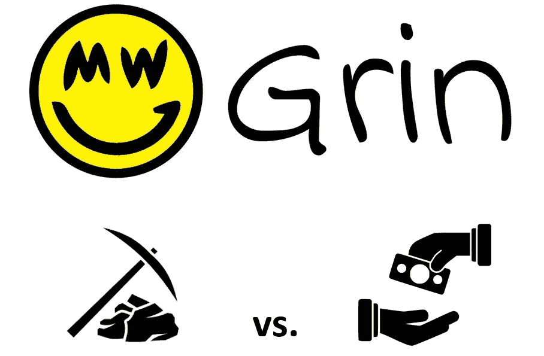
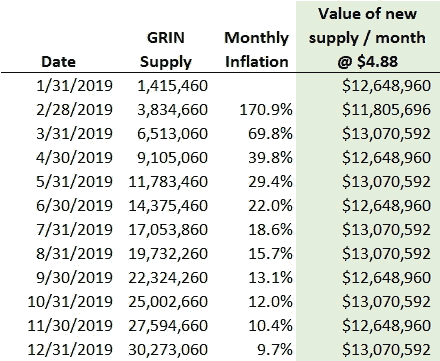
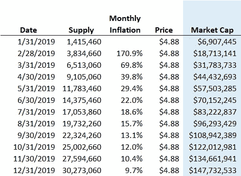
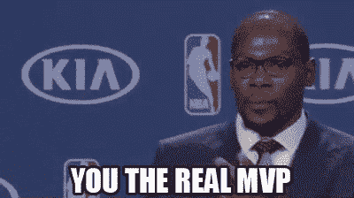

# 咧嘴笑:我的 vs .买的

> 原文：<https://medium.com/coinmonks/grin-mine-vs-buy-84b30f87e88c?source=collection_archive---------1----------------------->

上个月推出了 [Grin](https://grin-tech.org/) 和 [Beam](https://www.beam.mw/) ，这是[期待已久的](https://www.coindesk.com/mimblewimble-silly-sounding-tech-seriously-reform-bitcoin)隐私协议 Mimblewimble 的前两个实现。Mimblewimble 提供了一种在不公开发送地址、接收地址或交易金额的情况下进行网上交易的方式。与传统的区块链不同，它们实际上完全消除了公共地址的概念，与现有的隐私硬币如 Zcash 和 Monero 有所区别。这无疑增加了学习曲线，但也为真正的匿名支付开辟了一些有希望的机会。检查一个典型的磨削块作为例子。在这两者中，Grin 更好地反映了加密货币的 cypherpunk 起源，没有 ICO/pre-mine，分布式和假名团队，以及完全开源的项目开发。另一方面，Beam 得到了风险投资的支持，并从创始人那里获得 20%的报酬，专门用于开发和营销。

Grin 和 Beam 的推出伴随着一股大肆宣传的浪潮，伴随而来的是 Grin mining 的 1 亿美元投资和它自己的专用集成电路也即将问世的传言。这些货币的早期经济学真正有趣的是它们的排放时间表。这两者都反映了比特币早期的高通胀(Beam [完全按照比特币的发射曲线](https://documentation.beam.mw/en/latest/rtd_pages/user_mining_beam.html)设计，而 GRIN 永远保持 1 Grin/秒的恒定发射)，因此为我们提供了一个了解比特币最初几天的迷人窗口——明显的不同是，这一次有数亿美元追逐这些 Grin 和 Beam 的新单位。

# 1 亿美元的矿业投资是明智之举，还是那些投资者应该在公开市场上购买？

现在 ASICs 对于普通人来说已经大多排挤密码挖掘了，Grin/Beam 的吸引力来源之一就是用户可以用 GPU 进行有效的挖掘(至少目前是这样；两者的抗 ASIC 性将在 12-18 个月后消退)。让我们关注 GRIN 的经济学，因为挖掘数据似乎更容易获得。

假设 0.075 美元/千瓦时的电力和 GTX 1080ti 在当前的难度下每天赚取大约 1/6 的 GRIN([来源](https://www.f2pool.com/))，当 GRIN 定价为 2.35 美元时，矿工应该在电费上达到收支平衡。因此，按照目前 4.88 美元的价格，他们赚取了可观的差价。但是他们还必须摊销售价不低于 589 美元的 1080ti 的成本。如果 GRIN 保持在 4.88 美元左右，几乎需要 4 年才能收回他们在 1080ti 上的投资！为了获得更合理的 365 天回收期 GRIN，矿工需要以平均 12.05 美元的价格出售 GRIN。当然，一家资金雄厚的矿商可能会坐以待毙，直到排放曲线变平，并降低价格下行压力，但传统观点认为，大多数矿商利润微薄，需要出售才能收回成本。根据格林的排放计划，这种持续的销售压力看起来像什么？

Sources: Grinmint, CoinGecko

每月大约生产 2592000 个新研磨料。这意味着，仅仅为了维持目前 4.88 美元的价格，每个月至少需要购买约 1300 万美元的 GRIN。2019 年全年的月通胀率将达到两位数——就此而言，BTC 的月通胀率为 0.33%，瑞士联邦理工学院为 0.58%，瑞士长期信贷为 0.72%。似乎至少在 2019 年剩余时间内，这将是一个买方市场，除非投机者将 GRIN 的价格长期推高至 12 美元以上。

**结论**:如果你有一些高端 GPU，并且开采 ETH 或 XMR 不再有利可图，那么转向 GRIN 看起来是正确的举动(至少在当前的难度水平下)。但是如果你加上新采矿硬件的摊销成本，那么简单地从市场上购买 GRIN 可能更划算。尽管如此，买家也要小心:GRIN 的月通胀率也可以被认为是 GRIN 的市值每月需要增长的$ number，才能维持目前的价格。GRIN 低于 700 万美元的市值可能看起来被低估了，但从现在起到 2019 年 3 月底，市值需要增加 460%，才能保持在目前 4.88 美元的价格。

Sources: Grinmint, CoinGecko

如果你真的决定购买或开采 Grin，并成功脱颖而出，我会要求你做正确的事情，并回馈 GRIN 开发团队。与 Beam 或大多数其他高调的区块链项目不同，Grin 团队严格由社区资助。让我们不要忘记那些为推动区块链领域的创新贡献自己力量的人。

