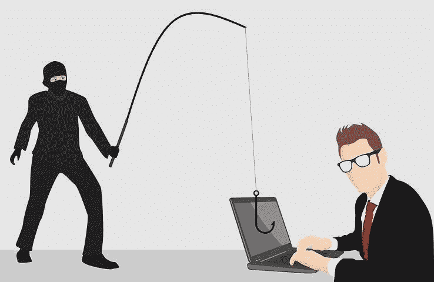
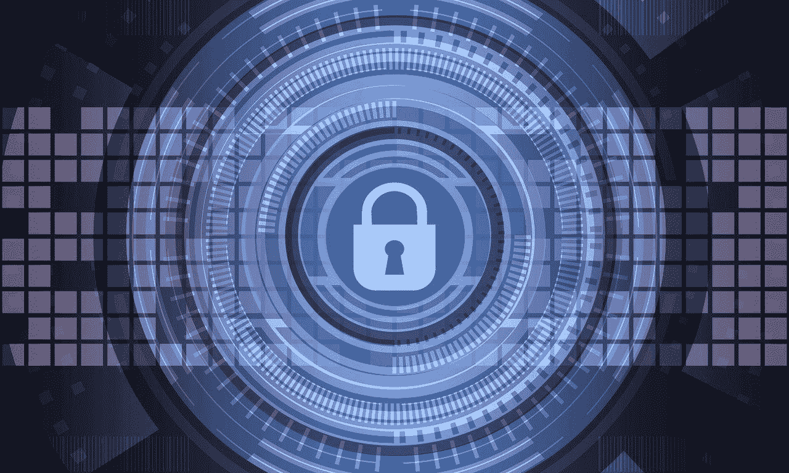
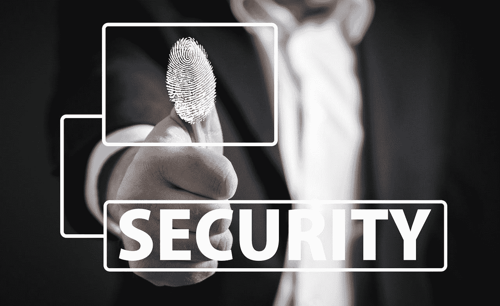
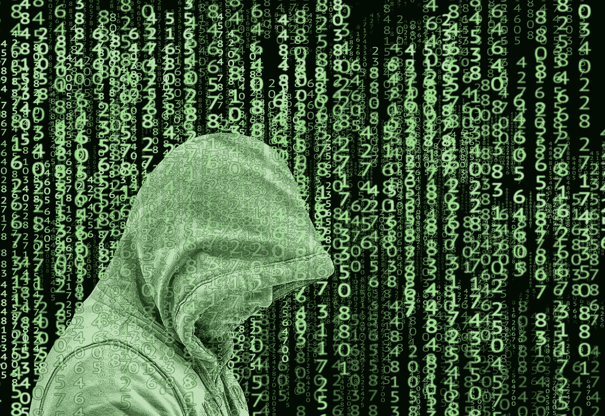

# 如何使用区块链保护您的个人数据？

> 原文：<https://medium.com/coinmonks/guarantee-your-patients-privacy-today-securing-sensitive-data-with-blockchain-fcb179f1302c?source=collection_archive---------4----------------------->

保存的数据如果被泄露，有可能毁掉患者的生活，同时破坏被泄露公司的声誉。

问题是找到并实现一个安全系统，使医生、患者和经过适当授权的第三方组织(如保险公司)能够访问数据，而不会产生潜在的安全风险。

**为什么密码不够用？**

密码是字母、符号和数字的简单组合，现代计算机可以在相对较短的时间内破解。多亏了僵尸网络，人们甚至有可能利用数百万台计算机来寻找一个密码，让数据窃贼能够访问那些从法律和道德角度来看都不应公开的资料。

**利用区块链保护数据。**

区块链技术是一种开放式加密技术，它利用公钥和私钥来保护信息以及以自动化和分散化方式管理的公共可用注册表。加密后，您需要密码和私钥来解锁信息，这使得所有加密的数据都有可能被窃取，但对窃贼来说仍然毫无用处。

从数字货币到智能合同管理，这种技术在过去的十年中有许多实际应用。对于医疗行业来说，最好将其视为一种安全的分散数据存储形式，让医疗机构和患者能够以安全、公平的方式在任何地方访问他们的记录。

我们可以利用专门的 SSL/TLS 证书和区块链公钥的组合，在传输任何信息之前对用户进行身份验证，从而克服密码限制。因此，如果黑客没有在正确的计算机上使用正确的文件，他就不可能破解密码。

**轻松授予和撤销访问权限**

在传统环境中保护数据的一个挑战是，一旦数据被复制到第三方介质上，任何 it 部门都无法获取。即使文件启用了密码保护，只需一个黑客就能破解它。通过使访问以来自更新的区块链的认证为条件，有可能以保证信息安全的方式远程授予和移除对所有文件的访问。

区块链解决方案使启用和删除对特定令牌支持文件的访问成为可能，此外还可以动态更改这些文件的所有权。对于雇主来说，这意味着可以保证前工作人员在雇佣关系终止时无法访问所有数据，而不必在公司离职过程中侵犯他或她的隐私。它只需要一个命令，所有相关的材料都可以转移给其他人。

**保护个人数据**

设备上的生物特征安全性与由用户单独控制的私钥的区块链原则相结合，提供了永远丢弃用户名和密码的机会。最流行的密码仍然是 123456，这是一件好事。

除此之外，还可以在只有用户拥有和控制的区块链上存储身份信息。区块链一直被认为是一个伟大的资产存储系统，这要归功于它的零知识存储、加密、隐私、安全和信任，所有这些都与去中心化的不可变账本相结合。

许多公司已经在区块链上启用了身份认证。然而，与我们日常使用的服务无关的身份本身是有限的。

当你将区块链上的身份与现有的支付方式和服务联系起来时，事情变得非常有趣。

**隐私**

现在，我们都如此杂乱地交出我们个人信息的控制权，唯一真正令人惊讶的是，相关的隐私问题甚至没有比它们更大。

区块链提供了一个诱人的世界，在这个世界中，你可以进行交易，而不必交出交易细节的每一部分，或者记住你母亲童年最喜欢的宠物的名字。区块链的零知识证明潜力还提供了一种加密方式，可以在不显示年龄的情况下证明你的年龄，或者用成功交易的记录证明你是一个好演员的身份——而不透露那些交易的内容。

像这样的技术可以很好地用于获得贷款，进行高额支付——也许可以消除对每一笔交易进行风险评估的需要。这甚至可能意味着我们所知的信贷监控的终结——这是个好消息，因为最近的事件表明，我们应该对其中一些公司的安全性保持警惕。

最后，一旦我们每个人都将自己的信息安全地存储在区块链上，我们就有机会选择是否以及何时分享这些信息，以换取实际价值。这可能是真正的“价值互联网”的开端。

最初发表于 block9solutions.com